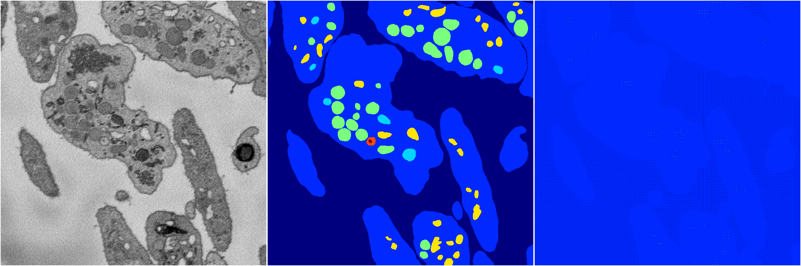

[Back](..)&nbsp;&nbsp;&nbsp;&nbsp;&nbsp;[Home](https://leapmanlab.github.io/snapshots)

---

<a href="0"><h2>random_hybrid_3d / 0416 / 67 / 0</h2></a>
Created 20 Apr 2019, 00:17:11

<i>Click for more details</i>

**ari**: -0.0031. **miou**: 0.0673. **accuracy**: 0.4661. **n_params**: 2013424.0000. 

---

<a href="1"><h2>random_hybrid_3d / 0416 / 67 / 1</h2></a>
Created 20 Apr 2019, 00:17:11

<i>Click for more details</i>

**ari**: 0.0014. **miou**: 0.0890. **accuracy**: 0.5209. **n_params**: 2013277.0000. 

---

[Back](..)&nbsp;&nbsp;&nbsp;&nbsp;&nbsp;[Home](https://leapmanlab.github.io/snapshots)

---