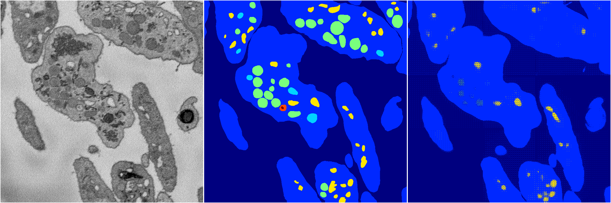
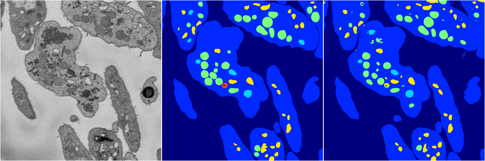

[Back](..)&nbsp;&nbsp;&nbsp;&nbsp;&nbsp;[Home](https://leapmanlab.github.io/snapshots)

---

<a href="0"><h2>random_hybrid_3d / 0416 / 71 / 0</h2></a>
Created 07 May 2019, 10:52:57

<i>Click for more details</i>

**ari**: 0.7202. **miou**: 0.3239. **accuracy**: 0.8992. **n_params**: 1796861.0000. 

---

<a href="1"><h2>random_hybrid_3d / 0416 / 71 / 1</h2></a>
Created 07 May 2019, 10:52:57

<i>Click for more details</i>

**ari**: 0.8401. **miou**: 0.5057. **accuracy**: 0.9417. **n_params**: 1796525.0000. 

---

[Back](..)&nbsp;&nbsp;&nbsp;&nbsp;&nbsp;[Home](https://leapmanlab.github.io/snapshots)

---