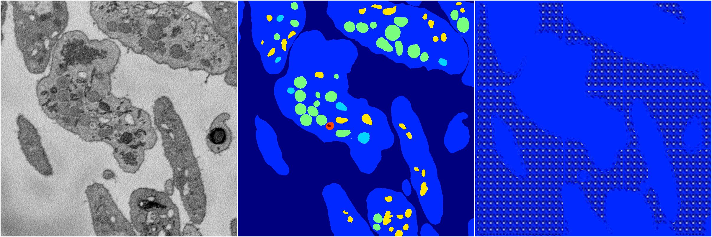

[Back](..)&nbsp;&nbsp;&nbsp;&nbsp;&nbsp;[Home](https://leapmanlab.github.io/snapshots)

---

<a href="1"><h2>random_hybrid_3d / 0416 / 76 / 1</h2></a>
Created 29 Apr 2019, 14:48:29

<i>Click for more details</i>

**ari**: 0.0143. **miou**: 0.1026. **accuracy**: 0.5416. **n_params**: 663726.0000. 

---

<a href="0"><h2>random_hybrid_3d / 0416 / 76 / 0</h2></a>
Created 29 Apr 2019, 14:48:29

<i>Click for more details</i>

**ari**: 0.0201. **miou**: 0.1087. **accuracy**: 0.5739. **n_params**: 663726.0000. 

---

[Back](..)&nbsp;&nbsp;&nbsp;&nbsp;&nbsp;[Home](https://leapmanlab.github.io/snapshots)

---