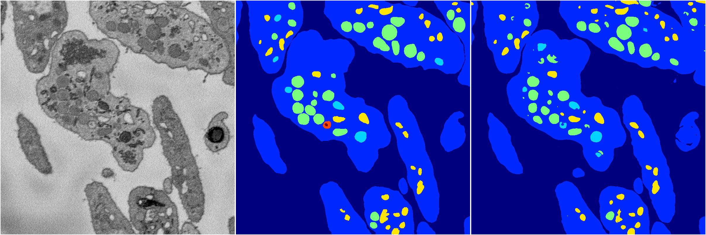
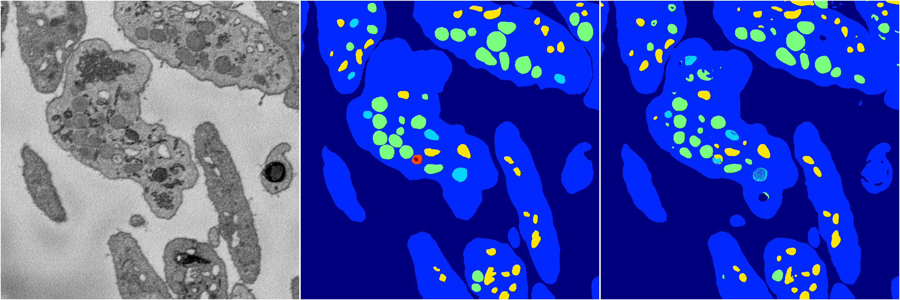

[Back](..)&nbsp;&nbsp;&nbsp;&nbsp;&nbsp;[Home](https://leapmanlab.github.io/snapshots)

---

<a href="0"><h2>random_hybrid_3d / 0416 / 79 / 0</h2></a>
Created 25 Apr 2019, 13:50:41

<i>Click for more details</i>

**ari**: 0.8345. **miou**: 0.5039. **accuracy**: 0.9403. **n_params**: 8083725.0000. 

---

<a href="1"><h2>random_hybrid_3d / 0416 / 79 / 1</h2></a>
Created 25 Apr 2019, 13:50:41

<i>Click for more details</i>

**ari**: 0.8360. **miou**: 0.5011. **accuracy**: 0.9399. **n_params**: 8083725.0000. 

---

[Back](..)&nbsp;&nbsp;&nbsp;&nbsp;&nbsp;[Home](https://leapmanlab.github.io/snapshots)

---