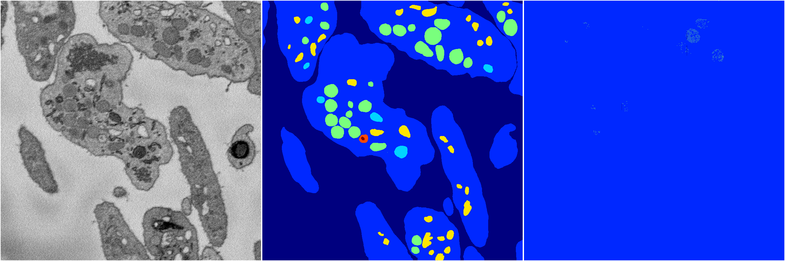
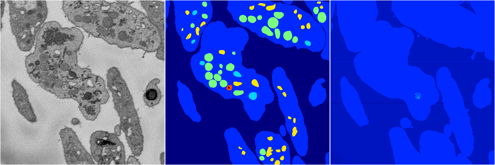

[Back](..)&nbsp;&nbsp;&nbsp;&nbsp;&nbsp;[Home](https://leapmanlab.github.io/snapshots)

---

<a href="1"><h2>random_hybrid_3d / 0416 / 85 / 1</h2></a>
Created 18 Apr 2019, 16:41:03

<i>Click for more details</i>

**ari**: -0.0076. **miou**: 0.0715. **accuracy**: 0.4741. **n_params**: 73441.0000. 

---

<a href="0"><h2>random_hybrid_3d / 0416 / 85 / 0</h2></a>
Created 18 Apr 2019, 16:41:03

<i>Click for more details</i>

**ari**: 0.0621. **miou**: 0.1369. **accuracy**: 0.6183. **n_params**: 73294.0000. 

---

[Back](..)&nbsp;&nbsp;&nbsp;&nbsp;&nbsp;[Home](https://leapmanlab.github.io/snapshots)

---