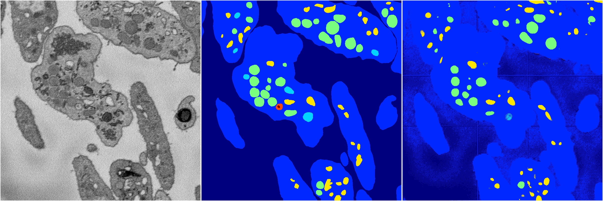

[Back](..)&nbsp;&nbsp;&nbsp;&nbsp;&nbsp;[Home](https://leapmanlab.github.io/snapshots)

---

<a href="1"><h2>random_hybrid_3d / 0416 / 94 / 1</h2></a>
Created 20 Apr 2019, 00:17:11

<i>Click for more details</i>

**ari**: 0.7618. **miou**: 0.2767. **accuracy**: 0.9097. **n_params**: 419956.0000. 

---

<a href="0"><h2>random_hybrid_3d / 0416 / 94 / 0</h2></a>
Created 20 Apr 2019, 00:17:11

<i>Click for more details</i>

**ari**: 0.5007. **miou**: 0.3907. **accuracy**: 0.8246. **n_params**: 419809.0000. 

---

[Back](..)&nbsp;&nbsp;&nbsp;&nbsp;&nbsp;[Home](https://leapmanlab.github.io/snapshots)

---