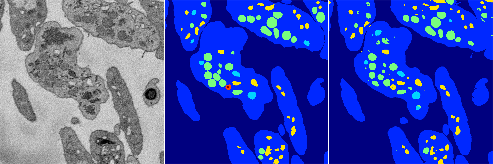
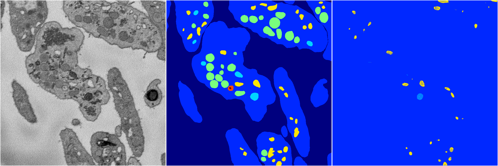

[Back](..)&nbsp;&nbsp;&nbsp;&nbsp;&nbsp;[Home](https://leapmanlab.github.io/snapshots)

---

<a href="0"><h2>random_hybrid_3d / 0416 / 97 / 0</h2></a>
Created 25 Apr 2019, 13:50:41

<i>Click for more details</i>

**ari**: 0.8416. **miou**: 0.5149. **accuracy**: 0.9422. **n_params**: 153055.0000. 

---

<a href="1"><h2>random_hybrid_3d / 0416 / 97 / 1</h2></a>
Created 25 Apr 2019, 13:50:41

<i>Click for more details</i>

**ari**: 0.0285. **miou**: 0.1133. **accuracy**: 0.4690. **n_params**: 152733.0000. 

---

[Back](..)&nbsp;&nbsp;&nbsp;&nbsp;&nbsp;[Home](https://leapmanlab.github.io/snapshots)

---