[Back](..)&nbsp;&nbsp;&nbsp;&nbsp;&nbsp;[Home](https://leapmanlab.github.io/snapshots)

---

<a href="294"><h2>random_hybrid_3d / 0416 / 294</h2></a>
Created 18 Apr 2019, 16:41:07

<i>Click image for more details</i>

2 nets

**ari**: min 0.8379. max 0.8402. mean 0.8391.  ([best net](294/1))

**miou**: min 0.4625. max 0.5095. mean 0.4860.  ([best net](294/0))

**accuracy**: min 0.9391. max 0.9412. mean 0.9402.  ([best net](294/0))

**n_params**: min 82795039.0000. max 82797454.0000. mean 82796246.5000.  ([best net](294/0))

---

<a href="292"><h2>random_hybrid_3d / 0416 / 292</h2></a>
Created 18 Apr 2019, 16:41:07

<i>Click image for more details</i>

2 nets

**ari**: min 0.8276. max 0.8413. mean 0.8345.  ([best net](292/0))

**miou**: min 0.3000. max 0.4175. mean 0.3588.  ([best net](292/0))

**accuracy**: min 0.9100. max 0.9364. mean 0.9232.  ([best net](292/0))

**n_params**: min 1668515.0000. max 1668515.0000. mean 1668515.0000.  ([best net](292/1))

---

<a href="289"><h2>random_hybrid_3d / 0416 / 289</h2></a>
Created 18 Apr 2019, 16:41:07

<i>Click image for more details</i>

2 nets

**ari**: min 0.4824. max 0.8392. mean 0.6608.  ([best net](289/1))

**miou**: min 0.2191. max 0.5032. mean 0.3611.  ([best net](289/1))

**accuracy**: min 0.8238. max 0.9418. mean 0.8828.  ([best net](289/1))

**n_params**: min 268282.0000. max 268485.0000. mean 268383.5000.  ([best net](289/1))

---

<a href="291"><h2>random_hybrid_3d / 0416 / 291</h2></a>
Created 18 Apr 2019, 16:41:07

<i>Click image for more details</i>

2 nets

**ari**: min 0.8377. max 0.8411. mean 0.8394.  ([best net](291/0))

**miou**: min 0.4745. max 0.5331. mean 0.5038.  ([best net](291/0))

**accuracy**: min 0.9401. max 0.9425. mean 0.9413.  ([best net](291/0))

**n_params**: min 8374485.0000. max 8376102.0000. mean 8375293.5000.  ([best net](291/0))

---

<a href="297"><h2>random_hybrid_3d / 0416 / 297</h2></a>
Created 18 Apr 2019, 16:41:07

<i>Click image for more details</i>

2 nets

**ari**: min 0.8305. max 0.8321. mean 0.8313.  ([best net](297/1))

**miou**: min 0.4312. max 0.4861. mean 0.4587.  ([best net](297/1))

**accuracy**: min 0.9355. max 0.9374. mean 0.9364.  ([best net](297/1))

**n_params**: min 6868252.0000. max 6869764.0000. mean 6869008.0000.  ([best net](297/1))

---

<a href="299"><h2>random_hybrid_3d / 0416 / 299</h2></a>
Created 18 Apr 2019, 16:41:07

<a href="299">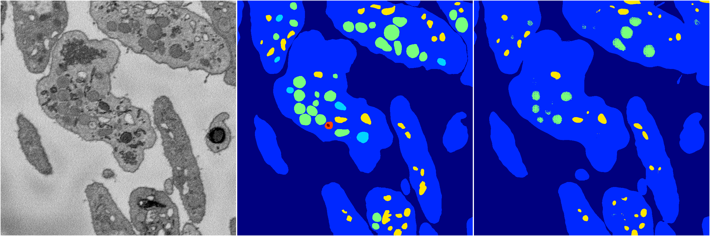</a>
<i>Click image for more details</i>

2 nets

**ari**: min 0.7916. max 0.8023. mean 0.7970.  ([best net](299/0))

**miou**: min 0.3829. max 0.3924. mean 0.3876.  ([best net](299/0))

**accuracy**: min 0.9248. max 0.9279. mean 0.9264.  ([best net](299/0))

**n_params**: min 24441266.0000. max 24441266.0000. mean 24441266.0000.  ([best net](299/1))

---

<a href="282"><h2>random_hybrid_3d / 0416 / 282</h2></a>
Created 18 Apr 2019, 16:41:07

<i>Click image for more details</i>

2 nets

**ari**: min 0.8295. max 0.8402. mean 0.8348.  ([best net](282/0))

**miou**: min 0.4328. max 0.5111. mean 0.4719.  ([best net](282/0))

**accuracy**: min 0.9360. max 0.9420. mean 0.9390.  ([best net](282/0))

**n_params**: min 5560026.0000. max 5560026.0000. mean 5560026.0000.  ([best net](282/0))

---

<a href="296"><h2>random_hybrid_3d / 0416 / 296</h2></a>
Created 18 Apr 2019, 16:41:07

<i>Click image for more details</i>

2 nets

**ari**: min 0.7802. max 0.8404. mean 0.8103.  ([best net](296/1))

**miou**: min 0.3451. max 0.4914. mean 0.4183.  ([best net](296/1))

**accuracy**: min 0.9178. max 0.9403. mean 0.9291.  ([best net](296/1))

**n_params**: min 317598.0000. max 318333.0000. mean 317965.5000.  ([best net](296/0))

---

<a href="298"><h2>random_hybrid_3d / 0416 / 298</h2></a>
Created 18 Apr 2019, 16:41:07

<i>Click image for more details</i>

2 nets

**ari**: min 0.7971. max 0.8384. mean 0.8177.  ([best net](298/0))

**miou**: min 0.3556. max 0.4221. mean 0.3888.  ([best net](298/0))

**accuracy**: min 0.9245. max 0.9358. mean 0.9301.  ([best net](298/0))

**n_params**: min 1061464.0000. max 1062395.0000. mean 1061929.5000.  ([best net](298/0))

---

<a href="278"><h2>random_hybrid_3d / 0416 / 278</h2></a>
Created 18 Apr 2019, 16:41:07

<i>Click image for more details</i>

2 nets

**ari**: min 0.8276. max 0.8366. mean 0.8321.  ([best net](278/1))

**miou**: min 0.4394. max 0.5069. mean 0.4731.  ([best net](278/1))

**accuracy**: min 0.9363. max 0.9404. mean 0.9384.  ([best net](278/1))

**n_params**: min 2824773.0000. max 2824773.0000. mean 2824773.0000.  ([best net](278/1))

---

<a href="293"><h2>random_hybrid_3d / 0416 / 293</h2></a>
Created 18 Apr 2019, 16:41:07

<i>Click image for more details</i>

2 nets

**ari**: min 0.7167. max 0.8300. mean 0.7734.  ([best net](293/1))

**miou**: min 0.2477. max 0.4357. mean 0.3417.  ([best net](293/1))

**accuracy**: min 0.8970. max 0.9360. mean 0.9165.  ([best net](293/1))

**n_params**: min 396782.0000. max 397657.0000. mean 397219.5000.  ([best net](293/1))

---

<a href="290"><h2>random_hybrid_3d / 0416 / 290</h2></a>
Created 18 Apr 2019, 16:41:07

<i>Click image for more details</i>

2 nets

**ari**: min -0.0107. max 0.0062. mean -0.0023.  ([best net](290/0))

**miou**: min 0.0729. max 0.0958. mean 0.0843.  ([best net](290/0))

**accuracy**: min 0.4787. max 0.5055. mean 0.4921.  ([best net](290/0))

**n_params**: min 599183.0000. max 599561.0000. mean 599372.0000.  ([best net](290/1))

---

<a href="295"><h2>random_hybrid_3d / 0416 / 295</h2></a>
Created 18 Apr 2019, 16:41:07

<i>Click image for more details</i>

2 nets

**ari**: min 0.7167. max 0.8420. mean 0.7794.  ([best net](295/1))

**miou**: min 0.2577. max 0.6549. mean 0.4563.  ([best net](295/1))

**accuracy**: min 0.8754. max 0.9433. mean 0.9094.  ([best net](295/1))

**n_params**: min 4263.0000. max 4410.0000. mean 4336.5000.  ([best net](295/0))

---

<a href="287"><h2>random_hybrid_3d / 0416 / 287</h2></a>
Created 18 Apr 2019, 16:41:07

<i>Click image for more details</i>

2 nets

**ari**: min 0.8377. max 0.8381. mean 0.8379.  ([best net](287/0))

**miou**: min 0.4308. max 0.4341. mean 0.4325.  ([best net](287/1))

**accuracy**: min 0.9383. max 0.9384. mean 0.9384.  ([best net](287/0))

**n_params**: min 683017.0000. max 683304.0000. mean 683160.5000.  ([best net](287/0))

---

<a href="286"><h2>random_hybrid_3d / 0416 / 286</h2></a>
Created 18 Apr 2019, 16:41:07

<i>Click image for more details</i>

2 nets

**ari**: min 0.7269. max 0.7613. mean 0.7441.  ([best net](286/0))

**miou**: min 0.2673. max 0.2860. mean 0.2766.  ([best net](286/0))

**accuracy**: min 0.9003. max 0.9110. mean 0.9057.  ([best net](286/0))

**n_params**: min 1411406.0000. max 1412862.0000. mean 1412134.0000.  ([best net](286/0))

---

<a href="279"><h2>random_hybrid_3d / 0416 / 279</h2></a>
Created 18 Apr 2019, 16:41:07

<i>Click image for more details</i>

2 nets

**ari**: min 0.7991. max 0.8407. mean 0.8199.  ([best net](279/0))

**miou**: min 0.3885. max 0.5725. mean 0.4805.  ([best net](279/0))

**accuracy**: min 0.9272. max 0.9422. mean 0.9347.  ([best net](279/0))

**n_params**: min 22743009.0000. max 22743156.0000. mean 22743082.5000.  ([best net](279/1))

---

<a href="288"><h2>random_hybrid_3d / 0416 / 288</h2></a>
Created 18 Apr 2019, 16:41:07

<i>Click image for more details</i>

2 nets

**ari**: min 0.8364. max 0.8375. mean 0.8370.  ([best net](288/1))

**miou**: min 0.4189. max 0.5203. mean 0.4696.  ([best net](288/1))

**accuracy**: min 0.9339. max 0.9409. mean 0.9374.  ([best net](288/1))

**n_params**: min 578984.0000. max 579278.0000. mean 579131.0000.  ([best net](288/0))

---

<a href="283"><h2>random_hybrid_3d / 0416 / 283</h2></a>
Created 18 Apr 2019, 16:41:07

<i>Click image for more details</i>

2 nets

**ari**: min 0.7835. max 0.8284. mean 0.8060.  ([best net](283/1))

**miou**: min 0.3302. max 0.4351. mean 0.3826.  ([best net](283/1))

**accuracy**: min 0.9190. max 0.9357. mean 0.9273.  ([best net](283/1))

**n_params**: min 1928844.0000. max 1928991.0000. mean 1928917.5000.  ([best net](283/0))

---

<a href="284"><h2>random_hybrid_3d / 0416 / 284</h2></a>
Created 18 Apr 2019, 16:41:07

<i>Click image for more details</i>

2 nets

**ari**: min 0.8111. max 0.8288. mean 0.8199.  ([best net](284/0))

**miou**: min 0.3197. max 0.4242. mean 0.3720.  ([best net](284/0))

**accuracy**: min 0.9171. max 0.9342. mean 0.9256.  ([best net](284/0))

**n_params**: min 762806.0000. max 762806.0000. mean 762806.0000.  ([best net](284/0))

---

<a href="264"><h2>random_hybrid_3d / 0416 / 264</h2></a>
Created 18 Apr 2019, 16:41:07

<i>Click image for more details</i>

2 nets

**ari**: min 0.8329. max 0.8437. mean 0.8383.  ([best net](264/1))

**miou**: min 0.4881. max 0.5506. mean 0.5194.  ([best net](264/1))

**accuracy**: min 0.9377. max 0.9431. mean 0.9404.  ([best net](264/1))

**n_params**: min 11413941.0000. max 11413941.0000. mean 11413941.0000.  ([best net](264/1))

---

<a href="280"><h2>random_hybrid_3d / 0416 / 280</h2></a>
Created 18 Apr 2019, 16:41:07

<i>Click image for more details</i>

2 nets

**ari**: min 0.8400. max 0.8409. mean 0.8404.  ([best net](280/1))

**miou**: min 0.4951. max 0.5784. mean 0.5367.  ([best net](280/1))

**accuracy**: min 0.9408. max 0.9431. mean 0.9419.  ([best net](280/1))

**n_params**: min 762538.0000. max 763420.0000. mean 762979.0000.  ([best net](280/0))

---

<a href="281"><h2>random_hybrid_3d / 0416 / 281</h2></a>
Created 18 Apr 2019, 16:41:07

<i>Click image for more details</i>

2 nets

**ari**: min -0.0000. max 0.8381. mean 0.4191.  ([best net](281/0))

**miou**: min 0.0659. max 0.4535. mean 0.2597.  ([best net](281/0))

**accuracy**: min 0.4613. max 0.9367. mean 0.6990.  ([best net](281/0))

**n_params**: min 116073.0000. max 116220.0000. mean 116146.5000.  ([best net](281/1))

---

<a href="285"><h2>random_hybrid_3d / 0416 / 285</h2></a>
Created 18 Apr 2019, 16:41:07

<i>Click image for more details</i>

2 nets

**ari**: min 0.1951. max 0.7788. mean 0.4870.  ([best net](285/0))

**miou**: min 0.1705. max 0.4225. mean 0.2965.  ([best net](285/0))

**accuracy**: min 0.6911. max 0.9239. mean 0.8075.  ([best net](285/0))

**n_params**: min 49849.0000. max 49996.0000. mean 49922.5000.  ([best net](285/1))

---

<a href="273"><h2>random_hybrid_3d / 0416 / 273</h2></a>
Created 18 Apr 2019, 16:41:07

<i>Click image for more details</i>

2 nets

**ari**: min 0.8369. max 0.8416. mean 0.8393.  ([best net](273/0))

**miou**: min 0.4359. max 0.5678. mean 0.5019.  ([best net](273/0))

**accuracy**: min 0.9387. max 0.9432. mean 0.9409.  ([best net](273/0))

**n_params**: min 5122367.0000. max 5122367.0000. mean 5122367.0000.  ([best net](273/1))

---

<a href="276"><h2>random_hybrid_3d / 0416 / 276</h2></a>
Created 18 Apr 2019, 16:41:07

<i>Click image for more details</i>

2 nets

**ari**: min 0.8295. max 0.8389. mean 0.8342.  ([best net](276/0))

**miou**: min 0.4973. max 0.6448. mean 0.5711.  ([best net](276/0))

**accuracy**: min 0.9371. max 0.9422. mean 0.9396.  ([best net](276/0))

**n_params**: min 2060036.0000. max 2060036.0000. mean 2060036.0000.  ([best net](276/0))

---

<a href="265"><h2>random_hybrid_3d / 0416 / 265</h2></a>
Created 18 Apr 2019, 16:41:07

<i>Click image for more details</i>

2 nets

**ari**: min 0.8190. max 0.8398. mean 0.8294.  ([best net](265/0))

**miou**: min 0.4255. max 0.4328. mean 0.4291.  ([best net](265/0))

**accuracy**: min 0.9337. max 0.9387. mean 0.9362.  ([best net](265/0))

**n_params**: min 7378559.0000. max 7378559.0000. mean 7378559.0000.  ([best net](265/0))

---

<a href="272"><h2>random_hybrid_3d / 0416 / 272</h2></a>
Created 18 Apr 2019, 16:41:07

<i>Click image for more details</i>

2 nets

**ari**: min 0.7332. max 0.8401. mean 0.7866.  ([best net](272/1))

**miou**: min 0.2493. max 0.5076. mean 0.3785.  ([best net](272/1))

**accuracy**: min 0.9002. max 0.9421. mean 0.9212.  ([best net](272/1))

**n_params**: min 1447940.0000. max 1447940.0000. mean 1447940.0000.  ([best net](272/1))

---

<a href="275"><h2>random_hybrid_3d / 0416 / 275</h2></a>
Created 18 Apr 2019, 16:41:07

<i>Click image for more details</i>

2 nets

**ari**: min 0.8289. max 0.8411. mean 0.8350.  ([best net](275/0))

**miou**: min 0.4363. max 0.5178. mean 0.4771.  ([best net](275/0))

**accuracy**: min 0.9366. max 0.9430. mean 0.9398.  ([best net](275/0))

**n_params**: min 4765353.0000. max 4766256.0000. mean 4765804.5000.  ([best net](275/1))

---

<a href="269"><h2>random_hybrid_3d / 0416 / 269</h2></a>
Created 18 Apr 2019, 16:41:07

<i>Click image for more details</i>

2 nets

**ari**: min 0.6792. max 0.8372. mean 0.7582.  ([best net](269/1))

**miou**: min 0.2418. max 0.5071. mean 0.3744.  ([best net](269/1))

**accuracy**: min 0.8856. max 0.9412. mean 0.9134.  ([best net](269/1))

**n_params**: min 1973169.0000. max 1973169.0000. mean 1973169.0000.  ([best net](269/0))

---

<a href="263"><h2>random_hybrid_3d / 0416 / 263</h2></a>
Created 18 Apr 2019, 16:41:07

<i>Click image for more details</i>

2 nets

**ari**: min 0.8315. max 0.8325. mean 0.8320.  ([best net](263/0))

**miou**: min 0.4703. max 0.5779. mean 0.5241.  ([best net](263/1))

**accuracy**: min 0.9375. max 0.9392. mean 0.9383.  ([best net](263/0))

**n_params**: min 619578.0000. max 621174.0000. mean 620376.0000.  ([best net](263/0))

---

<a href="271"><h2>random_hybrid_3d / 0416 / 271</h2></a>
Created 18 Apr 2019, 16:41:07

<i>Click image for more details</i>

2 nets

**ari**: min -0.0000. max 0.8421. mean 0.4210.  ([best net](271/1))

**miou**: min 0.0659. max 0.5106. mean 0.2882.  ([best net](271/1))

**accuracy**: min 0.4613. max 0.9429. mean 0.7021.  ([best net](271/1))

**n_params**: min 395114.0000. max 395114.0000. mean 395114.0000.  ([best net](271/0))

---

<a href="277"><h2>random_hybrid_3d / 0416 / 277</h2></a>
Created 18 Apr 2019, 16:41:07

<i>Click image for more details</i>

2 nets

**ari**: min 0.8307. max 0.8331. mean 0.8319.  ([best net](277/1))

**miou**: min 0.4354. max 0.4373. mean 0.4363.  ([best net](277/1))

**accuracy**: min 0.9368. max 0.9384. mean 0.9376.  ([best net](277/1))

**n_params**: min 37618.0000. max 37618.0000. mean 37618.0000.  ([best net](277/1))

---

<a href="262"><h2>random_hybrid_3d / 0416 / 262</h2></a>
Created 18 Apr 2019, 16:41:06

<i>Click image for more details</i>

2 nets

**ari**: min 0.4482. max 0.8451. mean 0.6466.  ([best net](262/1))

**miou**: min 0.2720. max 0.6041. mean 0.4380.  ([best net](262/1))

**accuracy**: min 0.8149. max 0.9446. mean 0.8797.  ([best net](262/1))

**n_params**: min 21210.0000. max 21210.0000. mean 21210.0000.  ([best net](262/0))

---

<a href="266"><h2>random_hybrid_3d / 0416 / 266</h2></a>
Created 18 Apr 2019, 16:41:06

<a href="266">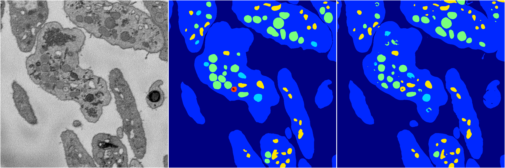</a>
<i>Click image for more details</i>

2 nets

**ari**: min 0.4621. max 0.8400. mean 0.6511.  ([best net](266/0))

**miou**: min 0.2106. max 0.5093. mean 0.3600.  ([best net](266/0))

**accuracy**: min 0.8196. max 0.9424. mean 0.8810.  ([best net](266/0))

**n_params**: min 7108208.0000. max 7109209.0000. mean 7108708.5000.  ([best net](266/1))

---

<a href="268"><h2>random_hybrid_3d / 0416 / 268</h2></a>
Created 18 Apr 2019, 16:41:06

<i>Click image for more details</i>

2 nets

**ari**: min 0.8263. max 0.8342. mean 0.8303.  ([best net](268/1))

**miou**: min 0.4335. max 0.4682. mean 0.4508.  ([best net](268/1))

**accuracy**: min 0.9357. max 0.9374. mean 0.9365.  ([best net](268/1))

**n_params**: min 1100804.0000. max 1101336.0000. mean 1101070.0000.  ([best net](268/0))

---

<a href="267"><h2>random_hybrid_3d / 0416 / 267</h2></a>
Created 18 Apr 2019, 16:41:06

<i>Click image for more details</i>

2 nets

**ari**: min 0.8278. max 0.8350. mean 0.8314.  ([best net](267/1))

**miou**: min 0.4331. max 0.4855. mean 0.4593.  ([best net](267/1))

**accuracy**: min 0.9349. max 0.9401. mean 0.9375.  ([best net](267/1))

**n_params**: min 925283.0000. max 925507.0000. mean 925395.0000.  ([best net](267/0))

---

<a href="270"><h2>random_hybrid_3d / 0416 / 270</h2></a>
Created 18 Apr 2019, 16:41:06

<i>Click image for more details</i>

2 nets

**ari**: min 0.7690. max 0.7905. mean 0.7798.  ([best net](270/0))

**miou**: min 0.3324. max 0.3822. mean 0.3573.  ([best net](270/1))

**accuracy**: min 0.9142. max 0.9150. mean 0.9146.  ([best net](270/1))

**n_params**: min 1722784.0000. max 1723470.0000. mean 1723127.0000.  ([best net](270/1))

---

<a href="274"><h2>random_hybrid_3d / 0416 / 274</h2></a>
Created 18 Apr 2019, 16:41:06

<i>Click image for more details</i>

2 nets

**ari**: min 0.8419. max 0.8422. mean 0.8421.  ([best net](274/0))

**miou**: min 0.5048. max 0.5104. mean 0.5076.  ([best net](274/1))

**accuracy**: min 0.9421. max 0.9429. mean 0.9425.  ([best net](274/1))

**n_params**: min 281631.0000. max 281778.0000. mean 281704.5000.  ([best net](274/1))

---

<a href="260"><h2>random_hybrid_3d / 0416 / 260</h2></a>
Created 18 Apr 2019, 16:41:06

<i>Click image for more details</i>

2 nets

**ari**: min 0.8339. max 0.8428. mean 0.8384.  ([best net](260/1))

**miou**: min 0.4536. max 0.5770. mean 0.5153.  ([best net](260/1))

**accuracy**: min 0.9380. max 0.9434. mean 0.9407.  ([best net](260/1))

**n_params**: min 734709.0000. max 734709.0000. mean 734709.0000.  ([best net](260/1))

---

<a href="252"><h2>random_hybrid_3d / 0416 / 252</h2></a>
Created 18 Apr 2019, 16:41:06

<i>Click image for more details</i>

2 nets

**ari**: min 0.8371. max 0.8407. mean 0.8389.  ([best net](252/1))

**miou**: min 0.4891. max 0.5774. mean 0.5332.  ([best net](252/1))

**accuracy**: min 0.9397. max 0.9428. mean 0.9413.  ([best net](252/1))

**n_params**: min 5924540.0000. max 5924687.0000. mean 5924613.5000.  ([best net](252/1))

---

<a href="253"><h2>random_hybrid_3d / 0416 / 253</h2></a>
Created 18 Apr 2019, 16:41:06

<i>Click image for more details</i>

2 nets

**ari**: min 0.3886. max 0.8224. mean 0.6055.  ([best net](253/0))

**miou**: min 0.0391. max 0.4264. mean 0.2328.  ([best net](253/0))

**accuracy**: min 0.1585. max 0.9351. mean 0.5468.  ([best net](253/0))

**n_params**: min 261893.0000. max 261893.0000. mean 261893.0000.  ([best net](253/0))

---

<a href="254"><h2>random_hybrid_3d / 0416 / 254</h2></a>
Created 18 Apr 2019, 16:41:06

<i>Click image for more details</i>

2 nets

**ari**: min 0.8205. max 0.8398. mean 0.8301.  ([best net](254/0))

**miou**: min 0.3846. max 0.5082. mean 0.4464.  ([best net](254/0))

**accuracy**: min 0.9233. max 0.9403. mean 0.9318.  ([best net](254/0))

**n_params**: min 4227538.0000. max 4228938.0000. mean 4228238.0000.  ([best net](254/0))

---

<a href="255"><h2>random_hybrid_3d / 0416 / 255</h2></a>
Created 18 Apr 2019, 16:41:06

<i>Click image for more details</i>

2 nets

**ari**: min 0.8324. max 0.8410. mean 0.8367.  ([best net](255/0))

**miou**: min 0.4789. max 0.5608. mean 0.5199.  ([best net](255/0))

**accuracy**: min 0.9392. max 0.9425. mean 0.9408.  ([best net](255/0))

**n_params**: min 5369375.0000. max 5370789.0000. mean 5370082.0000.  ([best net](255/1))

---

<a href="247"><h2>random_hybrid_3d / 0416 / 247</h2></a>
Created 18 Apr 2019, 16:41:06

<i>Click image for more details</i>

2 nets

**ari**: min 0.8383. max 0.8401. mean 0.8392.  ([best net](247/1))

**miou**: min 0.4482. max 0.5124. mean 0.4803.  ([best net](247/1))

**accuracy**: min 0.9355. max 0.9420. mean 0.9387.  ([best net](247/1))

**n_params**: min 1647144.0000. max 1647144.0000. mean 1647144.0000.  ([best net](247/0))

---

<a href="258"><h2>random_hybrid_3d / 0416 / 258</h2></a>
Created 18 Apr 2019, 16:41:06

<i>Click image for more details</i>

2 nets

**ari**: min 0.8401. max 0.8403. mean 0.8402.  ([best net](258/1))

**miou**: min 0.4935. max 0.5695. mean 0.5315.  ([best net](258/1))

**accuracy**: min 0.9413. max 0.9426. mean 0.9419.  ([best net](258/1))

**n_params**: min 3260354.0000. max 3261880.0000. mean 3261117.0000.  ([best net](258/1))

---

<a href="251"><h2>random_hybrid_3d / 0416 / 251</h2></a>
Created 18 Apr 2019, 16:41:06

<i>Click image for more details</i>

2 nets

**ari**: min 0.8355. max 0.8420. mean 0.8388.  ([best net](251/1))

**miou**: min 0.4253. max 0.5615. mean 0.4934.  ([best net](251/1))

**accuracy**: min 0.9359. max 0.9426. mean 0.9392.  ([best net](251/1))

**n_params**: min 482335.0000. max 482608.0000. mean 482471.5000.  ([best net](251/0))

---

<a href="257"><h2>random_hybrid_3d / 0416 / 257</h2></a>
Created 18 Apr 2019, 16:41:06

<i>Click image for more details</i>

2 nets

**ari**: min 0.8419. max 0.8424. mean 0.8421.  ([best net](257/0))

**miou**: min 0.4937. max 0.5084. mean 0.5010.  ([best net](257/0))

**accuracy**: min 0.9413. max 0.9424. mean 0.9418.  ([best net](257/0))

**n_params**: min 477855.0000. max 477855.0000. mean 477855.0000.  ([best net](257/0))

---

<a href="249"><h2>random_hybrid_3d / 0416 / 249</h2></a>
Created 18 Apr 2019, 16:41:06

<i>Click image for more details</i>

2 nets

**ari**: min 0.8366. max 0.8416. mean 0.8391.  ([best net](249/1))

**miou**: min 0.4316. max 0.4770. mean 0.4543.  ([best net](249/1))

**accuracy**: min 0.9372. max 0.9405. mean 0.9389.  ([best net](249/1))

**n_params**: min 1083895.0000. max 1084259.0000. mean 1084077.0000.  ([best net](249/1))

---

<a href="259"><h2>random_hybrid_3d / 0416 / 259</h2></a>
Created 18 Apr 2019, 16:41:06

<i>Click image for more details</i>

2 nets

**ari**: min 0.7896. max 0.8296. mean 0.8096.  ([best net](259/0))

**miou**: min 0.2978. max 0.4373. mean 0.3676.  ([best net](259/0))

**accuracy**: min 0.9127. max 0.9367. mean 0.9247.  ([best net](259/0))

**n_params**: min 431428.0000. max 431575.0000. mean 431501.5000.  ([best net](259/0))

---

<a href="256"><h2>random_hybrid_3d / 0416 / 256</h2></a>
Created 18 Apr 2019, 16:41:06

<i>Click image for more details</i>

2 nets

**ari**: min 0.6190. max 0.8372. mean 0.7281.  ([best net](256/0))

**miou**: min 0.2393. max 0.4816. mean 0.3605.  ([best net](256/0))

**accuracy**: min 0.8631. max 0.9399. mean 0.9015.  ([best net](256/0))

**n_params**: min 4942095.0000. max 4942683.0000. mean 4942389.0000.  ([best net](256/0))

---

<a href="261"><h2>random_hybrid_3d / 0416 / 261</h2></a>
Created 18 Apr 2019, 16:41:06

<a href="261">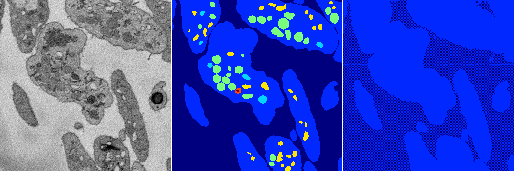</a>
<i>Click image for more details</i>

2 nets

**ari**: min -0.0000. max 0.2237. mean 0.1118.  ([best net](261/0))

**miou**: min 0.0659. max 0.1677. mean 0.1168.  ([best net](261/0))

**accuracy**: min 0.4613. max 0.7215. mean 0.5914.  ([best net](261/0))

**n_params**: min 185712.0000. max 185859.0000. mean 185785.5000.  ([best net](261/1))

---

<a href="250"><h2>random_hybrid_3d / 0416 / 250</h2></a>
Created 18 Apr 2019, 16:41:06

<i>Click image for more details</i>

2 nets

**ari**: min 0.7803. max 0.8416. mean 0.8109.  ([best net](250/1))

**miou**: min 0.3205. max 0.5717. mean 0.4461.  ([best net](250/1))

**accuracy**: min 0.9173. max 0.9433. mean 0.9303.  ([best net](250/1))

**n_params**: min 53931.0000. max 54078.0000. mean 54004.5000.  ([best net](250/0))

---

<a href="248"><h2>random_hybrid_3d / 0416 / 248</h2></a>
Created 18 Apr 2019, 16:41:06

<i>Click image for more details</i>

2 nets

**ari**: min 0.0423. max 0.8344. mean 0.4384.  ([best net](248/1))

**miou**: min 0.1339. max 0.4775. mean 0.3057.  ([best net](248/1))

**accuracy**: min 0.4732. max 0.9392. mean 0.7062.  ([best net](248/1))

**n_params**: min 115841.0000. max 116555.0000. mean 116198.0000.  ([best net](248/1))

---

<a href="234"><h2>random_hybrid_3d / 0416 / 234</h2></a>
Created 18 Apr 2019, 16:41:06

<i>Click image for more details</i>

2 nets

**ari**: min 0.7958. max 0.8423. mean 0.8191.  ([best net](234/1))

**miou**: min 0.3902. max 0.5732. mean 0.4817.  ([best net](234/1))

**accuracy**: min 0.9267. max 0.9434. mean 0.9350.  ([best net](234/1))

**n_params**: min 5657535.0000. max 5657535.0000. mean 5657535.0000.  ([best net](234/1))

---

<a href="236"><h2>random_hybrid_3d / 0416 / 236</h2></a>
Created 18 Apr 2019, 16:41:06

<i>Click image for more details</i>

2 nets

**ari**: min 0.8351. max 0.8394. mean 0.8372.  ([best net](236/0))

**miou**: min 0.4358. max 0.5108. mean 0.4733.  ([best net](236/0))

**accuracy**: min 0.9381. max 0.9426. mean 0.9403.  ([best net](236/0))

**n_params**: min 8652923.0000. max 8652923.0000. mean 8652923.0000.  ([best net](236/0))

---

<a href="244"><h2>random_hybrid_3d / 0416 / 244</h2></a>
Created 18 Apr 2019, 16:41:06

<i>Click image for more details</i>

2 nets

**ari**: min 0.8357. max 0.8380. mean 0.8369.  ([best net](244/1))

**miou**: min 0.4211. max 0.4586. mean 0.4399.  ([best net](244/0))

**accuracy**: min 0.9352. max 0.9371. mean 0.9362.  ([best net](244/0))

**n_params**: min 901967.0000. max 902114.0000. mean 902040.5000.  ([best net](244/0))

---

<a href="243"><h2>random_hybrid_3d / 0416 / 243</h2></a>
Created 18 Apr 2019, 16:41:06

<i>Click image for more details</i>

2 nets

**ari**: min 0.8249. max 0.8357. mean 0.8303.  ([best net](243/1))

**miou**: min 0.4202. max 0.5604. mean 0.4903.  ([best net](243/1))

**accuracy**: min 0.9323. max 0.9397. mean 0.9360.  ([best net](243/1))

**n_params**: min 14451324.0000. max 14453263.0000. mean 14452293.5000.  ([best net](243/1))

---

<a href="242"><h2>random_hybrid_3d / 0416 / 242</h2></a>
Created 18 Apr 2019, 16:41:06

<i>Click image for more details</i>

2 nets

**ari**: min 0.8257. max 0.8377. mean 0.8317.  ([best net](242/1))

**miou**: min 0.4296. max 0.4348. mean 0.4322.  ([best net](242/0))

**accuracy**: min 0.9346. max 0.9379. mean 0.9363.  ([best net](242/1))

**n_params**: min 4361807.0000. max 4361954.0000. mean 4361880.5000.  ([best net](242/1))

---

<a href="240"><h2>random_hybrid_3d / 0416 / 240</h2></a>
Created 18 Apr 2019, 16:41:06

<i>Click image for more details</i>

2 nets

**ari**: min 0.8411. max 0.8417. mean 0.8414.  ([best net](240/0))

**miou**: min 0.5693. max 0.5745. mean 0.5719.  ([best net](240/0))

**accuracy**: min 0.9430. max 0.9431. mean 0.9430.  ([best net](240/0))

**n_params**: min 18360402.0000. max 18360402.0000. mean 18360402.0000.  ([best net](240/1))

---

<a href="232"><h2>random_hybrid_3d / 0416 / 232</h2></a>
Created 18 Apr 2019, 16:41:06

<i>Click image for more details</i>

2 nets

**ari**: min 0.4167. max 0.7251. mean 0.5709.  ([best net](232/1))

**miou**: min 0.2027. max 0.2480. mean 0.2254.  ([best net](232/1))

**accuracy**: min 0.8020. max 0.8973. mean 0.8497.  ([best net](232/1))

**n_params**: min 2744941.0000. max 2745088.0000. mean 2745014.5000.  ([best net](232/1))

---

<a href="233"><h2>random_hybrid_3d / 0416 / 233</h2></a>
Created 18 Apr 2019, 16:41:06

<i>Click image for more details</i>

2 nets

**ari**: min -0.0000. max 0.8349. mean 0.4175.  ([best net](233/1))

**miou**: min 0.0659. max 0.4337. mean 0.2498.  ([best net](233/1))

**accuracy**: min 0.4613. max 0.9355. mean 0.6984.  ([best net](233/1))

**n_params**: min 1697018.0000. max 1697711.0000. mean 1697364.5000.  ([best net](233/0))

---

<a href="235"><h2>random_hybrid_3d / 0416 / 235</h2></a>
Created 18 Apr 2019, 16:41:06

<i>Click image for more details</i>

2 nets

**ari**: min 0.8301. max 0.8386. mean 0.8343.  ([best net](235/1))

**miou**: min 0.4280. max 0.4302. mean 0.4291.  ([best net](235/1))

**accuracy**: min 0.9364. max 0.9370. mean 0.9367.  ([best net](235/1))

**n_params**: min 1801751.0000. max 1802374.0000. mean 1802062.5000.  ([best net](235/0))

---

<a href="238"><h2>random_hybrid_3d / 0416 / 238</h2></a>
Created 18 Apr 2019, 16:41:06

<i>Click image for more details</i>

2 nets

**ari**: min 0.8329. max 0.8345. mean 0.8337.  ([best net](238/0))

**miou**: min 0.4336. max 0.4415. mean 0.4376.  ([best net](238/0))

**accuracy**: min 0.9345. max 0.9374. mean 0.9360.  ([best net](238/1))

**n_params**: min 360931.0000. max 361078.0000. mean 361004.5000.  ([best net](238/1))

---

<a href="239"><h2>random_hybrid_3d / 0416 / 239</h2></a>
Created 18 Apr 2019, 16:41:06

<i>Click image for more details</i>

2 nets

**ari**: min 0.7377. max 0.8287. mean 0.7832.  ([best net](239/1))

**miou**: min 0.2573. max 0.4340. mean 0.3456.  ([best net](239/1))

**accuracy**: min 0.9010. max 0.9360. mean 0.9185.  ([best net](239/1))

**n_params**: min 426286.0000. max 426468.0000. mean 426377.0000.  ([best net](239/0))

---

<a href="217"><h2>random_hybrid_3d / 0416 / 217</h2></a>
Created 18 Apr 2019, 16:41:06

<i>Click image for more details</i>

2 nets

**ari**: min 0.8398. max 0.8426. mean 0.8412.  ([best net](217/0))

**miou**: min 0.5387. max 0.5656. mean 0.5521.  ([best net](217/1))

**accuracy**: min 0.9425. max 0.9427. mean 0.9426.  ([best net](217/0))

**n_params**: min 38216496.0000. max 38218239.0000. mean 38217367.5000.  ([best net](217/0))

---

<a href="245"><h2>random_hybrid_3d / 0416 / 245</h2></a>
Created 18 Apr 2019, 16:41:06

<i>Click image for more details</i>

2 nets

**ari**: min 0.8407. max 0.8427. mean 0.8417.  ([best net](245/1))

**miou**: min 0.5350. max 0.5504. mean 0.5427.  ([best net](245/1))

**accuracy**: min 0.9421. max 0.9427. mean 0.9424.  ([best net](245/1))

**n_params**: min 764301.0000. max 764448.0000. mean 764374.5000.  ([best net](245/1))

---

<a href="246"><h2>random_hybrid_3d / 0416 / 246</h2></a>
Created 18 Apr 2019, 16:41:06

<i>Click image for more details</i>

2 nets

**ari**: min 0.8388. max 0.8409. mean 0.8399.  ([best net](246/0))

**miou**: min 0.5060. max 0.5750. mean 0.5405.  ([best net](246/1))

**accuracy**: min 0.9420. max 0.9425. mean 0.9422.  ([best net](246/1))

**n_params**: min 333205.0000. max 333205.0000. mean 333205.0000.  ([best net](246/0))

---

<a href="237"><h2>random_hybrid_3d / 0416 / 237</h2></a>
Created 18 Apr 2019, 16:41:06

<i>Click image for more details</i>

2 nets

**ari**: min 0.8040. max 0.8441. mean 0.8241.  ([best net](237/1))

**miou**: min 0.4761. max 0.6557. mean 0.5659.  ([best net](237/1))

**accuracy**: min 0.9253. max 0.9442. mean 0.9348.  ([best net](237/1))

**n_params**: min 609800.0000. max 611375.0000. mean 610587.5000.  ([best net](237/0))

---

<a href="241"><h2>random_hybrid_3d / 0416 / 241</h2></a>
Created 18 Apr 2019, 16:41:06

<i>Click image for more details</i>

2 nets

**ari**: min -0.0108. max 0.0000. mean -0.0054.  ([best net](241/0))

**miou**: min 0.0661. max 0.0729. mean 0.0695.  ([best net](241/1))

**accuracy**: min 0.4629. max 0.4813. mean 0.4721.  ([best net](241/1))

**n_params**: min 756293.0000. max 756440.0000. mean 756366.5000.  ([best net](241/1))

---

<a href="231"><h2>random_hybrid_3d / 0416 / 231</h2></a>
Created 18 Apr 2019, 16:41:06

<i>Click image for more details</i>

2 nets

**ari**: min 0.7653. max 0.8415. mean 0.8034.  ([best net](231/0))

**miou**: min 0.3205. max 0.5045. mean 0.4125.  ([best net](231/0))

**accuracy**: min 0.9114. max 0.9415. mean 0.9265.  ([best net](231/0))

**n_params**: min 12248737.0000. max 12248737.0000. mean 12248737.0000.  ([best net](231/0))

---

<a href="222"><h2>random_hybrid_3d / 0416 / 222</h2></a>
Created 18 Apr 2019, 16:41:06

<i>Click image for more details</i>

2 nets

**ari**: min 0.8304. max 0.8430. mean 0.8367.  ([best net](222/0))

**miou**: min 0.4953. max 0.5611. mean 0.5282.  ([best net](222/0))

**accuracy**: min 0.9375. max 0.9428. mean 0.9401.  ([best net](222/0))

**n_params**: min 179386.0000. max 179386.0000. mean 179386.0000.  ([best net](222/0))

---

<a href="221"><h2>random_hybrid_3d / 0416 / 221</h2></a>
Created 18 Apr 2019, 16:41:06

<i>Click image for more details</i>

2 nets

**ari**: min 0.8312. max 0.8374. mean 0.8343.  ([best net](221/1))

**miou**: min 0.4967. max 0.5069. mean 0.5018.  ([best net](221/1))

**accuracy**: min 0.9375. max 0.9418. mean 0.9396.  ([best net](221/1))

**n_params**: min 3442330.0000. max 3444577.0000. mean 3443453.5000.  ([best net](221/1))

---

<a href="226"><h2>random_hybrid_3d / 0416 / 226</h2></a>
Created 18 Apr 2019, 16:41:06

<i>Click image for more details</i>

2 nets

**ari**: min 0.2607. max 0.8408. mean 0.5508.  ([best net](226/1))

**miou**: min 0.2981. max 0.4235. mean 0.3608.  ([best net](226/1))

**accuracy**: min 0.6363. max 0.9361. mean 0.7862.  ([best net](226/1))

**n_params**: min 211498.0000. max 211792.0000. mean 211645.0000.  ([best net](226/0))

---

<a href="229"><h2>random_hybrid_3d / 0416 / 229</h2></a>
Created 18 Apr 2019, 16:41:06

<a href="229">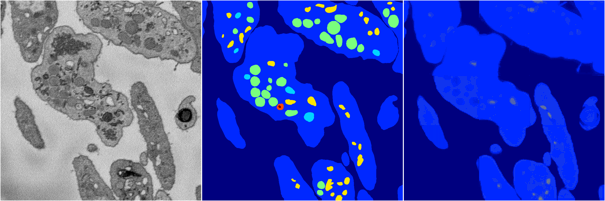</a>
<i>Click image for more details</i>

2 nets

**ari**: min -0.0021. max 0.7077. mean 0.3528.  ([best net](229/1))

**miou**: min 0.0699. max 0.2704. mean 0.1702.  ([best net](229/1))

**accuracy**: min 0.4558. max 0.8900. mean 0.6729.  ([best net](229/1))

**n_params**: min 273583.0000. max 273842.0000. mean 273712.5000.  ([best net](229/1))

---

<a href="218"><h2>random_hybrid_3d / 0416 / 218</h2></a>
Created 18 Apr 2019, 16:41:06

<a href="218">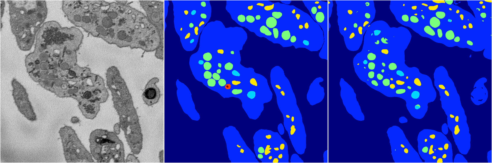</a>
<i>Click image for more details</i>

2 nets

**ari**: min 0.8345. max 0.8363. mean 0.8354.  ([best net](218/0))

**miou**: min 0.4230. max 0.5049. mean 0.4639.  ([best net](218/0))

**accuracy**: min 0.9353. max 0.9399. mean 0.9376.  ([best net](218/0))

**n_params**: min 2241159.0000. max 2241306.0000. mean 2241232.5000.  ([best net](218/0))

---

<a href="219"><h2>random_hybrid_3d / 0416 / 219</h2></a>
Created 18 Apr 2019, 16:41:06

<i>Click image for more details</i>

2 nets

**ari**: min 0.8382. max 0.8407. mean 0.8394.  ([best net](219/1))

**miou**: min 0.4272. max 0.5665. mean 0.4969.  ([best net](219/1))

**accuracy**: min 0.9375. max 0.9424. mean 0.9399.  ([best net](219/1))

**n_params**: min 26284117.0000. max 26286322.0000. mean 26285219.5000.  ([best net](219/1))

---

<a href="223"><h2>random_hybrid_3d / 0416 / 223</h2></a>
Created 18 Apr 2019, 16:41:06

<i>Click image for more details</i>

2 nets

**ari**: min 0.8223. max 0.8426. mean 0.8325.  ([best net](223/1))

**miou**: min 0.4358. max 0.5111. mean 0.4734.  ([best net](223/1))

**accuracy**: min 0.9340. max 0.9430. mean 0.9385.  ([best net](223/1))

**n_params**: min 2195320.0000. max 2195467.0000. mean 2195393.5000.  ([best net](223/1))

---

<a href="225"><h2>random_hybrid_3d / 0416 / 225</h2></a>
Created 18 Apr 2019, 16:41:06

<i>Click image for more details</i>

2 nets

**ari**: min 0.8285. max 0.8289. mean 0.8287.  ([best net](225/0))

**miou**: min 0.4204. max 0.4345. mean 0.4274.  ([best net](225/1))

**accuracy**: min 0.9343. max 0.9353. mean 0.9348.  ([best net](225/1))

**n_params**: min 3265630.0000. max 3266659.0000. mean 3266144.5000.  ([best net](225/1))

---

<a href="227"><h2>random_hybrid_3d / 0416 / 227</h2></a>
Created 18 Apr 2019, 16:41:06

<i>Click image for more details</i>

2 nets

**ari**: min 0.8240. max 0.8385. mean 0.8313.  ([best net](227/1))

**miou**: min 0.4160. max 0.4307. mean 0.4234.  ([best net](227/0))

**accuracy**: min 0.9343. max 0.9349. mean 0.9346.  ([best net](227/1))

**n_params**: min 847567.0000. max 847714.0000. mean 847640.5000.  ([best net](227/0))

---

<a href="220"><h2>random_hybrid_3d / 0416 / 220</h2></a>
Created 18 Apr 2019, 16:41:06

<i>Click image for more details</i>

2 nets

**ari**: min 0.4854. max 0.8423. mean 0.6638.  ([best net](220/0))

**miou**: min 0.2177. max 0.5692. mean 0.3934.  ([best net](220/0))

**accuracy**: min 0.8277. max 0.9432. mean 0.8854.  ([best net](220/0))

**n_params**: min 660861.0000. max 660861.0000. mean 660861.0000.  ([best net](220/1))

---

<a href="224"><h2>random_hybrid_3d / 0416 / 224</h2></a>
Created 18 Apr 2019, 16:41:06

<i>Click image for more details</i>

2 nets

**ari**: min 0.8185. max 0.8323. mean 0.8254.  ([best net](224/0))

**miou**: min 0.4183. max 0.4340. mean 0.4261.  ([best net](224/0))

**accuracy**: min 0.9342. max 0.9364. mean 0.9353.  ([best net](224/0))

**n_params**: min 313712.0000. max 314923.0000. mean 314317.5000.  ([best net](224/0))

---

<a href="230"><h2>random_hybrid_3d / 0416 / 230</h2></a>
Created 18 Apr 2019, 16:41:06

<i>Click image for more details</i>

2 nets

**ari**: min 0.7957. max 0.8345. mean 0.8151.  ([best net](230/1))

**miou**: min 0.2878. max 0.4421. mean 0.3650.  ([best net](230/1))

**accuracy**: min 0.9144. max 0.9360. mean 0.9252.  ([best net](230/1))

**n_params**: min 119548.0000. max 119548.0000. mean 119548.0000.  ([best net](230/0))

---

<a href="214"><h2>random_hybrid_3d / 0416 / 214</h2></a>
Created 18 Apr 2019, 16:41:06

<i>Click image for more details</i>

2 nets

**ari**: min 0.8344. max 0.8380. mean 0.8362.  ([best net](214/1))

**miou**: min 0.4368. max 0.5059. mean 0.4714.  ([best net](214/0))

**accuracy**: min 0.9371. max 0.9407. mean 0.9389.  ([best net](214/0))

**n_params**: min 4480984.0000. max 4481663.0000. mean 4481323.5000.  ([best net](214/0))

---

<a href="228"><h2>random_hybrid_3d / 0416 / 228</h2></a>
Created 18 Apr 2019, 16:41:06

<i>Click image for more details</i>

2 nets

**ari**: min 0.1218. max 0.7620. mean 0.4419.  ([best net](228/1))

**miou**: min 0.2364. max 0.2928. mean 0.2646.  ([best net](228/1))

**accuracy**: min 0.6302. max 0.9107. mean 0.7705.  ([best net](228/1))

**n_params**: min 104927.0000. max 104927.0000. mean 104927.0000.  ([best net](228/0))

---

<a href="210"><h2>random_hybrid_3d / 0416 / 210</h2></a>
Created 18 Apr 2019, 16:41:06

<a href="210">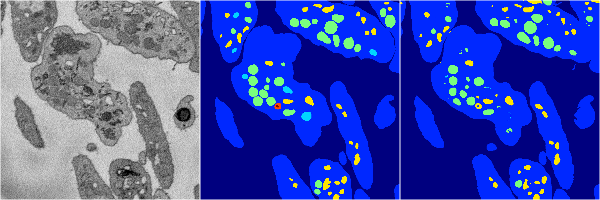</a>
<i>Click image for more details</i>

2 nets

**ari**: min 0.8146. max 0.8411. mean 0.8279.  ([best net](210/1))

**miou**: min 0.4007. max 0.4761. mean 0.4384.  ([best net](210/1))

**accuracy**: min 0.9319. max 0.9409. mean 0.9364.  ([best net](210/1))

**n_params**: min 1257171.0000. max 1258053.0000. mean 1257612.0000.  ([best net](210/1))

---

<a href="215"><h2>random_hybrid_3d / 0416 / 215</h2></a>
Created 18 Apr 2019, 16:41:06

<i>Click image for more details</i>

2 nets

**ari**: min 0.8374. max 0.8420. mean 0.8397.  ([best net](215/1))

**miou**: min 0.4243. max 0.5508. mean 0.4875.  ([best net](215/1))

**accuracy**: min 0.9360. max 0.9429. mean 0.9395.  ([best net](215/1))

**n_params**: min 35726187.0000. max 35728350.0000. mean 35727268.5000.  ([best net](215/0))

---

<a href="213"><h2>random_hybrid_3d / 0416 / 213</h2></a>
Created 18 Apr 2019, 16:41:06

<i>Click image for more details</i>

2 nets

**ari**: min -0.0000. max 0.0565. mean 0.0282.  ([best net](213/0))

**miou**: min 0.0659. max 0.1090. mean 0.0874.  ([best net](213/0))

**accuracy**: min 0.4613. max 0.5083. mean 0.4848.  ([best net](213/0))

**n_params**: min 31450.0000. max 31450.0000. mean 31450.0000.  ([best net](213/0))

---

<a href="216"><h2>random_hybrid_3d / 0416 / 216</h2></a>
Created 18 Apr 2019, 16:41:05

<i>Click image for more details</i>

2 nets

**ari**: min 0.8219. max 0.8378. mean 0.8298.  ([best net](216/0))

**miou**: min 0.4314. max 0.5082. mean 0.4698.  ([best net](216/0))

**accuracy**: min 0.9334. max 0.9407. mean 0.9371.  ([best net](216/0))

**n_params**: min 4348423.0000. max 4349263.0000. mean 4348843.0000.  ([best net](216/1))

---

<a href="206"><h2>random_hybrid_3d / 0416 / 206</h2></a>
Created 18 Apr 2019, 16:41:05

<i>Click image for more details</i>

2 nets

**ari**: min 0.7136. max 0.7820. mean 0.7478.  ([best net](206/1))

**miou**: min 0.2460. max 0.3489. mean 0.2975.  ([best net](206/1))

**accuracy**: min 0.8938. max 0.9186. mean 0.9062.  ([best net](206/1))

**n_params**: min 7339399.0000. max 7340435.0000. mean 7339917.0000.  ([best net](206/1))

---

<a href="211"><h2>random_hybrid_3d / 0416 / 211</h2></a>
Created 18 Apr 2019, 16:41:05

<i>Click image for more details</i>

2 nets

**ari**: min 0.7900. max 0.8276. mean 0.8088.  ([best net](211/1))

**miou**: min 0.3473. max 0.4905. mean 0.4189.  ([best net](211/1))

**accuracy**: min 0.9168. max 0.9367. mean 0.9268.  ([best net](211/1))

**n_params**: min 1504859.0000. max 1505006.0000. mean 1504932.5000.  ([best net](211/1))

---

<a href="208"><h2>random_hybrid_3d / 0416 / 208</h2></a>
Created 18 Apr 2019, 16:41:05

<i>Click image for more details</i>

2 nets

**ari**: min 0.8357. max 0.8436. mean 0.8396.  ([best net](208/1))

**miou**: min 0.4260. max 0.5698. mean 0.4979.  ([best net](208/1))

**accuracy**: min 0.9355. max 0.9439. mean 0.9397.  ([best net](208/1))

**n_params**: min 5629807.0000. max 5632047.0000. mean 5630927.0000.  ([best net](208/0))

---

<a href="212"><h2>random_hybrid_3d / 0416 / 212</h2></a>
Created 18 Apr 2019, 16:41:05

<i>Click image for more details</i>

2 nets

**ari**: min 0.0121. max 0.8417. mean 0.4269.  ([best net](212/1))

**miou**: min 0.0888. max 0.5488. mean 0.3188.  ([best net](212/1))

**accuracy**: min 0.4655. max 0.9420. mean 0.7038.  ([best net](212/1))

**n_params**: min 988022.0000. max 988589.0000. mean 988305.5000.  ([best net](212/0))

---

<a href="204"><h2>random_hybrid_3d / 0416 / 204</h2></a>
Created 18 Apr 2019, 16:41:05

<i>Click image for more details</i>

2 nets

**ari**: min 0.8418. max 0.8421. mean 0.8419.  ([best net](204/0))

**miou**: min 0.4738. max 0.4840. mean 0.4789.  ([best net](204/0))

**accuracy**: min 0.9409. max 0.9414. mean 0.9411.  ([best net](204/0))

**n_params**: min 5047665.0000. max 5050073.0000. mean 5048869.0000.  ([best net](204/0))

---

<a href="209"><h2>random_hybrid_3d / 0416 / 209</h2></a>
Created 18 Apr 2019, 16:41:05

<i>Click image for more details</i>

2 nets

**ari**: min 0.8341. max 0.8373. mean 0.8357.  ([best net](209/0))

**miou**: min 0.4179. max 0.4196. mean 0.4188.  ([best net](209/1))

**accuracy**: min 0.9345. max 0.9345. mean 0.9345.  ([best net](209/0))

**n_params**: min 76279.0000. max 76279.0000. mean 76279.0000.  ([best net](209/1))

---

<a href="207"><h2>random_hybrid_3d / 0416 / 207</h2></a>
Created 18 Apr 2019, 16:41:05

<i>Click image for more details</i>

2 nets

**ari**: min 0.8193. max 0.8319. mean 0.8256.  ([best net](207/1))

**miou**: min 0.4364. max 0.4549. mean 0.4457.  ([best net](207/1))

**accuracy**: min 0.9330. max 0.9347. mean 0.9339.  ([best net](207/0))

**n_params**: min 252935.0000. max 252970.0000. mean 252952.5000.  ([best net](207/0))

---

<a href="194"><h2>random_hybrid_3d / 0416 / 194</h2></a>
Created 18 Apr 2019, 16:41:05

<i>Click image for more details</i>

2 nets

**ari**: min 0.8307. max 0.8371. mean 0.8339.  ([best net](194/1))

**miou**: min 0.4472. max 0.5049. mean 0.4760.  ([best net](194/1))

**accuracy**: min 0.9368. max 0.9413. mean 0.9390.  ([best net](194/1))

**n_params**: min 3522723.0000. max 3522723.0000. mean 3522723.0000.  ([best net](194/0))

---

<a href="205"><h2>random_hybrid_3d / 0416 / 205</h2></a>
Created 18 Apr 2019, 16:41:05

<i>Click image for more details</i>

2 nets

**ari**: min 0.8368. max 0.8425. mean 0.8397.  ([best net](205/0))

**miou**: min 0.4253. max 0.5641. mean 0.4947.  ([best net](205/0))

**accuracy**: min 0.9360. max 0.9431. mean 0.9395.  ([best net](205/0))

**n_params**: min 59602.0000. max 59749.0000. mean 59675.5000.  ([best net](205/0))

---

<a href="197"><h2>random_hybrid_3d / 0416 / 197</h2></a>
Created 18 Apr 2019, 16:41:05

<i>Click image for more details</i>

2 nets

**ari**: min 0.8286. max 0.8412. mean 0.8349.  ([best net](197/0))

**miou**: min 0.5124. max 0.5305. mean 0.5215.  ([best net](197/0))

**accuracy**: min 0.9373. max 0.9423. mean 0.9398.  ([best net](197/0))

**n_params**: min 7956259.0000. max 7956259.0000. mean 7956259.0000.  ([best net](197/0))

---

<a href="203"><h2>random_hybrid_3d / 0416 / 203</h2></a>
Created 18 Apr 2019, 16:41:05

<i>Click image for more details</i>

2 nets

**ari**: min 0.8294. max 0.8425. mean 0.8359.  ([best net](203/1))

**miou**: min 0.4346. max 0.5725. mean 0.5035.  ([best net](203/1))

**accuracy**: min 0.9365. max 0.9433. mean 0.9399.  ([best net](203/1))

**n_params**: min 613548.0000. max 613548.0000. mean 613548.0000.  ([best net](203/0))

---

<a href="189"><h2>random_hybrid_3d / 0416 / 189</h2></a>
Created 18 Apr 2019, 16:41:05

<i>Click image for more details</i>

2 nets

**ari**: min 0.6171. max 0.8309. mean 0.7240.  ([best net](189/0))

**miou**: min 0.2597. max 0.4376. mean 0.3486.  ([best net](189/0))

**accuracy**: min 0.8685. max 0.9375. mean 0.9030.  ([best net](189/0))

**n_params**: min 739526.0000. max 740282.0000. mean 739904.0000.  ([best net](189/0))

---

<a href="202"><h2>random_hybrid_3d / 0416 / 202</h2></a>
Created 18 Apr 2019, 16:41:05

<i>Click image for more details</i>

2 nets

**ari**: min 0.7880. max 0.8394. mean 0.8137.  ([best net](202/1))

**miou**: min 0.3405. max 0.5558. mean 0.4481.  ([best net](202/1))

**accuracy**: min 0.9202. max 0.9426. mean 0.9314.  ([best net](202/1))

**n_params**: min 34029.0000. max 34029.0000. mean 34029.0000.  ([best net](202/0))

---

<a href="192"><h2>random_hybrid_3d / 0416 / 192</h2></a>
Created 18 Apr 2019, 16:41:05

<i>Click image for more details</i>

2 nets

**ari**: min 0.8181. max 0.8384. mean 0.8282.  ([best net](192/1))

**miou**: min 0.3921. max 0.5652. mean 0.4786.  ([best net](192/1))

**accuracy**: min 0.9263. max 0.9417. mean 0.9340.  ([best net](192/1))

**n_params**: min 10098434.0000. max 10100009.0000. mean 10099221.5000.  ([best net](192/0))

---

<a href="184"><h2>random_hybrid_3d / 0416 / 184</h2></a>
Created 18 Apr 2019, 16:41:05

<i>Click image for more details</i>

2 nets

**ari**: min 0.7119. max 0.8367. mean 0.7743.  ([best net](184/1))

**miou**: min 0.2469. max 0.4291. mean 0.3380.  ([best net](184/1))

**accuracy**: min 0.8945. max 0.9370. mean 0.9158.  ([best net](184/1))

**n_params**: min 21322638.0000. max 21322638.0000. mean 21322638.0000.  ([best net](184/0))

---

<a href="190"><h2>random_hybrid_3d / 0416 / 190</h2></a>
Created 18 Apr 2019, 16:41:05

<a href="190">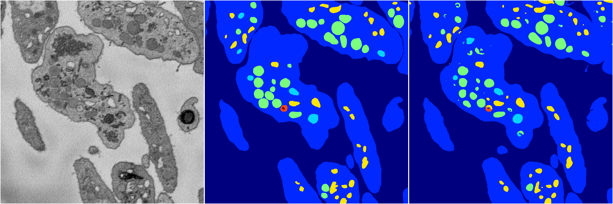</a>
<i>Click image for more details</i>

2 nets

**ari**: min 0.8358. max 0.8413. mean 0.8385.  ([best net](190/0))

**miou**: min 0.4253. max 0.5656. mean 0.4955.  ([best net](190/0))

**accuracy**: min 0.9363. max 0.9424. mean 0.9394.  ([best net](190/0))

**n_params**: min 2489836.0000. max 2490704.0000. mean 2490270.0000.  ([best net](190/1))

---

<a href="195"><h2>random_hybrid_3d / 0416 / 195</h2></a>
Created 18 Apr 2019, 16:41:05

<i>Click image for more details</i>

2 nets

**ari**: min 0.8387. max 0.8406. mean 0.8397.  ([best net](195/0))

**miou**: min 0.4216. max 0.5646. mean 0.4931.  ([best net](195/0))

**accuracy**: min 0.9356. max 0.9428. mean 0.9392.  ([best net](195/0))

**n_params**: min 3202425.0000. max 3202943.0000. mean 3202684.0000.  ([best net](195/1))

---

<a href="193"><h2>random_hybrid_3d / 0416 / 193</h2></a>
Created 18 Apr 2019, 16:41:05

<i>Click image for more details</i>

2 nets

**ari**: min 0.8020. max 0.8264. mean 0.8142.  ([best net](193/0))

**miou**: min 0.3359. max 0.4320. mean 0.3839.  ([best net](193/0))

**accuracy**: min 0.9176. max 0.9352. mean 0.9264.  ([best net](193/0))

**n_params**: min 1145246.0000. max 1145939.0000. mean 1145592.5000.  ([best net](193/1))

---

<a href="196"><h2>random_hybrid_3d / 0416 / 196</h2></a>
Created 18 Apr 2019, 16:41:05

<i>Click image for more details</i>

2 nets

**ari**: min 0.8298. max 0.8404. mean 0.8351.  ([best net](196/1))

**miou**: min 0.4095. max 0.5094. mean 0.4595.  ([best net](196/1))

**accuracy**: min 0.9311. max 0.9417. mean 0.9364.  ([best net](196/1))

**n_params**: min 2288868.0000. max 2289414.0000. mean 2289141.0000.  ([best net](196/1))

---

<a href="200"><h2>random_hybrid_3d / 0416 / 200</h2></a>
Created 18 Apr 2019, 16:41:05

<i>Click image for more details</i>

2 nets

**ari**: min 0.0000. max 0.8437. mean 0.4218.  ([best net](200/1))

**miou**: min 0.0661. max 0.5667. mean 0.3164.  ([best net](200/1))

**accuracy**: min 0.4629. max 0.9438. mean 0.7033.  ([best net](200/1))

**n_params**: min 2341987.0000. max 2343779.0000. mean 2342883.0000.  ([best net](200/1))

---

<a href="188"><h2>random_hybrid_3d / 0416 / 188</h2></a>
Created 18 Apr 2019, 16:41:05

<i>Click image for more details</i>

2 nets

**ari**: min 0.8390. max 0.8418. mean 0.8404.  ([best net](188/1))

**miou**: min 0.4980. max 0.5742. mean 0.5361.  ([best net](188/0))

**accuracy**: min 0.9416. max 0.9424. mean 0.9420.  ([best net](188/0))

**n_params**: min 230338.0000. max 230485.0000. mean 230411.5000.  ([best net](188/0))

---

<a href="199"><h2>random_hybrid_3d / 0416 / 199</h2></a>
Created 18 Apr 2019, 16:41:05

<i>Click image for more details</i>

2 nets

**ari**: min 0.7894. max 0.8188. mean 0.8041.  ([best net](199/0))

**miou**: min 0.3837. max 0.4135. mean 0.3986.  ([best net](199/0))

**accuracy**: min 0.9240. max 0.9336. mean 0.9288.  ([best net](199/0))

**n_params**: min 2882419.0000. max 2883490.0000. mean 2882954.5000.  ([best net](199/0))

---

<a href="191"><h2>random_hybrid_3d / 0416 / 191</h2></a>
Created 18 Apr 2019, 16:41:05

<i>Click image for more details</i>

2 nets

**ari**: min 0.4994. max 0.8420. mean 0.6707.  ([best net](191/0))

**miou**: min 0.2231. max 0.5114. mean 0.3673.  ([best net](191/0))

**accuracy**: min 0.8308. max 0.9427. mean 0.8868.  ([best net](191/0))

**n_params**: min 2583947.0000. max 2584262.0000. mean 2584104.5000.  ([best net](191/0))

---

<a href="201"><h2>random_hybrid_3d / 0416 / 201</h2></a>
Created 18 Apr 2019, 16:41:05

<i>Click image for more details</i>

2 nets

**ari**: min 0.0000. max 0.8439. mean 0.4220.  ([best net](201/1))

**miou**: min 0.0661. max 0.5762. mean 0.3212.  ([best net](201/1))

**accuracy**: min 0.4629. max 0.9437. mean 0.7033.  ([best net](201/1))

**n_params**: min 947721.0000. max 949863.0000. mean 948792.0000.  ([best net](201/1))

---

<a href="198"><h2>random_hybrid_3d / 0416 / 198</h2></a>
Created 18 Apr 2019, 16:41:05

<i>Click image for more details</i>

2 nets

**ari**: min 0.0370. max 0.0909. mean 0.0639.  ([best net](198/1))

**miou**: min 0.1007. max 0.1422. mean 0.1215.  ([best net](198/1))

**accuracy**: min 0.3743. max 0.6222. mean 0.4983.  ([best net](198/1))

**n_params**: min 145939.0000. max 146163.0000. mean 146051.0000.  ([best net](198/1))

---

<a href="179"><h2>random_hybrid_3d / 0416 / 179</h2></a>
Created 18 Apr 2019, 16:41:05

<i>Click image for more details</i>

2 nets

**ari**: min 0.8281. max 0.8386. mean 0.8334.  ([best net](179/0))

**miou**: min 0.4386. max 0.5056. mean 0.4721.  ([best net](179/0))

**accuracy**: min 0.9351. max 0.9408. mean 0.9380.  ([best net](179/0))

**n_params**: min 12743217.0000. max 12746052.0000. mean 12744634.5000.  ([best net](179/1))

---

<a href="187"><h2>random_hybrid_3d / 0416 / 187</h2></a>
Created 18 Apr 2019, 16:41:05

<i>Click image for more details</i>

2 nets

**ari**: min 0.7964. max 0.8359. mean 0.8161.  ([best net](187/0))

**miou**: min 0.3700. max 0.4573. mean 0.4137.  ([best net](187/0))

**accuracy**: min 0.9246. max 0.9378. mean 0.9312.  ([best net](187/0))

**n_params**: min 4555392.0000. max 4555392.0000. mean 4555392.0000.  ([best net](187/0))

---

<a href="181"><h2>random_hybrid_3d / 0416 / 181</h2></a>
Created 18 Apr 2019, 16:41:05

<i>Click image for more details</i>

2 nets

**ari**: min 0.7976. max 0.8276. mean 0.8126.  ([best net](181/1))

**miou**: min 0.3991. max 0.4794. mean 0.4393.  ([best net](181/1))

**accuracy**: min 0.9227. max 0.9347. mean 0.9287.  ([best net](181/1))

**n_params**: min 8552687.0000. max 8552834.0000. mean 8552760.5000.  ([best net](181/0))

---

<a href="182"><h2>random_hybrid_3d / 0416 / 182</h2></a>
Created 18 Apr 2019, 16:41:05

<a href="182">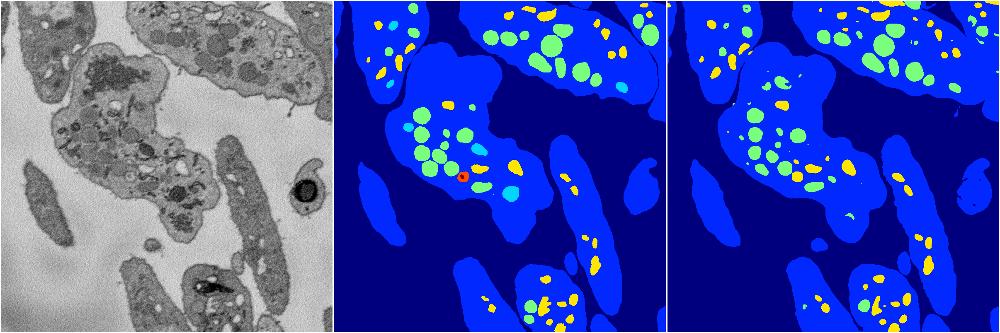</a>
<i>Click image for more details</i>

2 nets

**ari**: min 0.7853. max 0.8276. mean 0.8065.  ([best net](182/0))

**miou**: min 0.3340. max 0.4347. mean 0.3844.  ([best net](182/0))

**accuracy**: min 0.9165. max 0.9359. mean 0.9262.  ([best net](182/0))

**n_params**: min 1625188.0000. max 1625335.0000. mean 1625261.5000.  ([best net](182/0))

---

<a href="186"><h2>random_hybrid_3d / 0416 / 186</h2></a>
Created 18 Apr 2019, 16:41:05

<i>Click image for more details</i>

2 nets

**ari**: min 0.7560. max 0.8334. mean 0.7947.  ([best net](186/1))

**miou**: min 0.2582. max 0.5259. mean 0.3921.  ([best net](186/1))

**accuracy**: min 0.8995. max 0.9385. mean 0.9190.  ([best net](186/1))

**n_params**: min 13101860.0000. max 13101860.0000. mean 13101860.0000.  ([best net](186/1))

---

<a href="159"><h2>random_hybrid_3d / 0416 / 159</h2></a>
Created 18 Apr 2019, 16:41:05

<i>Click image for more details</i>

2 nets

**ari**: min 0.8327. max 0.8405. mean 0.8366.  ([best net](159/0))

**miou**: min 0.4293. max 0.4633. mean 0.4463.  ([best net](159/0))

**accuracy**: min 0.9362. max 0.9394. mean 0.9378.  ([best net](159/0))

**n_params**: min 29446131.0000. max 29447622.0000. mean 29446876.5000.  ([best net](159/1))

---

<a href="178"><h2>random_hybrid_3d / 0416 / 178</h2></a>
Created 18 Apr 2019, 16:41:05

<a href="178">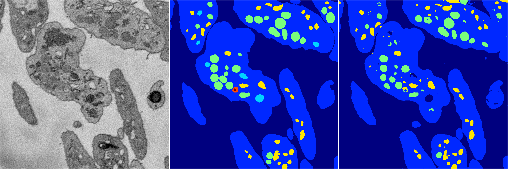</a>
<i>Click image for more details</i>

2 nets

**ari**: min 0.2285. max 0.8251. mean 0.5268.  ([best net](178/0))

**miou**: min 0.1685. max 0.4297. mean 0.2991.  ([best net](178/0))

**accuracy**: min 0.7239. max 0.9340. mean 0.8289.  ([best net](178/0))

**n_params**: min 1597440.0000. max 1597937.0000. mean 1597688.5000.  ([best net](178/1))

---

<a href="185"><h2>random_hybrid_3d / 0416 / 185</h2></a>
Created 18 Apr 2019, 16:41:05

<i>Click image for more details</i>

2 nets

**ari**: min 0.8340. max 0.8378. mean 0.8359.  ([best net](185/0))

**miou**: min 0.4305. max 0.5006. mean 0.4656.  ([best net](185/0))

**accuracy**: min 0.9346. max 0.9401. mean 0.9373.  ([best net](185/0))

**n_params**: min 6270285.0000. max 6270285.0000. mean 6270285.0000.  ([best net](185/0))

---

<a href="177"><h2>random_hybrid_3d / 0416 / 177</h2></a>
Created 18 Apr 2019, 16:41:05

<i>Click image for more details</i>

2 nets

**ari**: min 0.8415. max 0.8430. mean 0.8423.  ([best net](177/1))

**miou**: min 0.5153. max 0.5644. mean 0.5399.  ([best net](177/1))

**accuracy**: min 0.9426. max 0.9433. mean 0.9429.  ([best net](177/1))

**n_params**: min 624901.0000. max 625048.0000. mean 624974.5000.  ([best net](177/0))

---

<a href="180"><h2>random_hybrid_3d / 0416 / 180</h2></a>
Created 18 Apr 2019, 16:41:05

<i>Click image for more details</i>

2 nets

**ari**: min 0.8337. max 0.8381. mean 0.8359.  ([best net](180/0))

**miou**: min 0.4268. max 0.5114. mean 0.4691.  ([best net](180/0))

**accuracy**: min 0.9353. max 0.9420. mean 0.9387.  ([best net](180/0))

**n_params**: min 144822.0000. max 144969.0000. mean 144895.5000.  ([best net](180/0))

---

<a href="168"><h2>random_hybrid_3d / 0416 / 168</h2></a>
Created 18 Apr 2019, 16:41:05

<i>Click image for more details</i>

2 nets

**ari**: min 0.8289. max 0.8435. mean 0.8362.  ([best net](168/1))

**miou**: min 0.4943. max 0.5086. mean 0.5014.  ([best net](168/1))

**accuracy**: min 0.9370. max 0.9427. mean 0.9398.  ([best net](168/1))

**n_params**: min 1939318.0000. max 1939318.0000. mean 1939318.0000.  ([best net](168/0))

---

<a href="183"><h2>random_hybrid_3d / 0416 / 183</h2></a>
Created 18 Apr 2019, 16:41:05

<a href="183">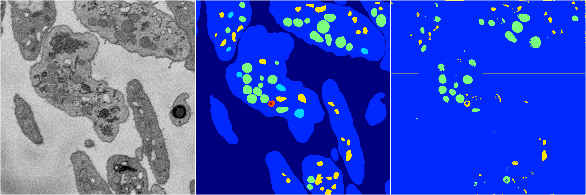</a>
<i>Click image for more details</i>

2 nets

**ari**: min 0.0285. max 0.1045. mean 0.0665.  ([best net](183/1))

**miou**: min 0.1558. max 0.2392. mean 0.1975.  ([best net](183/1))

**accuracy**: min 0.4843. max 0.4956. mean 0.4900.  ([best net](183/0))

**n_params**: min 11655.0000. max 11655.0000. mean 11655.0000.  ([best net](183/0))

---

<a href="163"><h2>random_hybrid_3d / 0416 / 163</h2></a>
Created 18 Apr 2019, 16:41:05

<i>Click image for more details</i>

2 nets

**ari**: min 0.8319. max 0.8379. mean 0.8349.  ([best net](163/1))

**miou**: min 0.4958. max 0.5815. mean 0.5387.  ([best net](163/0))

**accuracy**: min 0.9373. max 0.9411. mean 0.9392.  ([best net](163/1))

**n_params**: min 5917880.0000. max 5917880.0000. mean 5917880.0000.  ([best net](163/1))

---

<a href="161"><h2>random_hybrid_3d / 0416 / 161</h2></a>
Created 18 Apr 2019, 16:41:05

<i>Click image for more details</i>

2 nets

**ari**: min 0.4689. max 0.8379. mean 0.6534.  ([best net](161/0))

**miou**: min 0.2119. max 0.4910. mean 0.3515.  ([best net](161/0))

**accuracy**: min 0.8224. max 0.9403. mean 0.8814.  ([best net](161/0))

**n_params**: min 951350.0000. max 951567.0000. mean 951458.5000.  ([best net](161/0))

---

<a href="171"><h2>random_hybrid_3d / 0416 / 171</h2></a>
Created 18 Apr 2019, 16:41:05

<i>Click image for more details</i>

2 nets

**ari**: min 0.7590. max 0.8426. mean 0.8008.  ([best net](171/1))

**miou**: min 0.2983. max 0.5514. mean 0.4248.  ([best net](171/1))

**accuracy**: min 0.9096. max 0.9425. mean 0.9261.  ([best net](171/1))

**n_params**: min 8922749.0000. max 8922749.0000. mean 8922749.0000.  ([best net](171/1))

---

<a href="176"><h2>random_hybrid_3d / 0416 / 176</h2></a>
Created 18 Apr 2019, 16:41:05

<i>Click image for more details</i>

2 nets

**ari**: min 0.8162. max 0.8350. mean 0.8256.  ([best net](176/0))

**miou**: min 0.4171. max 0.4176. mean 0.4173.  ([best net](176/0))

**accuracy**: min 0.9302. max 0.9343. mean 0.9322.  ([best net](176/0))

**n_params**: min 2474490.0000. max 2474490.0000. mean 2474490.0000.  ([best net](176/1))

---

<a href="165"><h2>random_hybrid_3d / 0416 / 165</h2></a>
Created 18 Apr 2019, 16:41:05

<i>Click image for more details</i>

2 nets

**ari**: min 0.8404. max 0.8429. mean 0.8417.  ([best net](165/0))

**miou**: min 0.5098. max 0.5099. mean 0.5098.  ([best net](165/0))

**accuracy**: min 0.9421. max 0.9427. mean 0.9424.  ([best net](165/0))

**n_params**: min 3460391.0000. max 3460958.0000. mean 3460674.5000.  ([best net](165/1))

---

<a href="172"><h2>random_hybrid_3d / 0416 / 172</h2></a>
Created 18 Apr 2019, 16:41:05

<i>Click image for more details</i>

2 nets

**ari**: min 0.8354. max 0.8378. mean 0.8366.  ([best net](172/1))

**miou**: min 0.4245. max 0.5158. mean 0.4702.  ([best net](172/1))

**accuracy**: min 0.9354. max 0.9417. mean 0.9386.  ([best net](172/1))

**n_params**: min 9487806.0000. max 9490053.0000. mean 9488929.5000.  ([best net](172/1))

---

<a href="170"><h2>random_hybrid_3d / 0416 / 170</h2></a>
Created 18 Apr 2019, 16:41:05

<i>Click image for more details</i>

2 nets

**ari**: min 0.8398. max 0.8412. mean 0.8405.  ([best net](170/0))

**miou**: min 0.5009. max 0.5105. mean 0.5057.  ([best net](170/1))

**accuracy**: min 0.9413. max 0.9422. mean 0.9418.  ([best net](170/1))

**n_params**: min 4857012.0000. max 4857012.0000. mean 4857012.0000.  ([best net](170/0))

---

<a href="174"><h2>random_hybrid_3d / 0416 / 174</h2></a>
Created 18 Apr 2019, 16:41:05

<i>Click image for more details</i>

2 nets

**ari**: min 0.8217. max 0.8430. mean 0.8324.  ([best net](174/1))

**miou**: min 0.4302. max 0.5091. mean 0.4697.  ([best net](174/1))

**accuracy**: min 0.9329. max 0.9429. mean 0.9379.  ([best net](174/1))

**n_params**: min 4578855.0000. max 4579002.0000. mean 4578928.5000.  ([best net](174/1))

---

<a href="167"><h2>random_hybrid_3d / 0416 / 167</h2></a>
Created 18 Apr 2019, 16:41:05

<i>Click image for more details</i>

2 nets

**ari**: min 0.8360. max 0.8415. mean 0.8387.  ([best net](167/1))

**miou**: min 0.4304. max 0.5221. mean 0.4762.  ([best net](167/1))

**accuracy**: min 0.9368. max 0.9422. mean 0.9395.  ([best net](167/1))

**n_params**: min 1217500.0000. max 1217983.0000. mean 1217741.5000.  ([best net](167/0))

---

<a href="152"><h2>random_hybrid_3d / 0416 / 152</h2></a>
Created 18 Apr 2019, 16:41:05

<i>Click image for more details</i>

2 nets

**ari**: min 0.1302. max 0.8282. mean 0.4792.  ([best net](152/0))

**miou**: min 0.2436. max 0.4829. mean 0.3632.  ([best net](152/0))

**accuracy**: min 0.4911. max 0.9364. mean 0.7137.  ([best net](152/0))

**n_params**: min 1049543.0000. max 1049543.0000. mean 1049543.0000.  ([best net](152/0))

---

<a href="173"><h2>random_hybrid_3d / 0416 / 173</h2></a>
Created 18 Apr 2019, 16:41:05

<i>Click image for more details</i>

2 nets

**ari**: min 0.6030. max 0.8339. mean 0.7184.  ([best net](173/0))

**miou**: min 0.2442. max 0.5144. mean 0.3793.  ([best net](173/0))

**accuracy**: min 0.8158. max 0.9363. mean 0.8760.  ([best net](173/0))

**n_params**: min 11431.0000. max 11431.0000. mean 11431.0000.  ([best net](173/0))

---

<a href="164"><h2>random_hybrid_3d / 0416 / 164</h2></a>
Created 18 Apr 2019, 16:41:05

<i>Click image for more details</i>

2 nets

**ari**: min 0.8310. max 0.8406. mean 0.8358.  ([best net](164/1))

**miou**: min 0.4335. max 0.5096. mean 0.4715.  ([best net](164/1))

**accuracy**: min 0.9357. max 0.9424. mean 0.9391.  ([best net](164/1))

**n_params**: min 1233337.0000. max 1235017.0000. mean 1234177.0000.  ([best net](164/1))

---

<a href="162"><h2>random_hybrid_3d / 0416 / 162</h2></a>
Created 18 Apr 2019, 16:41:05

<i>Click image for more details</i>

2 nets

**ari**: min -0.0019. max 0.8191. mean 0.4086.  ([best net](162/0))

**miou**: min 0.0675. max 0.4209. mean 0.2442.  ([best net](162/0))

**accuracy**: min 0.4640. max 0.9342. mean 0.6991.  ([best net](162/0))

**n_params**: min 171444.0000. max 171696.0000. mean 171570.0000.  ([best net](162/1))

---

<a href="160"><h2>random_hybrid_3d / 0416 / 160</h2></a>
Created 18 Apr 2019, 16:41:05

<i>Click image for more details</i>

2 nets

**ari**: min 0.7137. max 0.8424. mean 0.7780.  ([best net](160/1))

**miou**: min 0.2471. max 0.5258. mean 0.3865.  ([best net](160/1))

**accuracy**: min 0.8950. max 0.9417. mean 0.9184.  ([best net](160/1))

**n_params**: min 2924967.0000. max 2926332.0000. mean 2925649.5000.  ([best net](160/0))

---

<a href="169"><h2>random_hybrid_3d / 0416 / 169</h2></a>
Created 18 Apr 2019, 16:41:05

<i>Click image for more details</i>

2 nets

**ari**: min 0.1014. max 0.8429. mean 0.4721.  ([best net](169/0))

**miou**: min 0.1955. max 0.5350. mean 0.3652.  ([best net](169/0))

**accuracy**: min 0.6301. max 0.9435. mean 0.7868.  ([best net](169/0))

**n_params**: min 70942.0000. max 71089.0000. mean 71015.5000.  ([best net](169/0))

---

<a href="158"><h2>random_hybrid_3d / 0416 / 158</h2></a>
Created 18 Apr 2019, 16:41:05

<i>Click image for more details</i>

2 nets

**ari**: min 0.0987. max 0.8378. mean 0.4683.  ([best net](158/1))

**miou**: min 0.0803. max 0.4329. mean 0.2566.  ([best net](158/1))

**accuracy**: min 0.2775. max 0.9357. mean 0.6066.  ([best net](158/1))

**n_params**: min 26808.0000. max 26955.0000. mean 26881.5000.  ([best net](158/0))

---

<a href="175"><h2>random_hybrid_3d / 0416 / 175</h2></a>
Created 18 Apr 2019, 16:41:05

<i>Click image for more details</i>

2 nets

**ari**: min 0.7611. max 0.8414. mean 0.8012.  ([best net](175/1))

**miou**: min 0.3202. max 0.5707. mean 0.4454.  ([best net](175/1))

**accuracy**: min 0.9119. max 0.9430. mean 0.9275.  ([best net](175/1))

**n_params**: min 23751.0000. max 23898.0000. mean 23824.5000.  ([best net](175/0))

---

<a href="166"><h2>random_hybrid_3d / 0416 / 166</h2></a>
Created 18 Apr 2019, 16:41:05

<i>Click image for more details</i>

2 nets

**ari**: min 0.7715. max 0.8413. mean 0.8064.  ([best net](166/1))

**miou**: min 0.4137. max 0.5627. mean 0.4882.  ([best net](166/1))

**accuracy**: min 0.9087. max 0.9430. mean 0.9259.  ([best net](166/1))

**n_params**: min 26663.0000. max 26810.0000. mean 26736.5000.  ([best net](166/1))

---

<a href="156"><h2>random_hybrid_3d / 0416 / 156</h2></a>
Created 18 Apr 2019, 16:41:05

<i>Click image for more details</i>

2 nets

**ari**: min -0.0001. max 0.8425. mean 0.4212.  ([best net](156/0))

**miou**: min 0.0660. max 0.6548. mean 0.3604.  ([best net](156/0))

**accuracy**: min 0.4615. max 0.9436. mean 0.7026.  ([best net](156/0))

**n_params**: min 121034.0000. max 121650.0000. mean 121342.0000.  ([best net](156/1))

---

<a href="157"><h2>random_hybrid_3d / 0416 / 157</h2></a>
Created 18 Apr 2019, 16:41:04

<i>Click image for more details</i>

2 nets

**ari**: min 0.2489. max 0.8408. mean 0.5449.  ([best net](157/1))

**miou**: min 0.1786. max 0.6462. mean 0.4124.  ([best net](157/1))

**accuracy**: min 0.7227. max 0.9429. mean 0.8328.  ([best net](157/1))

**n_params**: min 3762738.0000. max 3764110.0000. mean 3763424.0000.  ([best net](157/1))

---

<a href="151"><h2>random_hybrid_3d / 0416 / 151</h2></a>
Created 18 Apr 2019, 16:41:04

<i>Click image for more details</i>

2 nets

**ari**: min 0.8045. max 0.8380. mean 0.8213.  ([best net](151/0))

**miou**: min 0.4216. max 0.5430. mean 0.4823.  ([best net](151/0))

**accuracy**: min 0.9258. max 0.9415. mean 0.9337.  ([best net](151/0))

**n_params**: min 422940.0000. max 423087.0000. mean 423013.5000.  ([best net](151/0))

---

<a href="155"><h2>random_hybrid_3d / 0416 / 155</h2></a>
Created 18 Apr 2019, 16:41:04

<i>Click image for more details</i>

2 nets

**ari**: min -0.0074. max 0.8412. mean 0.4169.  ([best net](155/1))

**miou**: min 0.0749. max 0.4589. mean 0.2669.  ([best net](155/1))

**accuracy**: min 0.4855. max 0.9394. mean 0.7125.  ([best net](155/1))

**n_params**: min 532644.0000. max 532791.0000. mean 532717.5000.  ([best net](155/0))

---

<a href="149"><h2>random_hybrid_3d / 0416 / 149</h2></a>
Created 18 Apr 2019, 16:41:04

<i>Click image for more details</i>

2 nets

**ari**: min 0.7928. max 0.8416. mean 0.8172.  ([best net](149/0))

**miou**: min 0.3917. max 0.5890. mean 0.4904.  ([best net](149/0))

**accuracy**: min 0.9259. max 0.9428. mean 0.9343.  ([best net](149/0))

**n_params**: min 855609.0000. max 857541.0000. mean 856575.0000.  ([best net](149/0))

---

<a href="148"><h2>random_hybrid_3d / 0416 / 148</h2></a>
Created 18 Apr 2019, 16:41:04

<i>Click image for more details</i>

2 nets

**ari**: min -0.0000. max 0.8406. mean 0.4203.  ([best net](148/0))

**miou**: min 0.0659. max 0.5087. mean 0.2873.  ([best net](148/0))

**accuracy**: min 0.4613. max 0.9418. mean 0.7016.  ([best net](148/0))

**n_params**: min 109887.0000. max 109999.0000. mean 109943.0000.  ([best net](148/1))

---

<a href="150"><h2>random_hybrid_3d / 0416 / 150</h2></a>
Created 18 Apr 2019, 16:41:04

<i>Click image for more details</i>

2 nets

**ari**: min 0.2816. max 0.8414. mean 0.5615.  ([best net](150/1))

**miou**: min 0.1826. max 0.5721. mean 0.3773.  ([best net](150/1))

**accuracy**: min 0.7472. max 0.9430. mean 0.8451.  ([best net](150/1))

**n_params**: min 320042.0000. max 320042.0000. mean 320042.0000.  ([best net](150/1))

---

<a href="153"><h2>random_hybrid_3d / 0416 / 153</h2></a>
Created 18 Apr 2019, 16:41:04

<i>Click image for more details</i>

2 nets

**ari**: min 0.0330. max 0.7241. mean 0.3786.  ([best net](153/0))

**miou**: min 0.1179. max 0.3717. mean 0.2448.  ([best net](153/0))

**accuracy**: min 0.4694. max 0.9064. mean 0.6879.  ([best net](153/0))

**n_params**: min 247717.0000. max 247864.0000. mean 247790.5000.  ([best net](153/1))

---

<a href="154"><h2>random_hybrid_3d / 0416 / 154</h2></a>
Created 18 Apr 2019, 16:41:04

<i>Click image for more details</i>

2 nets

**ari**: min 0.8284. max 0.8303. mean 0.8294.  ([best net](154/1))

**miou**: min 0.4363. max 0.4976. mean 0.4670.  ([best net](154/1))

**accuracy**: min 0.9358. max 0.9363. mean 0.9360.  ([best net](154/1))

**n_params**: min 157176.0000. max 157176.0000. mean 157176.0000.  ([best net](154/1))

---

<a href="144"><h2>random_hybrid_3d / 0416 / 144</h2></a>
Created 18 Apr 2019, 16:41:04

<i>Click image for more details</i>

2 nets

**ari**: min 0.7530. max 0.8418. mean 0.7974.  ([best net](144/1))

**miou**: min 0.3259. max 0.5639. mean 0.4449.  ([best net](144/1))

**accuracy**: min 0.9101. max 0.9426. mean 0.9264.  ([best net](144/1))

**n_params**: min 1949844.0000. max 1949844.0000. mean 1949844.0000.  ([best net](144/1))

---

<a href="146"><h2>random_hybrid_3d / 0416 / 146</h2></a>
Created 18 Apr 2019, 16:41:04

<i>Click image for more details</i>

2 nets

**ari**: min -0.0000. max 0.7411. mean 0.3705.  ([best net](146/0))

**miou**: min 0.0659. max 0.2508. mean 0.1583.  ([best net](146/0))

**accuracy**: min 0.4613. max 0.9031. mean 0.6822.  ([best net](146/0))

**n_params**: min 256131.0000. max 256131.0000. mean 256131.0000.  ([best net](146/1))

---

<a href="135"><h2>random_hybrid_3d / 0416 / 135</h2></a>
Created 18 Apr 2019, 16:41:04

<i>Click image for more details</i>

2 nets

**ari**: min 0.7612. max 0.8411. mean 0.8011.  ([best net](135/1))

**miou**: min 0.3204. max 0.6203. mean 0.4703.  ([best net](135/1))

**accuracy**: min 0.9121. max 0.9426. mean 0.9274.  ([best net](135/1))

**n_params**: min 27149464.0000. max 27149464.0000. mean 27149464.0000.  ([best net](135/1))

---

<a href="134"><h2>random_hybrid_3d / 0416 / 134</h2></a>
Created 18 Apr 2019, 16:41:04

<i>Click image for more details</i>

2 nets

**ari**: min 0.8280. max 0.8426. mean 0.8353.  ([best net](134/0))

**miou**: min 0.4372. max 0.5633. mean 0.5003.  ([best net](134/0))

**accuracy**: min 0.9370. max 0.9431. mean 0.9400.  ([best net](134/0))

**n_params**: min 2567390.0000. max 2567390.0000. mean 2567390.0000.  ([best net](134/1))

---

<a href="143"><h2>random_hybrid_3d / 0416 / 143</h2></a>
Created 18 Apr 2019, 16:41:04

<i>Click image for more details</i>

2 nets

**ari**: min 0.8123. max 0.8383. mean 0.8253.  ([best net](143/1))

**miou**: min 0.4316. max 0.5336. mean 0.4826.  ([best net](143/1))

**accuracy**: min 0.9320. max 0.9405. mean 0.9362.  ([best net](143/1))

**n_params**: min 7299810.0000. max 7299957.0000. mean 7299883.5000.  ([best net](143/0))

---

<a href="142"><h2>random_hybrid_3d / 0416 / 142</h2></a>
Created 18 Apr 2019, 16:41:04

<a href="142">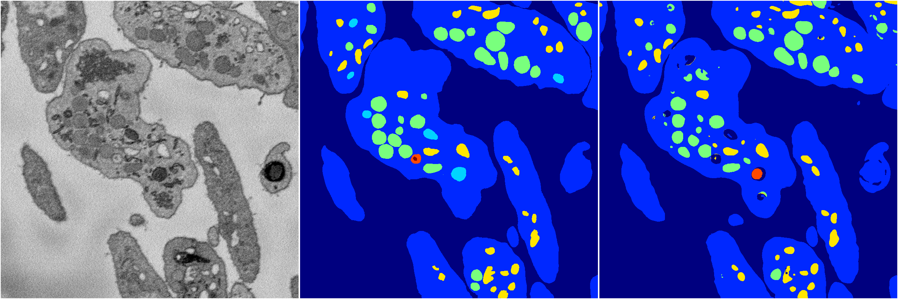</a>
<i>Click image for more details</i>

2 nets

**ari**: min 0.8248. max 0.8374. mean 0.8311.  ([best net](142/1))

**miou**: min 0.4232. max 0.4626. mean 0.4429.  ([best net](142/0))

**accuracy**: min 0.9341. max 0.9354. mean 0.9348.  ([best net](142/1))

**n_params**: min 4001676.0000. max 4001823.0000. mean 4001749.5000.  ([best net](142/0))

---

<a href="138"><h2>random_hybrid_3d / 0416 / 138</h2></a>
Created 18 Apr 2019, 16:41:04

<a href="138">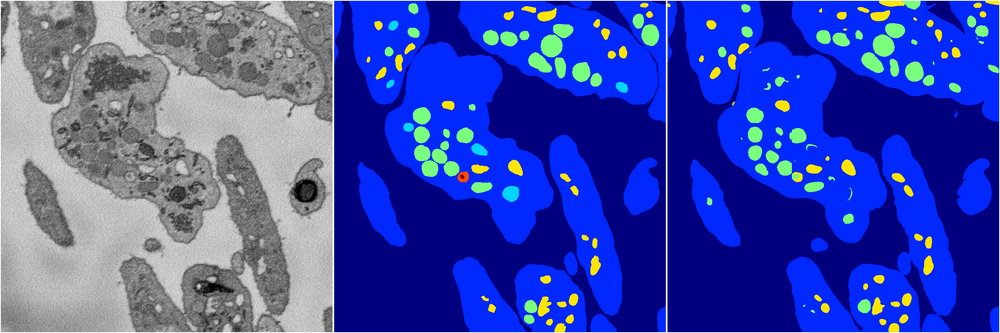</a>
<i>Click image for more details</i>

2 nets

**ari**: min -0.0000. max 0.8263. mean 0.4132.  ([best net](138/1))

**miou**: min 0.0659. max 0.4299. mean 0.2479.  ([best net](138/1))

**accuracy**: min 0.4613. max 0.9341. mean 0.6977.  ([best net](138/1))

**n_params**: min 925408.0000. max 925408.0000. mean 925408.0000.  ([best net](138/1))

---

<a href="147"><h2>random_hybrid_3d / 0416 / 147</h2></a>
Created 18 Apr 2019, 16:41:04

<i>Click image for more details</i>

2 nets

**ari**: min 0.8377. max 0.8393. mean 0.8385.  ([best net](147/1))

**miou**: min 0.5098. max 0.5107. mean 0.5102.  ([best net](147/1))

**accuracy**: min 0.9411. max 0.9420. mean 0.9415.  ([best net](147/1))

**n_params**: min 1314565.0000. max 1314565.0000. mean 1314565.0000.  ([best net](147/0))

---

<a href="137"><h2>random_hybrid_3d / 0416 / 137</h2></a>
Created 18 Apr 2019, 16:41:04

<i>Click image for more details</i>

2 nets

**ari**: min 0.8365. max 0.8387. mean 0.8376.  ([best net](137/0))

**miou**: min 0.4866. max 0.5660. mean 0.5263.  ([best net](137/0))

**accuracy**: min 0.9388. max 0.9416. mean 0.9402.  ([best net](137/0))

**n_params**: min 4324477.0000. max 4325086.0000. mean 4324781.5000.  ([best net](137/0))

---

<a href="145"><h2>random_hybrid_3d / 0416 / 145</h2></a>
Created 18 Apr 2019, 16:41:04

<i>Click image for more details</i>

2 nets

**ari**: min 0.8314. max 0.8361. mean 0.8337.  ([best net](145/1))

**miou**: min 0.4725. max 0.5063. mean 0.4894.  ([best net](145/1))

**accuracy**: min 0.9354. max 0.9402. mean 0.9378.  ([best net](145/1))

**n_params**: min 339939.0000. max 340086.0000. mean 340012.5000.  ([best net](145/1))

---

<a href="131"><h2>random_hybrid_3d / 0416 / 131</h2></a>
Created 18 Apr 2019, 16:41:04

<i>Click image for more details</i>

2 nets

**ari**: min 0.7678. max 0.8300. mean 0.7989.  ([best net](131/0))

**miou**: min 0.3024. max 0.4365. mean 0.3695.  ([best net](131/0))

**accuracy**: min 0.9106. max 0.9365. mean 0.9236.  ([best net](131/0))

**n_params**: min 5266260.0000. max 5266407.0000. mean 5266333.5000.  ([best net](131/0))

---

<a href="133"><h2>random_hybrid_3d / 0416 / 133</h2></a>
Created 18 Apr 2019, 16:41:04

<i>Click image for more details</i>

2 nets

**ari**: min 0.8270. max 0.8430. mean 0.8350.  ([best net](133/0))

**miou**: min 0.4352. max 0.6306. mean 0.5329.  ([best net](133/0))

**accuracy**: min 0.9349. max 0.9432. mean 0.9391.  ([best net](133/0))

**n_params**: min 28745104.0000. max 28746784.0000. mean 28745944.0000.  ([best net](133/1))

---

<a href="141"><h2>random_hybrid_3d / 0416 / 141</h2></a>
Created 18 Apr 2019, 16:41:04

<i>Click image for more details</i>

2 nets

**ari**: min 0.8284. max 0.8415. mean 0.8350.  ([best net](141/1))

**miou**: min 0.4363. max 0.5684. mean 0.5023.  ([best net](141/1))

**accuracy**: min 0.9364. max 0.9431. mean 0.9398.  ([best net](141/1))

**n_params**: min 6691487.0000. max 6691634.0000. mean 6691560.5000.  ([best net](141/0))

---

<a href="125"><h2>random_hybrid_3d / 0416 / 125</h2></a>
Created 18 Apr 2019, 16:41:04

<i>Click image for more details</i>

2 nets

**ari**: min 0.8339. max 0.8379. mean 0.8359.  ([best net](125/1))

**miou**: min 0.4315. max 0.4954. mean 0.4634.  ([best net](125/1))

**accuracy**: min 0.9376. max 0.9407. mean 0.9392.  ([best net](125/1))

**n_params**: min 3608430.0000. max 3608430.0000. mean 3608430.0000.  ([best net](125/1))

---

<a href="139"><h2>random_hybrid_3d / 0416 / 139</h2></a>
Created 18 Apr 2019, 16:41:04

<i>Click image for more details</i>

2 nets

**ari**: min 0.8391. max 0.8412. mean 0.8402.  ([best net](139/0))

**miou**: min 0.4276. max 0.4973. mean 0.4624.  ([best net](139/0))

**accuracy**: min 0.9374. max 0.9419. mean 0.9397.  ([best net](139/0))

**n_params**: min 605217.0000. max 605364.0000. mean 605290.5000.  ([best net](139/1))

---

<a href="140"><h2>random_hybrid_3d / 0416 / 140</h2></a>
Created 18 Apr 2019, 16:41:04

<i>Click image for more details</i>

2 nets

**ari**: min 0.1384. max 0.8398. mean 0.4891.  ([best net](140/0))

**miou**: min 0.2012. max 0.5498. mean 0.3755.  ([best net](140/0))

**accuracy**: min 0.5200. max 0.9417. mean 0.7309.  ([best net](140/0))

**n_params**: min 857728.0000. max 857875.0000. mean 857801.5000.  ([best net](140/1))

---

<a href="136"><h2>random_hybrid_3d / 0416 / 136</h2></a>
Created 18 Apr 2019, 16:41:04

<i>Click image for more details</i>

2 nets

**ari**: min 0.8331. max 0.8414. mean 0.8372.  ([best net](136/1))

**miou**: min 0.4378. max 0.5098. mean 0.4738.  ([best net](136/1))

**accuracy**: min 0.9379. max 0.9426. mean 0.9403.  ([best net](136/1))

**n_params**: min 2881624.0000. max 2882254.0000. mean 2881939.0000.  ([best net](136/1))

---

<a href="132"><h2>random_hybrid_3d / 0416 / 132</h2></a>
Created 18 Apr 2019, 16:41:04

<a href="132">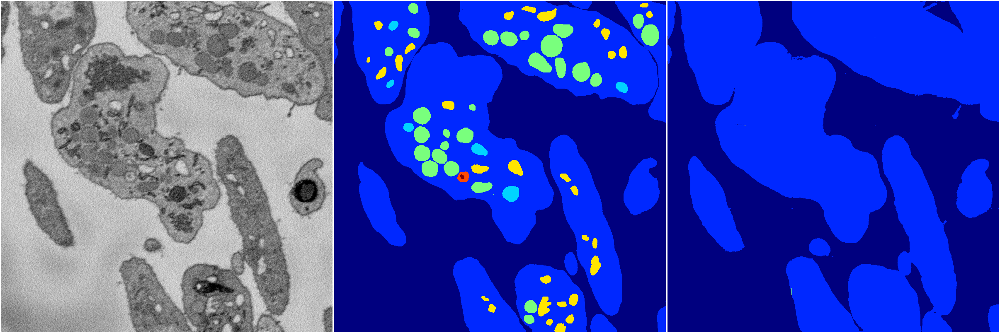</a>
<i>Click image for more details</i>

2 nets

**ari**: min -0.0000. max 0.5411. mean 0.2706.  ([best net](132/1))

**miou**: min 0.0659. max 0.2199. mean 0.1429.  ([best net](132/1))

**accuracy**: min 0.4613. max 0.8325. mean 0.6469.  ([best net](132/1))

**n_params**: min 78127.0000. max 78274.0000. mean 78200.5000.  ([best net](132/0))

---

<a href="120"><h2>random_hybrid_3d / 0416 / 120</h2></a>
Created 18 Apr 2019, 16:41:04

<a href="120">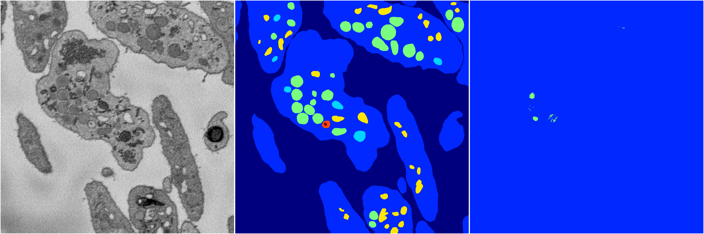</a>
<i>Click image for more details</i>

2 nets

**ari**: min 0.0001. max 0.0057. mean 0.0029.  ([best net](120/1))

**miou**: min 0.0661. max 0.0771. mean 0.0716.  ([best net](120/1))

**accuracy**: min 0.4614. max 0.4634. mean 0.4624.  ([best net](120/1))

**n_params**: min 132898.0000. max 132898.0000. mean 132898.0000.  ([best net](120/1))

---

<a href="128"><h2>random_hybrid_3d / 0416 / 128</h2></a>
Created 18 Apr 2019, 16:41:04

<i>Click image for more details</i>

2 nets

**ari**: min 0.8342. max 0.8415. mean 0.8378.  ([best net](128/1))

**miou**: min 0.4315. max 0.5019. mean 0.4667.  ([best net](128/1))

**accuracy**: min 0.9380. max 0.9413. mean 0.9397.  ([best net](128/1))

**n_params**: min 105343.0000. max 105343.0000. mean 105343.0000.  ([best net](128/0))

---

<a href="121"><h2>random_hybrid_3d / 0416 / 121</h2></a>
Created 18 Apr 2019, 16:41:04

<i>Click image for more details</i>

2 nets

**ari**: min 0.0860. max 0.8402. mean 0.4631.  ([best net](121/1))

**miou**: min 0.1329. max 0.5167. mean 0.3248.  ([best net](121/1))

**accuracy**: min 0.6374. max 0.9429. mean 0.7902.  ([best net](121/1))

**n_params**: min 2287071.0000. max 2287218.0000. mean 2287144.5000.  ([best net](121/1))

---

<a href="119"><h2>random_hybrid_3d / 0416 / 119</h2></a>
Created 18 Apr 2019, 16:41:04

<i>Click image for more details</i>

2 nets

**ari**: min 0.1364. max 0.4014. mean 0.2689.  ([best net](119/1))

**miou**: min 0.1975. max 0.2006. mean 0.1990.  ([best net](119/1))

**accuracy**: min 0.5199. max 0.7974. mean 0.6586.  ([best net](119/1))

**n_params**: min 1061195.0000. max 1061342.0000. mean 1061268.5000.  ([best net](119/0))

---

<a href="130"><h2>random_hybrid_3d / 0416 / 130</h2></a>
Created 18 Apr 2019, 16:41:04

<i>Click image for more details</i>

2 nets

**ari**: min 0.8403. max 0.8417. mean 0.8410.  ([best net](130/1))

**miou**: min 0.5121. max 0.5726. mean 0.5423.  ([best net](130/1))

**accuracy**: min 0.9422. max 0.9425. mean 0.9424.  ([best net](130/1))

**n_params**: min 2490352.0000. max 2490352.0000. mean 2490352.0000.  ([best net](130/0))

---

<a href="127"><h2>random_hybrid_3d / 0416 / 127</h2></a>
Created 18 Apr 2019, 16:41:04

<i>Click image for more details</i>

2 nets

**ari**: min 0.8397. max 0.8408. mean 0.8403.  ([best net](127/0))

**miou**: min 0.5042. max 0.5124. mean 0.5083.  ([best net](127/1))

**accuracy**: min 0.9419. max 0.9426. mean 0.9423.  ([best net](127/1))

**n_params**: min 438071.0000. max 438218.0000. mean 438144.5000.  ([best net](127/1))

---

<a href="123"><h2>random_hybrid_3d / 0416 / 123</h2></a>
Created 18 Apr 2019, 16:41:04

<i>Click image for more details</i>

2 nets

**ari**: min 0.7923. max 0.8322. mean 0.8122.  ([best net](123/1))

**miou**: min 0.3485. max 0.4306. mean 0.3895.  ([best net](123/1))

**accuracy**: min 0.9173. max 0.9360. mean 0.9267.  ([best net](123/1))

**n_params**: min 7095805.0000. max 7095952.0000. mean 7095878.5000.  ([best net](123/1))

---

<a href="124"><h2>random_hybrid_3d / 0416 / 124</h2></a>
Created 18 Apr 2019, 16:41:04

<i>Click image for more details</i>

2 nets

**ari**: min 0.4818. max 0.8409. mean 0.6614.  ([best net](124/1))

**miou**: min 0.2136. max 0.4833. mean 0.3484.  ([best net](124/1))

**accuracy**: min 0.8260. max 0.9407. mean 0.8834.  ([best net](124/1))

**n_params**: min 1210209.0000. max 1210209.0000. mean 1210209.0000.  ([best net](124/0))

---

<a href="118"><h2>random_hybrid_3d / 0416 / 118</h2></a>
Created 18 Apr 2019, 16:41:04

<i>Click image for more details</i>

2 nets

**ari**: min 0.8307. max 0.8309. mean 0.8308.  ([best net](118/1))

**miou**: min 0.4162. max 0.4224. mean 0.4193.  ([best net](118/0))

**accuracy**: min 0.9328. max 0.9332. mean 0.9330.  ([best net](118/0))

**n_params**: min 218137.0000. max 218137.0000. mean 218137.0000.  ([best net](118/1))

---

<a href="122"><h2>random_hybrid_3d / 0416 / 122</h2></a>
Created 18 Apr 2019, 16:41:04

<i>Click image for more details</i>

2 nets

**ari**: min 0.7725. max 0.8366. mean 0.8045.  ([best net](122/0))

**miou**: min 0.3166. max 0.4235. mean 0.3700.  ([best net](122/0))

**accuracy**: min 0.9153. max 0.9365. mean 0.9259.  ([best net](122/0))

**n_params**: min 390478.0000. max 391017.0000. mean 390747.5000.  ([best net](122/0))

---

<a href="126"><h2>random_hybrid_3d / 0416 / 126</h2></a>
Created 18 Apr 2019, 16:41:04

<i>Click image for more details</i>

2 nets

**ari**: min 0.8367. max 0.8387. mean 0.8377.  ([best net](126/0))

**miou**: min 0.4976. max 0.5087. mean 0.5032.  ([best net](126/0))

**accuracy**: min 0.9402. max 0.9411. mean 0.9406.  ([best net](126/0))

**n_params**: min 127487.0000. max 127634.0000. mean 127560.5000.  ([best net](126/1))

---

<a href="129"><h2>random_hybrid_3d / 0416 / 129</h2></a>
Created 18 Apr 2019, 16:41:04

<i>Click image for more details</i>

2 nets

**ari**: min 0.8417. max 0.8419. mean 0.8418.  ([best net](129/1))

**miou**: min 0.6531. max 0.6639. mean 0.6585.  ([best net](129/0))

**accuracy**: min 0.9433. max 0.9433. mean 0.9433.  ([best net](129/1))

**n_params**: min 454534.0000. max 456242.0000. mean 455388.0000.  ([best net](129/0))

---

<a href="114"><h2>random_hybrid_3d / 0416 / 114</h2></a>
Created 18 Apr 2019, 16:41:04

<i>Click image for more details</i>

2 nets

**ari**: min 0.8297. max 0.8371. mean 0.8334.  ([best net](114/0))

**miou**: min 0.4814. max 0.5082. mean 0.4948.  ([best net](114/0))

**accuracy**: min 0.9352. max 0.9412. mean 0.9382.  ([best net](114/0))

**n_params**: min 8074250.0000. max 8074999.0000. mean 8074624.5000.  ([best net](114/1))

---

<a href="106"><h2>random_hybrid_3d / 0416 / 106</h2></a>
Created 18 Apr 2019, 16:41:04

<a href="106">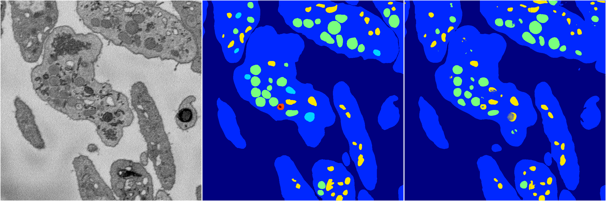</a>
<i>Click image for more details</i>

2 nets

**ari**: min 0.8059. max 0.8440. mean 0.8250.  ([best net](106/1))

**miou**: min 0.3933. max 0.4239. mean 0.4086.  ([best net](106/1))

**accuracy**: min 0.9274. max 0.9384. mean 0.9329.  ([best net](106/1))

**n_params**: min 25333936.0000. max 25335245.0000. mean 25334590.5000.  ([best net](106/0))

---

<a href="105"><h2>random_hybrid_3d / 0416 / 105</h2></a>
Created 18 Apr 2019, 16:41:04

<i>Click image for more details</i>

2 nets

**ari**: min 0.8256. max 0.8401. mean 0.8329.  ([best net](105/0))

**miou**: min 0.4395. max 0.4986. mean 0.4691.  ([best net](105/0))

**accuracy**: min 0.9368. max 0.9408. mean 0.9388.  ([best net](105/0))

**n_params**: min 11621887.0000. max 11624428.0000. mean 11623157.5000.  ([best net](105/1))

---

<a href="116"><h2>random_hybrid_3d / 0416 / 116</h2></a>
Created 18 Apr 2019, 16:41:04

<i>Click image for more details</i>

2 nets

**ari**: min 0.8268. max 0.8383. mean 0.8326.  ([best net](116/1))

**miou**: min 0.4344. max 0.5016. mean 0.4680.  ([best net](116/1))

**accuracy**: min 0.9360. max 0.9411. mean 0.9385.  ([best net](116/1))

**n_params**: min 6242286.0000. max 6242433.0000. mean 6242359.5000.  ([best net](116/0))

---

<a href="112"><h2>random_hybrid_3d / 0416 / 112</h2></a>
Created 18 Apr 2019, 16:41:04

<i>Click image for more details</i>

2 nets

**ari**: min 0.8319. max 0.8421. mean 0.8370.  ([best net](112/1))

**miou**: min 0.4437. max 0.5652. mean 0.5044.  ([best net](112/1))

**accuracy**: min 0.9381. max 0.9438. mean 0.9410.  ([best net](112/1))

**n_params**: min 274772.0000. max 275920.0000. mean 275346.0000.  ([best net](112/0))

---

<a href="117"><h2>random_hybrid_3d / 0416 / 117</h2></a>
Created 18 Apr 2019, 16:41:04

<i>Click image for more details</i>

2 nets

**ari**: min 0.8307. max 0.8313. mean 0.8310.  ([best net](117/0))

**miou**: min 0.4166. max 0.4245. mean 0.4205.  ([best net](117/0))

**accuracy**: min 0.9335. max 0.9350. mean 0.9342.  ([best net](117/0))

**n_params**: min 891093.0000. max 891093.0000. mean 891093.0000.  ([best net](117/0))

---

<a href="109"><h2>random_hybrid_3d / 0416 / 109</h2></a>
Created 18 Apr 2019, 16:41:04

<i>Click image for more details</i>

2 nets

**ari**: min 0.8323. max 0.8412. mean 0.8367.  ([best net](109/0))

**miou**: min 0.4243. max 0.5023. mean 0.4633.  ([best net](109/0))

**accuracy**: min 0.9344. max 0.9417. mean 0.9380.  ([best net](109/0))

**n_params**: min 8580958.0000. max 8580958.0000. mean 8580958.0000.  ([best net](109/1))

---

<a href="103"><h2>random_hybrid_3d / 0416 / 103</h2></a>
Created 18 Apr 2019, 16:41:04

<i>Click image for more details</i>

2 nets

**ari**: min 0.8253. max 0.8410. mean 0.8331.  ([best net](103/0))

**miou**: min 0.4354. max 0.5583. mean 0.4969.  ([best net](103/0))

**accuracy**: min 0.9358. max 0.9426. mean 0.9392.  ([best net](103/0))

**n_params**: min 5954734.0000. max 5954734.0000. mean 5954734.0000.  ([best net](103/0))

---

<a href="113"><h2>random_hybrid_3d / 0416 / 113</h2></a>
Created 18 Apr 2019, 16:41:04

<i>Click image for more details</i>

2 nets

**ari**: min 0.8366. max 0.8398. mean 0.8382.  ([best net](113/1))

**miou**: min 0.5291. max 0.5647. mean 0.5469.  ([best net](113/1))

**accuracy**: min 0.9401. max 0.9425. mean 0.9413.  ([best net](113/1))

**n_params**: min 130746.0000. max 130893.0000. mean 130819.5000.  ([best net](113/0))

---

<a href="115"><h2>random_hybrid_3d / 0416 / 115</h2></a>
Created 18 Apr 2019, 16:41:04

<i>Click image for more details</i>

2 nets

**ari**: min 0.0963. max 0.3387. mean 0.2175.  ([best net](115/0))

**miou**: min 0.1106. max 0.2750. mean 0.1928.  ([best net](115/1))

**accuracy**: min 0.3889. max 0.5726. mean 0.4808.  ([best net](115/1))

**n_params**: min 6055.0000. max 6202.0000. mean 6128.5000.  ([best net](115/0))

---

<a href="107"><h2>random_hybrid_3d / 0416 / 107</h2></a>
Created 18 Apr 2019, 16:41:04

<i>Click image for more details</i>

2 nets

**ari**: min 0.8406. max 0.8416. mean 0.8411.  ([best net](107/0))

**miou**: min 0.5098. max 0.6007. mean 0.5553.  ([best net](107/0))

**accuracy**: min 0.9423. max 0.9427. mean 0.9425.  ([best net](107/0))

**n_params**: min 1920706.0000. max 1920706.0000. mean 1920706.0000.  ([best net](107/0))

---

<a href="100"><h2>random_hybrid_3d / 0416 / 100</h2></a>
Created 18 Apr 2019, 16:41:04

<i>Click image for more details</i>

2 nets

**ari**: min 0.7204. max 0.8408. mean 0.7806.  ([best net](100/0))

**miou**: min 0.2476. max 0.5038. mean 0.3757.  ([best net](100/0))

**accuracy**: min 0.8969. max 0.9419. mean 0.9194.  ([best net](100/0))

**n_params**: min 40213414.0000. max 40215409.0000. mean 40214411.5000.  ([best net](100/0))

---

<a href="110"><h2>random_hybrid_3d / 0416 / 110</h2></a>
Created 18 Apr 2019, 16:41:04

<i>Click image for more details</i>

2 nets

**ari**: min 0.8341. max 0.8408. mean 0.8375.  ([best net](110/0))

**miou**: min 0.4269. max 0.4895. mean 0.4582.  ([best net](110/0))

**accuracy**: min 0.9352. max 0.9411. mean 0.9382.  ([best net](110/0))

**n_params**: min 212369.0000. max 212369.0000. mean 212369.0000.  ([best net](110/0))

---

<a href="104"><h2>random_hybrid_3d / 0416 / 104</h2></a>
Created 18 Apr 2019, 16:41:04

<i>Click image for more details</i>

2 nets

**ari**: min 0.8416. max 0.8432. mean 0.8424.  ([best net](104/0))

**miou**: min 0.5089. max 0.5710. mean 0.5399.  ([best net](104/1))

**accuracy**: min 0.9429. max 0.9430. mean 0.9430.  ([best net](104/0))

**n_params**: min 1400126.0000. max 1401778.0000. mean 1400952.0000.  ([best net](104/0))

---

<a href="111"><h2>random_hybrid_3d / 0416 / 111</h2></a>
Created 18 Apr 2019, 16:41:04

<i>Click image for more details</i>

2 nets

**ari**: min 0.8403. max 0.8439. mean 0.8421.  ([best net](111/1))

**miou**: min 0.5694. max 0.6599. mean 0.6147.  ([best net](111/1))

**accuracy**: min 0.9427. max 0.9437. mean 0.9432.  ([best net](111/1))

**n_params**: min 20615.0000. max 20762.0000. mean 20688.5000.  ([best net](111/1))

---

<a href="93"><h2>random_hybrid_3d / 0416 / 93</h2></a>
Created 18 Apr 2019, 16:41:04

<i>Click image for more details</i>

2 nets

**ari**: min 0.3770. max 0.7090. mean 0.5430.  ([best net](93/1))

**miou**: min 0.1975. max 0.2469. mean 0.2222.  ([best net](93/1))

**accuracy**: min 0.7906. max 0.8957. mean 0.8432.  ([best net](93/1))

**n_params**: min 3197120.0000. max 3197120.0000. mean 3197120.0000.  ([best net](93/0))

---

<a href="108"><h2>random_hybrid_3d / 0416 / 108</h2></a>
Created 18 Apr 2019, 16:41:03

<i>Click image for more details</i>

2 nets

**ari**: min 0.2597. max 0.8407. mean 0.5502.  ([best net](108/0))

**miou**: min 0.1695. max 0.6621. mean 0.4158.  ([best net](108/0))

**accuracy**: min 0.6655. max 0.9430. mean 0.8042.  ([best net](108/0))

**n_params**: min 7399.0000. max 7399.0000. mean 7399.0000.  ([best net](108/0))

---

<a href="99"><h2>random_hybrid_3d / 0416 / 99</h2></a>
Created 18 Apr 2019, 16:41:03

<i>Click image for more details</i>

2 nets

**ari**: min 0.8346. max 0.8408. mean 0.8377.  ([best net](99/1))

**miou**: min 0.4330. max 0.5000. mean 0.4665.  ([best net](99/1))

**accuracy**: min 0.9374. max 0.9413. mean 0.9394.  ([best net](99/1))

**n_params**: min 5274822.0000. max 5274822.0000. mean 5274822.0000.  ([best net](99/0))

---

<a href="92"><h2>random_hybrid_3d / 0416 / 92</h2></a>
Created 18 Apr 2019, 16:41:03

<i>Click image for more details</i>

2 nets

**ari**: min 0.8282. max 0.8287. mean 0.8285.  ([best net](92/1))

**miou**: min 0.4390. max 0.4399. mean 0.4395.  ([best net](92/0))

**accuracy**: min 0.9353. max 0.9365. mean 0.9359.  ([best net](92/1))

**n_params**: min 886932.0000. max 887163.0000. mean 887047.5000.  ([best net](92/1))

---

<a href="90"><h2>random_hybrid_3d / 0416 / 90</h2></a>
Created 18 Apr 2019, 16:41:03

<i>Click image for more details</i>

2 nets

**ari**: min 0.8434. max 0.8439. mean 0.8437.  ([best net](90/0))

**miou**: min 0.5302. max 0.5679. mean 0.5491.  ([best net](90/1))

**accuracy**: min 0.9434. max 0.9435. mean 0.9435.  ([best net](90/0))

**n_params**: min 271807.0000. max 272479.0000. mean 272143.0000.  ([best net](90/1))

---

<a href="96"><h2>random_hybrid_3d / 0416 / 96</h2></a>
Created 18 Apr 2019, 16:41:03

<i>Click image for more details</i>

2 nets

**ari**: min 0.7900. max 0.8334. mean 0.8117.  ([best net](96/0))

**miou**: min 0.3467. max 0.4260. mean 0.3863.  ([best net](96/0))

**accuracy**: min 0.9167. max 0.9350. mean 0.9258.  ([best net](96/0))

**n_params**: min 11366366.0000. max 11367619.0000. mean 11366992.5000.  ([best net](96/0))

---

<a href="95"><h2>random_hybrid_3d / 0416 / 95</h2></a>
Created 18 Apr 2019, 16:41:03

<i>Click image for more details</i>

2 nets

**ari**: min 0.8391. max 0.8418. mean 0.8404.  ([best net](95/0))

**miou**: min 0.4904. max 0.5097. mean 0.5000.  ([best net](95/1))

**accuracy**: min 0.9412. max 0.9416. mean 0.9414.  ([best net](95/1))

**n_params**: min 4716240.0000. max 4717052.0000. mean 4716646.0000.  ([best net](95/1))

---

<a href="88"><h2>random_hybrid_3d / 0416 / 88</h2></a>
Created 18 Apr 2019, 16:41:03

<i>Click image for more details</i>

2 nets

**ari**: min 0.8206. max 0.8422. mean 0.8314.  ([best net](88/1))

**miou**: min 0.4246. max 0.5697. mean 0.4971.  ([best net](88/1))

**accuracy**: min 0.9312. max 0.9429. mean 0.9371.  ([best net](88/1))

**n_params**: min 3903270.0000. max 3903802.0000. mean 3903536.0000.  ([best net](88/0))

---

<a href="101"><h2>random_hybrid_3d / 0416 / 101</h2></a>
Created 18 Apr 2019, 16:41:03

<i>Click image for more details</i>

2 nets

**ari**: min 0.0068. max 0.8358. mean 0.4213.  ([best net](101/1))

**miou**: min 0.0994. max 0.4993. mean 0.2994.  ([best net](101/1))

**accuracy**: min 0.4866. max 0.9399. mean 0.7132.  ([best net](101/1))

**n_params**: min 5950268.0000. max 5950415.0000. mean 5950341.5000.  ([best net](101/1))

---

<a href="89"><h2>random_hybrid_3d / 0416 / 89</h2></a>
Created 18 Apr 2019, 16:41:03

<i>Click image for more details</i>

2 nets

**ari**: min 0.8261. max 0.8383. mean 0.8322.  ([best net](89/1))

**miou**: min 0.4228. max 0.4350. mean 0.4289.  ([best net](89/0))

**accuracy**: min 0.9349. max 0.9352. mean 0.9350.  ([best net](89/1))

**n_params**: min 1888943.0000. max 1889475.0000. mean 1889209.0000.  ([best net](89/0))

---

<a href="91"><h2>random_hybrid_3d / 0416 / 91</h2></a>
Created 18 Apr 2019, 16:41:03

<i>Click image for more details</i>

2 nets

**ari**: min 0.7043. max 0.8414. mean 0.7729.  ([best net](91/0))

**miou**: min 0.3852. max 0.6613. mean 0.5232.  ([best net](91/0))

**accuracy**: min 0.8991. max 0.9432. mean 0.9212.  ([best net](91/0))

**n_params**: min 5051418.0000. max 5052678.0000. mean 5052048.0000.  ([best net](91/0))

---

<a href="102"><h2>random_hybrid_3d / 0416 / 102</h2></a>
Created 18 Apr 2019, 16:41:03

<i>Click image for more details</i>

2 nets

**ari**: min 0.8281. max 0.8421. mean 0.8351.  ([best net](102/1))

**miou**: min 0.4283. max 0.4351. mean 0.4317.  ([best net](102/0))

**accuracy**: min 0.9359. max 0.9378. mean 0.9368.  ([best net](102/1))

**n_params**: min 325725.0000. max 325872.0000. mean 325798.5000.  ([best net](102/1))

---

<a href="97"><h2>random_hybrid_3d / 0416 / 97</h2></a>
Created 18 Apr 2019, 16:41:03

<i>Click image for more details</i>

2 nets

**ari**: min 0.0285. max 0.8416. mean 0.4351.  ([best net](97/0))

**miou**: min 0.1133. max 0.5149. mean 0.3141.  ([best net](97/0))

**accuracy**: min 0.4690. max 0.9422. mean 0.7056.  ([best net](97/0))

**n_params**: min 152733.0000. max 153055.0000. mean 152894.0000.  ([best net](97/0))

---

<a href="94"><h2>random_hybrid_3d / 0416 / 94</h2></a>
Created 18 Apr 2019, 16:41:03

<i>Click image for more details</i>

2 nets

**ari**: min 0.5007. max 0.7618. mean 0.6313.  ([best net](94/1))

**miou**: min 0.2767. max 0.3907. mean 0.3337.  ([best net](94/0))

**accuracy**: min 0.8246. max 0.9097. mean 0.8671.  ([best net](94/1))

**n_params**: min 419809.0000. max 419956.0000. mean 419882.5000.  ([best net](94/1))

---

<a href="82"><h2>random_hybrid_3d / 0416 / 82</h2></a>
Created 18 Apr 2019, 16:41:03

<i>Click image for more details</i>

2 nets

**ari**: min 0.8272. max 0.8320. mean 0.8296.  ([best net](82/0))

**miou**: min 0.4351. max 0.4611. mean 0.4481.  ([best net](82/0))

**accuracy**: min 0.9364. max 0.9366. mean 0.9365.  ([best net](82/0))

**n_params**: min 2939054.0000. max 2940188.0000. mean 2939621.0000.  ([best net](82/0))

---

<a href="80"><h2>random_hybrid_3d / 0416 / 80</h2></a>
Created 18 Apr 2019, 16:41:03

<i>Click image for more details</i>

2 nets

**ari**: min 0.7323. max 0.8410. mean 0.7866.  ([best net](80/0))

**miou**: min 0.2504. max 0.5751. mean 0.4128.  ([best net](80/0))

**accuracy**: min 0.8995. max 0.9431. mean 0.9213.  ([best net](80/0))

**n_params**: min 533723.0000. max 533723.0000. mean 533723.0000.  ([best net](80/0))

---

<a href="79"><h2>random_hybrid_3d / 0416 / 79</h2></a>
Created 18 Apr 2019, 16:41:03

<i>Click image for more details</i>

2 nets

**ari**: min 0.8345. max 0.8360. mean 0.8353.  ([best net](79/1))

**miou**: min 0.5011. max 0.5039. mean 0.5025.  ([best net](79/0))

**accuracy**: min 0.9399. max 0.9403. mean 0.9401.  ([best net](79/0))

**n_params**: min 8083725.0000. max 8083725.0000. mean 8083725.0000.  ([best net](79/1))

---

<a href="81"><h2>random_hybrid_3d / 0416 / 81</h2></a>
Created 18 Apr 2019, 16:41:03

<i>Click image for more details</i>

2 nets

**ari**: min 0.8292. max 0.8338. mean 0.8315.  ([best net](81/1))

**miou**: min 0.4367. max 0.4731. mean 0.4549.  ([best net](81/1))

**accuracy**: min 0.9359. max 0.9386. mean 0.9372.  ([best net](81/1))

**n_params**: min 1494376.0000. max 1494523.0000. mean 1494449.5000.  ([best net](81/0))

---

<a href="87"><h2>random_hybrid_3d / 0416 / 87</h2></a>
Created 18 Apr 2019, 16:41:03

<i>Click image for more details</i>

2 nets

**ari**: min 0.8288. max 0.8434. mean 0.8361.  ([best net](87/1))

**miou**: min 0.4337. max 0.5065. mean 0.4701.  ([best net](87/1))

**accuracy**: min 0.9355. max 0.9426. mean 0.9390.  ([best net](87/1))

**n_params**: min 6246403.0000. max 6247054.0000. mean 6246728.5000.  ([best net](87/0))

---

<a href="83"><h2>random_hybrid_3d / 0416 / 83</h2></a>
Created 18 Apr 2019, 16:41:03

<i>Click image for more details</i>

2 nets

**ari**: min 0.8116. max 0.8425. mean 0.8271.  ([best net](83/0))

**miou**: min 0.4387. max 0.5703. mean 0.5045.  ([best net](83/0))

**accuracy**: min 0.9256. max 0.9430. mean 0.9343.  ([best net](83/0))

**n_params**: min 482839.0000. max 483525.0000. mean 483182.0000.  ([best net](83/0))

---

<a href="86"><h2>random_hybrid_3d / 0416 / 86</h2></a>
Created 18 Apr 2019, 16:41:03

<i>Click image for more details</i>

2 nets

**ari**: min 0.7640. max 0.8402. mean 0.8021.  ([best net](86/1))

**miou**: min 0.2936. max 0.5079. mean 0.4007.  ([best net](86/1))

**accuracy**: min 0.9112. max 0.9423. mean 0.9267.  ([best net](86/1))

**n_params**: min 1581484.0000. max 1581484.0000. mean 1581484.0000.  ([best net](86/0))

---

<a href="74"><h2>random_hybrid_3d / 0416 / 74</h2></a>
Created 18 Apr 2019, 16:41:03

<i>Click image for more details</i>

2 nets

**ari**: min 0.8188. max 0.8362. mean 0.8275.  ([best net](74/0))

**miou**: min 0.4135. max 0.4694. mean 0.4414.  ([best net](74/0))

**accuracy**: min 0.9304. max 0.9390. mean 0.9347.  ([best net](74/0))

**n_params**: min 13168058.0000. max 13168856.0000. mean 13168457.0000.  ([best net](74/0))

---

<a href="85"><h2>random_hybrid_3d / 0416 / 85</h2></a>
Created 18 Apr 2019, 16:41:03

<i>Click image for more details</i>

2 nets

**ari**: min -0.0076. max 0.0621. mean 0.0273.  ([best net](85/0))

**miou**: min 0.0715. max 0.1369. mean 0.1042.  ([best net](85/0))

**accuracy**: min 0.4741. max 0.6183. mean 0.5462.  ([best net](85/0))

**n_params**: min 73294.0000. max 73441.0000. mean 73367.5000.  ([best net](85/1))

---

<a href="75"><h2>random_hybrid_3d / 0416 / 75</h2></a>
Created 18 Apr 2019, 16:41:03

<i>Click image for more details</i>

2 nets

**ari**: min 0.7573. max 0.8433. mean 0.8003.  ([best net](75/1))

**miou**: min 0.2529. max 0.5087. mean 0.3808.  ([best net](75/1))

**accuracy**: min 0.9073. max 0.9428. mean 0.9250.  ([best net](75/1))

**n_params**: min 1287432.0000. max 1287432.0000. mean 1287432.0000.  ([best net](75/1))

---

<a href="84"><h2>random_hybrid_3d / 0416 / 84</h2></a>
Created 18 Apr 2019, 16:41:03

<i>Click image for more details</i>

2 nets

**ari**: min 0.8075. max 0.8397. mean 0.8236.  ([best net](84/0))

**miou**: min 0.4543. max 0.5981. mean 0.5262.  ([best net](84/0))

**accuracy**: min 0.9285. max 0.9426. mean 0.9356.  ([best net](84/0))

**n_params**: min 15239.0000. max 15386.0000. mean 15312.5000.  ([best net](84/1))

---

<a href="76"><h2>random_hybrid_3d / 0416 / 76</h2></a>
Created 18 Apr 2019, 16:41:03

<i>Click image for more details</i>

2 nets

**ari**: min 0.0143. max 0.0201. mean 0.0172.  ([best net](76/0))

**miou**: min 0.1026. max 0.1087. mean 0.1057.  ([best net](76/0))

**accuracy**: min 0.5416. max 0.5739. mean 0.5578.  ([best net](76/0))

**n_params**: min 663726.0000. max 663726.0000. mean 663726.0000.  ([best net](76/0))

---

<a href="71"><h2>random_hybrid_3d / 0416 / 71</h2></a>
Created 18 Apr 2019, 16:41:03

<i>Click image for more details</i>

2 nets

**ari**: min 0.7202. max 0.8401. mean 0.7802.  ([best net](71/1))

**miou**: min 0.3239. max 0.5057. mean 0.4148.  ([best net](71/1))

**accuracy**: min 0.8992. max 0.9417. mean 0.9204.  ([best net](71/1))

**n_params**: min 1796525.0000. max 1796861.0000. mean 1796693.0000.  ([best net](71/0))

---

<a href="78"><h2>random_hybrid_3d / 0416 / 78</h2></a>
Created 18 Apr 2019, 16:41:03

<a href="78">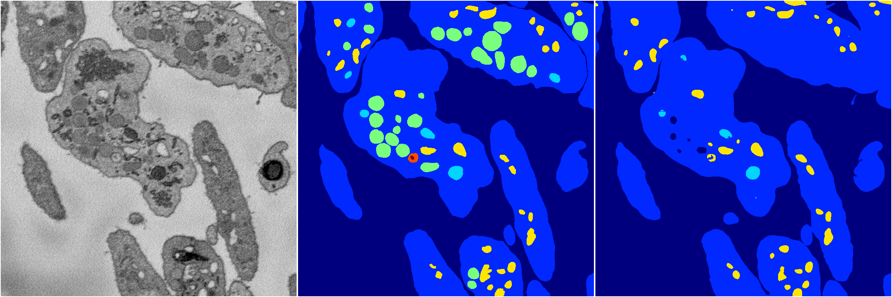</a>
<i>Click image for more details</i>

2 nets

**ari**: min 0.8036. max 0.8094. mean 0.8065.  ([best net](78/0))

**miou**: min 0.3824. max 0.4253. mean 0.4038.  ([best net](78/0))

**accuracy**: min 0.9284. max 0.9289. mean 0.9287.  ([best net](78/0))

**n_params**: min 95330.0000. max 95330.0000. mean 95330.0000.  ([best net](78/0))

---

<a href="70"><h2>random_hybrid_3d / 0416 / 70</h2></a>
Created 18 Apr 2019, 16:41:03

<i>Click image for more details</i>

2 nets

**ari**: min 0.8309. max 0.8434. mean 0.8371.  ([best net](70/0))

**miou**: min 0.4362. max 0.5077. mean 0.4720.  ([best net](70/0))

**accuracy**: min 0.9370. max 0.9429. mean 0.9400.  ([best net](70/0))

**n_params**: min 1497630.0000. max 1497630.0000. mean 1497630.0000.  ([best net](70/1))

---

<a href="77"><h2>random_hybrid_3d / 0416 / 77</h2></a>
Created 18 Apr 2019, 16:41:03

<i>Click image for more details</i>

2 nets

**ari**: min 0.7665. max 0.8028. mean 0.7847.  ([best net](77/0))

**miou**: min 0.3042. max 0.4156. mean 0.3599.  ([best net](77/0))

**accuracy**: min 0.9131. max 0.9236. mean 0.9183.  ([best net](77/0))

**n_params**: min 67873.0000. max 68020.0000. mean 67946.5000.  ([best net](77/0))

---

<a href="73"><h2>random_hybrid_3d / 0416 / 73</h2></a>
Created 18 Apr 2019, 16:41:02

<a href="73">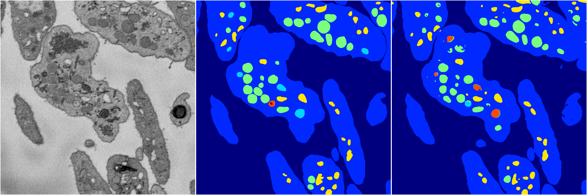</a>
<i>Click image for more details</i>

2 nets

**ari**: min 0.0258. max 0.8417. mean 0.4337.  ([best net](73/1))

**miou**: min 0.1165. max 0.4637. mean 0.2901.  ([best net](73/1))

**accuracy**: min 0.4780. max 0.9372. mean 0.7076.  ([best net](73/1))

**n_params**: min 29349.0000. max 29349.0000. mean 29349.0000.  ([best net](73/0))

---

<a href="72"><h2>random_hybrid_3d / 0416 / 72</h2></a>
Created 18 Apr 2019, 16:41:02

<i>Click image for more details</i>

2 nets

**ari**: min 0.8056. max 0.8403. mean 0.8229.  ([best net](72/1))

**miou**: min 0.5705. max 0.5751. mean 0.5728.  ([best net](72/0))

**accuracy**: min 0.9250. max 0.9429. mean 0.9339.  ([best net](72/1))

**n_params**: min 568077.0000. max 568224.0000. mean 568150.5000.  ([best net](72/1))

---

<a href="58"><h2>random_hybrid_3d / 0416 / 58</h2></a>
Created 18 Apr 2019, 16:41:02

<i>Click image for more details</i>

2 nets

**ari**: min 0.8360. max 0.8411. mean 0.8386.  ([best net](58/1))

**miou**: min 0.4348. max 0.5149. mean 0.4748.  ([best net](58/1))

**accuracy**: min 0.9384. max 0.9427. mean 0.9405.  ([best net](58/1))

**n_params**: min 14464474.0000. max 14464474.0000. mean 14464474.0000.  ([best net](58/0))

---

<a href="61"><h2>random_hybrid_3d / 0416 / 61</h2></a>
Created 18 Apr 2019, 16:41:02

<i>Click image for more details</i>

2 nets

**ari**: min 0.8334. max 0.8370. mean 0.8352.  ([best net](61/0))

**miou**: min 0.4173. max 0.5140. mean 0.4656.  ([best net](61/0))

**accuracy**: min 0.9315. max 0.9417. mean 0.9366.  ([best net](61/0))

**n_params**: min 486220.0000. max 486220.0000. mean 486220.0000.  ([best net](61/1))

---

<a href="63"><h2>random_hybrid_3d / 0416 / 63</h2></a>
Created 18 Apr 2019, 16:41:02

<i>Click image for more details</i>

2 nets

**ari**: min 0.8290. max 0.8430. mean 0.8360.  ([best net](63/1))

**miou**: min 0.4287. max 0.5707. mean 0.4997.  ([best net](63/1))

**accuracy**: min 0.9363. max 0.9435. mean 0.9399.  ([best net](63/1))

**n_params**: min 9116807.0000. max 9116954.0000. mean 9116880.5000.  ([best net](63/0))

---

<a href="65"><h2>random_hybrid_3d / 0416 / 65</h2></a>
Created 18 Apr 2019, 16:41:02

<i>Click image for more details</i>

2 nets

**ari**: min 0.5327. max 0.8404. mean 0.6865.  ([best net](65/1))

**miou**: min 0.2215. max 0.5504. mean 0.3859.  ([best net](65/1))

**accuracy**: min 0.8430. max 0.9423. mean 0.8926.  ([best net](65/1))

**n_params**: min 1920270.0000. max 1920417.0000. mean 1920343.5000.  ([best net](65/1))

---

<a href="60"><h2>random_hybrid_3d / 0416 / 60</h2></a>
Created 18 Apr 2019, 16:41:02

<i>Click image for more details</i>

2 nets

**ari**: min 0.1700. max 0.8398. mean 0.5049.  ([best net](60/1))

**miou**: min 0.1801. max 0.4560. mean 0.3180.  ([best net](60/1))

**accuracy**: min 0.6750. max 0.9363. mean 0.8056.  ([best net](60/1))

**n_params**: min 194071.0000. max 194218.0000. mean 194144.5000.  ([best net](60/0))

---

<a href="68"><h2>random_hybrid_3d / 0416 / 68</h2></a>
Created 18 Apr 2019, 16:41:02

<i>Click image for more details</i>

2 nets

**ari**: min 0.8407. max 0.8423. mean 0.8415.  ([best net](68/1))

**miou**: min 0.5159. max 0.5201. mean 0.5180.  ([best net](68/0))

**accuracy**: min 0.9425. max 0.9430. mean 0.9428.  ([best net](68/1))

**n_params**: min 1792352.0000. max 1792499.0000. mean 1792425.5000.  ([best net](68/1))

---

<a href="62"><h2>random_hybrid_3d / 0416 / 62</h2></a>
Created 18 Apr 2019, 16:41:02

<i>Click image for more details</i>

2 nets

**ari**: min 0.8266. max 0.8395. mean 0.8331.  ([best net](62/0))

**miou**: min 0.4469. max 0.5705. mean 0.5087.  ([best net](62/0))

**accuracy**: min 0.9353. max 0.9422. mean 0.9388.  ([best net](62/0))

**n_params**: min 1342512.0000. max 1342715.0000. mean 1342613.5000.  ([best net](62/0))

---

<a href="59"><h2>random_hybrid_3d / 0416 / 59</h2></a>
Created 18 Apr 2019, 16:41:02

<i>Click image for more details</i>

2 nets

**ari**: min 0.8305. max 0.8404. mean 0.8354.  ([best net](59/1))

**miou**: min 0.4382. max 0.5076. mean 0.4729.  ([best net](59/1))

**accuracy**: min 0.9370. max 0.9416. mean 0.9393.  ([best net](59/1))

**n_params**: min 309024.0000. max 309171.0000. mean 309097.5000.  ([best net](59/0))

---

<a href="67"><h2>random_hybrid_3d / 0416 / 67</h2></a>
Created 18 Apr 2019, 16:41:02

<i>Click image for more details</i>

2 nets

**ari**: min -0.0031. max 0.0014. mean -0.0009.  ([best net](67/1))

**miou**: min 0.0673. max 0.0890. mean 0.0782.  ([best net](67/1))

**accuracy**: min 0.4661. max 0.5209. mean 0.4935.  ([best net](67/1))

**n_params**: min 2013277.0000. max 2013424.0000. mean 2013350.5000.  ([best net](67/0))

---

<a href="64"><h2>random_hybrid_3d / 0416 / 64</h2></a>
Created 18 Apr 2019, 16:41:02

<i>Click image for more details</i>

2 nets

**ari**: min 0.8209. max 0.8421. mean 0.8315.  ([best net](64/1))

**miou**: min 0.3520. max 0.5728. mean 0.4624.  ([best net](64/1))

**accuracy**: min 0.9236. max 0.9426. mean 0.9331.  ([best net](64/1))

**n_params**: min 146307.0000. max 146454.0000. mean 146380.5000.  ([best net](64/1))

---

<a href="69"><h2>random_hybrid_3d / 0416 / 69</h2></a>
Created 18 Apr 2019, 16:41:02

<i>Click image for more details</i>

2 nets

**ari**: min 0.8409. max 0.8460. mean 0.8434.  ([best net](69/0))

**miou**: min 0.5707. max 0.5830. mean 0.5769.  ([best net](69/0))

**accuracy**: min 0.9429. max 0.9447. mean 0.9438.  ([best net](69/0))

**n_params**: min 45309.0000. max 45456.0000. mean 45382.5000.  ([best net](69/0))

---

<a href="57"><h2>random_hybrid_3d / 0416 / 57</h2></a>
Created 18 Apr 2019, 16:41:02

<i>Click image for more details</i>

2 nets

**ari**: min 0.6814. max 0.8393. mean 0.7604.  ([best net](57/0))

**miou**: min 0.2419. max 0.5115. mean 0.3767.  ([best net](57/0))

**accuracy**: min 0.8853. max 0.9420. mean 0.9137.  ([best net](57/0))

**n_params**: min 1475624.0000. max 1475624.0000. mean 1475624.0000.  ([best net](57/0))

---

<a href="50"><h2>random_hybrid_3d / 0416 / 50</h2></a>
Created 18 Apr 2019, 16:41:02

<i>Click image for more details</i>

2 nets

**ari**: min 0.7925. max 0.8277. mean 0.8101.  ([best net](50/1))

**miou**: min 0.3846. max 0.4349. mean 0.4097.  ([best net](50/1))

**accuracy**: min 0.9240. max 0.9362. mean 0.9301.  ([best net](50/1))

**n_params**: min 26348172.0000. max 26349705.0000. mean 26348938.5000.  ([best net](50/0))

---

<a href="53"><h2>random_hybrid_3d / 0416 / 53</h2></a>
Created 18 Apr 2019, 16:41:02

<i>Click image for more details</i>

2 nets

**ari**: min 0.8261. max 0.8397. mean 0.8329.  ([best net](53/1))

**miou**: min 0.4310. max 0.5146. mean 0.4728.  ([best net](53/1))

**accuracy**: min 0.9364. max 0.9429. mean 0.9396.  ([best net](53/1))

**n_params**: min 1860292.0000. max 1861069.0000. mean 1860680.5000.  ([best net](53/1))

---

<a href="52"><h2>random_hybrid_3d / 0416 / 52</h2></a>
Created 18 Apr 2019, 16:41:02

<i>Click image for more details</i>

2 nets

**ari**: min 0.7952. max 0.8256. mean 0.8104.  ([best net](52/1))

**miou**: min 0.3836. max 0.4331. mean 0.4083.  ([best net](52/1))

**accuracy**: min 0.9206. max 0.9353. mean 0.9280.  ([best net](52/1))

**n_params**: min 348607.0000. max 348740.0000. mean 348673.5000.  ([best net](52/1))

---

<a href="49"><h2>random_hybrid_3d / 0416 / 49</h2></a>
Created 18 Apr 2019, 16:41:02

<i>Click image for more details</i>

2 nets

**ari**: min 0.8369. max 0.8432. mean 0.8400.  ([best net](49/0))

**miou**: min 0.4329. max 0.5721. mean 0.5025.  ([best net](49/0))

**accuracy**: min 0.9381. max 0.9434. mean 0.9408.  ([best net](49/0))

**n_params**: min 712896.0000. max 713365.0000. mean 713130.5000.  ([best net](49/1))

---

<a href="44"><h2>random_hybrid_3d / 0416 / 44</h2></a>
Created 18 Apr 2019, 16:41:02

<i>Click image for more details</i>

2 nets

**ari**: min 0.8399. max 0.8418. mean 0.8408.  ([best net](44/0))

**miou**: min 0.5141. max 0.5623. mean 0.5382.  ([best net](44/0))

**accuracy**: min 0.9424. max 0.9431. mean 0.9428.  ([best net](44/0))

**n_params**: min 41963280.0000. max 41963280.0000. mean 41963280.0000.  ([best net](44/0))

---

<a href="56"><h2>random_hybrid_3d / 0416 / 56</h2></a>
Created 18 Apr 2019, 16:41:02

<i>Click image for more details</i>

2 nets

**ari**: min 0.8244. max 0.8288. mean 0.8266.  ([best net](56/0))

**miou**: min 0.4164. max 0.4493. mean 0.4329.  ([best net](56/1))

**accuracy**: min 0.9333. max 0.9356. mean 0.9345.  ([best net](56/1))

**n_params**: min 136667.0000. max 136814.0000. mean 136740.5000.  ([best net](56/1))

---

<a href="55"><h2>random_hybrid_3d / 0416 / 55</h2></a>
Created 18 Apr 2019, 16:41:02

<a href="55">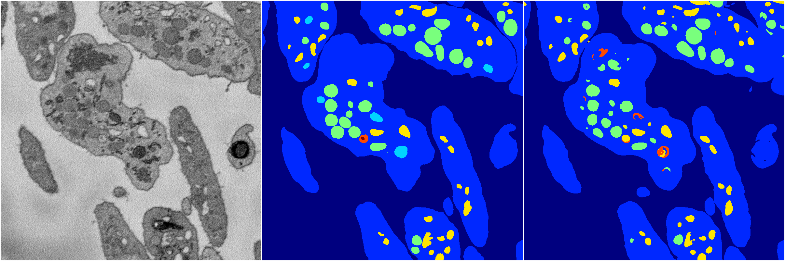</a>
<i>Click image for more details</i>

2 nets

**ari**: min -0.0000. max 0.8364. mean 0.4182.  ([best net](55/0))

**miou**: min 0.0659. max 0.4500. mean 0.2579.  ([best net](55/0))

**accuracy**: min 0.4613. max 0.9350. mean 0.6982.  ([best net](55/0))

**n_params**: min 64893.0000. max 65040.0000. mean 64966.5000.  ([best net](55/1))

---

<a href="54"><h2>random_hybrid_3d / 0416 / 54</h2></a>
Created 18 Apr 2019, 16:41:02

<i>Click image for more details</i>

2 nets

**ari**: min 0.7577. max 0.8407. mean 0.7992.  ([best net](54/1))

**miou**: min 0.2806. max 0.5600. mean 0.4203.  ([best net](54/1))

**accuracy**: min 0.9078. max 0.9419. mean 0.9248.  ([best net](54/1))

**n_params**: min 1272062.0000. max 1272209.0000. mean 1272135.5000.  ([best net](54/1))

---

<a href="47"><h2>random_hybrid_3d / 0416 / 47</h2></a>
Created 18 Apr 2019, 16:41:01

<i>Click image for more details</i>

2 nets

**ari**: min 0.8411. max 0.8425. mean 0.8418.  ([best net](47/1))

**miou**: min 0.4784. max 0.5391. mean 0.5087.  ([best net](47/1))

**accuracy**: min 0.9405. max 0.9419. mean 0.9412.  ([best net](47/1))

**n_params**: min 22359360.0000. max 22360977.0000. mean 22360168.5000.  ([best net](47/1))

---

<a href="51"><h2>random_hybrid_3d / 0416 / 51</h2></a>
Created 18 Apr 2019, 16:41:01

<i>Click image for more details</i>

2 nets

**ari**: min 0.8379. max 0.8425. mean 0.8402.  ([best net](51/1))

**miou**: min 0.4279. max 0.5054. mean 0.4667.  ([best net](51/1))

**accuracy**: min 0.9368. max 0.9421. mean 0.9395.  ([best net](51/1))

**n_params**: min 718474.0000. max 718621.0000. mean 718547.5000.  ([best net](51/0))

---

<a href="48"><h2>random_hybrid_3d / 0416 / 48</h2></a>
Created 18 Apr 2019, 16:41:01

<i>Click image for more details</i>

2 nets

**ari**: min 0.7865. max 0.8408. mean 0.8137.  ([best net](48/0))

**miou**: min 0.3832. max 0.6573. mean 0.5202.  ([best net](48/0))

**accuracy**: min 0.9233. max 0.9428. mean 0.9330.  ([best net](48/0))

**n_params**: min 15015.0000. max 15015.0000. mean 15015.0000.  ([best net](48/0))

---

<a href="46"><h2>random_hybrid_3d / 0416 / 46</h2></a>
Created 18 Apr 2019, 16:41:01

<i>Click image for more details</i>

2 nets

**ari**: min 0.7408. max 0.8399. mean 0.7903.  ([best net](46/0))

**miou**: min 0.2539. max 0.4470. mean 0.3505.  ([best net](46/0))

**accuracy**: min 0.9020. max 0.9361. mean 0.9191.  ([best net](46/0))

**n_params**: min 1277497.0000. max 1277497.0000. mean 1277497.0000.  ([best net](46/0))

---

<a href="40"><h2>random_hybrid_3d / 0416 / 40</h2></a>
Created 18 Apr 2019, 16:41:01

<i>Click image for more details</i>

2 nets

**ari**: min 0.8425. max 0.8434. mean 0.8429.  ([best net](40/1))

**miou**: min 0.5709. max 0.6188. mean 0.5948.  ([best net](40/0))

**accuracy**: min 0.9434. max 0.9435. mean 0.9435.  ([best net](40/0))

**n_params**: min 348173.0000. max 349447.0000. mean 348810.0000.  ([best net](40/0))

---

<a href="42"><h2>random_hybrid_3d / 0416 / 42</h2></a>
Created 18 Apr 2019, 16:41:01

<i>Click image for more details</i>

2 nets

**ari**: min 0.8391. max 0.8416. mean 0.8404.  ([best net](42/0))

**miou**: min 0.5062. max 0.5567. mean 0.5315.  ([best net](42/0))

**accuracy**: min 0.9415. max 0.9424. mean 0.9420.  ([best net](42/0))

**n_params**: min 936564.0000. max 936711.0000. mean 936637.5000.  ([best net](42/1))

---

<a href="39"><h2>random_hybrid_3d / 0416 / 39</h2></a>
Created 18 Apr 2019, 16:41:01

<i>Click image for more details</i>

2 nets

**ari**: min 0.8267. max 0.8365. mean 0.8316.  ([best net](39/0))

**miou**: min 0.4338. max 0.5561. mean 0.4949.  ([best net](39/0))

**accuracy**: min 0.9356. max 0.9396. mean 0.9376.  ([best net](39/0))

**n_params**: min 3336097.0000. max 3336440.0000. mean 3336268.5000.  ([best net](39/0))

---

<a href="41"><h2>random_hybrid_3d / 0416 / 41</h2></a>
Created 18 Apr 2019, 16:41:01

<a href="41">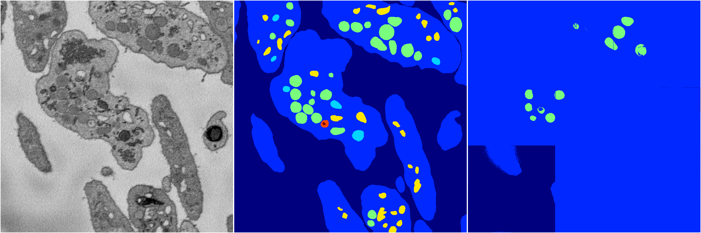</a>
<i>Click image for more details</i>

2 nets

**ari**: min 0.0210. max 0.0917. mean 0.0564.  ([best net](41/0))

**miou**: min 0.0656. max 0.1339. mean 0.0997.  ([best net](41/0))

**accuracy**: min 0.4476. max 0.6131. mean 0.5303.  ([best net](41/0))

**n_params**: min 12327.0000. max 12474.0000. mean 12400.5000.  ([best net](41/0))

---

<a href="45"><h2>random_hybrid_3d / 0416 / 45</h2></a>
Created 18 Apr 2019, 16:41:01

<i>Click image for more details</i>

2 nets

**ari**: min 0.8415. max 0.8423. mean 0.8419.  ([best net](45/0))

**miou**: min 0.4828. max 0.5920. mean 0.5374.  ([best net](45/0))

**accuracy**: min 0.9358. max 0.9431. mean 0.9394.  ([best net](45/0))

**n_params**: min 24199.0000. max 24346.0000. mean 24272.5000.  ([best net](45/1))

---

<a href="43"><h2>random_hybrid_3d / 0416 / 43</h2></a>
Created 18 Apr 2019, 16:41:01

<i>Click image for more details</i>

2 nets

**ari**: min 0.0386. max 0.8409. mean 0.4398.  ([best net](43/1))

**miou**: min 0.1684. max 0.5157. mean 0.3420.  ([best net](43/1))

**accuracy**: min 0.5459. max 0.9425. mean 0.7442.  ([best net](43/1))

**n_params**: min 7847.0000. max 7847.0000. mean 7847.0000.  ([best net](43/0))

---

<a href="35"><h2>random_hybrid_3d / 0416 / 35</h2></a>
Created 18 Apr 2019, 16:41:01

<i>Click image for more details</i>

2 nets

**ari**: min 0.5612. max 0.8389. mean 0.7000.  ([best net](35/1))

**miou**: min 0.2255. max 0.4288. mean 0.3272.  ([best net](35/1))

**accuracy**: min 0.8515. max 0.9373. mean 0.8944.  ([best net](35/1))

**n_params**: min 2128931.0000. max 2129855.0000. mean 2129393.0000.  ([best net](35/0))

---

<a href="36"><h2>random_hybrid_3d / 0416 / 36</h2></a>
Created 18 Apr 2019, 16:41:01

<i>Click image for more details</i>

2 nets

**ari**: min 0.8294. max 0.8377. mean 0.8335.  ([best net](36/0))

**miou**: min 0.4686. max 0.5008. mean 0.4847.  ([best net](36/0))

**accuracy**: min 0.9360. max 0.9408. mean 0.9384.  ([best net](36/0))

**n_params**: min 58516295.0000. max 58516442.0000. mean 58516368.5000.  ([best net](36/1))

---

<a href="37"><h2>random_hybrid_3d / 0416 / 37</h2></a>
Created 18 Apr 2019, 16:41:01

<i>Click image for more details</i>

2 nets

**ari**: min 0.8286. max 0.8394. mean 0.8340.  ([best net](37/1))

**miou**: min 0.4040. max 0.5271. mean 0.4656.  ([best net](37/1))

**accuracy**: min 0.9324. max 0.9416. mean 0.9370.  ([best net](37/1))

**n_params**: min 14827241.0000. max 14827388.0000. mean 14827314.5000.  ([best net](37/0))

---

<a href="38"><h2>random_hybrid_3d / 0416 / 38</h2></a>
Created 18 Apr 2019, 16:41:01

<i>Click image for more details</i>

2 nets

**ari**: min 0.8317. max 0.8419. mean 0.8368.  ([best net](38/1))

**miou**: min 0.4706. max 0.5726. mean 0.5216.  ([best net](38/1))

**accuracy**: min 0.9392. max 0.9431. mean 0.9412.  ([best net](38/1))

**n_params**: min 156022.0000. max 156785.0000. mean 156403.5000.  ([best net](38/1))

---

<a href="66"><h2>random_hybrid_3d / 0416 / 66</h2></a>
Created 18 Apr 2019, 16:41:01

<i>Click image for more details</i>

2 nets

**ari**: min 0.8205. max 0.8427. mean 0.8316.  ([best net](66/1))

**miou**: min 0.4192. max 0.5715. mean 0.4953.  ([best net](66/1))

**accuracy**: min 0.9342. max 0.9432. mean 0.9387.  ([best net](66/1))

**n_params**: min 5809387.0000. max 5809534.0000. mean 5809460.5000.  ([best net](66/1))

---

<a href="33"><h2>random_hybrid_3d / 0416 / 33</h2></a>
Created 18 Apr 2019, 16:41:01

<i>Click image for more details</i>

2 nets

**ari**: min 0.8387. max 0.8400. mean 0.8394.  ([best net](33/1))

**miou**: min 0.5666. max 0.5667. mean 0.5667.  ([best net](33/1))

**accuracy**: min 0.9420. max 0.9421. mean 0.9420.  ([best net](33/1))

**n_params**: min 11360003.0000. max 11361319.0000. mean 11360661.0000.  ([best net](33/0))

---

<a href="29"><h2>random_hybrid_3d / 0416 / 29</h2></a>
Created 18 Apr 2019, 16:41:01

<i>Click image for more details</i>

2 nets

**ari**: min 0.8416. max 0.8428. mean 0.8422.  ([best net](29/1))

**miou**: min 0.5152. max 0.5488. mean 0.5320.  ([best net](29/1))

**accuracy**: min 0.9429. max 0.9430. mean 0.9429.  ([best net](29/1))

**n_params**: min 3566828.0000. max 3566828.0000. mean 3566828.0000.  ([best net](29/0))

---

<a href="28"><h2>random_hybrid_3d / 0416 / 28</h2></a>
Created 18 Apr 2019, 16:41:01

<i>Click image for more details</i>

2 nets

**ari**: min -0.0001. max 0.7993. mean 0.3996.  ([best net](28/1))

**miou**: min 0.0659. max 0.3897. mean 0.2278.  ([best net](28/1))

**accuracy**: min 0.4614. max 0.9237. mean 0.6926.  ([best net](28/1))

**n_params**: min 4071443.0000. max 4071443.0000. mean 4071443.0000.  ([best net](28/0))

---

<a href="30"><h2>random_hybrid_3d / 0416 / 30</h2></a>
Created 18 Apr 2019, 16:41:01

<i>Click image for more details</i>

2 nets

**ari**: min 0.8244. max 0.8385. mean 0.8315.  ([best net](30/0))

**miou**: min 0.4232. max 0.5758. mean 0.4995.  ([best net](30/0))

**accuracy**: min 0.9349. max 0.9421. mean 0.9385.  ([best net](30/0))

**n_params**: min 1836733.0000. max 1836733.0000. mean 1836733.0000.  ([best net](30/1))

---

<a href="27"><h2>random_hybrid_3d / 0416 / 27</h2></a>
Created 18 Apr 2019, 16:41:01

<i>Click image for more details</i>

2 nets

**ari**: min 0.8310. max 0.8406. mean 0.8358.  ([best net](27/0))

**miou**: min 0.4360. max 0.4532. mean 0.4446.  ([best net](27/0))

**accuracy**: min 0.9351. max 0.9375. mean 0.9363.  ([best net](27/0))

**n_params**: min 331054.0000. max 331201.0000. mean 331127.5000.  ([best net](27/0))

---

<a href="32"><h2>random_hybrid_3d / 0416 / 32</h2></a>
Created 18 Apr 2019, 16:41:01

<a href="32">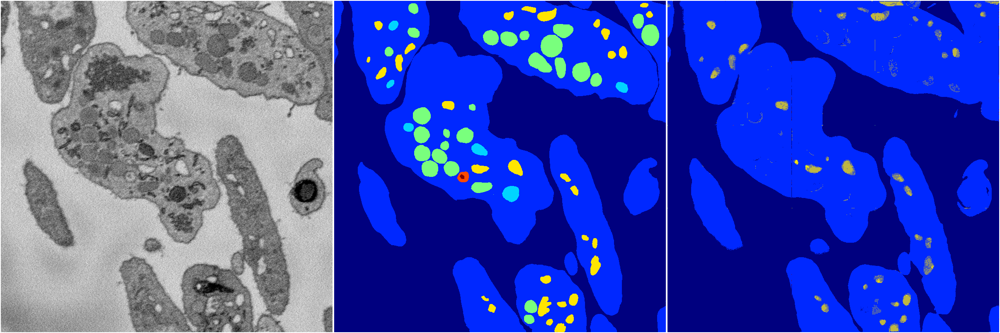</a>
<i>Click image for more details</i>

2 nets

**ari**: min -0.0000. max 0.7733. mean 0.3866.  ([best net](32/1))

**miou**: min 0.0659. max 0.3193. mean 0.1926.  ([best net](32/1))

**accuracy**: min 0.4613. max 0.9120. mean 0.6866.  ([best net](32/1))

**n_params**: min 106353.0000. max 106815.0000. mean 106584.0000.  ([best net](32/0))

---

<a href="31"><h2>random_hybrid_3d / 0416 / 31</h2></a>
Created 18 Apr 2019, 16:41:01

<i>Click image for more details</i>

2 nets

**ari**: min 0.8406. max 0.8410. mean 0.8408.  ([best net](31/1))

**miou**: min 0.5088. max 0.5736. mean 0.5412.  ([best net](31/0))

**accuracy**: min 0.9424. max 0.9425. mean 0.9424.  ([best net](31/1))

**n_params**: min 1123704.0000. max 1124635.0000. mean 1124169.5000.  ([best net](31/1))

---

<a href="34"><h2>random_hybrid_3d / 0416 / 34</h2></a>
Created 18 Apr 2019, 16:41:00

<i>Click image for more details</i>

2 nets

**ari**: min 0.8391. max 0.8396. mean 0.8394.  ([best net](34/0))

**miou**: min 0.5080. max 0.5371. mean 0.5226.  ([best net](34/1))

**accuracy**: min 0.9413. max 0.9413. mean 0.9413.  ([best net](34/0))

**n_params**: min 1098264.0000. max 1098537.0000. mean 1098400.5000.  ([best net](34/0))

---

<a href="26"><h2>random_hybrid_3d / 0416 / 26</h2></a>
Created 18 Apr 2019, 16:41:00

<a href="26">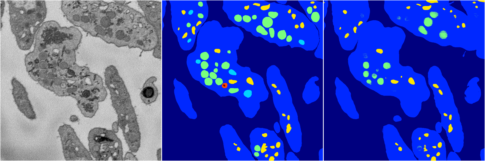</a>
<i>Click image for more details</i>

2 nets

**ari**: min 0.5443. max 0.8206. mean 0.6825.  ([best net](26/1))

**miou**: min 0.2232. max 0.4158. mean 0.3195.  ([best net](26/1))

**accuracy**: min 0.8464. max 0.9349. mean 0.8907.  ([best net](26/1))

**n_params**: min 12884767.0000. max 12884767.0000. mean 12884767.0000.  ([best net](26/1))

---

<a href="25"><h2>random_hybrid_3d / 0416 / 25</h2></a>
Created 18 Apr 2019, 16:41:00

<i>Click image for more details</i>

2 nets

**ari**: min 0.8283. max 0.8363. mean 0.8323.  ([best net](25/1))

**miou**: min 0.4376. max 0.5077. mean 0.4727.  ([best net](25/1))

**accuracy**: min 0.9370. max 0.9415. mean 0.9392.  ([best net](25/1))

**n_params**: min 28884245.0000. max 28884245.0000. mean 28884245.0000.  ([best net](25/0))

---

<a href="24"><h2>random_hybrid_3d / 0416 / 24</h2></a>
Created 18 Apr 2019, 16:41:00

<i>Click image for more details</i>

2 nets

**ari**: min 0.8375. max 0.8377. mean 0.8376.  ([best net](24/1))

**miou**: min 0.4291. max 0.5591. mean 0.4941.  ([best net](24/0))

**accuracy**: min 0.9368. max 0.9413. mean 0.9390.  ([best net](24/0))

**n_params**: min 1137205.0000. max 1137352.0000. mean 1137278.5000.  ([best net](24/1))

---

<a href="23"><h2>random_hybrid_3d / 0416 / 23</h2></a>
Created 18 Apr 2019, 16:41:00

<i>Click image for more details</i>

2 nets

**ari**: min 0.8183. max 0.8412. mean 0.8298.  ([best net](23/1))

**miou**: min 0.4176. max 0.5863. mean 0.5020.  ([best net](23/1))

**accuracy**: min 0.9308. max 0.9428. mean 0.9368.  ([best net](23/1))

**n_params**: min 300684.0000. max 301272.0000. mean 300978.0000.  ([best net](23/0))

---

<a href="22"><h2>random_hybrid_3d / 0416 / 22</h2></a>
Created 18 Apr 2019, 16:41:00

<i>Click image for more details</i>

2 nets

**ari**: min 0.4815. max 0.7786. mean 0.6300.  ([best net](22/1))

**miou**: min 0.2132. max 0.3430. mean 0.2781.  ([best net](22/1))

**accuracy**: min 0.8252. max 0.9130. mean 0.8691.  ([best net](22/1))

**n_params**: min 4896636.0000. max 4896636.0000. mean 4896636.0000.  ([best net](22/1))

---

<a href="21"><h2>random_hybrid_3d / 0416 / 21</h2></a>
Created 18 Apr 2019, 16:41:00

<i>Click image for more details</i>

2 nets

**ari**: min 0.8235. max 0.8387. mean 0.8311.  ([best net](21/1))

**miou**: min 0.4308. max 0.5155. mean 0.4731.  ([best net](21/1))

**accuracy**: min 0.9342. max 0.9415. mean 0.9379.  ([best net](21/1))

**n_params**: min 14563824.0000. max 14565042.0000. mean 14564433.0000.  ([best net](21/0))

---

<a href="19"><h2>random_hybrid_3d / 0416 / 19</h2></a>
Created 18 Apr 2019, 16:41:00

<i>Click image for more details</i>

2 nets

**ari**: min 0.8170. max 0.8428. mean 0.8299.  ([best net](19/1))

**miou**: min 0.4127. max 0.5094. mean 0.4610.  ([best net](19/1))

**accuracy**: min 0.9339. max 0.9429. mean 0.9384.  ([best net](19/1))

**n_params**: min 805192.0000. max 806578.0000. mean 805885.0000.  ([best net](19/1))

---

<a href="20"><h2>random_hybrid_3d / 0416 / 20</h2></a>
Created 18 Apr 2019, 16:41:00

<i>Click image for more details</i>

2 nets

**ari**: min 0.7088. max 0.8410. mean 0.7749.  ([best net](20/1))

**miou**: min 0.2540. max 0.5693. mean 0.4117.  ([best net](20/1))

**accuracy**: min 0.8941. max 0.9432. mean 0.9186.  ([best net](20/1))

**n_params**: min 18948643.0000. max 18948643.0000. mean 18948643.0000.  ([best net](20/0))

---

<a href="15"><h2>random_hybrid_3d / 0416 / 15</h2></a>
Created 18 Apr 2019, 16:41:00

<i>Click image for more details</i>

2 nets

**ari**: min 0.7816. max 0.8298. mean 0.8057.  ([best net](15/1))

**miou**: min 0.3416. max 0.4490. mean 0.3953.  ([best net](15/1))

**accuracy**: min 0.9173. max 0.9356. mean 0.9264.  ([best net](15/1))

**n_params**: min 3824539.0000. max 3824910.0000. mean 3824724.5000.  ([best net](15/1))

---

<a href="17"><h2>random_hybrid_3d / 0416 / 17</h2></a>
Created 18 Apr 2019, 16:41:00

<i>Click image for more details</i>

2 nets

**ari**: min 0.8404. max 0.8413. mean 0.8409.  ([best net](17/1))

**miou**: min 0.5138. max 0.5694. mean 0.5416.  ([best net](17/0))

**accuracy**: min 0.9411. max 0.9424. mean 0.9418.  ([best net](17/0))

**n_params**: min 7346317.0000. max 7347969.0000. mean 7347143.0000.  ([best net](17/1))

---

<a href="16"><h2>random_hybrid_3d / 0416 / 16</h2></a>
Created 18 Apr 2019, 16:41:00

<i>Click image for more details</i>

2 nets

**ari**: min 0.5715. max 0.8343. mean 0.7029.  ([best net](16/0))

**miou**: min 0.4043. max 0.4866. mean 0.4454.  ([best net](16/0))

**accuracy**: min 0.8549. max 0.9380. mean 0.8965.  ([best net](16/0))

**n_params**: min 643950.0000. max 643950.0000. mean 643950.0000.  ([best net](16/1))

---

<a href="14"><h2>random_hybrid_3d / 0416 / 14</h2></a>
Created 18 Apr 2019, 16:41:00

<i>Click image for more details</i>

2 nets

**ari**: min -0.0000. max 0.8429. mean 0.4215.  ([best net](14/1))

**miou**: min 0.0659. max 0.6436. mean 0.3548.  ([best net](14/1))

**accuracy**: min 0.4613. max 0.9437. mean 0.7025.  ([best net](14/1))

**n_params**: min 366889.0000. max 368464.0000. mean 367676.5000.  ([best net](14/0))

---

<a href="18"><h2>random_hybrid_3d / 0416 / 18</h2></a>
Created 18 Apr 2019, 16:41:00

<a href="18">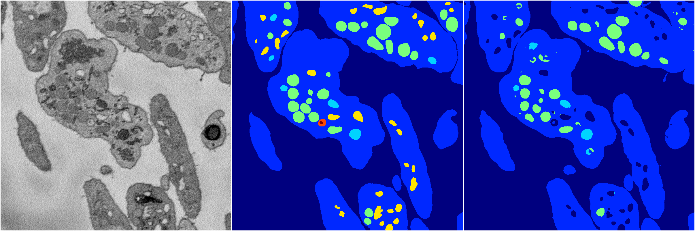</a>
<i>Click image for more details</i>

2 nets

**ari**: min -0.0000. max 0.8016. mean 0.4008.  ([best net](18/0))

**miou**: min 0.0659. max 0.4113. mean 0.2386.  ([best net](18/0))

**accuracy**: min 0.4613. max 0.9244. mean 0.6929.  ([best net](18/0))

**n_params**: min 190466.0000. max 191481.0000. mean 190973.5000.  ([best net](18/1))

---

<a href="10"><h2>random_hybrid_3d / 0416 / 10</h2></a>
Created 18 Apr 2019, 16:41:00

<i>Click image for more details</i>

2 nets

**ari**: min 0.8208. max 0.8326. mean 0.8267.  ([best net](10/0))

**miou**: min 0.4344. max 0.4920. mean 0.4632.  ([best net](10/0))

**accuracy**: min 0.9334. max 0.9377. mean 0.9355.  ([best net](10/0))

**n_params**: min 2217609.0000. max 2218771.0000. mean 2218190.0000.  ([best net](10/1))

---

<a href="12"><h2>random_hybrid_3d / 0416 / 12</h2></a>
Created 18 Apr 2019, 16:41:00

<i>Click image for more details</i>

2 nets

**ari**: min 0.8398. max 0.8410. mean 0.8404.  ([best net](12/1))

**miou**: min 0.4261. max 0.5121. mean 0.4691.  ([best net](12/0))

**accuracy**: min 0.9373. max 0.9419. mean 0.9396.  ([best net](12/0))

**n_params**: min 2550402.0000. max 2550402.0000. mean 2550402.0000.  ([best net](12/0))

---

<a href="11"><h2>random_hybrid_3d / 0416 / 11</h2></a>
Created 18 Apr 2019, 16:41:00

<i>Click image for more details</i>

2 nets

**ari**: min 0.8314. max 0.8326. mean 0.8320.  ([best net](11/1))

**miou**: min 0.4335. max 0.4945. mean 0.4640.  ([best net](11/0))

**accuracy**: min 0.9362. max 0.9371. mean 0.9366.  ([best net](11/1))

**n_params**: min 2241724.0000. max 2242543.0000. mean 2242133.5000.  ([best net](11/1))

---

<a href="13"><h2>random_hybrid_3d / 0416 / 13</h2></a>
Created 18 Apr 2019, 16:41:00

<i>Click image for more details</i>

2 nets

**ari**: min 0.8355. max 0.8368. mean 0.8361.  ([best net](13/1))

**miou**: min 0.4633. max 0.5549. mean 0.5091.  ([best net](13/1))

**accuracy**: min 0.9369. max 0.9409. mean 0.9389.  ([best net](13/1))

**n_params**: min 456822.0000. max 456969.0000. mean 456895.5000.  ([best net](13/1))

---

<a href="5"><h2>random_hybrid_3d / 0416 / 5</h2></a>
Created 18 Apr 2019, 16:41:00

<i>Click image for more details</i>

2 nets

**ari**: min 0.7415. max 0.8407. mean 0.7911.  ([best net](5/0))

**miou**: min 0.2778. max 0.5028. mean 0.3903.  ([best net](5/0))

**accuracy**: min 0.9054. max 0.9413. mean 0.9233.  ([best net](5/0))

**n_params**: min 7627464.0000. max 7627464.0000. mean 7627464.0000.  ([best net](5/1))

---

<a href="4"><h2>random_hybrid_3d / 0416 / 4</h2></a>
Created 18 Apr 2019, 16:40:59

<i>Click image for more details</i>

2 nets

**ari**: min 0.7776. max 0.8435. mean 0.8106.  ([best net](4/1))

**miou**: min 0.3250. max 0.5655. mean 0.4453.  ([best net](4/1))

**accuracy**: min 0.9176. max 0.9431. mean 0.9303.  ([best net](4/1))

**n_params**: min 224092.0000. max 224092.0000. mean 224092.0000.  ([best net](4/1))

---

<a href="7"><h2>random_hybrid_3d / 0416 / 7</h2></a>
Created 18 Apr 2019, 16:40:59

<i>Click image for more details</i>

2 nets

**ari**: min 0.8423. max 0.8426. mean 0.8425.  ([best net](7/1))

**miou**: min 0.5003. max 0.5081. mean 0.5042.  ([best net](7/1))

**accuracy**: min 0.9418. max 0.9424. mean 0.9421.  ([best net](7/1))

**n_params**: min 20219625.0000. max 20219625.0000. mean 20219625.0000.  ([best net](7/1))

---

<a href="1"><h2>random_hybrid_3d / 0416 / 1</h2></a>
Created 18 Apr 2019, 16:40:59

<i>Click image for more details</i>

2 nets

**ari**: min 0.8422. max 0.8427. mean 0.8424.  ([best net](1/0))

**miou**: min 0.5028. max 0.5560. mean 0.5294.  ([best net](1/1))

**accuracy**: min 0.9415. max 0.9423. mean 0.9419.  ([best net](1/1))

**n_params**: min 5960382.0000. max 5960382.0000. mean 5960382.0000.  ([best net](1/0))

---

<a href="3"><h2>random_hybrid_3d / 0416 / 3</h2></a>
Created 18 Apr 2019, 16:40:59

<i>Click image for more details</i>

2 nets

**ari**: min 0.7898. max 0.7932. mean 0.7915.  ([best net](3/1))

**miou**: min 0.3191. max 0.3812. mean 0.3501.  ([best net](3/1))

**accuracy**: min 0.9152. max 0.9242. mean 0.9197.  ([best net](3/1))

**n_params**: min 1587585.0000. max 1588110.0000. mean 1587847.5000.  ([best net](3/1))

---

<a href="8"><h2>random_hybrid_3d / 0416 / 8</h2></a>
Created 18 Apr 2019, 16:40:59

<i>Click image for more details</i>

2 nets

**ari**: min -0.0001. max 0.8022. mean 0.4010.  ([best net](8/1))

**miou**: min 0.0660. max 0.4163. mean 0.2412.  ([best net](8/1))

**accuracy**: min 0.4617. max 0.9274. mean 0.6946.  ([best net](8/1))

**n_params**: min 4351778.0000. max 4353143.0000. mean 4352460.5000.  ([best net](8/0))

---

<a href="6"><h2>random_hybrid_3d / 0416 / 6</h2></a>
Created 18 Apr 2019, 16:40:59

<i>Click image for more details</i>

1 nets

**ari**: min 0.8430. max 0.8430. mean 0.8430.  ([best net](6/1))

**miou**: min 0.5756. max 0.5756. mean 0.5756.  ([best net](6/1))

**accuracy**: min 0.9433. max 0.9433. mean 0.9433.  ([best net](6/1))

**n_params**: min 1101128.0000. max 1101128.0000. mean 1101128.0000.  ([best net](6/1))

---

<a href="9"><h2>random_hybrid_3d / 0416 / 9</h2></a>
Created 18 Apr 2019, 16:40:59

<i>Click image for more details</i>

2 nets

**ari**: min 0.6122. max 0.8093. mean 0.7107.  ([best net](9/1))

**miou**: min 0.3085. max 0.4675. mean 0.3880.  ([best net](9/1))

**accuracy**: min 0.8047. max 0.9286. mean 0.8667.  ([best net](9/1))

**n_params**: min 9191.0000. max 9338.0000. mean 9264.5000.  ([best net](9/1))

---

<a href="2"><h2>random_hybrid_3d / 0416 / 2</h2></a>
Created 18 Apr 2019, 16:40:59

<i>Click image for more details</i>

2 nets

**ari**: min 0.8334. max 0.8418. mean 0.8376.  ([best net](2/1))

**miou**: min 0.5930. max 0.6577. mean 0.6253.  ([best net](2/0))

**accuracy**: min 0.9409. max 0.9432. mean 0.9420.  ([best net](2/1))

**n_params**: min 29309.0000. max 29701.0000. mean 29505.0000.  ([best net](2/1))

---

<a href="0"><h2>random_hybrid_3d / 0416 / 0</h2></a>
Created 18 Apr 2019, 16:40:59

<i>Click image for more details</i>

2 nets

**ari**: min 0.8388. max 0.8425. mean 0.8407.  ([best net](0/1))

**miou**: min 0.4266. max 0.5676. mean 0.4971.  ([best net](0/1))

**accuracy**: min 0.9367. max 0.9429. mean 0.9398.  ([best net](0/1))

**n_params**: min 1042724.0000. max 1042724.0000. mean 1042724.0000.  ([best net](0/0))

---

[Back](..)&nbsp;&nbsp;&nbsp;&nbsp;&nbsp;[Home](https://leapmanlab.github.io/snapshots)

---