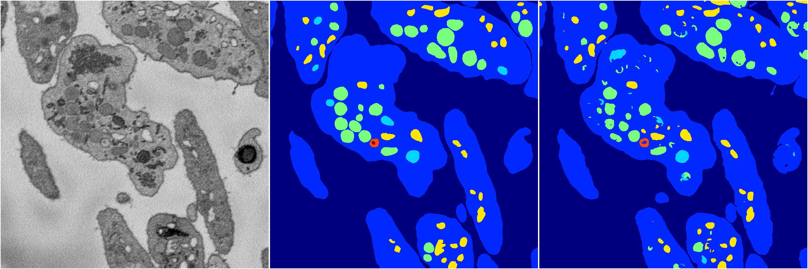
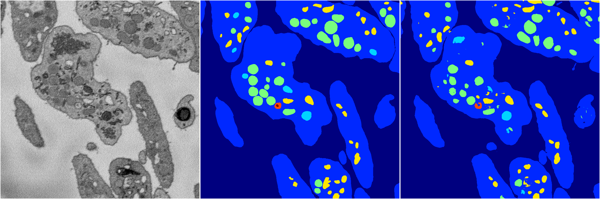

[Back](..)&nbsp;&nbsp;&nbsp;&nbsp;&nbsp;[Home](https://leapmanlab.github.io/snapshots)

---

<a href="1"><h2>random_hybrid_3d / 0418 / 32 / 1</h2></a>
Created 25 Apr 2019, 13:51:02

<i>Click for more details</i>

**ari**: 0.8305. **miou**: 0.5415. **accuracy**: 0.9370. **n_params**: 106815.0000. 

---

<a href="0"><h2>random_hybrid_3d / 0418 / 32 / 0</h2></a>
Created 25 Apr 2019, 13:51:02

<i>Click for more details</i>

**ari**: 0.8319. **miou**: 0.6209. **accuracy**: 0.9387. **n_params**: 106500.0000. 

---

[Back](..)&nbsp;&nbsp;&nbsp;&nbsp;&nbsp;[Home](https://leapmanlab.github.io/snapshots)

---