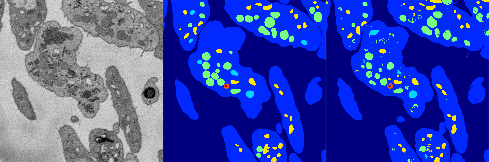
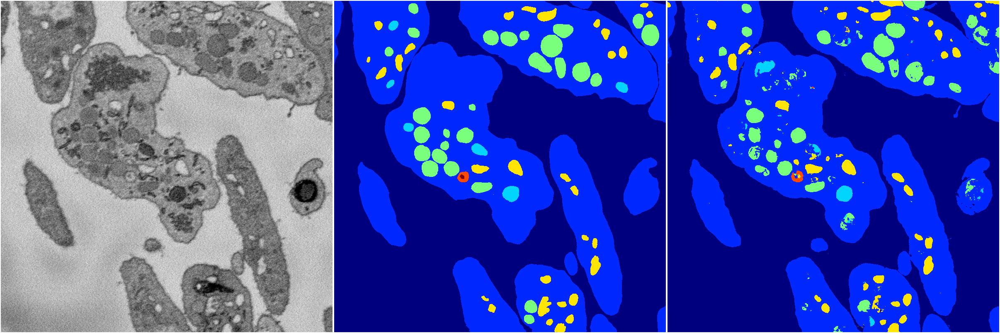

[Back](..)&nbsp;&nbsp;&nbsp;&nbsp;&nbsp;[Home](https://leapmanlab.github.io/snapshots)

---

<a href="0"><h2>random_hybrid_3d / 0418 / 35 / 0</h2></a>
Created 20 Apr 2019, 00:17:23

<i>Click for more details</i>

**ari**: 0.8311. **miou**: 0.6267. **accuracy**: 0.9378. **n_params**: 2128931.0000. 

---

<a href="1"><h2>random_hybrid_3d / 0418 / 35 / 1</h2></a>
Created 20 Apr 2019, 00:17:23

<i>Click for more details</i>

**ari**: 0.8290. **miou**: 0.6177. **accuracy**: 0.9373. **n_params**: 2128931.0000. 

---

[Back](..)&nbsp;&nbsp;&nbsp;&nbsp;&nbsp;[Home](https://leapmanlab.github.io/snapshots)

---