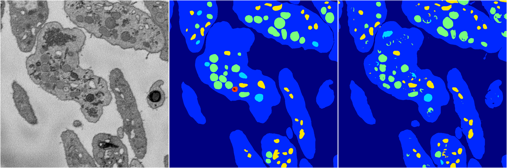
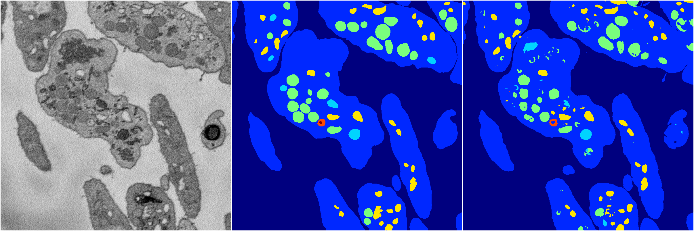
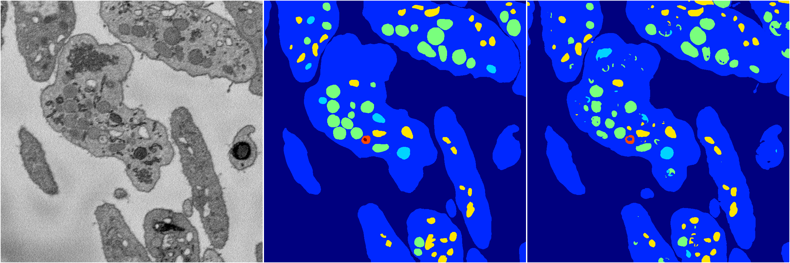

[Back](..)&nbsp;&nbsp;&nbsp;&nbsp;&nbsp;[Home](https://leapmanlab.github.io/snapshots)

---

<a href="51"><h2>random_hybrid_3d / 0418 / 51</h2></a>
Created 20 Apr 2019, 00:17:24

<i>Click image for more details</i>

1 nets

**ari**: min 0.8317. max 0.8317. mean 0.8317.  ([best net](51/0))

**miou**: min 0.4936. max 0.4936. mean 0.4936.  ([best net](51/0))

**accuracy**: min 0.9377. max 0.9377. mean 0.9377.  ([best net](51/0))

**n_params**: min 718621.0000. max 718621.0000. mean 718621.0000.  ([best net](51/0))

---

<a href="42"><h2>random_hybrid_3d / 0418 / 42</h2></a>
Created 20 Apr 2019, 00:17:24

<i>Click image for more details</i>

1 nets

**ari**: min 0.8268. max 0.8268. mean 0.8268.  ([best net](42/0))

**miou**: min 0.4898. max 0.4898. mean 0.4898.  ([best net](42/0))

**accuracy**: min 0.9358. max 0.9358. mean 0.9358.  ([best net](42/0))

**n_params**: min 936711.0000. max 936711.0000. mean 936711.0000.  ([best net](42/0))

---

<a href="46"><h2>random_hybrid_3d / 0418 / 46</h2></a>
Created 20 Apr 2019, 00:17:24

<i>Click image for more details</i>

1 nets

**ari**: min 0.8312. max 0.8312. mean 0.8312.  ([best net](46/0))

**miou**: min 0.5470. max 0.5470. mean 0.5470.  ([best net](46/0))

**accuracy**: min 0.9378. max 0.9378. mean 0.9378.  ([best net](46/0))

**n_params**: min 1277644.0000. max 1277644.0000. mean 1277644.0000.  ([best net](46/0))

---

<a href="44"><h2>random_hybrid_3d / 0418 / 44</h2></a>
Created 20 Apr 2019, 00:17:24

<i>Click image for more details</i>

2 nets

**ari**: min 0.8282. max 0.8285. mean 0.8284.  ([best net](44/1))

**miou**: min 0.4947. max 0.6223. mean 0.5585.  ([best net](44/0))

**accuracy**: min 0.9361. max 0.9370. mean 0.9366.  ([best net](44/1))

**n_params**: min 41963133.0000. max 41963280.0000. mean 41963206.5000.  ([best net](44/1))

---

<a href="49"><h2>random_hybrid_3d / 0418 / 49</h2></a>
Created 20 Apr 2019, 00:17:24

<i>Click image for more details</i>

1 nets

**ari**: min 0.8292. max 0.8292. mean 0.8292.  ([best net](49/0))

**miou**: min 0.6367. max 0.6367. mean 0.6367.  ([best net](49/0))

**accuracy**: min 0.9372. max 0.9372. mean 0.9372.  ([best net](49/0))

**n_params**: min 712749.0000. max 712749.0000. mean 712749.0000.  ([best net](49/0))

---

<a href="43"><h2>random_hybrid_3d / 0418 / 43</h2></a>
Created 20 Apr 2019, 00:17:24

<i>Click image for more details</i>

2 nets

**ari**: min 0.8294. max 0.8299. mean 0.8296.  ([best net](43/0))

**miou**: min 0.6163. max 0.6258. mean 0.6211.  ([best net](43/1))

**accuracy**: min 0.9372. max 0.9374. mean 0.9373.  ([best net](43/0))

**n_params**: min 7847.0000. max 7994.0000. mean 7920.5000.  ([best net](43/1))

---

<a href="45"><h2>random_hybrid_3d / 0418 / 45</h2></a>
Created 20 Apr 2019, 00:17:24

<i>Click image for more details</i>

2 nets

**ari**: min 0.7980. max 0.8314. mean 0.8147.  ([best net](45/0))

**miou**: min 0.5433. max 0.6212. mean 0.5823.  ([best net](45/0))

**accuracy**: min 0.9217. max 0.9378. mean 0.9297.  ([best net](45/0))

**n_params**: min 24199.0000. max 24346.0000. mean 24272.5000.  ([best net](45/0))

---

<a href="41"><h2>random_hybrid_3d / 0418 / 41</h2></a>
Created 20 Apr 2019, 00:17:24

<i>Click image for more details</i>

1 nets

**ari**: min 0.8193. max 0.8193. mean 0.8193.  ([best net](41/0))

**miou**: min 0.5567. max 0.5567. mean 0.5567.  ([best net](41/0))

**accuracy**: min 0.9314. max 0.9314. mean 0.9314.  ([best net](41/0))

**n_params**: min 12327.0000. max 12327.0000. mean 12327.0000.  ([best net](41/0))

---

<a href="39"><h2>random_hybrid_3d / 0418 / 39</h2></a>
Created 20 Apr 2019, 00:17:24

<i>Click image for more details</i>

2 nets

**ari**: min 0.8292. max 0.8308. mean 0.8300.  ([best net](39/1))

**miou**: min 0.5499. max 0.6131. mean 0.5815.  ([best net](39/0))

**accuracy**: min 0.9369. max 0.9377. mean 0.9373.  ([best net](39/1))

**n_params**: min 3336097.0000. max 3336097.0000. mean 3336097.0000.  ([best net](39/1))

---

<a href="40"><h2>random_hybrid_3d / 0418 / 40</h2></a>
Created 20 Apr 2019, 00:17:24

<i>Click image for more details</i>

2 nets

**ari**: min 0.8342. max 0.8357. mean 0.8349.  ([best net](40/0))

**miou**: min 0.5323. max 0.5460. mean 0.5391.  ([best net](40/1))

**accuracy**: min 0.9393. max 0.9399. mean 0.9396.  ([best net](40/0))

**n_params**: min 348173.0000. max 349594.0000. mean 348883.5000.  ([best net](40/0))

---

<a href="38"><h2>random_hybrid_3d / 0418 / 38</h2></a>
Created 20 Apr 2019, 00:17:23

<i>Click image for more details</i>

2 nets

**ari**: min 0.8291. max 0.8297. mean 0.8294.  ([best net](38/1))

**miou**: min 0.6231. max 0.6247. mean 0.6239.  ([best net](38/1))

**accuracy**: min 0.9370. max 0.9372. mean 0.9371.  ([best net](38/1))

**n_params**: min 155875.0000. max 156785.0000. mean 156330.0000.  ([best net](38/0))

---

<a href="36"><h2>random_hybrid_3d / 0418 / 36</h2></a>
Created 20 Apr 2019, 00:17:23

<i>Click image for more details</i>

2 nets

**ari**: min 0.8296. max 0.8300. mean 0.8298.  ([best net](36/0))

**miou**: min 0.5423. max 0.6229. mean 0.5826.  ([best net](36/1))

**accuracy**: min 0.9371. max 0.9376. mean 0.9373.  ([best net](36/0))

**n_params**: min 58516442.0000. max 58518269.0000. mean 58517355.5000.  ([best net](36/0))

---

<a href="37"><h2>random_hybrid_3d / 0418 / 37</h2></a>
Created 20 Apr 2019, 00:17:23

<i>Click image for more details</i>

1 nets

**ari**: min 0.8317. max 0.8317. mean 0.8317.  ([best net](37/0))

**miou**: min 0.5534. max 0.5534. mean 0.5534.  ([best net](37/0))

**accuracy**: min 0.9380. max 0.9380. mean 0.9380.  ([best net](37/0))

**n_params**: min 14827388.0000. max 14827388.0000. mean 14827388.0000.  ([best net](37/0))

---

<a href="35"><h2>random_hybrid_3d / 0418 / 35</h2></a>
Created 20 Apr 2019, 00:17:23

<i>Click image for more details</i>

2 nets

**ari**: min 0.8290. max 0.8311. mean 0.8300.  ([best net](35/0))

**miou**: min 0.6177. max 0.6267. mean 0.6222.  ([best net](35/0))

**accuracy**: min 0.9373. max 0.9378. mean 0.9376.  ([best net](35/0))

**n_params**: min 2128931.0000. max 2128931.0000. mean 2128931.0000.  ([best net](35/1))

---

<a href="34"><h2>random_hybrid_3d / 0418 / 34</h2></a>
Created 20 Apr 2019, 00:17:23

<i>Click image for more details</i>

2 nets

**ari**: min 0.8276. max 0.8295. mean 0.8286.  ([best net](34/0))

**miou**: min 0.5687. max 0.6156. mean 0.5922.  ([best net](34/1))

**accuracy**: min 0.9364. max 0.9368. mean 0.9366.  ([best net](34/0))

**n_params**: min 1098264.0000. max 1098684.0000. mean 1098474.0000.  ([best net](34/1))

---

<a href="33"><h2>random_hybrid_3d / 0418 / 33</h2></a>
Created 20 Apr 2019, 00:17:23

<i>Click image for more details</i>

2 nets

**ari**: min 0.8163. max 0.8302. mean 0.8233.  ([best net](33/0))

**miou**: min 0.4769. max 0.6296. mean 0.5532.  ([best net](33/0))

**accuracy**: min 0.9305. max 0.9375. mean 0.9340.  ([best net](33/0))

**n_params**: min 11360003.0000. max 11361319.0000. mean 11360661.0000.  ([best net](33/0))

---

<a href="32"><h2>random_hybrid_3d / 0418 / 32</h2></a>
Created 20 Apr 2019, 00:17:23

<i>Click image for more details</i>

2 nets

**ari**: min 0.8306. max 0.8308. mean 0.8307.  ([best net](32/1))

**miou**: min 0.5455. max 0.6256. mean 0.5855.  ([best net](32/0))

**accuracy**: min 0.9372. max 0.9376. mean 0.9374.  ([best net](32/0))

**n_params**: min 106500.0000. max 106815.0000. mean 106657.5000.  ([best net](32/1))

---

<a href="31"><h2>random_hybrid_3d / 0418 / 31</h2></a>
Created 20 Apr 2019, 00:17:23

<i>Click image for more details</i>

2 nets

**ari**: min 0.8301. max 0.8301. mean 0.8301.  ([best net](31/1))

**miou**: min 0.6238. max 0.6269. mean 0.6253.  ([best net](31/0))

**accuracy**: min 0.9373. max 0.9375. mean 0.9374.  ([best net](31/1))

**n_params**: min 1124488.0000. max 1124635.0000. mean 1124561.5000.  ([best net](31/1))

---

<a href="29"><h2>random_hybrid_3d / 0418 / 29</h2></a>
Created 20 Apr 2019, 00:17:23

<i>Click image for more details</i>

2 nets

**ari**: min 0.8268. max 0.8303. mean 0.8286.  ([best net](29/0))

**miou**: min 0.6181. max 0.6251. mean 0.6216.  ([best net](29/0))

**accuracy**: min 0.9358. max 0.9379. mean 0.9368.  ([best net](29/0))

**n_params**: min 3566975.0000. max 3566975.0000. mean 3566975.0000.  ([best net](29/0))

---

<a href="30"><h2>random_hybrid_3d / 0418 / 30</h2></a>
Created 20 Apr 2019, 00:17:23

<i>Click image for more details</i>

2 nets

**ari**: min 0.8284. max 0.8301. mean 0.8292.  ([best net](30/0))

**miou**: min 0.6236. max 0.6247. mean 0.6241.  ([best net](30/0))

**accuracy**: min 0.9370. max 0.9374. mean 0.9372.  ([best net](30/0))

**n_params**: min 1836159.0000. max 1836880.0000. mean 1836519.5000.  ([best net](30/0))

---

<a href="27"><h2>random_hybrid_3d / 0418 / 27</h2></a>
Created 20 Apr 2019, 00:17:23

<i>Click image for more details</i>

2 nets

**ari**: min 0.8282. max 0.8315. mean 0.8299.  ([best net](27/1))

**miou**: min 0.5716. max 0.6165. mean 0.5940.  ([best net](27/0))

**accuracy**: min 0.9367. max 0.9380. mean 0.9373.  ([best net](27/1))

**n_params**: min 330907.0000. max 331201.0000. mean 331054.0000.  ([best net](27/0))

---

<a href="26"><h2>random_hybrid_3d / 0418 / 26</h2></a>
Created 20 Apr 2019, 00:17:23

<i>Click image for more details</i>

2 nets

**ari**: min 0.8271. max 0.8299. mean 0.8285.  ([best net](26/1))

**miou**: min 0.6157. max 0.6260. mean 0.6208.  ([best net](26/1))

**accuracy**: min 0.9353. max 0.9373. mean 0.9363.  ([best net](26/1))

**n_params**: min 12884767.0000. max 12886328.0000. mean 12885547.5000.  ([best net](26/0))

---

<a href="28"><h2>random_hybrid_3d / 0418 / 28</h2></a>
Created 20 Apr 2019, 00:17:23

<i>Click image for more details</i>

2 nets

**ari**: min 0.8292. max 0.8299. mean 0.8296.  ([best net](28/1))

**miou**: min 0.6208. max 0.6246. mean 0.6227.  ([best net](28/0))

**accuracy**: min 0.9370. max 0.9372. mean 0.9371.  ([best net](28/1))

**n_params**: min 4070631.0000. max 4071443.0000. mean 4071037.0000.  ([best net](28/0))

---

<a href="25"><h2>random_hybrid_3d / 0418 / 25</h2></a>
Created 20 Apr 2019, 00:17:23

<i>Click image for more details</i>

2 nets

**ari**: min 0.8228. max 0.8298. mean 0.8263.  ([best net](25/0))

**miou**: min 0.5399. max 0.6224. mean 0.5811.  ([best net](25/0))

**accuracy**: min 0.9353. max 0.9372. mean 0.9362.  ([best net](25/0))

**n_params**: min 28884098.0000. max 28884245.0000. mean 28884171.5000.  ([best net](25/0))

---

<a href="24"><h2>random_hybrid_3d / 0418 / 24</h2></a>
Created 20 Apr 2019, 00:17:23

<i>Click image for more details</i>

2 nets

**ari**: min 0.8288. max 0.8310. mean 0.8299.  ([best net](24/1))

**miou**: min 0.6204. max 0.6363. mean 0.6283.  ([best net](24/1))

**accuracy**: min 0.9371. max 0.9376. mean 0.9374.  ([best net](24/1))

**n_params**: min 1136771.0000. max 1137205.0000. mean 1136988.0000.  ([best net](24/0))

---

<a href="23"><h2>random_hybrid_3d / 0418 / 23</h2></a>
Created 20 Apr 2019, 00:17:23

<i>Click image for more details</i>

2 nets

**ari**: min 0.6311. max 0.8293. mean 0.7302.  ([best net](23/0))

**miou**: min 0.3816. max 0.6244. mean 0.5030.  ([best net](23/0))

**accuracy**: min 0.8679. max 0.9370. mean 0.9024.  ([best net](23/0))

**n_params**: min 300684.0000. max 300831.0000. mean 300757.5000.  ([best net](23/0))

---

<a href="22"><h2>random_hybrid_3d / 0418 / 22</h2></a>
Created 20 Apr 2019, 00:17:23

<i>Click image for more details</i>

2 nets

**ari**: min 0.8303. max 0.8315. mean 0.8309.  ([best net](22/0))

**miou**: min 0.5354. max 0.5464. mean 0.5409.  ([best net](22/0))

**accuracy**: min 0.9375. max 0.9378. mean 0.9377.  ([best net](22/0))

**n_params**: min 4895957.0000. max 4896636.0000. mean 4896296.5000.  ([best net](22/1))

---

<a href="21"><h2>random_hybrid_3d / 0418 / 21</h2></a>
Created 20 Apr 2019, 00:17:23

<i>Click image for more details</i>

2 nets

**ari**: min 0.8275. max 0.8305. mean 0.8290.  ([best net](21/1))

**miou**: min 0.6087. max 0.6130. mean 0.6109.  ([best net](21/1))

**accuracy**: min 0.9363. max 0.9371. mean 0.9367.  ([best net](21/1))

**n_params**: min 14563677.0000. max 14563824.0000. mean 14563750.5000.  ([best net](21/1))

---

<a href="20"><h2>random_hybrid_3d / 0418 / 20</h2></a>
Created 20 Apr 2019, 00:17:23

<i>Click image for more details</i>

2 nets

**ari**: min 0.8282. max 0.8293. mean 0.8288.  ([best net](20/0))

**miou**: min 0.6146. max 0.6199. mean 0.6173.  ([best net](20/0))

**accuracy**: min 0.9366. max 0.9375. mean 0.9370.  ([best net](20/0))

**n_params**: min 18948643.0000. max 18950204.0000. mean 18949423.5000.  ([best net](20/0))

---

<a href="16"><h2>random_hybrid_3d / 0418 / 16</h2></a>
Created 20 Apr 2019, 00:17:23

<i>Click image for more details</i>

2 nets

**ari**: min 0.8282. max 0.8299. mean 0.8291.  ([best net](16/0))

**miou**: min 0.6178. max 0.6191. mean 0.6184.  ([best net](16/0))

**accuracy**: min 0.9371. max 0.9371. mean 0.9371.  ([best net](16/1))

**n_params**: min 643950.0000. max 643950.0000. mean 643950.0000.  ([best net](16/0))

---

<a href="13"><h2>random_hybrid_3d / 0418 / 13</h2></a>
Created 20 Apr 2019, 00:17:23

<i>Click image for more details</i>

2 nets

**ari**: min 0.8276. max 0.8289. mean 0.8283.  ([best net](13/1))

**miou**: min 0.5995. max 0.6181. mean 0.6088.  ([best net](13/1))

**accuracy**: min 0.9360. max 0.9366. mean 0.9363.  ([best net](13/1))

**n_params**: min 456787.0000. max 456969.0000. mean 456878.0000.  ([best net](13/0))

---

<a href="15"><h2>random_hybrid_3d / 0418 / 15</h2></a>
Created 20 Apr 2019, 00:17:23

<i>Click image for more details</i>

2 nets

**ari**: min 0.8282. max 0.8288. mean 0.8285.  ([best net](15/0))

**miou**: min 0.5442. max 0.6157. mean 0.5799.  ([best net](15/0))

**accuracy**: min 0.9365. max 0.9368. mean 0.9367.  ([best net](15/0))

**n_params**: min 3824392.0000. max 3824539.0000. mean 3824465.5000.  ([best net](15/0))

---

<a href="17"><h2>random_hybrid_3d / 0418 / 17</h2></a>
Created 20 Apr 2019, 00:17:23

<i>Click image for more details</i>

2 nets

**ari**: min 0.8290. max 0.8298. mean 0.8294.  ([best net](17/1))

**miou**: min 0.6055. max 0.6243. mean 0.6149.  ([best net](17/0))

**accuracy**: min 0.9365. max 0.9374. mean 0.9369.  ([best net](17/1))

**n_params**: min 7346317.0000. max 7348116.0000. mean 7347216.5000.  ([best net](17/0))

---

<a href="19"><h2>random_hybrid_3d / 0418 / 19</h2></a>
Created 20 Apr 2019, 00:17:23

<i>Click image for more details</i>

2 nets

**ari**: min 0.8284. max 0.8288. mean 0.8286.  ([best net](19/0))

**miou**: min 0.6153. max 0.6186. mean 0.6169.  ([best net](19/0))

**accuracy**: min 0.9366. max 0.9367. mean 0.9366.  ([best net](19/1))

**n_params**: min 805045.0000. max 806578.0000. mean 805811.5000.  ([best net](19/0))

---

<a href="14"><h2>random_hybrid_3d / 0418 / 14</h2></a>
Created 20 Apr 2019, 00:17:23

<i>Click image for more details</i>

2 nets

**ari**: min 0.8277. max 0.8299. mean 0.8288.  ([best net](14/0))

**miou**: min 0.6210. max 0.6271. mean 0.6241.  ([best net](14/0))

**accuracy**: min 0.9361. max 0.9374. mean 0.9367.  ([best net](14/0))

**n_params**: min 366889.0000. max 367036.0000. mean 366962.5000.  ([best net](14/0))

---

<a href="18"><h2>random_hybrid_3d / 0418 / 18</h2></a>
Created 20 Apr 2019, 00:17:23

<i>Click image for more details</i>

2 nets

**ari**: min 0.8288. max 0.8304. mean 0.8296.  ([best net](18/0))

**miou**: min 0.6215. max 0.6251. mean 0.6233.  ([best net](18/0))

**accuracy**: min 0.9368. max 0.9376. mean 0.9372.  ([best net](18/0))

**n_params**: min 190613.0000. max 191334.0000. mean 190973.5000.  ([best net](18/1))

---

<a href="10"><h2>random_hybrid_3d / 0418 / 10</h2></a>
Created 20 Apr 2019, 00:17:23

<i>Click image for more details</i>

2 nets

**ari**: min 0.8287. max 0.8293. mean 0.8290.  ([best net](10/1))

**miou**: min 0.6176. max 0.6207. mean 0.6192.  ([best net](10/0))

**accuracy**: min 0.9370. max 0.9373. mean 0.9372.  ([best net](10/0))

**n_params**: min 2218771.0000. max 2218771.0000. mean 2218771.0000.  ([best net](10/0))

---

<a href="12"><h2>random_hybrid_3d / 0418 / 12</h2></a>
Created 20 Apr 2019, 00:17:22

<i>Click image for more details</i>

2 nets

**ari**: min 0.8258. max 0.8279. mean 0.8268.  ([best net](12/0))

**miou**: min 0.6210. max 0.6269. mean 0.6240.  ([best net](12/0))

**accuracy**: min 0.9357. max 0.9361. mean 0.9359.  ([best net](12/0))

**n_params**: min 2549821.0000. max 2549821.0000. mean 2549821.0000.  ([best net](12/0))

---

<a href="11"><h2>random_hybrid_3d / 0418 / 11</h2></a>
Created 20 Apr 2019, 00:17:22

<i>Click image for more details</i>

2 nets

**ari**: min 0.8154. max 0.8280. mean 0.8217.  ([best net](11/1))

**miou**: min 0.4758. max 0.6222. mean 0.5490.  ([best net](11/1))

**accuracy**: min 0.9303. max 0.9369. mean 0.9336.  ([best net](11/1))

**n_params**: min 2241724.0000. max 2242543.0000. mean 2242133.5000.  ([best net](11/1))

---

<a href="9"><h2>random_hybrid_3d / 0418 / 9</h2></a>
Created 20 Apr 2019, 00:17:22

<i>Click image for more details</i>

2 nets

**ari**: min 0.8287. max 0.8290. mean 0.8289.  ([best net](9/0))

**miou**: min 0.6206. max 0.6233. mean 0.6220.  ([best net](9/1))

**accuracy**: min 0.9366. max 0.9369. mean 0.9368.  ([best net](9/1))

**n_params**: min 9191.0000. max 9191.0000. mean 9191.0000.  ([best net](9/1))

---

<a href="8"><h2>random_hybrid_3d / 0418 / 8</h2></a>
Created 20 Apr 2019, 00:17:22

<i>Click image for more details</i>

2 nets

**ari**: min 0.8290. max 0.8294. mean 0.8292.  ([best net](8/1))

**miou**: min 0.6193. max 0.6226. mean 0.6209.  ([best net](8/0))

**accuracy**: min 0.9368. max 0.9370. mean 0.9369.  ([best net](8/1))

**n_params**: min 4351631.0000. max 4351778.0000. mean 4351704.5000.  ([best net](8/1))

---

<a href="0"><h2>random_hybrid_3d / 0418 / 0</h2></a>
Created 20 Apr 2019, 00:17:22

<i>Click image for more details</i>

2 nets

**ari**: min 0.8288. max 0.8302. mean 0.8295.  ([best net](0/0))

**miou**: min 0.6171. max 0.6276. mean 0.6223.  ([best net](0/0))

**accuracy**: min 0.9367. max 0.9377. mean 0.9372.  ([best net](0/0))

**n_params**: min 1042871.0000. max 1043620.0000. mean 1043245.5000.  ([best net](0/1))

---

<a href="7"><h2>random_hybrid_3d / 0418 / 7</h2></a>
Created 20 Apr 2019, 00:17:22

<i>Click image for more details</i>

2 nets

**ari**: min 0.8308. max 0.8317. mean 0.8313.  ([best net](7/1))

**miou**: min 0.6233. max 0.6234. mean 0.6234.  ([best net](7/1))

**accuracy**: min 0.9381. max 0.9384. mean 0.9383.  ([best net](7/1))

**n_params**: min 20217987.0000. max 20217987.0000. mean 20217987.0000.  ([best net](7/0))

---

<a href="1"><h2>random_hybrid_3d / 0418 / 1</h2></a>
Created 20 Apr 2019, 00:17:22

<i>Click image for more details</i>

2 nets

**ari**: min 0.8289. max 0.8308. mean 0.8299.  ([best net](1/1))

**miou**: min 0.6137. max 0.6244. mean 0.6190.  ([best net](1/0))

**accuracy**: min 0.9366. max 0.9379. mean 0.9372.  ([best net](1/1))

**n_params**: min 5960382.0000. max 5961831.0000. mean 5961106.5000.  ([best net](1/1))

---

<a href="5"><h2>random_hybrid_3d / 0418 / 5</h2></a>
Created 20 Apr 2019, 00:17:22

<i>Click image for more details</i>

2 nets

**ari**: min 0.8287. max 0.8298. mean 0.8292.  ([best net](5/0))

**miou**: min 0.6176. max 0.6212. mean 0.6194.  ([best net](5/1))

**accuracy**: min 0.9365. max 0.9370. mean 0.9367.  ([best net](5/0))

**n_params**: min 7625364.0000. max 7627317.0000. mean 7626340.5000.  ([best net](5/0))

---

<a href="3"><h2>random_hybrid_3d / 0418 / 3</h2></a>
Created 20 Apr 2019, 00:17:22

<i>Click image for more details</i>

2 nets

**ari**: min 0.8278. max 0.8287. mean 0.8282.  ([best net](3/1))

**miou**: min 0.5427. max 0.5846. mean 0.5636.  ([best net](3/0))

**accuracy**: min 0.9361. max 0.9368. mean 0.9364.  ([best net](3/1))

**n_params**: min 1587585.0000. max 1587732.0000. mean 1587658.5000.  ([best net](3/1))

---

<a href="4"><h2>random_hybrid_3d / 0418 / 4</h2></a>
Created 20 Apr 2019, 00:17:22

<i>Click image for more details</i>

2 nets

**ari**: min 0.8270. max 0.8300. mean 0.8285.  ([best net](4/0))

**miou**: min 0.4894. max 0.5582. mean 0.5238.  ([best net](4/0))

**accuracy**: min 0.9359. max 0.9375. mean 0.9367.  ([best net](4/0))

**n_params**: min 223945.0000. max 224092.0000. mean 224018.5000.  ([best net](4/0))

---

<a href="6"><h2>random_hybrid_3d / 0418 / 6</h2></a>
Created 20 Apr 2019, 00:17:22

<i>Click image for more details</i>

1 nets

**ari**: min 0.8299. max 0.8299. mean 0.8299.  ([best net](6/1))

**miou**: min 0.6174. max 0.6174. mean 0.6174.  ([best net](6/1))

**accuracy**: min 0.9371. max 0.9371. mean 0.9371.  ([best net](6/1))

**n_params**: min 1099427.0000. max 1099427.0000. mean 1099427.0000.  ([best net](6/1))

---

<a href="2"><h2>random_hybrid_3d / 0418 / 2</h2></a>
Created 20 Apr 2019, 00:17:22

<i>Click image for more details</i>

2 nets

**ari**: min 0.8287. max 0.8289. mean 0.8288.  ([best net](2/0))

**miou**: min 0.6182. max 0.6216. mean 0.6199.  ([best net](2/0))

**accuracy**: min 0.9368. max 0.9369. mean 0.9368.  ([best net](2/1))

**n_params**: min 29309.0000. max 29456.0000. mean 29382.5000.  ([best net](2/1))

---

[Back](..)&nbsp;&nbsp;&nbsp;&nbsp;&nbsp;[Home](https://leapmanlab.github.io/snapshots)

---