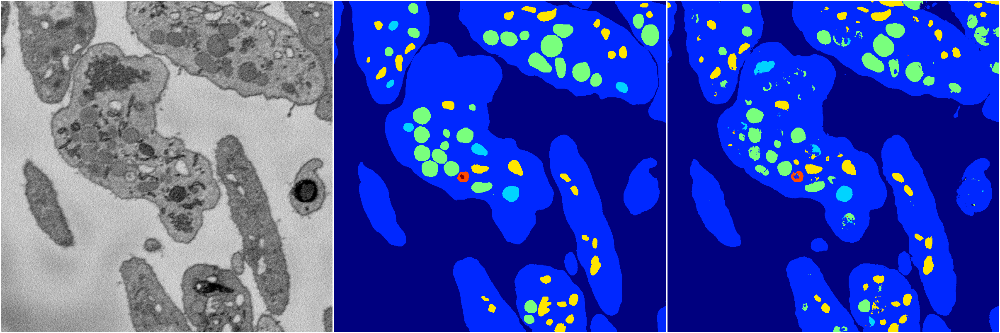

[Back](..)&nbsp;&nbsp;&nbsp;&nbsp;&nbsp;[Home](https://leapmanlab.github.io/snapshots)

---

<a href="1"><h2>random_hybrid_3d / 0424 / 110 / 1</h2></a>
Created 07 May 2019, 11:57:09

<i>Click for more details</i>

**ari**: 0.8317. **miou**: 0.6274. **accuracy**: 0.9384. **n_params**: 49096817.0000. 

---

<a href="0"><h2>random_hybrid_3d / 0424 / 110 / 0</h2></a>
Created 07 May 2019, 11:57:09

<i>Click for more details</i>

**ari**: 0.8305. **miou**: 0.6097. **accuracy**: 0.9377. **n_params**: 49096817.0000. 

---

[Back](..)&nbsp;&nbsp;&nbsp;&nbsp;&nbsp;[Home](https://leapmanlab.github.io/snapshots)

---