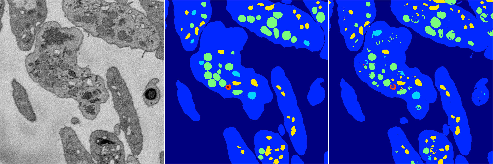

[Back](..)&nbsp;&nbsp;&nbsp;&nbsp;&nbsp;[Home](https://leapmanlab.github.io/snapshots)

---

<a href="1"><h2>random_hybrid_3d / 0424 / 121 / 1</h2></a>
Created 07 May 2019, 11:57:09

<i>Click for more details</i>

**ari**: 0.8305. **miou**: 0.6177. **accuracy**: 0.9374. **n_params**: 123145.0000. 

---

<a href="0"><h2>random_hybrid_3d / 0424 / 121 / 0</h2></a>
Created 07 May 2019, 11:57:09

<i>Click for more details</i>

**ari**: 0.8293. **miou**: 0.6273. **accuracy**: 0.9372. **n_params**: 122501.0000. 

---

[Back](..)&nbsp;&nbsp;&nbsp;&nbsp;&nbsp;[Home](https://leapmanlab.github.io/snapshots)

---