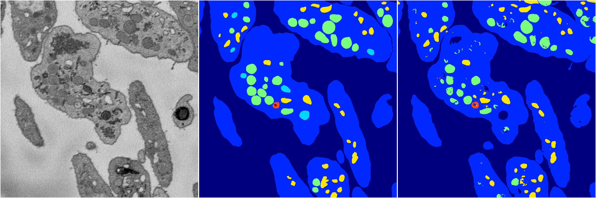
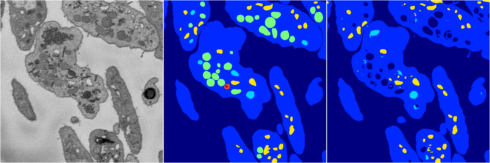

[Back](..)&nbsp;&nbsp;&nbsp;&nbsp;&nbsp;[Home](https://leapmanlab.github.io/snapshots)

---

<a href="1"><h2>random_hybrid_3d / 0424 / 127 / 1</h2></a>
Created 07 May 2019, 10:53:22

<i>Click for more details</i>

**ari**: 0.8188. **miou**: 0.4764. **accuracy**: 0.9317. **n_params**: 29581.0000. 

---

<a href="0"><h2>random_hybrid_3d / 0424 / 127 / 0</h2></a>
Created 07 May 2019, 10:53:22

<i>Click for more details</i>

**ari**: 0.7841. **miou**: 0.4091. **accuracy**: 0.9175. **n_params**: 29581.0000. 

---

[Back](..)&nbsp;&nbsp;&nbsp;&nbsp;&nbsp;[Home](https://leapmanlab.github.io/snapshots)

---