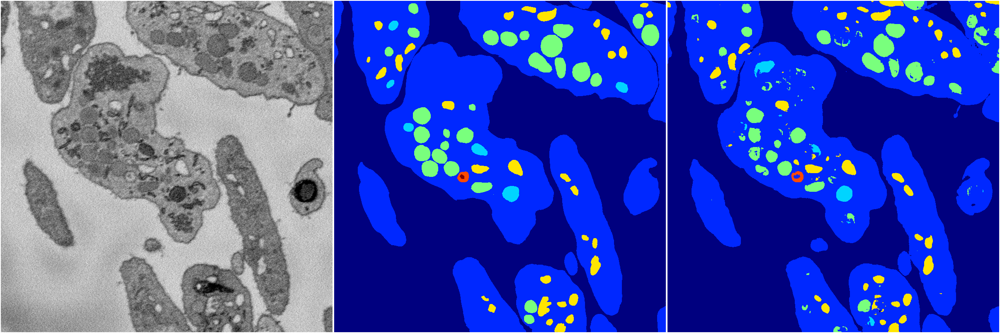

[Back](..)&nbsp;&nbsp;&nbsp;&nbsp;&nbsp;[Home](https://leapmanlab.github.io/snapshots)

---

<a href="1"><h2>random_hybrid_3d / 0424 / 135 / 1</h2></a>
Created 07 May 2019, 11:57:10

<i>Click for more details</i>

**ari**: 0.8277. **miou**: 0.6193. **accuracy**: 0.9362. **n_params**: 1347435.0000. 

---

<a href="0"><h2>random_hybrid_3d / 0424 / 135 / 0</h2></a>
Created 07 May 2019, 11:57:10

<i>Click for more details</i>

**ari**: 0.8302. **miou**: 0.6138. **accuracy**: 0.9375. **n_params**: 1348191.0000. 

---

[Back](..)&nbsp;&nbsp;&nbsp;&nbsp;&nbsp;[Home](https://leapmanlab.github.io/snapshots)

---