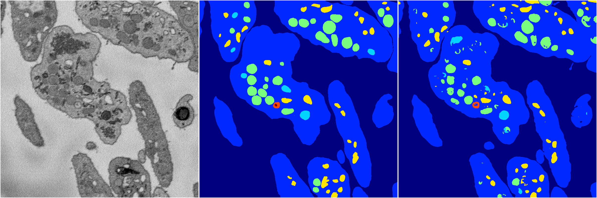
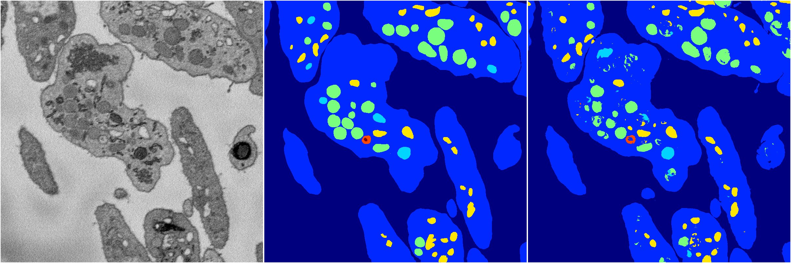

[Back](..)&nbsp;&nbsp;&nbsp;&nbsp;&nbsp;[Home](https://leapmanlab.github.io/snapshots)

---

<a href="1"><h2>random_hybrid_3d / 0424 / 206 / 1</h2></a>
Created 07 May 2019, 11:57:13

<i>Click for more details</i>

**ari**: 0.8289. **miou**: 0.6239. **accuracy**: 0.9368. **n_params**: 1075059.0000. 

---

<a href="0"><h2>random_hybrid_3d / 0424 / 206 / 0</h2></a>
Created 07 May 2019, 11:57:13

<i>Click for more details</i>

**ari**: 0.8270. **miou**: 0.6180. **accuracy**: 0.9362. **n_params**: 1075059.0000. 

---

[Back](..)&nbsp;&nbsp;&nbsp;&nbsp;&nbsp;[Home](https://leapmanlab.github.io/snapshots)

---