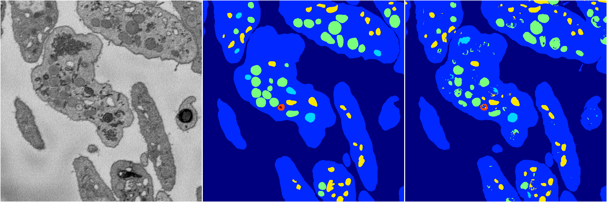

[Back](..)&nbsp;&nbsp;&nbsp;&nbsp;&nbsp;[Home](https://leapmanlab.github.io/snapshots)

---

<a href="1"><h2>random_hybrid_3d / 0424 / 215 / 1</h2></a>
Created 07 May 2019, 10:53:27

<i>Click for more details</i>

**ari**: 0.8288. **miou**: 0.6228. **accuracy**: 0.9366. **n_params**: 13238186.0000. 

---

<a href="0"><h2>random_hybrid_3d / 0424 / 215 / 0</h2></a>
Created 07 May 2019, 10:53:27

<i>Click for more details</i>

**ari**: 0.8285. **miou**: 0.6123. **accuracy**: 0.9371. **n_params**: 13238963.0000. 

---

[Back](..)&nbsp;&nbsp;&nbsp;&nbsp;&nbsp;[Home](https://leapmanlab.github.io/snapshots)

---