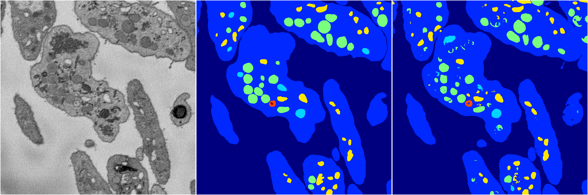

[Back](..)&nbsp;&nbsp;&nbsp;&nbsp;&nbsp;[Home](https://leapmanlab.github.io/snapshots)

---

<a href="1"><h2>random_hybrid_3d / 0424 / 242 / 1</h2></a>
Created 07 May 2019, 10:53:29

<i>Click for more details</i>

**ari**: 0.8273. **miou**: 0.6206. **accuracy**: 0.9361. **n_params**: 1551406.0000. 

---

<a href="0"><h2>random_hybrid_3d / 0424 / 242 / 0</h2></a>
Created 07 May 2019, 10:53:29

<i>Click for more details</i>

**ari**: 0.8290. **miou**: 0.6173. **accuracy**: 0.9367. **n_params**: 1550398.0000. 

---

[Back](..)&nbsp;&nbsp;&nbsp;&nbsp;&nbsp;[Home](https://leapmanlab.github.io/snapshots)

---