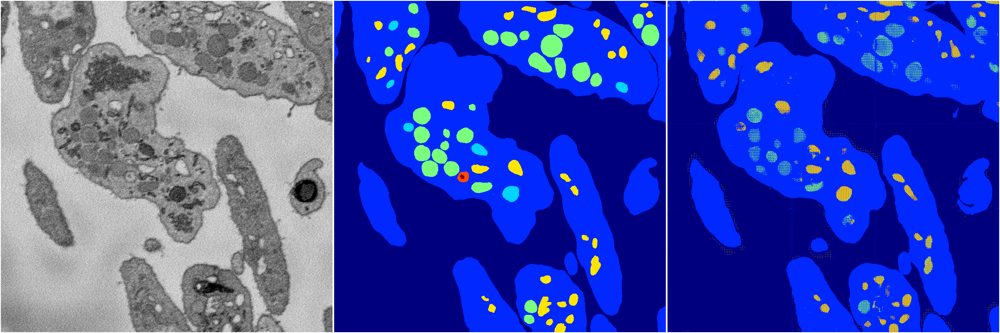
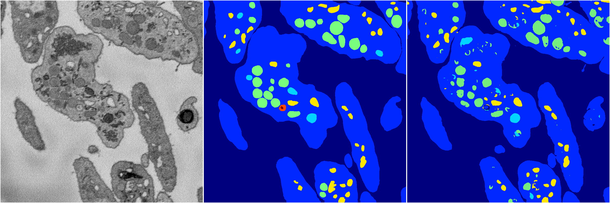

[Back](..)&nbsp;&nbsp;&nbsp;&nbsp;&nbsp;[Home](https://leapmanlab.github.io/snapshots)

---

<a href="0"><h2>random_hybrid_3d / 0424 / 270 / 0</h2></a>
Created 07 May 2019, 10:53:30

<i>Click for more details</i>

**ari**: 0.7781. **miou**: 0.3437. **accuracy**: 0.9080. **n_params**: 423852.0000. 

---

<a href="1"><h2>random_hybrid_3d / 0424 / 270 / 1</h2></a>
Created 07 May 2019, 10:53:30

<i>Click for more details</i>

**ari**: 0.8250. **miou**: 0.4845. **accuracy**: 0.9350. **n_params**: 423852.0000. 

---

[Back](..)&nbsp;&nbsp;&nbsp;&nbsp;&nbsp;[Home](https://leapmanlab.github.io/snapshots)

---