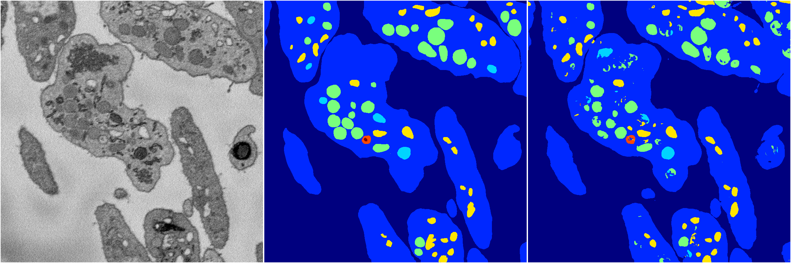

[Back](..)&nbsp;&nbsp;&nbsp;&nbsp;&nbsp;[Home](https://leapmanlab.github.io/snapshots)

---

<a href="1"><h2>random_hybrid_3d / 0424 / 33 / 1</h2></a>
Created 25 Apr 2019, 13:51:10

<i>Click for more details</i>

**ari**: 0.8289. **miou**: 0.6196. **accuracy**: 0.9369. **n_params**: 1958829.0000. 

---

<a href="0"><h2>random_hybrid_3d / 0424 / 33 / 0</h2></a>
Created 25 Apr 2019, 13:51:10

<i>Click for more details</i>

**ari**: 0.8291. **miou**: 0.5426. **accuracy**: 0.9369. **n_params**: 1960278.0000. 

---

[Back](..)&nbsp;&nbsp;&nbsp;&nbsp;&nbsp;[Home](https://leapmanlab.github.io/snapshots)

---