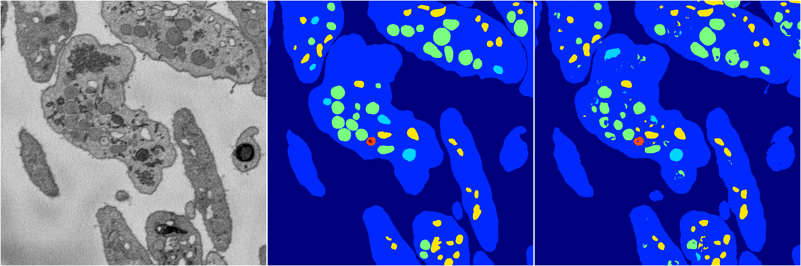

[Back](..)&nbsp;&nbsp;&nbsp;&nbsp;&nbsp;[Home](https://leapmanlab.github.io/snapshots)

---

<a href="1"><h2>random_hybrid_3d / 0424 / 45 / 1</h2></a>
Created 29 Apr 2019, 14:49:43

<i>Click for more details</i>

**ari**: 0.8155. **miou**: 0.4603. **accuracy**: 0.9298. **n_params**: 20264211.0000. 

---

<a href="0"><h2>random_hybrid_3d / 0424 / 45 / 0</h2></a>
Created 29 Apr 2019, 14:49:43

<i>Click for more details</i>

**ari**: 0.8312. **miou**: 0.6207. **accuracy**: 0.9380. **n_params**: 20261775.0000. 

---

[Back](..)&nbsp;&nbsp;&nbsp;&nbsp;&nbsp;[Home](https://leapmanlab.github.io/snapshots)

---