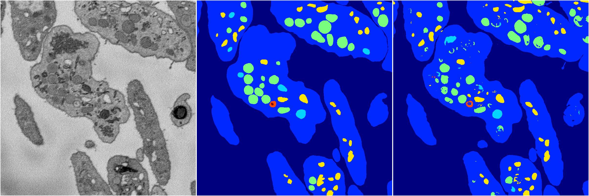

[Back](..)&nbsp;&nbsp;&nbsp;&nbsp;&nbsp;[Home](https://leapmanlab.github.io/snapshots)

---

<a href="1"><h2>random_hybrid_3d / 0424 / 72 / 1</h2></a>
Created 29 Apr 2019, 14:49:44

<i>Click for more details</i>

**ari**: 0.8293. **miou**: 0.6174. **accuracy**: 0.9368. **n_params**: 25095.0000. 

---

<a href="0"><h2>random_hybrid_3d / 0424 / 72 / 0</h2></a>
Created 29 Apr 2019, 14:49:44

<i>Click for more details</i>

**ari**: 0.8290. **miou**: 0.6255. **accuracy**: 0.9371. **n_params**: 25095.0000. 

---

[Back](..)&nbsp;&nbsp;&nbsp;&nbsp;&nbsp;[Home](https://leapmanlab.github.io/snapshots)

---