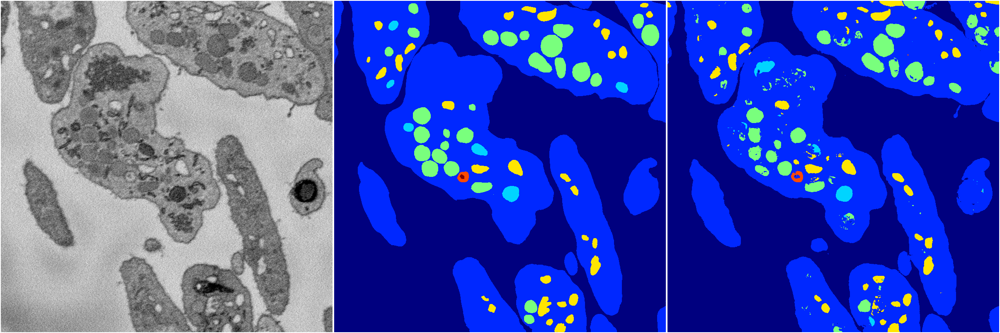
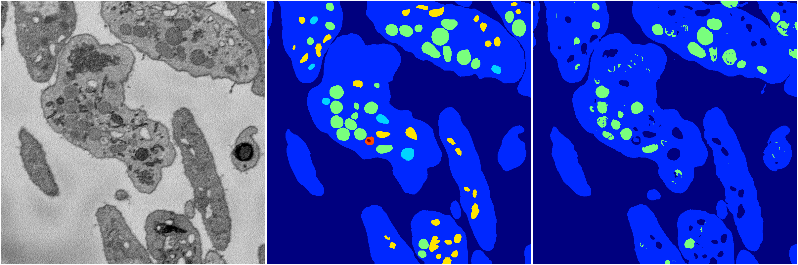

[Back](..)&nbsp;&nbsp;&nbsp;&nbsp;&nbsp;[Home](https://leapmanlab.github.io/snapshots)

---

<a href="37"><h2>random_hybrid_3d / 0424 / 37</h2></a>
Created 25 Apr 2019, 13:51:10

<i>Click image for more details</i>

1 nets

**ari**: min 0.8181. max 0.8181. mean 0.8181.  ([best net](37/0))

**miou**: min 0.4747. max 0.4747. mean 0.4747.  ([best net](37/0))

**accuracy**: min 0.9308. max 0.9308. mean 0.9308.  ([best net](37/0))

**n_params**: min 67559.0000. max 67559.0000. mean 67559.0000.  ([best net](37/0))

---

<a href="36"><h2>random_hybrid_3d / 0424 / 36</h2></a>
Created 25 Apr 2019, 13:51:10

<i>Click image for more details</i>

2 nets

**ari**: min 0.8014. max 0.8294. mean 0.8154.  ([best net](36/0))

**miou**: min 0.4976. max 0.6199. mean 0.5587.  ([best net](36/0))

**accuracy**: min 0.9263. max 0.9369. mean 0.9316.  ([best net](36/0))

**n_params**: min 6279.0000. max 6279.0000. mean 6279.0000.  ([best net](36/0))

---

<a href="35"><h2>random_hybrid_3d / 0424 / 35</h2></a>
Created 25 Apr 2019, 13:51:10

<i>Click image for more details</i>

2 nets

**ari**: min -0.0000. max 0.8294. mean 0.4147.  ([best net](35/1))

**miou**: min 0.0678. max 0.6243. mean 0.3460.  ([best net](35/1))

**accuracy**: min 0.4743. max 0.9369. mean 0.7056.  ([best net](35/1))

**n_params**: min 1287559.0000. max 1287559.0000. mean 1287559.0000.  ([best net](35/0))

---

<a href="34"><h2>random_hybrid_3d / 0424 / 34</h2></a>
Created 25 Apr 2019, 13:51:10

<i>Click image for more details</i>

2 nets

**ari**: min 0.8274. max 0.8293. mean 0.8283.  ([best net](34/1))

**miou**: min 0.5213. max 0.5364. mean 0.5288.  ([best net](34/1))

**accuracy**: min 0.9363. max 0.9371. mean 0.9367.  ([best net](34/1))

**n_params**: min 5045157.0000. max 5045157.0000. mean 5045157.0000.  ([best net](34/0))

---

<a href="33"><h2>random_hybrid_3d / 0424 / 33</h2></a>
Created 25 Apr 2019, 13:51:10

<i>Click image for more details</i>

2 nets

**ari**: min 0.8289. max 0.8291. mean 0.8290.  ([best net](33/0))

**miou**: min 0.5426. max 0.6196. mean 0.5811.  ([best net](33/1))

**accuracy**: min 0.9369. max 0.9369. mean 0.9369.  ([best net](33/0))

**n_params**: min 1958829.0000. max 1960278.0000. mean 1959553.5000.  ([best net](33/0))

---

<a href="30"><h2>random_hybrid_3d / 0424 / 30</h2></a>
Created 25 Apr 2019, 13:51:10

<i>Click image for more details</i>

2 nets

**ari**: min 0.8297. max 0.8297. mean 0.8297.  ([best net](30/0))

**miou**: min 0.5533. max 0.6170. mean 0.5852.  ([best net](30/0))

**accuracy**: min 0.9369. max 0.9372. mean 0.9370.  ([best net](30/1))

**n_params**: min 5468306.0000. max 5469433.0000. mean 5468869.5000.  ([best net](30/0))

---

<a href="32"><h2>random_hybrid_3d / 0424 / 32</h2></a>
Created 25 Apr 2019, 13:51:10

<i>Click image for more details</i>

2 nets

**ari**: min 0.8298. max 0.8304. mean 0.8301.  ([best net](32/0))

**miou**: min 0.6204. max 0.6234. mean 0.6219.  ([best net](32/1))

**accuracy**: min 0.9371. max 0.9377. mean 0.9374.  ([best net](32/0))

**n_params**: min 33390.0000. max 33684.0000. mean 33537.0000.  ([best net](32/1))

---

<a href="31"><h2>random_hybrid_3d / 0424 / 31</h2></a>
Created 25 Apr 2019, 13:51:10

<i>Click image for more details</i>

2 nets

**ari**: min 0.8026. max 0.8291. mean 0.8158.  ([best net](31/0))

**miou**: min 0.4200. max 0.6227. mean 0.5213.  ([best net](31/0))

**accuracy**: min 0.9267. max 0.9368. mean 0.9318.  ([best net](31/0))

**n_params**: min 132241.0000. max 132241.0000. mean 132241.0000.  ([best net](31/1))

---

<a href="29"><h2>random_hybrid_3d / 0424 / 29</h2></a>
Created 25 Apr 2019, 13:51:10

<i>Click image for more details</i>

2 nets

**ari**: min 0.8281. max 0.8282. mean 0.8281.  ([best net](29/1))

**miou**: min 0.6145. max 0.6182. mean 0.6163.  ([best net](29/1))

**accuracy**: min 0.9362. max 0.9369. mean 0.9366.  ([best net](29/1))

**n_params**: min 2636722.0000. max 2637058.0000. mean 2636890.0000.  ([best net](29/1))

---

<a href="28"><h2>random_hybrid_3d / 0424 / 28</h2></a>
Created 25 Apr 2019, 13:51:10

<i>Click image for more details</i>

2 nets

**ari**: min 0.7796. max 0.8161. mean 0.7978.  ([best net](28/1))

**miou**: min 0.3262. max 0.4217. mean 0.3739.  ([best net](28/1))

**accuracy**: min 0.9137. max 0.9301. mean 0.9219.  ([best net](28/1))

**n_params**: min 619087.0000. max 619087.0000. mean 619087.0000.  ([best net](28/0))

---

<a href="27"><h2>random_hybrid_3d / 0424 / 27</h2></a>
Created 25 Apr 2019, 13:51:10

<i>Click image for more details</i>

2 nets

**ari**: min 0.8004. max 0.8278. mean 0.8141.  ([best net](27/0))

**miou**: min 0.4186. max 0.6003. mean 0.5095.  ([best net](27/0))

**accuracy**: min 0.9256. max 0.9361. mean 0.9309.  ([best net](27/0))

**n_params**: min 655939.0000. max 655939.0000. mean 655939.0000.  ([best net](27/0))

---

<a href="26"><h2>random_hybrid_3d / 0424 / 26</h2></a>
Created 25 Apr 2019, 13:51:09

<i>Click image for more details</i>

2 nets

**ari**: min 0.8285. max 0.8285. mean 0.8285.  ([best net](26/0))

**miou**: min 0.6175. max 0.6230. mean 0.6202.  ([best net](26/1))

**accuracy**: min 0.9365. max 0.9370. mean 0.9368.  ([best net](26/0))

**n_params**: min 14134796.0000. max 14137169.0000. mean 14135982.5000.  ([best net](26/1))

---

<a href="25"><h2>random_hybrid_3d / 0424 / 25</h2></a>
Created 25 Apr 2019, 13:51:09

<i>Click image for more details</i>

2 nets

**ari**: min 0.8295. max 0.8301. mean 0.8298.  ([best net](25/0))

**miou**: min 0.5447. max 0.6140. mean 0.5794.  ([best net](25/0))

**accuracy**: min 0.9366. max 0.9375. mean 0.9371.  ([best net](25/0))

**n_params**: min 2771783.0000. max 2771783.0000. mean 2771783.0000.  ([best net](25/0))

---

<a href="12"><h2>random_hybrid_3d / 0424 / 12</h2></a>
Created 25 Apr 2019, 13:51:09

<i>Click image for more details</i>

2 nets

**ari**: min 0.8289. max 0.8292. mean 0.8290.  ([best net](12/0))

**miou**: min 0.5454. max 0.6034. mean 0.5744.  ([best net](12/0))

**accuracy**: min 0.9374. max 0.9377. mean 0.9375.  ([best net](12/0))

**n_params**: min 24093772.0000. max 24093772.0000. mean 24093772.0000.  ([best net](12/1))

---

<a href="24"><h2>random_hybrid_3d / 0424 / 24</h2></a>
Created 25 Apr 2019, 13:51:09

<i>Click image for more details</i>

2 nets

**ari**: min 0.8271. max 0.8294. mean 0.8283.  ([best net](24/1))

**miou**: min 0.5422. max 0.6217. mean 0.5819.  ([best net](24/1))

**accuracy**: min 0.9364. max 0.9370. mean 0.9367.  ([best net](24/1))

**n_params**: min 8620055.0000. max 8620055.0000. mean 8620055.0000.  ([best net](24/0))

---

<a href="23"><h2>random_hybrid_3d / 0424 / 23</h2></a>
Created 25 Apr 2019, 13:51:09

<i>Click image for more details</i>

2 nets

**ari**: min 0.8282. max 0.8296. mean 0.8289.  ([best net](23/0))

**miou**: min 0.6134. max 0.6143. mean 0.6138.  ([best net](23/1))

**accuracy**: min 0.9369. max 0.9373. mean 0.9371.  ([best net](23/0))

**n_params**: min 5979673.0000. max 5979673.0000. mean 5979673.0000.  ([best net](23/1))

---

<a href="18"><h2>random_hybrid_3d / 0424 / 18</h2></a>
Created 25 Apr 2019, 13:51:09

<i>Click image for more details</i>

2 nets

**ari**: min 0.8288. max 0.8296. mean 0.8292.  ([best net](18/1))

**miou**: min 0.6143. max 0.6213. mean 0.6178.  ([best net](18/1))

**accuracy**: min 0.9372. max 0.9378. mean 0.9375.  ([best net](18/1))

**n_params**: min 12403882.0000. max 12403882.0000. mean 12403882.0000.  ([best net](18/1))

---

<a href="14"><h2>random_hybrid_3d / 0424 / 14</h2></a>
Created 25 Apr 2019, 13:51:09

<i>Click image for more details</i>

2 nets

**ari**: min 0.8265. max 0.8277. mean 0.8271.  ([best net](14/1))

**miou**: min 0.6070. max 0.6189. mean 0.6129.  ([best net](14/1))

**accuracy**: min 0.9360. max 0.9367. mean 0.9364.  ([best net](14/1))

**n_params**: min 3294611.0000. max 3294611.0000. mean 3294611.0000.  ([best net](14/0))

---

<a href="21"><h2>random_hybrid_3d / 0424 / 21</h2></a>
Created 25 Apr 2019, 13:51:09

<i>Click image for more details</i>

2 nets

**ari**: min 0.8282. max 0.8283. mean 0.8282.  ([best net](21/1))

**miou**: min 0.6214. max 0.6236. mean 0.6225.  ([best net](21/1))

**accuracy**: min 0.9368. max 0.9369. mean 0.9368.  ([best net](21/0))

**n_params**: min 2640946.0000. max 2641527.0000. mean 2641236.5000.  ([best net](21/1))

---

<a href="17"><h2>random_hybrid_3d / 0424 / 17</h2></a>
Created 25 Apr 2019, 13:51:09

<i>Click image for more details</i>

2 nets

**ari**: min 0.8292. max 0.8301. mean 0.8296.  ([best net](17/0))

**miou**: min 0.5447. max 0.6180. mean 0.5814.  ([best net](17/0))

**accuracy**: min 0.9369. max 0.9375. mean 0.9372.  ([best net](17/0))

**n_params**: min 4278971.0000. max 4278971.0000. mean 4278971.0000.  ([best net](17/1))

---

<a href="22"><h2>random_hybrid_3d / 0424 / 22</h2></a>
Created 25 Apr 2019, 13:51:08

<i>Click image for more details</i>

2 nets

**ari**: min 0.8287. max 0.8295. mean 0.8291.  ([best net](22/1))

**miou**: min 0.6011. max 0.6300. mean 0.6155.  ([best net](22/1))

**accuracy**: min 0.9364. max 0.9370. mean 0.9367.  ([best net](22/1))

**n_params**: min 2036284.0000. max 2036284.0000. mean 2036284.0000.  ([best net](22/1))

---

<a href="20"><h2>random_hybrid_3d / 0424 / 20</h2></a>
Created 25 Apr 2019, 13:51:08

<i>Click image for more details</i>

2 nets

**ari**: min 0.8289. max 0.8289. mean 0.8289.  ([best net](20/1))

**miou**: min 0.6206. max 0.6227. mean 0.6217.  ([best net](20/1))

**accuracy**: min 0.9368. max 0.9372. mean 0.9370.  ([best net](20/0))

**n_params**: min 6143510.0000. max 6143510.0000. mean 6143510.0000.  ([best net](20/1))

---

<a href="7"><h2>random_hybrid_3d / 0424 / 7</h2></a>
Created 25 Apr 2019, 13:51:08

<i>Click image for more details</i>

1 nets

**ari**: min 0.7820. max 0.7820. mean 0.7820.  ([best net](7/0))

**miou**: min 0.3287. max 0.3287. mean 0.3287.  ([best net](7/0))

**accuracy**: min 0.9150. max 0.9150. mean 0.9150.  ([best net](7/0))

**n_params**: min 15241070.0000. max 15241070.0000. mean 15241070.0000.  ([best net](7/0))

---

<a href="15"><h2>random_hybrid_3d / 0424 / 15</h2></a>
Created 25 Apr 2019, 13:51:08

<i>Click image for more details</i>

2 nets

**ari**: min 0.8144. max 0.8282. mean 0.8213.  ([best net](15/1))

**miou**: min 0.5673. max 0.5771. mean 0.5722.  ([best net](15/0))

**accuracy**: min 0.9303. max 0.9362. mean 0.9332.  ([best net](15/1))

**n_params**: min 7511612.0000. max 7512578.0000. mean 7512095.0000.  ([best net](15/1))

---

<a href="19"><h2>random_hybrid_3d / 0424 / 19</h2></a>
Created 25 Apr 2019, 13:51:08

<i>Click image for more details</i>

2 nets

**ari**: min 0.8293. max 0.8299. mean 0.8296.  ([best net](19/1))

**miou**: min 0.6235. max 0.6240. mean 0.6238.  ([best net](19/0))

**accuracy**: min 0.9369. max 0.9371. mean 0.9370.  ([best net](19/1))

**n_params**: min 642435.0000. max 642435.0000. mean 642435.0000.  ([best net](19/0))

---

<a href="13"><h2>random_hybrid_3d / 0424 / 13</h2></a>
Created 25 Apr 2019, 13:51:08

<i>Click image for more details</i>

2 nets

**ari**: min 0.8273. max 0.8295. mean 0.8284.  ([best net](13/1))

**miou**: min 0.6183. max 0.6233. mean 0.6208.  ([best net](13/1))

**accuracy**: min 0.9359. max 0.9369. mean 0.9364.  ([best net](13/1))

**n_params**: min 1327957.0000. max 1329595.0000. mean 1328776.0000.  ([best net](13/1))

---

<a href="16"><h2>random_hybrid_3d / 0424 / 16</h2></a>
Created 25 Apr 2019, 13:51:08

<i>Click image for more details</i>

2 nets

**ari**: min 0.8305. max 0.8315. mean 0.8310.  ([best net](16/0))

**miou**: min 0.6149. max 0.6262. mean 0.6206.  ([best net](16/0))

**accuracy**: min 0.9373. max 0.9381. mean 0.9377.  ([best net](16/0))

**n_params**: min 571580.0000. max 571748.0000. mean 571664.0000.  ([best net](16/0))

---

<a href="10"><h2>random_hybrid_3d / 0424 / 10</h2></a>
Created 25 Apr 2019, 13:51:08

<i>Click image for more details</i>

2 nets

**ari**: min 0.8294. max 0.8302. mean 0.8298.  ([best net](10/0))

**miou**: min 0.6214. max 0.6236. mean 0.6225.  ([best net](10/0))

**accuracy**: min 0.9371. max 0.9375. mean 0.9373.  ([best net](10/0))

**n_params**: min 1722346.0000. max 1722346.0000. mean 1722346.0000.  ([best net](10/1))

---

<a href="11"><h2>random_hybrid_3d / 0424 / 11</h2></a>
Created 25 Apr 2019, 13:51:08

<i>Click image for more details</i>

2 nets

**ari**: min 0.8296. max 0.8298. mean 0.8297.  ([best net](11/0))

**miou**: min 0.5458. max 0.6193. mean 0.5825.  ([best net](11/1))

**accuracy**: min 0.9367. max 0.9373. mean 0.9370.  ([best net](11/0))

**n_params**: min 505867.0000. max 505867.0000. mean 505867.0000.  ([best net](11/0))

---

<a href="6"><h2>random_hybrid_3d / 0424 / 6</h2></a>
Created 25 Apr 2019, 13:51:08

<i>Click image for more details</i>

2 nets

**ari**: min 0.8176. max 0.8294. mean 0.8235.  ([best net](6/1))

**miou**: min 0.4703. max 0.6174. mean 0.5439.  ([best net](6/1))

**accuracy**: min 0.9311. max 0.9368. mean 0.9339.  ([best net](6/1))

**n_params**: min 7860929.0000. max 7860929.0000. mean 7860929.0000.  ([best net](6/0))

---

<a href="8"><h2>random_hybrid_3d / 0424 / 8</h2></a>
Created 25 Apr 2019, 13:51:08

<i>Click image for more details</i>

2 nets

**ari**: min 0.8293. max 0.8298. mean 0.8295.  ([best net](8/1))

**miou**: min 0.5434. max 0.6214. mean 0.5824.  ([best net](8/1))

**accuracy**: min 0.9368. max 0.9376. mean 0.9372.  ([best net](8/1))

**n_params**: min 319587.0000. max 319587.0000. mean 319587.0000.  ([best net](8/0))

---

<a href="5"><h2>random_hybrid_3d / 0424 / 5</h2></a>
Created 25 Apr 2019, 13:51:07

<i>Click image for more details</i>

2 nets

**ari**: min 0.8287. max 0.8311. mean 0.8299.  ([best net](5/0))

**miou**: min 0.6174. max 0.6261. mean 0.6218.  ([best net](5/0))

**accuracy**: min 0.9370. max 0.9380. mean 0.9375.  ([best net](5/0))

**n_params**: min 9994161.0000. max 9996450.0000. mean 9995305.5000.  ([best net](5/0))

---

<a href="9"><h2>random_hybrid_3d / 0424 / 9</h2></a>
Created 25 Apr 2019, 13:51:07

<i>Click image for more details</i>

2 nets

**ari**: min 0.8291. max 0.8294. mean 0.8292.  ([best net](9/0))

**miou**: min 0.5463. max 0.6323. mean 0.5893.  ([best net](9/0))

**accuracy**: min 0.9372. max 0.9372. mean 0.9372.  ([best net](9/0))

**n_params**: min 134409.0000. max 134409.0000. mean 134409.0000.  ([best net](9/1))

---

<a href="0"><h2>random_hybrid_3d / 0424 / 0</h2></a>
Created 25 Apr 2019, 13:51:07

<i>Click image for more details</i>

2 nets

**ari**: min 0.8296. max 0.8298. mean 0.8297.  ([best net](0/1))

**miou**: min 0.6187. max 0.6198. mean 0.6192.  ([best net](0/1))

**accuracy**: min 0.9372. max 0.9372. mean 0.9372.  ([best net](0/0))

**n_params**: min 5528195.0000. max 5529980.0000. mean 5529087.5000.  ([best net](0/0))

---

<a href="3"><h2>random_hybrid_3d / 0424 / 3</h2></a>
Created 25 Apr 2019, 13:51:07

<i>Click image for more details</i>

2 nets

**ari**: min 0.8289. max 0.8305. mean 0.8297.  ([best net](3/1))

**miou**: min 0.6178. max 0.6196. mean 0.6187.  ([best net](3/1))

**accuracy**: min 0.9366. max 0.9376. mean 0.9371.  ([best net](3/1))

**n_params**: min 2222476.0000. max 2222476.0000. mean 2222476.0000.  ([best net](3/0))

---

<a href="2"><h2>random_hybrid_3d / 0424 / 2</h2></a>
Created 25 Apr 2019, 13:51:07

<i>Click image for more details</i>

2 nets

**ari**: min 0.8288. max 0.8289. mean 0.8289.  ([best net](2/1))

**miou**: min 0.5400. max 0.6229. mean 0.5814.  ([best net](2/1))

**accuracy**: min 0.9368. max 0.9370. mean 0.9369.  ([best net](2/1))

**n_params**: min 559546.0000. max 559868.0000. mean 559707.0000.  ([best net](2/0))

---

<a href="1"><h2>random_hybrid_3d / 0424 / 1</h2></a>
Created 25 Apr 2019, 13:51:07

<i>Click image for more details</i>

2 nets

**ari**: min 0.8286. max 0.8293. mean 0.8290.  ([best net](1/1))

**miou**: min 0.6194. max 0.6207. mean 0.6200.  ([best net](1/0))

**accuracy**: min 0.9366. max 0.9370. mean 0.9368.  ([best net](1/1))

**n_params**: min 319736.0000. max 320800.0000. mean 320268.0000.  ([best net](1/1))

---

<a href="4"><h2>random_hybrid_3d / 0424 / 4</h2></a>
Created 25 Apr 2019, 13:51:06

<i>Click image for more details</i>

2 nets

**ari**: min 0.0721. max 0.8286. mean 0.4504.  ([best net](4/1))

**miou**: min 0.1945. max 0.6159. mean 0.4052.  ([best net](4/1))

**accuracy**: min 0.5592. max 0.9364. mean 0.7478.  ([best net](4/1))

**n_params**: min 166721.0000. max 166721.0000. mean 166721.0000.  ([best net](4/0))

---

[Back](..)&nbsp;&nbsp;&nbsp;&nbsp;&nbsp;[Home](https://leapmanlab.github.io/snapshots)

---