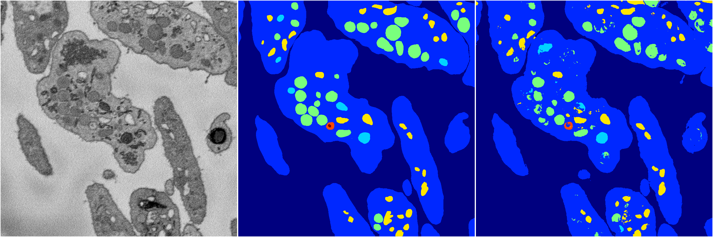
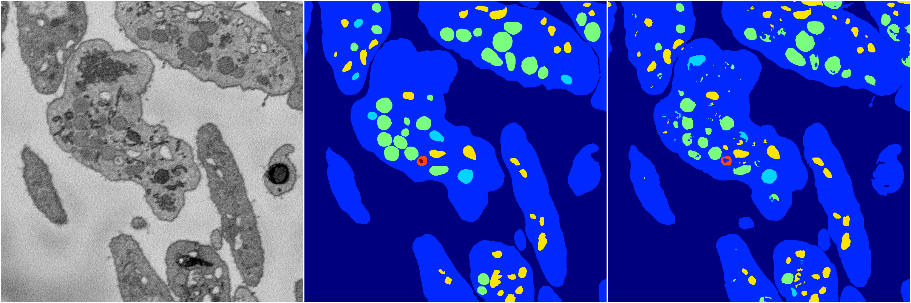
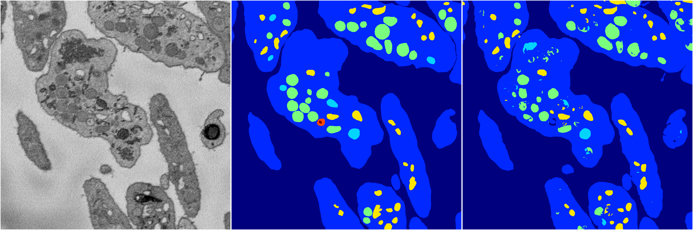
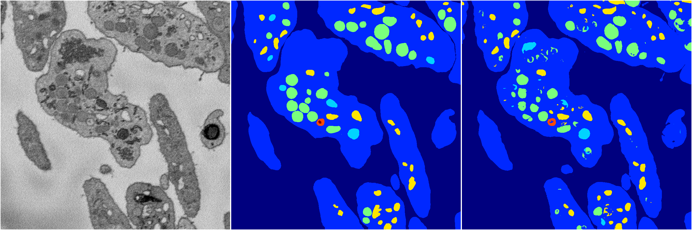
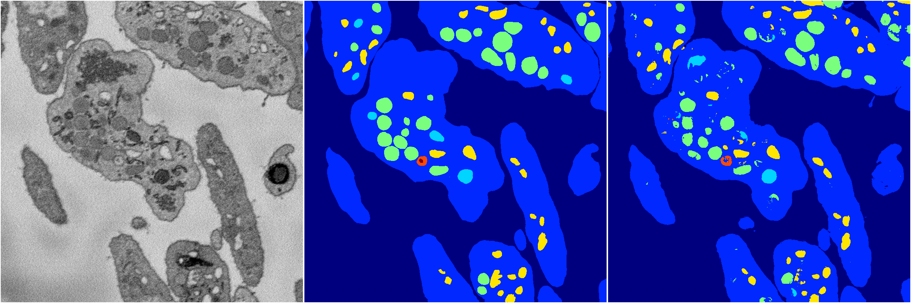

[Back](..)&nbsp;&nbsp;&nbsp;&nbsp;&nbsp;[Home](https://leapmanlab.github.io/snapshots)

---

<a href="299"><h2>random_hybrid_3d / 0424 / 299</h2></a>
Created 07 May 2019, 10:53:31

<i>Click image for more details</i>

2 nets

**ari**: min 0.8291. max 0.8291. mean 0.8291.  ([best net](299/0))

**miou**: min 0.6194. max 0.6215. mean 0.6205.  ([best net](299/0))

**accuracy**: min 0.9367. max 0.9367. mean 0.9367.  ([best net](299/1))

**n_params**: min 165843.0000. max 166375.0000. mean 166109.0000.  ([best net](299/0))

---

<a href="298"><h2>random_hybrid_3d / 0424 / 298</h2></a>
Created 07 May 2019, 10:53:31

<i>Click image for more details</i>

2 nets

**ari**: min 0.8291. max 0.8295. mean 0.8293.  ([best net](298/1))

**miou**: min 0.6202. max 0.6213. mean 0.6208.  ([best net](298/0))

**accuracy**: min 0.9371. max 0.9373. mean 0.9372.  ([best net](298/1))

**n_params**: min 105743.0000. max 105743.0000. mean 105743.0000.  ([best net](298/0))

---

<a href="297"><h2>random_hybrid_3d / 0424 / 297</h2></a>
Created 07 May 2019, 10:53:31

<i>Click image for more details</i>

2 nets

**ari**: min 0.1571. max 0.8284. mean 0.4928.  ([best net](297/1))

**miou**: min 0.3502. max 0.5419. mean 0.4461.  ([best net](297/1))

**accuracy**: min 0.5221. max 0.9365. mean 0.7293.  ([best net](297/1))

**n_params**: min 11655.0000. max 11655.0000. mean 11655.0000.  ([best net](297/0))

---

<a href="296"><h2>random_hybrid_3d / 0424 / 296</h2></a>
Created 07 May 2019, 10:53:31

<i>Click image for more details</i>

2 nets

**ari**: min 0.8287. max 0.8300. mean 0.8293.  ([best net](296/0))

**miou**: min 0.6073. max 0.6170. mean 0.6121.  ([best net](296/1))

**accuracy**: min 0.9372. max 0.9374. mean 0.9373.  ([best net](296/0))

**n_params**: min 499315.0000. max 499315.0000. mean 499315.0000.  ([best net](296/0))

---

<a href="284"><h2>random_hybrid_3d / 0424 / 284</h2></a>
Created 07 May 2019, 10:53:31

<i>Click image for more details</i>

2 nets

**ari**: min 0.8286. max 0.8298. mean 0.8292.  ([best net](284/1))

**miou**: min 0.6131. max 0.6219. mean 0.6175.  ([best net](284/0))

**accuracy**: min 0.9364. max 0.9377. mean 0.9370.  ([best net](284/1))

**n_params**: min 15166911.0000. max 15169340.0000. mean 15168125.5000.  ([best net](284/1))

---

<a href="295"><h2>random_hybrid_3d / 0424 / 295</h2></a>
Created 07 May 2019, 10:53:31

<i>Click image for more details</i>

2 nets

**ari**: min 0.8287. max 0.8289. mean 0.8288.  ([best net](295/1))

**miou**: min 0.6166. max 0.6231. mean 0.6199.  ([best net](295/0))

**accuracy**: min 0.9369. max 0.9370. mean 0.9370.  ([best net](295/0))

**n_params**: min 847558.0000. max 848678.0000. mean 848118.0000.  ([best net](295/1))

---

<a href="294"><h2>random_hybrid_3d / 0424 / 294</h2></a>
Created 07 May 2019, 10:53:31

<i>Click image for more details</i>

2 nets

**ari**: min 0.8279. max 0.8293. mean 0.8286.  ([best net](294/0))

**miou**: min 0.6194. max 0.6247. mean 0.6221.  ([best net](294/0))

**accuracy**: min 0.9366. max 0.9370. mean 0.9368.  ([best net](294/0))

**n_params**: min 2790378.0000. max 2790378.0000. mean 2790378.0000.  ([best net](294/0))

---

<a href="292"><h2>random_hybrid_3d / 0424 / 292</h2></a>
Created 07 May 2019, 10:53:31

<i>Click image for more details</i>

2 nets

**ari**: min 0.8255. max 0.8293. mean 0.8274.  ([best net](292/0))

**miou**: min 0.5266. max 0.5429. mean 0.5348.  ([best net](292/0))

**accuracy**: min 0.9349. max 0.9367. mean 0.9358.  ([best net](292/0))

**n_params**: min 3221912.0000. max 3221912.0000. mean 3221912.0000.  ([best net](292/0))

---

<a href="293"><h2>random_hybrid_3d / 0424 / 293</h2></a>
Created 07 May 2019, 10:53:31

<i>Click image for more details</i>

2 nets

**ari**: min 0.8152. max 0.8292. mean 0.8222.  ([best net](293/1))

**miou**: min 0.5455. max 0.6193. mean 0.5824.  ([best net](293/1))

**accuracy**: min 0.9294. max 0.9369. mean 0.9331.  ([best net](293/1))

**n_params**: min 1576073.0000. max 1576073.0000. mean 1576073.0000.  ([best net](293/0))

---

<a href="291"><h2>random_hybrid_3d / 0424 / 291</h2></a>
Created 07 May 2019, 10:53:31

<i>Click image for more details</i>

2 nets

**ari**: min 0.7802. max 0.8278. mean 0.8040.  ([best net](291/0))

**miou**: min 0.3271. max 0.6209. mean 0.4740.  ([best net](291/0))

**accuracy**: min 0.9139. max 0.9363. mean 0.9251.  ([best net](291/0))

**n_params**: min 1630482.0000. max 1630482.0000. mean 1630482.0000.  ([best net](291/0))

---

<a href="282"><h2>random_hybrid_3d / 0424 / 282</h2></a>
Created 07 May 2019, 10:53:31

<i>Click image for more details</i>

2 nets

**ari**: min 0.8176. max 0.8299. mean 0.8237.  ([best net](282/0))

**miou**: min 0.5505. max 0.6282. mean 0.5893.  ([best net](282/0))

**accuracy**: min 0.9313. max 0.9372. mean 0.9342.  ([best net](282/0))

**n_params**: min 1641083.0000. max 1642756.0000. mean 1641919.5000.  ([best net](282/1))

---

<a href="287"><h2>random_hybrid_3d / 0424 / 287</h2></a>
Created 07 May 2019, 10:53:31

<i>Click image for more details</i>

2 nets

**ari**: min 0.7903. max 0.8302. mean 0.8102.  ([best net](287/0))

**miou**: min 0.3949. max 0.6228. mean 0.5089.  ([best net](287/0))

**accuracy**: min 0.9193. max 0.9374. mean 0.9283.  ([best net](287/0))

**n_params**: min 325330.0000. max 325330.0000. mean 325330.0000.  ([best net](287/1))

---

<a href="288"><h2>random_hybrid_3d / 0424 / 288</h2></a>
Created 07 May 2019, 10:53:31

<i>Click image for more details</i>

2 nets

**ari**: min 0.8266. max 0.8288. mean 0.8277.  ([best net](288/1))

**miou**: min 0.4899. max 0.6203. mean 0.5551.  ([best net](288/1))

**accuracy**: min 0.9355. max 0.9367. mean 0.9361.  ([best net](288/1))

**n_params**: min 253333.0000. max 253333.0000. mean 253333.0000.  ([best net](288/0))

---

<a href="290"><h2>random_hybrid_3d / 0424 / 290</h2></a>
Created 07 May 2019, 10:53:31

<i>Click image for more details</i>

2 nets

**ari**: min 0.8297. max 0.8302. mean 0.8300.  ([best net](290/1))

**miou**: min 0.6285. max 0.6339. mean 0.6312.  ([best net](290/0))

**accuracy**: min 0.9370. max 0.9377. mean 0.9374.  ([best net](290/1))

**n_params**: min 321937.0000. max 322539.0000. mean 322238.0000.  ([best net](290/1))

---

<a href="283"><h2>random_hybrid_3d / 0424 / 283</h2></a>
Created 07 May 2019, 10:53:31

<i>Click image for more details</i>

2 nets

**ari**: min 0.8276. max 0.8297. mean 0.8286.  ([best net](283/0))

**miou**: min 0.6169. max 0.6177. mean 0.6173.  ([best net](283/0))

**accuracy**: min 0.9361. max 0.9368. mean 0.9364.  ([best net](283/0))

**n_params**: min 1867827.0000. max 1870116.0000. mean 1868971.5000.  ([best net](283/0))

---

<a href="281"><h2>random_hybrid_3d / 0424 / 281</h2></a>
Created 07 May 2019, 10:53:31

<i>Click image for more details</i>

2 nets

**ari**: min 0.8293. max 0.8295. mean 0.8294.  ([best net](281/0))

**miou**: min 0.5420. max 0.6189. mean 0.5804.  ([best net](281/0))

**accuracy**: min 0.9369. max 0.9371. mean 0.9370.  ([best net](281/0))

**n_params**: min 113974.0000. max 113974.0000. mean 113974.0000.  ([best net](281/1))

---

<a href="285"><h2>random_hybrid_3d / 0424 / 285</h2></a>
Created 07 May 2019, 10:53:31

<i>Click image for more details</i>

2 nets

**ari**: min 0.8168. max 0.8304. mean 0.8236.  ([best net](285/0))

**miou**: min 0.4738. max 0.6217. mean 0.5478.  ([best net](285/0))

**accuracy**: min 0.9307. max 0.9375. mean 0.9341.  ([best net](285/0))

**n_params**: min 75999.0000. max 75999.0000. mean 75999.0000.  ([best net](285/0))

---

<a href="286"><h2>random_hybrid_3d / 0424 / 286</h2></a>
Created 07 May 2019, 10:53:31

<i>Click image for more details</i>

2 nets

**ari**: min 0.8134. max 0.8281. mean 0.8208.  ([best net](286/1))

**miou**: min 0.3998. max 0.6211. mean 0.5104.  ([best net](286/1))

**accuracy**: min 0.9307. max 0.9365. mean 0.9336.  ([best net](286/1))

**n_params**: min 31308.0000. max 31581.0000. mean 31444.5000.  ([best net](286/1))

---

<a href="289"><h2>random_hybrid_3d / 0424 / 289</h2></a>
Created 07 May 2019, 10:53:31

<i>Click image for more details</i>

2 nets

**ari**: min 0.7816. max 0.8263. mean 0.8039.  ([best net](289/1))

**miou**: min 0.4577. max 0.5669. mean 0.5123.  ([best net](289/1))

**accuracy**: min 0.9145. max 0.9358. mean 0.9252.  ([best net](289/1))

**n_params**: min 16249.0000. max 16249.0000. mean 16249.0000.  ([best net](289/1))

---

<a href="280"><h2>random_hybrid_3d / 0424 / 280</h2></a>
Created 07 May 2019, 10:53:31

<i>Click image for more details</i>

2 nets

**ari**: min 0.8277. max 0.8303. mean 0.8290.  ([best net](280/1))

**miou**: min 0.6164. max 0.6212. mean 0.6188.  ([best net](280/1))

**accuracy**: min 0.9369. max 0.9372. mean 0.9370.  ([best net](280/1))

**n_params**: min 12195780.0000. max 12197012.0000. mean 12196396.0000.  ([best net](280/1))

---

<a href="279"><h2>random_hybrid_3d / 0424 / 279</h2></a>
Created 07 May 2019, 10:53:31

<i>Click image for more details</i>

2 nets

**ari**: min 0.8293. max 0.8310. mean 0.8301.  ([best net](279/1))

**miou**: min 0.5442. max 0.6199. mean 0.5821.  ([best net](279/0))

**accuracy**: min 0.9371. max 0.9375. mean 0.9373.  ([best net](279/1))

**n_params**: min 205743.0000. max 205974.0000. mean 205858.5000.  ([best net](279/1))

---

<a href="278"><h2>random_hybrid_3d / 0424 / 278</h2></a>
Created 07 May 2019, 10:53:30

<i>Click image for more details</i>

2 nets

**ari**: min 0.8276. max 0.8286. mean 0.8281.  ([best net](278/1))

**miou**: min 0.4875. max 0.6176. mean 0.5525.  ([best net](278/1))

**accuracy**: min 0.9360. max 0.9364. mean 0.9362.  ([best net](278/1))

**n_params**: min 1854603.0000. max 1856808.0000. mean 1855705.5000.  ([best net](278/0))

---

<a href="276"><h2>random_hybrid_3d / 0424 / 276</h2></a>
Created 07 May 2019, 10:53:30

<i>Click image for more details</i>

2 nets

**ari**: min 0.8161. max 0.8291. mean 0.8226.  ([best net](276/0))

**miou**: min 0.4716. max 0.6132. mean 0.5424.  ([best net](276/0))

**accuracy**: min 0.9303. max 0.9367. mean 0.9335.  ([best net](276/0))

**n_params**: min 402505.0000. max 402505.0000. mean 402505.0000.  ([best net](276/0))

---

<a href="277"><h2>random_hybrid_3d / 0424 / 277</h2></a>
Created 07 May 2019, 10:53:30

<i>Click image for more details</i>

2 nets

**ari**: min 0.7789. max 0.8308. mean 0.8049.  ([best net](277/0))

**miou**: min 0.3416. max 0.6202. mean 0.4809.  ([best net](277/0))

**accuracy**: min 0.9133. max 0.9375. mean 0.9254.  ([best net](277/0))

**n_params**: min 165107.0000. max 165107.0000. mean 165107.0000.  ([best net](277/0))

---

<a href="275"><h2>random_hybrid_3d / 0424 / 275</h2></a>
Created 07 May 2019, 10:53:30

<i>Click image for more details</i>

2 nets

**ari**: min 0.8276. max 0.8289. mean 0.8282.  ([best net](275/0))

**miou**: min 0.5668. max 0.6236. mean 0.5952.  ([best net](275/0))

**accuracy**: min 0.9364. max 0.9371. mean 0.9367.  ([best net](275/0))

**n_params**: min 9191.0000. max 9191.0000. mean 9191.0000.  ([best net](275/0))

---

<a href="274"><h2>random_hybrid_3d / 0424 / 274</h2></a>
Created 07 May 2019, 10:53:30

<i>Click image for more details</i>

2 nets

**ari**: min 0.8288. max 0.8298. mean 0.8293.  ([best net](274/1))

**miou**: min 0.6182. max 0.6214. mean 0.6198.  ([best net](274/1))

**accuracy**: min 0.9368. max 0.9371. mean 0.9370.  ([best net](274/1))

**n_params**: min 59605.0000. max 59605.0000. mean 59605.0000.  ([best net](274/0))

---

<a href="273"><h2>random_hybrid_3d / 0424 / 273</h2></a>
Created 07 May 2019, 10:53:30

<i>Click image for more details</i>

2 nets

**ari**: min 0.8303. max 0.8312. mean 0.8307.  ([best net](273/0))

**miou**: min 0.6201. max 0.6209. mean 0.6205.  ([best net](273/0))

**accuracy**: min 0.9374. max 0.9375. mean 0.9375.  ([best net](273/1))

**n_params**: min 2011942.0000. max 2011942.0000. mean 2011942.0000.  ([best net](273/0))

---

<a href="272"><h2>random_hybrid_3d / 0424 / 272</h2></a>
Created 07 May 2019, 10:53:30

<i>Click image for more details</i>

2 nets

**ari**: min 0.8286. max 0.8301. mean 0.8294.  ([best net](272/1))

**miou**: min 0.6158. max 0.6223. mean 0.6191.  ([best net](272/1))

**accuracy**: min 0.9367. max 0.9372. mean 0.9370.  ([best net](272/1))

**n_params**: min 710951.0000. max 710951.0000. mean 710951.0000.  ([best net](272/0))

---

<a href="271"><h2>random_hybrid_3d / 0424 / 271</h2></a>
Created 07 May 2019, 10:53:30

<i>Click image for more details</i>

2 nets

**ari**: min 0.8281. max 0.8290. mean 0.8285.  ([best net](271/1))

**miou**: min 0.6166. max 0.6190. mean 0.6178.  ([best net](271/1))

**accuracy**: min 0.9361. max 0.9367. mean 0.9364.  ([best net](271/1))

**n_params**: min 3736285.0000. max 3737076.0000. mean 3736680.5000.  ([best net](271/0))

---

<a href="270"><h2>random_hybrid_3d / 0424 / 270</h2></a>
Created 07 May 2019, 10:53:30

<i>Click image for more details</i>

2 nets

**ari**: min 0.7781. max 0.8250. mean 0.8016.  ([best net](270/1))

**miou**: min 0.3437. max 0.4845. mean 0.4141.  ([best net](270/1))

**accuracy**: min 0.9080. max 0.9350. mean 0.9215.  ([best net](270/1))

**n_params**: min 423852.0000. max 423852.0000. mean 423852.0000.  ([best net](270/1))

---

<a href="269"><h2>random_hybrid_3d / 0424 / 269</h2></a>
Created 07 May 2019, 10:53:30

<i>Click image for more details</i>

2 nets

**ari**: min 0.8278. max 0.8291. mean 0.8285.  ([best net](269/1))

**miou**: min 0.6149. max 0.6162. mean 0.6156.  ([best net](269/1))

**accuracy**: min 0.9364. max 0.9368. mean 0.9366.  ([best net](269/1))

**n_params**: min 2615161.0000. max 2615161.0000. mean 2615161.0000.  ([best net](269/1))

---

<a href="268"><h2>random_hybrid_3d / 0424 / 268</h2></a>
Created 07 May 2019, 10:53:30

<i>Click image for more details</i>

2 nets

**ari**: min 0.7797. max 0.8310. mean 0.8053.  ([best net](268/1))

**miou**: min 0.3266. max 0.6185. mean 0.4726.  ([best net](268/1))

**accuracy**: min 0.9139. max 0.9379. mean 0.9259.  ([best net](268/1))

**n_params**: min 2618816.0000. max 2618816.0000. mean 2618816.0000.  ([best net](268/0))

---

<a href="267"><h2>random_hybrid_3d / 0424 / 267</h2></a>
Created 07 May 2019, 10:53:30

<i>Click image for more details</i>

2 nets

**ari**: min 0.8277. max 0.8288. mean 0.8283.  ([best net](267/0))

**miou**: min 0.6246. max 0.6274. mean 0.6260.  ([best net](267/0))

**accuracy**: min 0.9365. max 0.9368. mean 0.9367.  ([best net](267/0))

**n_params**: min 8054929.0000. max 8056637.0000. mean 8055783.0000.  ([best net](267/0))

---

<a href="266"><h2>random_hybrid_3d / 0424 / 266</h2></a>
Created 07 May 2019, 10:53:30

<i>Click image for more details</i>

2 nets

**ari**: min 0.8296. max 0.8304. mean 0.8300.  ([best net](266/1))

**miou**: min 0.5465. max 0.6143. mean 0.5804.  ([best net](266/1))

**accuracy**: min 0.9371. max 0.9374. mean 0.9372.  ([best net](266/1))

**n_params**: min 140981.0000. max 140981.0000. mean 140981.0000.  ([best net](266/0))

---

<a href="265"><h2>random_hybrid_3d / 0424 / 265</h2></a>
Created 07 May 2019, 10:53:30

<i>Click image for more details</i>

2 nets

**ari**: min 0.8186. max 0.8283. mean 0.8235.  ([best net](265/1))

**miou**: min 0.5530. max 0.6242. mean 0.5886.  ([best net](265/1))

**accuracy**: min 0.9315. max 0.9363. mean 0.9339.  ([best net](265/1))

**n_params**: min 97104.0000. max 97104.0000. mean 97104.0000.  ([best net](265/0))

---

<a href="264"><h2>random_hybrid_3d / 0424 / 264</h2></a>
Created 07 May 2019, 10:53:30

<i>Click image for more details</i>

2 nets

**ari**: min 0.8295. max 0.8304. mean 0.8300.  ([best net](264/0))

**miou**: min 0.6195. max 0.6208. mean 0.6201.  ([best net](264/1))

**accuracy**: min 0.9372. max 0.9381. mean 0.9376.  ([best net](264/0))

**n_params**: min 11985239.0000. max 11985239.0000. mean 11985239.0000.  ([best net](264/1))

---

<a href="263"><h2>random_hybrid_3d / 0424 / 263</h2></a>
Created 07 May 2019, 10:53:30

<i>Click image for more details</i>

2 nets

**ari**: min 0.8164. max 0.8295. mean 0.8230.  ([best net](263/0))

**miou**: min 0.4696. max 0.5408. mean 0.5052.  ([best net](263/0))

**accuracy**: min 0.9307. max 0.9373. mean 0.9340.  ([best net](263/0))

**n_params**: min 10934243.0000. max 10935048.0000. mean 10934645.5000.  ([best net](263/0))

---

<a href="262"><h2>random_hybrid_3d / 0424 / 262</h2></a>
Created 07 May 2019, 10:53:30

<i>Click image for more details</i>

2 nets

**ari**: min 0.8286. max 0.8304. mean 0.8295.  ([best net](262/0))

**miou**: min 0.6146. max 0.6231. mean 0.6188.  ([best net](262/0))

**accuracy**: min 0.9366. max 0.9378. mean 0.9372.  ([best net](262/0))

**n_params**: min 3062461.0000. max 3062461.0000. mean 3062461.0000.  ([best net](262/0))

---

<a href="261"><h2>random_hybrid_3d / 0424 / 261</h2></a>
Created 07 May 2019, 10:53:30

<i>Click image for more details</i>

2 nets

**ari**: min 0.8297. max 0.8307. mean 0.8302.  ([best net](261/1))

**miou**: min 0.6124. max 0.6204. mean 0.6164.  ([best net](261/0))

**accuracy**: min 0.9372. max 0.9375. mean 0.9374.  ([best net](261/1))

**n_params**: min 11529181.0000. max 11530231.0000. mean 11529706.0000.  ([best net](261/0))

---

<a href="260"><h2>random_hybrid_3d / 0424 / 260</h2></a>
Created 07 May 2019, 10:53:29

<i>Click image for more details</i>

2 nets

**ari**: min 0.8284. max 0.8296. mean 0.8290.  ([best net](260/1))

**miou**: min 0.5454. max 0.6202. mean 0.5828.  ([best net](260/1))

**accuracy**: min 0.9369. max 0.9373. mean 0.9371.  ([best net](260/1))

**n_params**: min 66545.0000. max 66657.0000. mean 66601.0000.  ([best net](260/1))

---

<a href="259"><h2>random_hybrid_3d / 0424 / 259</h2></a>
Created 07 May 2019, 10:53:29

<i>Click image for more details</i>

2 nets

**ari**: min 0.8278. max 0.8293. mean 0.8286.  ([best net](259/0))

**miou**: min 0.4908. max 0.5588. mean 0.5248.  ([best net](259/1))

**accuracy**: min 0.9362. max 0.9369. mean 0.9365.  ([best net](259/0))

**n_params**: min 664197.0000. max 664197.0000. mean 664197.0000.  ([best net](259/0))

---

<a href="258"><h2>random_hybrid_3d / 0424 / 258</h2></a>
Created 07 May 2019, 10:53:29

<i>Click image for more details</i>

2 nets

**ari**: min 0.8287. max 0.8298. mean 0.8293.  ([best net](258/0))

**miou**: min 0.5437. max 0.6214. mean 0.5825.  ([best net](258/1))

**accuracy**: min 0.9367. max 0.9372. mean 0.9369.  ([best net](258/0))

**n_params**: min 3895851.0000. max 3898392.0000. mean 3897121.5000.  ([best net](258/0))

---

<a href="257"><h2>random_hybrid_3d / 0424 / 257</h2></a>
Created 07 May 2019, 10:53:29

<i>Click image for more details</i>

2 nets

**ari**: min 0.8281. max 0.8286. mean 0.8283.  ([best net](257/1))

**miou**: min 0.4909. max 0.5861. mean 0.5385.  ([best net](257/1))

**accuracy**: min 0.9365. max 0.9365. mean 0.9365.  ([best net](257/0))

**n_params**: min 443109.0000. max 443109.0000. mean 443109.0000.  ([best net](257/1))

---

<a href="256"><h2>random_hybrid_3d / 0424 / 256</h2></a>
Created 07 May 2019, 10:53:29

<i>Click image for more details</i>

2 nets

**ari**: min 0.8290. max 0.8299. mean 0.8294.  ([best net](256/1))

**miou**: min 0.6179. max 0.6214. mean 0.6197.  ([best net](256/0))

**accuracy**: min 0.9371. max 0.9372. mean 0.9371.  ([best net](256/0))

**n_params**: min 156597.0000. max 156597.0000. mean 156597.0000.  ([best net](256/0))

---

<a href="255"><h2>random_hybrid_3d / 0424 / 255</h2></a>
Created 07 May 2019, 10:53:29

<i>Click image for more details</i>

2 nets

**ari**: min 0.8282. max 0.8297. mean 0.8289.  ([best net](255/1))

**miou**: min 0.5399. max 0.5996. mean 0.5697.  ([best net](255/0))

**accuracy**: min 0.9367. max 0.9369. mean 0.9368.  ([best net](255/1))

**n_params**: min 1244331.0000. max 1244331.0000. mean 1244331.0000.  ([best net](255/1))

---

<a href="254"><h2>random_hybrid_3d / 0424 / 254</h2></a>
Created 07 May 2019, 10:53:29

<i>Click image for more details</i>

2 nets

**ari**: min 0.3077. max 0.8301. mean 0.5689.  ([best net](254/0))

**miou**: min 0.2695. max 0.6211. mean 0.4453.  ([best net](254/0))

**accuracy**: min 0.6905. max 0.9377. mean 0.8141.  ([best net](254/0))

**n_params**: min 30633539.0000. max 30635331.0000. mean 30634435.0000.  ([best net](254/0))

---

<a href="253"><h2>random_hybrid_3d / 0424 / 253</h2></a>
Created 07 May 2019, 10:53:29

<i>Click image for more details</i>

2 nets

**ari**: min 0.8277. max 0.8290. mean 0.8283.  ([best net](253/1))

**miou**: min 0.6174. max 0.6200. mean 0.6187.  ([best net](253/1))

**accuracy**: min 0.9366. max 0.9368. mean 0.9367.  ([best net](253/1))

**n_params**: min 1643899.0000. max 1643899.0000. mean 1643899.0000.  ([best net](253/0))

---

<a href="251"><h2>random_hybrid_3d / 0424 / 251</h2></a>
Created 07 May 2019, 10:53:29

<i>Click image for more details</i>

2 nets

**ari**: min 0.8281. max 0.8317. mean 0.8299.  ([best net](251/1))

**miou**: min 0.5466. max 0.6238. mean 0.5852.  ([best net](251/0))

**accuracy**: min 0.9370. max 0.9381. mean 0.9376.  ([best net](251/1))

**n_params**: min 1702692.0000. max 1702692.0000. mean 1702692.0000.  ([best net](251/1))

---

<a href="252"><h2>random_hybrid_3d / 0424 / 252</h2></a>
Created 07 May 2019, 10:53:29

<i>Click image for more details</i>

2 nets

**ari**: min 0.8293. max 0.8296. mean 0.8295.  ([best net](252/1))

**miou**: min 0.6261. max 0.6274. mean 0.6268.  ([best net](252/0))

**accuracy**: min 0.9370. max 0.9371. mean 0.9370.  ([best net](252/0))

**n_params**: min 1256707.0000. max 1256707.0000. mean 1256707.0000.  ([best net](252/0))

---

<a href="239"><h2>random_hybrid_3d / 0424 / 239</h2></a>
Created 07 May 2019, 10:53:29

<i>Click image for more details</i>

2 nets

**ari**: min 0.8277. max 0.8289. mean 0.8283.  ([best net](239/0))

**miou**: min 0.5428. max 0.6221. mean 0.5825.  ([best net](239/0))

**accuracy**: min 0.9365. max 0.9373. mean 0.9369.  ([best net](239/0))

**n_params**: min 4440278.0000. max 4440859.0000. mean 4440568.5000.  ([best net](239/1))

---

<a href="245"><h2>random_hybrid_3d / 0424 / 245</h2></a>
Created 07 May 2019, 10:53:29

<i>Click image for more details</i>

2 nets

**ari**: min 0.8273. max 0.8289. mean 0.8281.  ([best net](245/0))

**miou**: min 0.6107. max 0.6139. mean 0.6123.  ([best net](245/1))

**accuracy**: min 0.9357. max 0.9370. mean 0.9363.  ([best net](245/0))

**n_params**: min 9837026.0000. max 9838601.0000. mean 9837813.5000.  ([best net](245/0))

---

<a href="243"><h2>random_hybrid_3d / 0424 / 243</h2></a>
Created 07 May 2019, 10:53:29

<i>Click image for more details</i>

2 nets

**ari**: min 0.8296. max 0.8296. mean 0.8296.  ([best net](243/0))

**miou**: min 0.6230. max 0.6255. mean 0.6243.  ([best net](243/1))

**accuracy**: min 0.9375. max 0.9376. mean 0.9376.  ([best net](243/1))

**n_params**: min 1809073.0000. max 1809591.0000. mean 1809332.0000.  ([best net](243/0))

---

<a href="248"><h2>random_hybrid_3d / 0424 / 248</h2></a>
Created 07 May 2019, 10:53:29

<i>Click image for more details</i>

2 nets

**ari**: min 0.8288. max 0.8297. mean 0.8292.  ([best net](248/0))

**miou**: min 0.6191. max 0.6218. mean 0.6204.  ([best net](248/0))

**accuracy**: min 0.9362. max 0.9374. mean 0.9368.  ([best net](248/0))

**n_params**: min 10339889.0000. max 10341044.0000. mean 10340466.5000.  ([best net](248/1))

---

<a href="241"><h2>random_hybrid_3d / 0424 / 241</h2></a>
Created 07 May 2019, 10:53:29

<i>Click image for more details</i>

2 nets

**ari**: min 0.8290. max 0.8306. mean 0.8298.  ([best net](241/0))

**miou**: min 0.6035. max 0.6181. mean 0.6108.  ([best net](241/0))

**accuracy**: min 0.9370. max 0.9375. mean 0.9372.  ([best net](241/0))

**n_params**: min 5648073.0000. max 5648640.0000. mean 5648356.5000.  ([best net](241/0))

---

<a href="242"><h2>random_hybrid_3d / 0424 / 242</h2></a>
Created 07 May 2019, 10:53:29

<i>Click image for more details</i>

2 nets

**ari**: min 0.8273. max 0.8290. mean 0.8281.  ([best net](242/0))

**miou**: min 0.6173. max 0.6206. mean 0.6189.  ([best net](242/1))

**accuracy**: min 0.9361. max 0.9367. mean 0.9364.  ([best net](242/0))

**n_params**: min 1550398.0000. max 1551406.0000. mean 1550902.0000.  ([best net](242/1))

---

<a href="240"><h2>random_hybrid_3d / 0424 / 240</h2></a>
Created 07 May 2019, 10:53:29

<i>Click image for more details</i>

2 nets

**ari**: min 0.8282. max 0.8298. mean 0.8290.  ([best net](240/1))

**miou**: min 0.6091. max 0.6215. mean 0.6153.  ([best net](240/1))

**accuracy**: min 0.9366. max 0.9372. mean 0.9369.  ([best net](240/1))

**n_params**: min 918155.0000. max 919730.0000. mean 918942.5000.  ([best net](240/0))

---

<a href="244"><h2>random_hybrid_3d / 0424 / 244</h2></a>
Created 07 May 2019, 10:53:29

<i>Click image for more details</i>

1 nets

**ari**: min 0.8289. max 0.8289. mean 0.8289.  ([best net](244/0))

**miou**: min 0.5428. max 0.5428. mean 0.5428.  ([best net](244/0))

**accuracy**: min 0.9370. max 0.9370. mean 0.9370.  ([best net](244/0))

**n_params**: min 751429.0000. max 751429.0000. mean 751429.0000.  ([best net](244/0))

---

<a href="247"><h2>random_hybrid_3d / 0424 / 247</h2></a>
Created 07 May 2019, 10:53:28

<i>Click image for more details</i>

2 nets

**ari**: min 0.8163. max 0.8301. mean 0.8232.  ([best net](247/1))

**miou**: min 0.4209. max 0.5430. mean 0.4819.  ([best net](247/1))

**accuracy**: min 0.9301. max 0.9375. mean 0.9338.  ([best net](247/1))

**n_params**: min 35546.0000. max 35546.0000. mean 35546.0000.  ([best net](247/1))

---

<a href="250"><h2>random_hybrid_3d / 0424 / 250</h2></a>
Created 07 May 2019, 10:53:28

<i>Click image for more details</i>

2 nets

**ari**: min 0.8289. max 0.8299. mean 0.8294.  ([best net](250/1))

**miou**: min 0.6204. max 0.6211. mean 0.6207.  ([best net](250/1))

**accuracy**: min 0.9368. max 0.9371. mean 0.9369.  ([best net](250/1))

**n_params**: min 63077.0000. max 63448.0000. mean 63262.5000.  ([best net](250/1))

---

<a href="249"><h2>random_hybrid_3d / 0424 / 249</h2></a>
Created 07 May 2019, 10:53:28

<i>Click image for more details</i>

2 nets

**ari**: min 0.7994. max 0.8292. mean 0.8143.  ([best net](249/1))

**miou**: min 0.5455. max 0.6211. mean 0.5833.  ([best net](249/1))

**accuracy**: min 0.9222. max 0.9369. mean 0.9296.  ([best net](249/1))

**n_params**: min 21735.0000. max 21735.0000. mean 21735.0000.  ([best net](249/0))

---

<a href="246"><h2>random_hybrid_3d / 0424 / 246</h2></a>
Created 07 May 2019, 10:53:28

<i>Click image for more details</i>

2 nets

**ari**: min 0.8162. max 0.8309. mean 0.8235.  ([best net](246/1))

**miou**: min 0.4989. max 0.6200. mean 0.5594.  ([best net](246/1))

**accuracy**: min 0.9304. max 0.9375. mean 0.9339.  ([best net](246/1))

**n_params**: min 22183.0000. max 22183.0000. mean 22183.0000.  ([best net](246/1))

---

<a href="238"><h2>random_hybrid_3d / 0424 / 238</h2></a>
Created 07 May 2019, 10:53:28

<i>Click image for more details</i>

2 nets

**ari**: min 0.8280. max 0.8285. mean 0.8283.  ([best net](238/0))

**miou**: min 0.6184. max 0.6231. mean 0.6208.  ([best net](238/0))

**accuracy**: min 0.9366. max 0.9367. mean 0.9366.  ([best net](238/0))

**n_params**: min 3369412.0000. max 3370182.0000. mean 3369797.0000.  ([best net](238/0))

---

<a href="237"><h2>random_hybrid_3d / 0424 / 237</h2></a>
Created 07 May 2019, 10:53:28

<i>Click image for more details</i>

2 nets

**ari**: min 0.8169. max 0.8276. mean 0.8223.  ([best net](237/0))

**miou**: min 0.4745. max 0.6172. mean 0.5458.  ([best net](237/0))

**accuracy**: min 0.9311. max 0.9368. mean 0.9340.  ([best net](237/0))

**n_params**: min 2420873.0000. max 2422035.0000. mean 2421454.0000.  ([best net](237/1))

---

<a href="236"><h2>random_hybrid_3d / 0424 / 236</h2></a>
Created 07 May 2019, 10:53:28

<i>Click image for more details</i>

2 nets

**ari**: min 0.8296. max 0.8304. mean 0.8300.  ([best net](236/0))

**miou**: min 0.6263. max 0.6335. mean 0.6299.  ([best net](236/0))

**accuracy**: min 0.9369. max 0.9375. mean 0.9372.  ([best net](236/0))

**n_params**: min 2757655.0000. max 2758313.0000. mean 2757984.0000.  ([best net](236/0))

---

<a href="235"><h2>random_hybrid_3d / 0424 / 235</h2></a>
Created 07 May 2019, 10:53:28

<i>Click image for more details</i>

2 nets

**ari**: min 0.8286. max 0.8294. mean 0.8290.  ([best net](235/1))

**miou**: min 0.6177. max 0.6205. mean 0.6191.  ([best net](235/1))

**accuracy**: min 0.9365. max 0.9367. mean 0.9366.  ([best net](235/1))

**n_params**: min 1206325.0000. max 1206325.0000. mean 1206325.0000.  ([best net](235/0))

---

<a href="234"><h2>random_hybrid_3d / 0424 / 234</h2></a>
Created 07 May 2019, 10:53:28

<i>Click image for more details</i>

2 nets

**ari**: min 0.8295. max 0.8311. mean 0.8303.  ([best net](234/1))

**miou**: min 0.5411. max 0.6232. mean 0.5822.  ([best net](234/1))

**accuracy**: min 0.9369. max 0.9376. mean 0.9372.  ([best net](234/1))

**n_params**: min 779005.0000. max 779005.0000. mean 779005.0000.  ([best net](234/0))

---

<a href="233"><h2>random_hybrid_3d / 0424 / 233</h2></a>
Created 07 May 2019, 10:53:28

<i>Click image for more details</i>

2 nets

**ari**: min 0.8171. max 0.8175. mean 0.8173.  ([best net](233/0))

**miou**: min 0.4218. max 0.4739. mean 0.4478.  ([best net](233/1))

**accuracy**: min 0.9304. max 0.9304. mean 0.9304.  ([best net](233/0))

**n_params**: min 60665.0000. max 60665.0000. mean 60665.0000.  ([best net](233/1))

---

<a href="231"><h2>random_hybrid_3d / 0424 / 231</h2></a>
Created 07 May 2019, 10:53:28

<i>Click image for more details</i>

2 nets

**ari**: min 0.7816. max 0.8298. mean 0.8057.  ([best net](231/0))

**miou**: min 0.3421. max 0.6178. mean 0.4800.  ([best net](231/0))

**accuracy**: min 0.9141. max 0.9375. mean 0.9258.  ([best net](231/0))

**n_params**: min 6794448.0000. max 6794448.0000. mean 6794448.0000.  ([best net](231/0))

---

<a href="232"><h2>random_hybrid_3d / 0424 / 232</h2></a>
Created 07 May 2019, 10:53:28

<i>Click image for more details</i>

2 nets

**ari**: min 0.8302. max 0.8305. mean 0.8303.  ([best net](232/0))

**miou**: min 0.5463. max 0.6220. mean 0.5841.  ([best net](232/1))

**accuracy**: min 0.9372. max 0.9376. mean 0.9374.  ([best net](232/0))

**n_params**: min 8791440.0000. max 8793106.0000. mean 8792273.0000.  ([best net](232/1))

---

<a href="229"><h2>random_hybrid_3d / 0424 / 229</h2></a>
Created 07 May 2019, 10:53:28

<i>Click image for more details</i>

2 nets

**ari**: min 0.8276. max 0.8279. mean 0.8277.  ([best net](229/0))

**miou**: min 0.6093. max 0.6209. mean 0.6151.  ([best net](229/0))

**accuracy**: min 0.9362. max 0.9364. mean 0.9363.  ([best net](229/0))

**n_params**: min 5402572.0000. max 5402572.0000. mean 5402572.0000.  ([best net](229/0))

---

<a href="227"><h2>random_hybrid_3d / 0424 / 227</h2></a>
Created 07 May 2019, 10:53:28

<i>Click image for more details</i>

2 nets

**ari**: min 0.8187. max 0.8292. mean 0.8239.  ([best net](227/0))

**miou**: min 0.4761. max 0.6208. mean 0.5484.  ([best net](227/0))

**accuracy**: min 0.9314. max 0.9367. mean 0.9341.  ([best net](227/0))

**n_params**: min 9062683.0000. max 9063551.0000. mean 9063117.0000.  ([best net](227/1))

---

<a href="230"><h2>random_hybrid_3d / 0424 / 230</h2></a>
Created 07 May 2019, 10:53:28

<i>Click image for more details</i>

2 nets

**ari**: min 0.8182. max 0.8295. mean 0.8239.  ([best net](230/0))

**miou**: min 0.5535. max 0.6242. mean 0.5889.  ([best net](230/0))

**accuracy**: min 0.9311. max 0.9372. mean 0.9342.  ([best net](230/0))

**n_params**: min 10983.0000. max 10983.0000. mean 10983.0000.  ([best net](230/0))

---

<a href="228"><h2>random_hybrid_3d / 0424 / 228</h2></a>
Created 07 May 2019, 10:53:28

<i>Click image for more details</i>

2 nets

**ari**: min 0.8288. max 0.8307. mean 0.8298.  ([best net](228/0))

**miou**: min 0.5459. max 0.6198. mean 0.5828.  ([best net](228/0))

**accuracy**: min 0.9368. max 0.9375. mean 0.9371.  ([best net](228/0))

**n_params**: min 246956.0000. max 246956.0000. mean 246956.0000.  ([best net](228/0))

---

<a href="226"><h2>random_hybrid_3d / 0424 / 226</h2></a>
Created 07 May 2019, 10:53:28

<i>Click image for more details</i>

2 nets

**ari**: min 0.8148. max 0.8317. mean 0.8232.  ([best net](226/1))

**miou**: min 0.4663. max 0.6250. mean 0.5456.  ([best net](226/1))

**accuracy**: min 0.9300. max 0.9382. mean 0.9341.  ([best net](226/1))

**n_params**: min 80450185.0000. max 80450185.0000. mean 80450185.0000.  ([best net](226/0))

---

<a href="225"><h2>random_hybrid_3d / 0424 / 225</h2></a>
Created 07 May 2019, 10:53:28

<i>Click image for more details</i>

2 nets

**ari**: min 0.1500. max 0.8281. mean 0.4890.  ([best net](225/0))

**miou**: min 0.3870. max 0.6210. mean 0.5040.  ([best net](225/0))

**accuracy**: min 0.6276. max 0.9367. mean 0.7821.  ([best net](225/0))

**n_params**: min 8519.0000. max 8519.0000. mean 8519.0000.  ([best net](225/0))

---

<a href="224"><h2>random_hybrid_3d / 0424 / 224</h2></a>
Created 07 May 2019, 10:53:28

<i>Click image for more details</i>

2 nets

**ari**: min 0.8194. max 0.8297. mean 0.8246.  ([best net](224/1))

**miou**: min 0.5503. max 0.6274. mean 0.5889.  ([best net](224/1))

**accuracy**: min 0.9312. max 0.9373. mean 0.9342.  ([best net](224/1))

**n_params**: min 150173.0000. max 150173.0000. mean 150173.0000.  ([best net](224/0))

---

<a href="223"><h2>random_hybrid_3d / 0424 / 223</h2></a>
Created 07 May 2019, 10:53:28

<i>Click image for more details</i>

2 nets

**ari**: min 0.8291. max 0.8309. mean 0.8300.  ([best net](223/1))

**miou**: min 0.6227. max 0.6262. mean 0.6245.  ([best net](223/0))

**accuracy**: min 0.9369. max 0.9376. mean 0.9373.  ([best net](223/1))

**n_params**: min 208549.0000. max 208549.0000. mean 208549.0000.  ([best net](223/0))

---

<a href="222"><h2>random_hybrid_3d / 0424 / 222</h2></a>
Created 07 May 2019, 10:53:28

<i>Click image for more details</i>

2 nets

**ari**: min 0.8138. max 0.8291. mean 0.8215.  ([best net](222/1))

**miou**: min 0.6180. max 0.6199. mean 0.6190.  ([best net](222/1))

**accuracy**: min 0.9327. max 0.9370. mean 0.9349.  ([best net](222/1))

**n_params**: min 85438.0000. max 85438.0000. mean 85438.0000.  ([best net](222/0))

---

<a href="221"><h2>random_hybrid_3d / 0424 / 221</h2></a>
Created 07 May 2019, 10:53:28

<i>Click image for more details</i>

2 nets

**ari**: min 0.8293. max 0.8295. mean 0.8294.  ([best net](221/0))

**miou**: min 0.5970. max 0.6242. mean 0.6106.  ([best net](221/0))

**accuracy**: min 0.9368. max 0.9369. mean 0.9369.  ([best net](221/1))

**n_params**: min 4558856.0000. max 4558856.0000. mean 4558856.0000.  ([best net](221/0))

---

<a href="218"><h2>random_hybrid_3d / 0424 / 218</h2></a>
Created 07 May 2019, 10:53:28

<i>Click image for more details</i>

2 nets

**ari**: min 0.8293. max 0.8303. mean 0.8298.  ([best net](218/1))

**miou**: min 0.6195. max 0.6250. mean 0.6223.  ([best net](218/0))

**accuracy**: min 0.9370. max 0.9372. mean 0.9371.  ([best net](218/1))

**n_params**: min 18973470.0000. max 18975164.0000. mean 18974317.0000.  ([best net](218/1))

---

<a href="220"><h2>random_hybrid_3d / 0424 / 220</h2></a>
Created 07 May 2019, 10:53:27

<i>Click image for more details</i>

2 nets

**ari**: min 0.8191. max 0.8296. mean 0.8244.  ([best net](220/0))

**miou**: min 0.4891. max 0.5466. mean 0.5178.  ([best net](220/1))

**accuracy**: min 0.9316. max 0.9373. mean 0.9345.  ([best net](220/0))

**n_params**: min 134058.0000. max 134058.0000. mean 134058.0000.  ([best net](220/0))

---

<a href="219"><h2>random_hybrid_3d / 0424 / 219</h2></a>
Created 07 May 2019, 10:53:27

<i>Click image for more details</i>

2 nets

**ari**: min 0.7806. max 0.8264. mean 0.8035.  ([best net](219/1))

**miou**: min 0.3787. max 0.6130. mean 0.4958.  ([best net](219/1))

**accuracy**: min 0.9146. max 0.9362. mean 0.9254.  ([best net](219/1))

**n_params**: min 624019.0000. max 624425.0000. mean 624222.0000.  ([best net](219/0))

---

<a href="217"><h2>random_hybrid_3d / 0424 / 217</h2></a>
Created 07 May 2019, 10:53:27

<i>Click image for more details</i>

2 nets

**ari**: min 0.8294. max 0.8301. mean 0.8298.  ([best net](217/1))

**miou**: min 0.6194. max 0.6218. mean 0.6206.  ([best net](217/1))

**accuracy**: min 0.9373. max 0.9373. mean 0.9373.  ([best net](217/0))

**n_params**: min 5412056.0000. max 5413904.0000. mean 5412980.0000.  ([best net](217/0))

---

<a href="216"><h2>random_hybrid_3d / 0424 / 216</h2></a>
Created 07 May 2019, 10:53:27

<i>Click image for more details</i>

2 nets

**ari**: min 0.8278. max 0.8305. mean 0.8292.  ([best net](216/1))

**miou**: min 0.5460. max 0.6141. mean 0.5801.  ([best net](216/0))

**accuracy**: min 0.9365. max 0.9373. mean 0.9369.  ([best net](216/1))

**n_params**: min 2930333.0000. max 2930333.0000. mean 2930333.0000.  ([best net](216/0))

---

<a href="215"><h2>random_hybrid_3d / 0424 / 215</h2></a>
Created 07 May 2019, 10:53:27

<i>Click image for more details</i>

2 nets

**ari**: min 0.8285. max 0.8288. mean 0.8286.  ([best net](215/1))

**miou**: min 0.6123. max 0.6228. mean 0.6175.  ([best net](215/1))

**accuracy**: min 0.9366. max 0.9371. mean 0.9368.  ([best net](215/0))

**n_params**: min 13238186.0000. max 13238963.0000. mean 13238574.5000.  ([best net](215/0))

---

<a href="212"><h2>random_hybrid_3d / 0424 / 212</h2></a>
Created 07 May 2019, 10:53:27

<i>Click image for more details</i>

2 nets

**ari**: min 0.8271. max 0.8283. mean 0.8277.  ([best net](212/0))

**miou**: min 0.4890. max 0.6115. mean 0.5502.  ([best net](212/0))

**accuracy**: min 0.9362. max 0.9370. mean 0.9366.  ([best net](212/0))

**n_params**: min 2104795.0000. max 2105257.0000. mean 2105026.0000.  ([best net](212/1))

---

<a href="214"><h2>random_hybrid_3d / 0424 / 214</h2></a>
Created 07 May 2019, 10:53:27

<i>Click image for more details</i>

2 nets

**ari**: min 0.7945. max 0.8180. mean 0.8063.  ([best net](214/1))

**miou**: min 0.3821. max 0.5530. mean 0.4675.  ([best net](214/1))

**accuracy**: min 0.9235. max 0.9309. mean 0.9272.  ([best net](214/1))

**n_params**: min 249131.0000. max 249131.0000. mean 249131.0000.  ([best net](214/0))

---

<a href="211"><h2>random_hybrid_3d / 0424 / 211</h2></a>
Created 07 May 2019, 10:53:27

<i>Click image for more details</i>

2 nets

**ari**: min 0.8285. max 0.8304. mean 0.8295.  ([best net](211/0))

**miou**: min 0.5424. max 0.6219. mean 0.5822.  ([best net](211/1))

**accuracy**: min 0.9368. max 0.9372. mean 0.9370.  ([best net](211/0))

**n_params**: min 62535.0000. max 62535.0000. mean 62535.0000.  ([best net](211/0))

---

<a href="210"><h2>random_hybrid_3d / 0424 / 210</h2></a>
Created 07 May 2019, 10:53:27

<i>Click image for more details</i>

2 nets

**ari**: min 0.8271. max 0.8288. mean 0.8279.  ([best net](210/1))

**miou**: min 0.5430. max 0.5679. mean 0.5554.  ([best net](210/0))

**accuracy**: min 0.9363. max 0.9367. mean 0.9365.  ([best net](210/1))

**n_params**: min 1442015.0000. max 1442015.0000. mean 1442015.0000.  ([best net](210/0))

---

<a href="209"><h2>random_hybrid_3d / 0424 / 209</h2></a>
Created 07 May 2019, 10:53:27

<i>Click image for more details</i>

2 nets

**ari**: min 0.8170. max 0.8288. mean 0.8229.  ([best net](209/0))

**miou**: min 0.4991. max 0.5442. mean 0.5216.  ([best net](209/0))

**accuracy**: min 0.9306. max 0.9368. mean 0.9337.  ([best net](209/0))

**n_params**: min 179848.0000. max 179848.0000. mean 179848.0000.  ([best net](209/0))

---

<a href="208"><h2>random_hybrid_3d / 0424 / 208</h2></a>
Created 07 May 2019, 10:53:27

<i>Click image for more details</i>

2 nets

**ari**: min 0.8288. max 0.8298. mean 0.8293.  ([best net](208/0))

**miou**: min 0.5406. max 0.5412. mean 0.5409.  ([best net](208/0))

**accuracy**: min 0.9365. max 0.9369. mean 0.9367.  ([best net](208/0))

**n_params**: min 60774.0000. max 60774.0000. mean 60774.0000.  ([best net](208/0))

---

<a href="207"><h2>random_hybrid_3d / 0424 / 207</h2></a>
Created 07 May 2019, 10:53:27

<i>Click image for more details</i>

2 nets

**ari**: min 0.8291. max 0.8297. mean 0.8294.  ([best net](207/1))

**miou**: min 0.6211. max 0.6231. mean 0.6221.  ([best net](207/0))

**accuracy**: min 0.9370. max 0.9374. mean 0.9372.  ([best net](207/1))

**n_params**: min 6871326.0000. max 6871326.0000. mean 6871326.0000.  ([best net](207/0))

---

<a href="206"><h2>random_hybrid_3d / 0424 / 206</h2></a>
Created 07 May 2019, 10:53:27

<i>Click image for more details</i>

2 nets

**ari**: min 0.8270. max 0.8289. mean 0.8279.  ([best net](206/1))

**miou**: min 0.6180. max 0.6239. mean 0.6209.  ([best net](206/1))

**accuracy**: min 0.9362. max 0.9368. mean 0.9365.  ([best net](206/1))

**n_params**: min 1075059.0000. max 1075059.0000. mean 1075059.0000.  ([best net](206/0))

---

<a href="205"><h2>random_hybrid_3d / 0424 / 205</h2></a>
Created 07 May 2019, 10:53:27

<i>Click image for more details</i>

2 nets

**ari**: min 0.8291. max 0.8295. mean 0.8293.  ([best net](205/0))

**miou**: min 0.5527. max 0.6225. mean 0.5876.  ([best net](205/0))

**accuracy**: min 0.9368. max 0.9372. mean 0.9370.  ([best net](205/0))

**n_params**: min 2640396.0000. max 2640396.0000. mean 2640396.0000.  ([best net](205/0))

---

<a href="204"><h2>random_hybrid_3d / 0424 / 204</h2></a>
Created 07 May 2019, 10:53:27

<i>Click image for more details</i>

2 nets

**ari**: min 0.8287. max 0.8288. mean 0.8288.  ([best net](204/1))

**miou**: min 0.6145. max 0.6167. mean 0.6156.  ([best net](204/0))

**accuracy**: min 0.9368. max 0.9370. mean 0.9369.  ([best net](204/1))

**n_params**: min 1322744.0000. max 1323248.0000. mean 1322996.0000.  ([best net](204/1))

---

<a href="203"><h2>random_hybrid_3d / 0424 / 203</h2></a>
Created 07 May 2019, 10:53:26

<i>Click image for more details</i>

2 nets

**ari**: min 0.8278. max 0.8291. mean 0.8285.  ([best net](203/1))

**miou**: min 0.6194. max 0.6251. mean 0.6223.  ([best net](203/1))

**accuracy**: min 0.9363. max 0.9371. mean 0.9367.  ([best net](203/1))

**n_params**: min 1008474.0000. max 1008474.0000. mean 1008474.0000.  ([best net](203/0))

---

<a href="202"><h2>random_hybrid_3d / 0424 / 202</h2></a>
Created 07 May 2019, 10:53:26

<i>Click image for more details</i>

2 nets

**ari**: min 0.8275. max 0.8304. mean 0.8289.  ([best net](202/0))

**miou**: min 0.4879. max 0.6149. mean 0.5514.  ([best net](202/0))

**accuracy**: min 0.9357. max 0.9378. mean 0.9368.  ([best net](202/0))

**n_params**: min 6351671.0000. max 6351671.0000. mean 6351671.0000.  ([best net](202/0))

---

<a href="201"><h2>random_hybrid_3d / 0424 / 201</h2></a>
Created 07 May 2019, 10:53:26

<i>Click image for more details</i>

2 nets

**ari**: min 0.8174. max 0.8283. mean 0.8228.  ([best net](201/0))

**miou**: min 0.4755. max 0.6279. mean 0.5517.  ([best net](201/0))

**accuracy**: min 0.9311. max 0.9367. mean 0.9339.  ([best net](201/0))

**n_params**: min 177415.0000. max 177415.0000. mean 177415.0000.  ([best net](201/0))

---

<a href="200"><h2>random_hybrid_3d / 0424 / 200</h2></a>
Created 07 May 2019, 10:53:26

<i>Click image for more details</i>

2 nets

**ari**: min 0.8282. max 0.8292. mean 0.8287.  ([best net](200/1))

**miou**: min 0.5395. max 0.6201. mean 0.5798.  ([best net](200/1))

**accuracy**: min 0.9364. max 0.9374. mean 0.9369.  ([best net](200/1))

**n_params**: min 5434144.0000. max 5435005.0000. mean 5434574.5000.  ([best net](200/0))

---

<a href="199"><h2>random_hybrid_3d / 0424 / 199</h2></a>
Created 07 May 2019, 10:53:26

<i>Click image for more details</i>

2 nets

**ari**: min 0.8282. max 0.8295. mean 0.8289.  ([best net](199/0))

**miou**: min 0.6181. max 0.6195. mean 0.6188.  ([best net](199/1))

**accuracy**: min 0.9366. max 0.9368. mean 0.9367.  ([best net](199/0))

**n_params**: min 475327.0000. max 477077.0000. mean 476202.0000.  ([best net](199/0))

---

<a href="198"><h2>random_hybrid_3d / 0424 / 198</h2></a>
Created 07 May 2019, 10:53:26

<i>Click image for more details</i>

2 nets

**ari**: min 0.8154. max 0.8284. mean 0.8219.  ([best net](198/0))

**miou**: min 0.4898. max 0.6186. mean 0.5542.  ([best net](198/1))

**accuracy**: min 0.9332. max 0.9363. mean 0.9348.  ([best net](198/0))

**n_params**: min 55769.0000. max 55769.0000. mean 55769.0000.  ([best net](198/1))

---

<a href="197"><h2>random_hybrid_3d / 0424 / 197</h2></a>
Created 07 May 2019, 10:53:26

<i>Click image for more details</i>

2 nets

**ari**: min 0.8284. max 0.8297. mean 0.8291.  ([best net](197/0))

**miou**: min 0.6201. max 0.6255. mean 0.6228.  ([best net](197/0))

**accuracy**: min 0.9366. max 0.9372. mean 0.9369.  ([best net](197/0))

**n_params**: min 148297.0000. max 149193.0000. mean 148745.0000.  ([best net](197/0))

---

<a href="195"><h2>random_hybrid_3d / 0424 / 195</h2></a>
Created 07 May 2019, 10:53:26

<i>Click image for more details</i>

2 nets

**ari**: min 0.8186. max 0.8293. mean 0.8239.  ([best net](195/0))

**miou**: min 0.5393. max 0.5449. mean 0.5421.  ([best net](195/0))

**accuracy**: min 0.9308. max 0.9368. mean 0.9338.  ([best net](195/0))

**n_params**: min 4451074.0000. max 4451760.0000. mean 4451417.0000.  ([best net](195/1))

---

<a href="196"><h2>random_hybrid_3d / 0424 / 196</h2></a>
Created 07 May 2019, 10:53:26

<i>Click image for more details</i>

2 nets

**ari**: min 0.7681. max 0.8270. mean 0.7975.  ([best net](196/1))

**miou**: min 0.3395. max 0.4886. mean 0.4140.  ([best net](196/1))

**accuracy**: min 0.9101. max 0.9362. mean 0.9231.  ([best net](196/1))

**n_params**: min 240791.0000. max 240791.0000. mean 240791.0000.  ([best net](196/0))

---

<a href="194"><h2>random_hybrid_3d / 0424 / 194</h2></a>
Created 07 May 2019, 10:53:26

<i>Click image for more details</i>

2 nets

**ari**: min 0.8270. max 0.8307. mean 0.8289.  ([best net](194/1))

**miou**: min 0.6057. max 0.6208. mean 0.6132.  ([best net](194/1))

**accuracy**: min 0.9360. max 0.9378. mean 0.9369.  ([best net](194/1))

**n_params**: min 10526929.0000. max 10528588.0000. mean 10527758.5000.  ([best net](194/1))

---

<a href="192"><h2>random_hybrid_3d / 0424 / 192</h2></a>
Created 07 May 2019, 10:53:26

<i>Click image for more details</i>

2 nets

**ari**: min 0.8284. max 0.8300. mean 0.8292.  ([best net](192/0))

**miou**: min 0.6275. max 0.6292. mean 0.6284.  ([best net](192/0))

**accuracy**: min 0.9367. max 0.9371. mean 0.9369.  ([best net](192/0))

**n_params**: min 5469061.0000. max 5470069.0000. mean 5469565.0000.  ([best net](192/1))

---

<a href="193"><h2>random_hybrid_3d / 0424 / 193</h2></a>
Created 07 May 2019, 10:53:26

<i>Click image for more details</i>

2 nets

**ari**: min 0.8290. max 0.8292. mean 0.8291.  ([best net](193/0))

**miou**: min 0.6021. max 0.6211. mean 0.6116.  ([best net](193/0))

**accuracy**: min 0.9367. max 0.9368. mean 0.9368.  ([best net](193/1))

**n_params**: min 8780958.0000. max 8780958.0000. mean 8780958.0000.  ([best net](193/0))

---

<a href="191"><h2>random_hybrid_3d / 0424 / 191</h2></a>
Created 07 May 2019, 10:53:26

<i>Click image for more details</i>

2 nets

**ari**: min 0.7810. max 0.8294. mean 0.8052.  ([best net](191/1))

**miou**: min 0.3273. max 0.6027. mean 0.4650.  ([best net](191/1))

**accuracy**: min 0.9146. max 0.9372. mean 0.9259.  ([best net](191/1))

**n_params**: min 255800.0000. max 255800.0000. mean 255800.0000.  ([best net](191/0))

---

<a href="190"><h2>random_hybrid_3d / 0424 / 190</h2></a>
Created 07 May 2019, 10:53:26

<i>Click image for more details</i>

2 nets

**ari**: min 0.8294. max 0.8304. mean 0.8299.  ([best net](190/0))

**miou**: min 0.6193. max 0.6244. mean 0.6218.  ([best net](190/1))

**accuracy**: min 0.9369. max 0.9374. mean 0.9371.  ([best net](190/0))

**n_params**: min 490291.0000. max 490809.0000. mean 490550.0000.  ([best net](190/1))

---

<a href="189"><h2>random_hybrid_3d / 0424 / 189</h2></a>
Created 07 May 2019, 10:53:25

<i>Click image for more details</i>

2 nets

**ari**: min 0.8285. max 0.8303. mean 0.8294.  ([best net](189/1))

**miou**: min 0.6196. max 0.6233. mean 0.6214.  ([best net](189/1))

**accuracy**: min 0.9365. max 0.9374. mean 0.9369.  ([best net](189/1))

**n_params**: min 3707570.0000. max 3707570.0000. mean 3707570.0000.  ([best net](189/0))

---

<a href="188"><h2>random_hybrid_3d / 0424 / 188</h2></a>
Created 07 May 2019, 10:53:25

<i>Click image for more details</i>

2 nets

**ari**: min 0.7790. max 0.8293. mean 0.8042.  ([best net](188/0))

**miou**: min 0.3415. max 0.6217. mean 0.4816.  ([best net](188/0))

**accuracy**: min 0.9133. max 0.9368. mean 0.9251.  ([best net](188/0))

**n_params**: min 226309.0000. max 226309.0000. mean 226309.0000.  ([best net](188/0))

---

<a href="187"><h2>random_hybrid_3d / 0424 / 187</h2></a>
Created 07 May 2019, 10:53:25

<i>Click image for more details</i>

2 nets

**ari**: min 0.8307. max 0.8318. mean 0.8312.  ([best net](187/0))

**miou**: min 0.6253. max 0.6267. mean 0.6260.  ([best net](187/1))

**accuracy**: min 0.9379. max 0.9381. mean 0.9380.  ([best net](187/0))

**n_params**: min 830841.0000. max 830841.0000. mean 830841.0000.  ([best net](187/0))

---

<a href="186"><h2>random_hybrid_3d / 0424 / 186</h2></a>
Created 07 May 2019, 10:53:25

<i>Click image for more details</i>

2 nets

**ari**: min 0.8296. max 0.8304. mean 0.8300.  ([best net](186/0))

**miou**: min 0.6203. max 0.6215. mean 0.6209.  ([best net](186/1))

**accuracy**: min 0.9376. max 0.9377. mean 0.9376.  ([best net](186/0))

**n_params**: min 5569729.0000. max 5570954.0000. mean 5570341.5000.  ([best net](186/0))

---

<a href="185"><h2>random_hybrid_3d / 0424 / 185</h2></a>
Created 07 May 2019, 10:53:25

<i>Click image for more details</i>

2 nets

**ari**: min 0.8294. max 0.8301. mean 0.8297.  ([best net](185/1))

**miou**: min 0.6132. max 0.6165. mean 0.6149.  ([best net](185/0))

**accuracy**: min 0.9371. max 0.9372. mean 0.9371.  ([best net](185/1))

**n_params**: min 67048.0000. max 67160.0000. mean 67104.0000.  ([best net](185/1))

---

<a href="184"><h2>random_hybrid_3d / 0424 / 184</h2></a>
Created 07 May 2019, 10:53:25

<i>Click image for more details</i>

2 nets

**ari**: min 0.8284. max 0.8289. mean 0.8286.  ([best net](184/1))

**miou**: min 0.6174. max 0.6221. mean 0.6198.  ([best net](184/0))

**accuracy**: min 0.9368. max 0.9369. mean 0.9369.  ([best net](184/1))

**n_params**: min 2276535.0000. max 2276535.0000. mean 2276535.0000.  ([best net](184/1))

---

<a href="181"><h2>random_hybrid_3d / 0424 / 181</h2></a>
Created 07 May 2019, 10:53:25

<i>Click image for more details</i>

2 nets

**ari**: min 0.8289. max 0.8292. mean 0.8291.  ([best net](181/1))

**miou**: min 0.6188. max 0.6190. mean 0.6189.  ([best net](181/1))

**accuracy**: min 0.9365. max 0.9370. mean 0.9367.  ([best net](181/1))

**n_params**: min 6878924.0000. max 6878924.0000. mean 6878924.0000.  ([best net](181/0))

---

<a href="182"><h2>random_hybrid_3d / 0424 / 182</h2></a>
Created 07 May 2019, 10:53:25

<i>Click image for more details</i>

2 nets

**ari**: min 0.8290. max 0.8291. mean 0.8290.  ([best net](182/1))

**miou**: min 0.6210. max 0.6243. mean 0.6226.  ([best net](182/0))

**accuracy**: min 0.9368. max 0.9373. mean 0.9370.  ([best net](182/1))

**n_params**: min 1019613.0000. max 1020208.0000. mean 1019910.5000.  ([best net](182/0))

---

<a href="180"><h2>random_hybrid_3d / 0424 / 180</h2></a>
Created 07 May 2019, 10:53:25

<i>Click image for more details</i>

2 nets

**ari**: min 0.7842. max 0.8281. mean 0.8062.  ([best net](180/0))

**miou**: min 0.3419. max 0.5443. mean 0.4431.  ([best net](180/0))

**accuracy**: min 0.9149. max 0.9366. mean 0.9258.  ([best net](180/0))

**n_params**: min 1560830.0000. max 1561194.0000. mean 1561012.0000.  ([best net](180/0))

---

<a href="183"><h2>random_hybrid_3d / 0424 / 183</h2></a>
Created 07 May 2019, 10:53:25

<i>Click image for more details</i>

2 nets

**ari**: min 0.8294. max 0.8294. mean 0.8294.  ([best net](183/1))

**miou**: min 0.5459. max 0.6221. mean 0.5840.  ([best net](183/0))

**accuracy**: min 0.9370. max 0.9370. mean 0.9370.  ([best net](183/0))

**n_params**: min 198062.0000. max 198062.0000. mean 198062.0000.  ([best net](183/1))

---

<a href="179"><h2>random_hybrid_3d / 0424 / 179</h2></a>
Created 07 May 2019, 10:53:25

<i>Click image for more details</i>

2 nets

**ari**: min 0.8285. max 0.8286. mean 0.8286.  ([best net](179/0))

**miou**: min 0.5414. max 0.6241. mean 0.5827.  ([best net](179/1))

**accuracy**: min 0.9363. max 0.9368. mean 0.9366.  ([best net](179/0))

**n_params**: min 11089341.0000. max 11090713.0000. mean 11090027.0000.  ([best net](179/0))

---

<a href="176"><h2>random_hybrid_3d / 0424 / 176</h2></a>
Created 07 May 2019, 10:53:25

<i>Click image for more details</i>

2 nets

**ari**: min 0.8285. max 0.8298. mean 0.8291.  ([best net](176/1))

**miou**: min 0.4900. max 0.6235. mean 0.5568.  ([best net](176/1))

**accuracy**: min 0.9366. max 0.9375. mean 0.9370.  ([best net](176/1))

**n_params**: min 32691500.0000. max 32693075.0000. mean 32692287.5000.  ([best net](176/1))

---

<a href="178"><h2>random_hybrid_3d / 0424 / 178</h2></a>
Created 07 May 2019, 10:53:25

<i>Click image for more details</i>

2 nets

**ari**: min 0.8291. max 0.8292. mean 0.8292.  ([best net](178/0))

**miou**: min 0.6158. max 0.6171. mean 0.6164.  ([best net](178/0))

**accuracy**: min 0.9370. max 0.9371. mean 0.9371.  ([best net](178/1))

**n_params**: min 1448935.0000. max 1448935.0000. mean 1448935.0000.  ([best net](178/0))

---

<a href="177"><h2>random_hybrid_3d / 0424 / 177</h2></a>
Created 07 May 2019, 10:53:24

<i>Click image for more details</i>

2 nets

**ari**: min 0.8293. max 0.8297. mean 0.8295.  ([best net](177/0))

**miou**: min 0.6186. max 0.6321. mean 0.6254.  ([best net](177/0))

**accuracy**: min 0.9368. max 0.9375. mean 0.9371.  ([best net](177/0))

**n_params**: min 145626.0000. max 146046.0000. mean 145836.0000.  ([best net](177/0))

---

<a href="173"><h2>random_hybrid_3d / 0424 / 173</h2></a>
Created 07 May 2019, 10:53:24

<i>Click image for more details</i>

2 nets

**ari**: min 0.8297. max 0.8308. mean 0.8302.  ([best net](173/0))

**miou**: min 0.6162. max 0.6210. mean 0.6186.  ([best net](173/0))

**accuracy**: min 0.9372. max 0.9378. mean 0.9375.  ([best net](173/0))

**n_params**: min 9168881.0000. max 9170589.0000. mean 9169735.0000.  ([best net](173/1))

---

<a href="175"><h2>random_hybrid_3d / 0424 / 175</h2></a>
Created 07 May 2019, 10:53:24

<i>Click image for more details</i>

2 nets

**ari**: min 0.8288. max 0.8301. mean 0.8294.  ([best net](175/1))

**miou**: min 0.6209. max 0.6283. mean 0.6246.  ([best net](175/1))

**accuracy**: min 0.9366. max 0.9374. mean 0.9370.  ([best net](175/1))

**n_params**: min 1894545.0000. max 1894545.0000. mean 1894545.0000.  ([best net](175/0))

---

<a href="174"><h2>random_hybrid_3d / 0424 / 174</h2></a>
Created 07 May 2019, 10:53:24

<i>Click image for more details</i>

2 nets

**ari**: min 0.8285. max 0.8294. mean 0.8289.  ([best net](174/0))

**miou**: min 0.5639. max 0.6253. mean 0.5946.  ([best net](174/0))

**accuracy**: min 0.9365. max 0.9371. mean 0.9368.  ([best net](174/0))

**n_params**: min 1035146.0000. max 1035146.0000. mean 1035146.0000.  ([best net](174/0))

---

<a href="172"><h2>random_hybrid_3d / 0424 / 172</h2></a>
Created 07 May 2019, 10:53:24

<i>Click image for more details</i>

2 nets

**ari**: min 0.8285. max 0.8288. mean 0.8286.  ([best net](172/0))

**miou**: min 0.6158. max 0.6189. mean 0.6174.  ([best net](172/0))

**accuracy**: min 0.9364. max 0.9367. mean 0.9365.  ([best net](172/0))

**n_params**: min 991601.0000. max 993624.0000. mean 992612.5000.  ([best net](172/0))

---

<a href="171"><h2>random_hybrid_3d / 0424 / 171</h2></a>
Created 07 May 2019, 10:53:24

<i>Click image for more details</i>

2 nets

**ari**: min 0.8290. max 0.8291. mean 0.8290.  ([best net](171/0))

**miou**: min 0.6140. max 0.6199. mean 0.6169.  ([best net](171/1))

**accuracy**: min 0.9371. max 0.9375. mean 0.9373.  ([best net](171/0))

**n_params**: min 4973216.0000. max 4973216.0000. mean 4973216.0000.  ([best net](171/0))

---

<a href="169"><h2>random_hybrid_3d / 0424 / 169</h2></a>
Created 07 May 2019, 10:53:24

<i>Click image for more details</i>

2 nets

**ari**: min 0.8286. max 0.8302. mean 0.8294.  ([best net](169/0))

**miou**: min 0.6236. max 0.6295. mean 0.6266.  ([best net](169/1))

**accuracy**: min 0.9365. max 0.9374. mean 0.9369.  ([best net](169/0))

**n_params**: min 4723643.0000. max 4723643.0000. mean 4723643.0000.  ([best net](169/0))

---

<a href="170"><h2>random_hybrid_3d / 0424 / 170</h2></a>
Created 07 May 2019, 10:53:24

<i>Click image for more details</i>

2 nets

**ari**: min 0.8283. max 0.8303. mean 0.8293.  ([best net](170/1))

**miou**: min 0.4901. max 0.6208. mean 0.5554.  ([best net](170/1))

**accuracy**: min 0.9364. max 0.9375. mean 0.9370.  ([best net](170/1))

**n_params**: min 77454.0000. max 77454.0000. mean 77454.0000.  ([best net](170/0))

---

<a href="168"><h2>random_hybrid_3d / 0424 / 168</h2></a>
Created 07 May 2019, 10:53:24

<i>Click image for more details</i>

2 nets

**ari**: min 0.8281. max 0.8294. mean 0.8288.  ([best net](168/1))

**miou**: min 0.6216. max 0.6219. mean 0.6218.  ([best net](168/0))

**accuracy**: min 0.9367. max 0.9371. mean 0.9369.  ([best net](168/1))

**n_params**: min 6162004.0000. max 6162886.0000. mean 6162445.0000.  ([best net](168/0))

---

<a href="167"><h2>random_hybrid_3d / 0424 / 167</h2></a>
Created 07 May 2019, 10:53:24

<i>Click image for more details</i>

2 nets

**ari**: min 0.8285. max 0.8294. mean 0.8289.  ([best net](167/1))

**miou**: min 0.6151. max 0.6199. mean 0.6175.  ([best net](167/0))

**accuracy**: min 0.9367. max 0.9371. mean 0.9369.  ([best net](167/1))

**n_params**: min 3349629.0000. max 3350994.0000. mean 3350311.5000.  ([best net](167/0))

---

<a href="166"><h2>random_hybrid_3d / 0424 / 166</h2></a>
Created 07 May 2019, 10:53:24

<i>Click image for more details</i>

2 nets

**ari**: min 0.8175. max 0.8185. mean 0.8180.  ([best net](166/1))

**miou**: min 0.4751. max 0.5554. mean 0.5152.  ([best net](166/0))

**accuracy**: min 0.9311. max 0.9311. mean 0.9311.  ([best net](166/1))

**n_params**: min 14343.0000. max 14343.0000. mean 14343.0000.  ([best net](166/0))

---

<a href="163"><h2>random_hybrid_3d / 0424 / 163</h2></a>
Created 07 May 2019, 10:53:24

<i>Click image for more details</i>

2 nets

**ari**: min 0.8173. max 0.8300. mean 0.8237.  ([best net](163/1))

**miou**: min 0.5368. max 0.6170. mean 0.5769.  ([best net](163/1))

**accuracy**: min 0.9309. max 0.9376. mean 0.9342.  ([best net](163/1))

**n_params**: min 16159056.0000. max 16160862.0000. mean 16159959.0000.  ([best net](163/0))

---

<a href="165"><h2>random_hybrid_3d / 0424 / 165</h2></a>
Created 07 May 2019, 10:53:24

<i>Click image for more details</i>

2 nets

**ari**: min 0.8119. max 0.8280. mean 0.8200.  ([best net](165/1))

**miou**: min 0.4862. max 0.5363. mean 0.5112.  ([best net](165/1))

**accuracy**: min 0.9316. max 0.9362. mean 0.9339.  ([best net](165/1))

**n_params**: min 810621.0000. max 810621.0000. mean 810621.0000.  ([best net](165/0))

---

<a href="164"><h2>random_hybrid_3d / 0424 / 164</h2></a>
Created 07 May 2019, 10:53:24

<i>Click image for more details</i>

2 nets

**ari**: min 0.8103. max 0.8285. mean 0.8194.  ([best net](164/0))

**miou**: min 0.5618. max 0.6171. mean 0.5894.  ([best net](164/0))

**accuracy**: min 0.9312. max 0.9367. mean 0.9339.  ([best net](164/0))

**n_params**: min 239986.0000. max 239986.0000. mean 239986.0000.  ([best net](164/0))

---

<a href="162"><h2>random_hybrid_3d / 0424 / 162</h2></a>
Created 07 May 2019, 10:53:24

<i>Click image for more details</i>

2 nets

**ari**: min 0.8293. max 0.8307. mean 0.8300.  ([best net](162/0))

**miou**: min 0.6156. max 0.6186. mean 0.6171.  ([best net](162/0))

**accuracy**: min 0.9369. max 0.9375. mean 0.9372.  ([best net](162/0))

**n_params**: min 54611.0000. max 54611.0000. mean 54611.0000.  ([best net](162/0))

---

<a href="161"><h2>random_hybrid_3d / 0424 / 161</h2></a>
Created 07 May 2019, 10:53:24

<i>Click image for more details</i>

2 nets

**ari**: min 0.8173. max 0.8290. mean 0.8232.  ([best net](161/0))

**miou**: min 0.4740. max 0.5443. mean 0.5092.  ([best net](161/0))

**accuracy**: min 0.9308. max 0.9366. mean 0.9337.  ([best net](161/0))

**n_params**: min 140735.0000. max 140735.0000. mean 140735.0000.  ([best net](161/0))

---

<a href="160"><h2>random_hybrid_3d / 0424 / 160</h2></a>
Created 07 May 2019, 10:53:24

<i>Click image for more details</i>

2 nets

**ari**: min 0.8283. max 0.8283. mean 0.8283.  ([best net](160/0))

**miou**: min 0.6136. max 0.6164. mean 0.6150.  ([best net](160/1))

**accuracy**: min 0.9364. max 0.9367. mean 0.9365.  ([best net](160/0))

**n_params**: min 4466859.0000. max 4468098.0000. mean 4467478.5000.  ([best net](160/1))

---

<a href="157"><h2>random_hybrid_3d / 0424 / 157</h2></a>
Created 07 May 2019, 10:53:24

<i>Click image for more details</i>

2 nets

**ari**: min 0.8167. max 0.8277. mean 0.8222.  ([best net](157/1))

**miou**: min 0.4685. max 0.6103. mean 0.5394.  ([best net](157/1))

**accuracy**: min 0.9307. max 0.9369. mean 0.9338.  ([best net](157/1))

**n_params**: min 11184249.0000. max 11185355.0000. mean 11184802.0000.  ([best net](157/0))

---

<a href="159"><h2>random_hybrid_3d / 0424 / 159</h2></a>
Created 07 May 2019, 10:53:23

<i>Click image for more details</i>

2 nets

**ari**: min 0.8173. max 0.8279. mean 0.8226.  ([best net](159/0))

**miou**: min 0.5403. max 0.6210. mean 0.5806.  ([best net](159/0))

**accuracy**: min 0.9307. max 0.9362. mean 0.9335.  ([best net](159/0))

**n_params**: min 203276.0000. max 203276.0000. mean 203276.0000.  ([best net](159/0))

---

<a href="158"><h2>random_hybrid_3d / 0424 / 158</h2></a>
Created 07 May 2019, 10:53:23

<i>Click image for more details</i>

2 nets

**ari**: min 0.8276. max 0.8288. mean 0.8282.  ([best net](158/0))

**miou**: min 0.5658. max 0.6203. mean 0.5931.  ([best net](158/0))

**accuracy**: min 0.9363. max 0.9365. mean 0.9364.  ([best net](158/0))

**n_params**: min 8295.0000. max 8295.0000. mean 8295.0000.  ([best net](158/0))

---

<a href="156"><h2>random_hybrid_3d / 0424 / 156</h2></a>
Created 07 May 2019, 10:53:23

<i>Click image for more details</i>

2 nets

**ari**: min 0.8284. max 0.8300. mean 0.8292.  ([best net](156/1))

**miou**: min 0.6246. max 0.6248. mean 0.6247.  ([best net](156/0))

**accuracy**: min 0.9368. max 0.9374. mean 0.9371.  ([best net](156/1))

**n_params**: min 194396.0000. max 194508.0000. mean 194452.0000.  ([best net](156/1))

---

<a href="155"><h2>random_hybrid_3d / 0424 / 155</h2></a>
Created 07 May 2019, 10:53:23

<i>Click image for more details</i>

2 nets

**ari**: min 0.8296. max 0.8310. mean 0.8303.  ([best net](155/1))

**miou**: min 0.5879. max 0.6151. mean 0.6015.  ([best net](155/1))

**accuracy**: min 0.9371. max 0.9379. mean 0.9375.  ([best net](155/1))

**n_params**: min 359297.0000. max 359297.0000. mean 359297.0000.  ([best net](155/1))

---

<a href="154"><h2>random_hybrid_3d / 0424 / 154</h2></a>
Created 07 May 2019, 10:53:23

<i>Click image for more details</i>

2 nets

**ari**: min 0.8299. max 0.8304. mean 0.8302.  ([best net](154/1))

**miou**: min 0.6209. max 0.6218. mean 0.6213.  ([best net](154/0))

**accuracy**: min 0.9374. max 0.9375. mean 0.9374.  ([best net](154/1))

**n_params**: min 1903529.0000. max 1903529.0000. mean 1903529.0000.  ([best net](154/0))

---

<a href="153"><h2>random_hybrid_3d / 0424 / 153</h2></a>
Created 07 May 2019, 10:53:23

<i>Click image for more details</i>

2 nets

**ari**: min 0.8304. max 0.8305. mean 0.8305.  ([best net](153/0))

**miou**: min 0.6190. max 0.6199. mean 0.6195.  ([best net](153/1))

**accuracy**: min 0.9375. max 0.9377. mean 0.9376.  ([best net](153/0))

**n_params**: min 4702023.0000. max 4702555.0000. mean 4702289.0000.  ([best net](153/0))

---

<a href="152"><h2>random_hybrid_3d / 0424 / 152</h2></a>
Created 07 May 2019, 10:53:23

<i>Click image for more details</i>

2 nets

**ari**: min 0.8289. max 0.8297. mean 0.8293.  ([best net](152/1))

**miou**: min 0.6160. max 0.6293. mean 0.6227.  ([best net](152/1))

**accuracy**: min 0.9366. max 0.9372. mean 0.9369.  ([best net](152/1))

**n_params**: min 74036.0000. max 74309.0000. mean 74172.5000.  ([best net](152/1))

---

<a href="151"><h2>random_hybrid_3d / 0424 / 151</h2></a>
Created 07 May 2019, 10:53:23

<i>Click image for more details</i>

2 nets

**ari**: min 0.8289. max 0.8293. mean 0.8291.  ([best net](151/1))

**miou**: min 0.6188. max 0.6225. mean 0.6206.  ([best net](151/0))

**accuracy**: min 0.9369. max 0.9370. mean 0.9370.  ([best net](151/0))

**n_params**: min 259690.0000. max 259690.0000. mean 259690.0000.  ([best net](151/0))

---

<a href="150"><h2>random_hybrid_3d / 0424 / 150</h2></a>
Created 07 May 2019, 10:53:23

<i>Click image for more details</i>

2 nets

**ari**: min 0.8284. max 0.8290. mean 0.8287.  ([best net](150/0))

**miou**: min 0.6187. max 0.6216. mean 0.6201.  ([best net](150/1))

**accuracy**: min 0.9364. max 0.9367. mean 0.9366.  ([best net](150/1))

**n_params**: min 2919916.0000. max 2921848.0000. mean 2920882.0000.  ([best net](150/1))

---

<a href="149"><h2>random_hybrid_3d / 0424 / 149</h2></a>
Created 07 May 2019, 10:53:23

<i>Click image for more details</i>

2 nets

**ari**: min 0.8289. max 0.8301. mean 0.8295.  ([best net](149/0))

**miou**: min 0.6176. max 0.6227. mean 0.6202.  ([best net](149/1))

**accuracy**: min 0.9367. max 0.9371. mean 0.9369.  ([best net](149/0))

**n_params**: min 795715.0000. max 795715.0000. mean 795715.0000.  ([best net](149/0))

---

<a href="148"><h2>random_hybrid_3d / 0424 / 148</h2></a>
Created 07 May 2019, 10:53:23

<i>Click image for more details</i>

2 nets

**ari**: min 0.8287. max 0.8301. mean 0.8294.  ([best net](148/0))

**miou**: min 0.6207. max 0.6220. mean 0.6214.  ([best net](148/0))

**accuracy**: min 0.9369. max 0.9378. mean 0.9374.  ([best net](148/0))

**n_params**: min 5905441.0000. max 5905441.0000. mean 5905441.0000.  ([best net](148/0))

---

<a href="147"><h2>random_hybrid_3d / 0424 / 147</h2></a>
Created 07 May 2019, 10:53:23

<i>Click image for more details</i>

2 nets

**ari**: min 0.8167. max 0.8303. mean 0.8235.  ([best net](147/0))

**miou**: min 0.4211. max 0.6126. mean 0.5168.  ([best net](147/0))

**accuracy**: min 0.9304. max 0.9376. mean 0.9340.  ([best net](147/0))

**n_params**: min 166192.0000. max 166192.0000. mean 166192.0000.  ([best net](147/0))

---

<a href="146"><h2>random_hybrid_3d / 0424 / 146</h2></a>
Created 07 May 2019, 10:53:23

<i>Click image for more details</i>

2 nets

**ari**: min 0.8276. max 0.8291. mean 0.8284.  ([best net](146/0))

**miou**: min 0.4890. max 0.6185. mean 0.5537.  ([best net](146/0))

**accuracy**: min 0.9357. max 0.9366. mean 0.9362.  ([best net](146/0))

**n_params**: min 278003.0000. max 278969.0000. mean 278486.0000.  ([best net](146/1))

---

<a href="145"><h2>random_hybrid_3d / 0424 / 145</h2></a>
Created 07 May 2019, 10:53:23

<i>Click image for more details</i>

2 nets

**ari**: min 0.8296. max 0.8296. mean 0.8296.  ([best net](145/1))

**miou**: min 0.6209. max 0.6257. mean 0.6233.  ([best net](145/1))

**accuracy**: min 0.9370. max 0.9374. mean 0.9372.  ([best net](145/0))

**n_params**: min 3086029.0000. max 3087415.0000. mean 3086722.0000.  ([best net](145/1))

---

<a href="144"><h2>random_hybrid_3d / 0424 / 144</h2></a>
Created 07 May 2019, 10:53:23

<i>Click image for more details</i>

2 nets

**ari**: min 0.8288. max 0.8295. mean 0.8292.  ([best net](144/1))

**miou**: min 0.5515. max 0.6253. mean 0.5884.  ([best net](144/1))

**accuracy**: min 0.9368. max 0.9368. mean 0.9368.  ([best net](144/0))

**n_params**: min 711219.0000. max 711219.0000. mean 711219.0000.  ([best net](144/0))

---

<a href="143"><h2>random_hybrid_3d / 0424 / 143</h2></a>
Created 07 May 2019, 10:53:23

<i>Click image for more details</i>

2 nets

**ari**: min 0.1584. max 0.8296. mean 0.4940.  ([best net](143/0))

**miou**: min 0.4271. max 0.5427. mean 0.4849.  ([best net](143/0))

**accuracy**: min 0.5224. max 0.9371. mean 0.7297.  ([best net](143/0))

**n_params**: min 453247.0000. max 453247.0000. mean 453247.0000.  ([best net](143/0))

---

<a href="142"><h2>random_hybrid_3d / 0424 / 142</h2></a>
Created 07 May 2019, 10:53:23

<i>Click image for more details</i>

2 nets

**ari**: min 0.8288. max 0.8301. mean 0.8295.  ([best net](142/1))

**miou**: min 0.6196. max 0.6219. mean 0.6207.  ([best net](142/1))

**accuracy**: min 0.9369. max 0.9373. mean 0.9371.  ([best net](142/1))

**n_params**: min 772784.0000. max 773043.0000. mean 772913.5000.  ([best net](142/0))

---

<a href="141"><h2>random_hybrid_3d / 0424 / 141</h2></a>
Created 07 May 2019, 10:53:23

<i>Click image for more details</i>

2 nets

**ari**: min 0.8220. max 0.8307. mean 0.8264.  ([best net](141/1))

**miou**: min 0.4831. max 0.6189. mean 0.5510.  ([best net](141/1))

**accuracy**: min 0.9338. max 0.9377. mean 0.9357.  ([best net](141/1))

**n_params**: min 19369092.0000. max 19369092.0000. mean 19369092.0000.  ([best net](141/0))

---

<a href="140"><h2>random_hybrid_3d / 0424 / 140</h2></a>
Created 07 May 2019, 10:53:23

<i>Click image for more details</i>

2 nets

**ari**: min 0.8289. max 0.8292. mean 0.8291.  ([best net](140/1))

**miou**: min 0.6175. max 0.6185. mean 0.6180.  ([best net](140/1))

**accuracy**: min 0.9366. max 0.9370. mean 0.9368.  ([best net](140/1))

**n_params**: min 506015.0000. max 506743.0000. mean 506379.0000.  ([best net](140/1))

---

<a href="139"><h2>random_hybrid_3d / 0424 / 139</h2></a>
Created 07 May 2019, 10:53:22

<i>Click image for more details</i>

2 nets

**ari**: min 0.8287. max 0.8291. mean 0.8289.  ([best net](139/1))

**miou**: min 0.5655. max 0.6208. mean 0.5932.  ([best net](139/1))

**accuracy**: min 0.9367. max 0.9372. mean 0.9369.  ([best net](139/1))

**n_params**: min 645241.0000. max 645619.0000. mean 645430.0000.  ([best net](139/1))

---

<a href="138"><h2>random_hybrid_3d / 0424 / 138</h2></a>
Created 07 May 2019, 10:53:22

<i>Click image for more details</i>

2 nets

**ari**: min 0.8273. max 0.8283. mean 0.8278.  ([best net](138/0))

**miou**: min 0.4888. max 0.5419. mean 0.5154.  ([best net](138/0))

**accuracy**: min 0.9358. max 0.9366. mean 0.9362.  ([best net](138/0))

**n_params**: min 2118093.0000. max 2118093.0000. mean 2118093.0000.  ([best net](138/0))

---

<a href="137"><h2>random_hybrid_3d / 0424 / 137</h2></a>
Created 07 May 2019, 10:53:22

<i>Click image for more details</i>

2 nets

**ari**: min 0.7815. max 0.8294. mean 0.8055.  ([best net](137/0))

**miou**: min 0.3420. max 0.4904. mean 0.4162.  ([best net](137/0))

**accuracy**: min 0.9142. max 0.9370. mean 0.9256.  ([best net](137/0))

**n_params**: min 240177.0000. max 240177.0000. mean 240177.0000.  ([best net](137/0))

---

<a href="136"><h2>random_hybrid_3d / 0424 / 136</h2></a>
Created 07 May 2019, 10:53:22

<i>Click image for more details</i>

2 nets

**ari**: min 0.8288. max 0.8294. mean 0.8291.  ([best net](136/0))

**miou**: min 0.6153. max 0.6255. mean 0.6204.  ([best net](136/0))

**accuracy**: min 0.9364. max 0.9372. mean 0.9368.  ([best net](136/0))

**n_params**: min 106817.0000. max 106817.0000. mean 106817.0000.  ([best net](136/0))

---

<a href="135"><h2>random_hybrid_3d / 0424 / 135</h2></a>
Created 07 May 2019, 10:53:22

<i>Click image for more details</i>

2 nets

**ari**: min 0.8277. max 0.8302. mean 0.8290.  ([best net](135/0))

**miou**: min 0.6138. max 0.6193. mean 0.6166.  ([best net](135/1))

**accuracy**: min 0.9362. max 0.9375. mean 0.9368.  ([best net](135/0))

**n_params**: min 1347435.0000. max 1348191.0000. mean 1347813.0000.  ([best net](135/0))

---

<a href="133"><h2>random_hybrid_3d / 0424 / 133</h2></a>
Created 07 May 2019, 10:53:22

<i>Click image for more details</i>

2 nets

**ari**: min 0.8290. max 0.8301. mean 0.8295.  ([best net](133/0))

**miou**: min 0.5185. max 0.5391. mean 0.5288.  ([best net](133/1))

**accuracy**: min 0.9362. max 0.9368. mean 0.9365.  ([best net](133/0))

**n_params**: min 20076746.0000. max 20078132.0000. mean 20077439.0000.  ([best net](133/0))

---

<a href="134"><h2>random_hybrid_3d / 0424 / 134</h2></a>
Created 07 May 2019, 10:53:22

<i>Click image for more details</i>

2 nets

**ari**: min 0.8269. max 0.8284. mean 0.8276.  ([best net](134/0))

**miou**: min 0.5648. max 0.6155. mean 0.5901.  ([best net](134/0))

**accuracy**: min 0.9359. max 0.9371. mean 0.9365.  ([best net](134/0))

**n_params**: min 15785.0000. max 15925.0000. mean 15855.0000.  ([best net](134/1))

---

<a href="132"><h2>random_hybrid_3d / 0424 / 132</h2></a>
Created 07 May 2019, 10:53:22

<i>Click image for more details</i>

2 nets

**ari**: min 0.8281. max 0.8298. mean 0.8289.  ([best net](132/1))

**miou**: min 0.6032. max 0.6181. mean 0.6107.  ([best net](132/0))

**accuracy**: min 0.9365. max 0.9367. mean 0.9366.  ([best net](132/0))

**n_params**: min 3280363.0000. max 3281469.0000. mean 3280916.0000.  ([best net](132/0))

---

<a href="131"><h2>random_hybrid_3d / 0424 / 131</h2></a>
Created 07 May 2019, 10:53:22

<i>Click image for more details</i>

2 nets

**ari**: min 0.8269. max 0.8296. mean 0.8283.  ([best net](131/0))

**miou**: min 0.5410. max 0.6220. mean 0.5815.  ([best net](131/0))

**accuracy**: min 0.9356. max 0.9373. mean 0.9365.  ([best net](131/0))

**n_params**: min 969307.0000. max 969307.0000. mean 969307.0000.  ([best net](131/0))

---

<a href="128"><h2>random_hybrid_3d / 0424 / 128</h2></a>
Created 07 May 2019, 10:53:22

<i>Click image for more details</i>

2 nets

**ari**: min 0.8283. max 0.8302. mean 0.8293.  ([best net](128/0))

**miou**: min 0.6235. max 0.6261. mean 0.6248.  ([best net](128/0))

**accuracy**: min 0.9363. max 0.9376. mean 0.9370.  ([best net](128/0))

**n_params**: min 5446663.0000. max 5446663.0000. mean 5446663.0000.  ([best net](128/1))

---

<a href="130"><h2>random_hybrid_3d / 0424 / 130</h2></a>
Created 07 May 2019, 10:53:22

<i>Click image for more details</i>

2 nets

**ari**: min 0.8286. max 0.8291. mean 0.8288.  ([best net](130/0))

**miou**: min 0.5628. max 0.6160. mean 0.5894.  ([best net](130/1))

**accuracy**: min 0.9362. max 0.9370. mean 0.9366.  ([best net](130/0))

**n_params**: min 487100.0000. max 487478.0000. mean 487289.0000.  ([best net](130/1))

---

<a href="129"><h2>random_hybrid_3d / 0424 / 129</h2></a>
Created 07 May 2019, 10:53:22

<i>Click image for more details</i>

2 nets

**ari**: min 0.8283. max 0.8289. mean 0.8286.  ([best net](129/1))

**miou**: min 0.6165. max 0.6168. mean 0.6166.  ([best net](129/0))

**accuracy**: min 0.9363. max 0.9366. mean 0.9364.  ([best net](129/1))

**n_params**: min 692319.0000. max 693537.0000. mean 692928.0000.  ([best net](129/0))

---

<a href="127"><h2>random_hybrid_3d / 0424 / 127</h2></a>
Created 07 May 2019, 10:53:22

<i>Click image for more details</i>

2 nets

**ari**: min 0.7841. max 0.8188. mean 0.8014.  ([best net](127/1))

**miou**: min 0.4091. max 0.4764. mean 0.4428.  ([best net](127/1))

**accuracy**: min 0.9175. max 0.9317. mean 0.9246.  ([best net](127/1))

**n_params**: min 29581.0000. max 29581.0000. mean 29581.0000.  ([best net](127/0))

---

<a href="126"><h2>random_hybrid_3d / 0424 / 126</h2></a>
Created 07 May 2019, 10:53:22

<i>Click image for more details</i>

2 nets

**ari**: min 0.8286. max 0.8294. mean 0.8290.  ([best net](126/0))

**miou**: min 0.6196. max 0.6205. mean 0.6200.  ([best net](126/1))

**accuracy**: min 0.9368. max 0.9368. mean 0.9368.  ([best net](126/0))

**n_params**: min 686133.0000. max 686546.0000. mean 686339.5000.  ([best net](126/1))

---

<a href="125"><h2>random_hybrid_3d / 0424 / 125</h2></a>
Created 07 May 2019, 10:53:22

<i>Click image for more details</i>

2 nets

**ari**: min 0.8047. max 0.8303. mean 0.8175.  ([best net](125/0))

**miou**: min 0.4719. max 0.5476. mean 0.5098.  ([best net](125/0))

**accuracy**: min 0.9270. max 0.9376. mean 0.9323.  ([best net](125/0))

**n_params**: min 716007.0000. max 716007.0000. mean 716007.0000.  ([best net](125/0))

---

<a href="124"><h2>random_hybrid_3d / 0424 / 124</h2></a>
Created 07 May 2019, 10:53:22

<i>Click image for more details</i>

2 nets

**ari**: min 0.8284. max 0.8286. mean 0.8285.  ([best net](124/0))

**miou**: min 0.6130. max 0.6232. mean 0.6181.  ([best net](124/1))

**accuracy**: min 0.9367. max 0.9371. mean 0.9369.  ([best net](124/0))

**n_params**: min 3571202.0000. max 3571202.0000. mean 3571202.0000.  ([best net](124/0))

---

<a href="123"><h2>random_hybrid_3d / 0424 / 123</h2></a>
Created 07 May 2019, 10:53:22

<i>Click image for more details</i>

2 nets

**ari**: min 0.8282. max 0.8286. mean 0.8284.  ([best net](123/0))

**miou**: min 0.6177. max 0.6237. mean 0.6207.  ([best net](123/0))

**accuracy**: min 0.9364. max 0.9368. mean 0.9366.  ([best net](123/1))

**n_params**: min 3674206.0000. max 3675088.0000. mean 3674647.0000.  ([best net](123/0))

---

<a href="122"><h2>random_hybrid_3d / 0424 / 122</h2></a>
Created 07 May 2019, 10:53:22

<i>Click image for more details</i>

2 nets

**ari**: min 0.8283. max 0.8294. mean 0.8288.  ([best net](122/0))

**miou**: min 0.6128. max 0.6251. mean 0.6190.  ([best net](122/1))

**accuracy**: min 0.9366. max 0.9372. mean 0.9369.  ([best net](122/0))

**n_params**: min 3853086.0000. max 3853086.0000. mean 3853086.0000.  ([best net](122/0))

---

<a href="121"><h2>random_hybrid_3d / 0424 / 121</h2></a>
Created 07 May 2019, 10:53:22

<i>Click image for more details</i>

2 nets

**ari**: min 0.8293. max 0.8305. mean 0.8299.  ([best net](121/1))

**miou**: min 0.6177. max 0.6273. mean 0.6225.  ([best net](121/0))

**accuracy**: min 0.9372. max 0.9374. mean 0.9373.  ([best net](121/1))

**n_params**: min 122501.0000. max 123145.0000. mean 122823.0000.  ([best net](121/1))

---

<a href="120"><h2>random_hybrid_3d / 0424 / 120</h2></a>
Created 07 May 2019, 10:53:22

<i>Click image for more details</i>

2 nets

**ari**: min 0.8290. max 0.8298. mean 0.8294.  ([best net](120/1))

**miou**: min 0.5663. max 0.6225. mean 0.5944.  ([best net](120/1))

**accuracy**: min 0.9367. max 0.9371. mean 0.9369.  ([best net](120/1))

**n_params**: min 647110.0000. max 647110.0000. mean 647110.0000.  ([best net](120/1))

---

<a href="119"><h2>random_hybrid_3d / 0424 / 119</h2></a>
Created 07 May 2019, 10:53:22

<i>Click image for more details</i>

2 nets

**ari**: min 0.8169. max 0.8291. mean 0.8230.  ([best net](119/0))

**miou**: min 0.5004. max 0.5431. mean 0.5218.  ([best net](119/0))

**accuracy**: min 0.9306. max 0.9368. mean 0.9337.  ([best net](119/0))

**n_params**: min 17927.0000. max 17927.0000. mean 17927.0000.  ([best net](119/0))

---

<a href="118"><h2>random_hybrid_3d / 0424 / 118</h2></a>
Created 07 May 2019, 10:53:22

<i>Click image for more details</i>

2 nets

**ari**: min 0.8293. max 0.8297. mean 0.8295.  ([best net](118/0))

**miou**: min 0.5432. max 0.6229. mean 0.5831.  ([best net](118/1))

**accuracy**: min 0.9370. max 0.9372. mean 0.9371.  ([best net](118/0))

**n_params**: min 154821.0000. max 155598.0000. mean 155209.5000.  ([best net](118/0))

---

<a href="117"><h2>random_hybrid_3d / 0424 / 117</h2></a>
Created 07 May 2019, 10:53:21

<i>Click image for more details</i>

2 nets

**ari**: min 0.8281. max 0.8292. mean 0.8286.  ([best net](117/0))

**miou**: min 0.6147. max 0.6171. mean 0.6159.  ([best net](117/0))

**accuracy**: min 0.9366. max 0.9366. mean 0.9366.  ([best net](117/1))

**n_params**: min 33908725.0000. max 33908725.0000. mean 33908725.0000.  ([best net](117/0))

---

<a href="116"><h2>random_hybrid_3d / 0424 / 116</h2></a>
Created 07 May 2019, 10:53:21

<i>Click image for more details</i>

2 nets

**ari**: min 0.8298. max 0.8309. mean 0.8304.  ([best net](116/0))

**miou**: min 0.5433. max 0.6176. mean 0.5804.  ([best net](116/0))

**accuracy**: min 0.9371. max 0.9375. mean 0.9373.  ([best net](116/0))

**n_params**: min 435500.0000. max 435500.0000. mean 435500.0000.  ([best net](116/0))

---

<a href="115"><h2>random_hybrid_3d / 0424 / 115</h2></a>
Created 07 May 2019, 10:53:21

<i>Click image for more details</i>

2 nets

**ari**: min 0.8282. max 0.8291. mean 0.8287.  ([best net](115/1))

**miou**: min 0.6121. max 0.6172. mean 0.6147.  ([best net](115/0))

**accuracy**: min 0.9366. max 0.9366. mean 0.9366.  ([best net](115/1))

**n_params**: min 2659099.0000. max 2659099.0000. mean 2659099.0000.  ([best net](115/0))

---

<a href="113"><h2>random_hybrid_3d / 0424 / 113</h2></a>
Created 07 May 2019, 10:53:21

<i>Click image for more details</i>

2 nets

**ari**: min 0.8281. max 0.8304. mean 0.8293.  ([best net](113/0))

**miou**: min 0.5393. max 0.6217. mean 0.5805.  ([best net](113/0))

**accuracy**: min 0.9364. max 0.9379. mean 0.9372.  ([best net](113/0))

**n_params**: min 42543684.0000. max 42543684.0000. mean 42543684.0000.  ([best net](113/1))

---

<a href="114"><h2>random_hybrid_3d / 0424 / 114</h2></a>
Created 07 May 2019, 10:53:21

<i>Click image for more details</i>

2 nets

**ari**: min 0.8184. max 0.8285. mean 0.8235.  ([best net](114/0))

**miou**: min 0.5525. max 0.6139. mean 0.5832.  ([best net](114/0))

**accuracy**: min 0.9316. max 0.9366. mean 0.9341.  ([best net](114/0))

**n_params**: min 945150.0000. max 945374.0000. mean 945262.0000.  ([best net](114/1))

---

<a href="112"><h2>random_hybrid_3d / 0424 / 112</h2></a>
Created 07 May 2019, 10:53:21

<i>Click image for more details</i>

2 nets

**ari**: min 0.8290. max 0.8295. mean 0.8293.  ([best net](112/1))

**miou**: min 0.6154. max 0.6168. mean 0.6161.  ([best net](112/1))

**accuracy**: min 0.9368. max 0.9377. mean 0.9372.  ([best net](112/1))

**n_params**: min 4898197.0000. max 4898197.0000. mean 4898197.0000.  ([best net](112/0))

---

<a href="110"><h2>random_hybrid_3d / 0424 / 110</h2></a>
Created 07 May 2019, 10:53:21

<i>Click image for more details</i>

2 nets

**ari**: min 0.8305. max 0.8317. mean 0.8311.  ([best net](110/1))

**miou**: min 0.6097. max 0.6274. mean 0.6185.  ([best net](110/1))

**accuracy**: min 0.9377. max 0.9384. mean 0.9380.  ([best net](110/1))

**n_params**: min 49096817.0000. max 49096817.0000. mean 49096817.0000.  ([best net](110/0))

---

<a href="111"><h2>random_hybrid_3d / 0424 / 111</h2></a>
Created 07 May 2019, 10:53:21

<i>Click image for more details</i>

2 nets

**ari**: min 0.8288. max 0.8298. mean 0.8293.  ([best net](111/1))

**miou**: min 0.6231. max 0.6279. mean 0.6255.  ([best net](111/1))

**accuracy**: min 0.9368. max 0.9375. mean 0.9371.  ([best net](111/1))

**n_params**: min 498053.0000. max 498053.0000. mean 498053.0000.  ([best net](111/0))

---

<a href="109"><h2>random_hybrid_3d / 0424 / 109</h2></a>
Created 07 May 2019, 10:53:21

<i>Click image for more details</i>

2 nets

**ari**: min 0.8295. max 0.8296. mean 0.8295.  ([best net](109/1))

**miou**: min 0.6248. max 0.6250. mean 0.6249.  ([best net](109/1))

**accuracy**: min 0.9375. max 0.9376. mean 0.9376.  ([best net](109/0))

**n_params**: min 8878347.0000. max 8878347.0000. mean 8878347.0000.  ([best net](109/1))

---

<a href="108"><h2>random_hybrid_3d / 0424 / 108</h2></a>
Created 07 May 2019, 10:53:21

<i>Click image for more details</i>

2 nets

**ari**: min 0.8274. max 0.8296. mean 0.8285.  ([best net](108/1))

**miou**: min 0.6124. max 0.6245. mean 0.6185.  ([best net](108/1))

**accuracy**: min 0.9358. max 0.9373. mean 0.9365.  ([best net](108/1))

**n_params**: min 1064455.0000. max 1065988.0000. mean 1065221.5000.  ([best net](108/1))

---

<a href="107"><h2>random_hybrid_3d / 0424 / 107</h2></a>
Created 07 May 2019, 10:53:21

<i>Click image for more details</i>

2 nets

**ari**: min 0.8291. max 0.8300. mean 0.8296.  ([best net](107/0))

**miou**: min 0.6196. max 0.6215. mean 0.6206.  ([best net](107/0))

**accuracy**: min 0.9372. max 0.9372. mean 0.9372.  ([best net](107/1))

**n_params**: min 3355511.0000. max 3355511.0000. mean 3355511.0000.  ([best net](107/0))

---

<a href="106"><h2>random_hybrid_3d / 0424 / 106</h2></a>
Created 07 May 2019, 10:53:21

<i>Click image for more details</i>

2 nets

**ari**: min 0.8158. max 0.8284. mean 0.8221.  ([best net](106/1))

**miou**: min 0.4230. max 0.5383. mean 0.4806.  ([best net](106/1))

**accuracy**: min 0.9305. max 0.9369. mean 0.9337.  ([best net](106/1))

**n_params**: min 830475.0000. max 830475.0000. mean 830475.0000.  ([best net](106/1))

---

<a href="105"><h2>random_hybrid_3d / 0424 / 105</h2></a>
Created 07 May 2019, 10:53:21

<i>Click image for more details</i>

2 nets

**ari**: min 0.8289. max 0.8303. mean 0.8296.  ([best net](105/0))

**miou**: min 0.5410. max 0.6236. mean 0.5823.  ([best net](105/0))

**accuracy**: min 0.9368. max 0.9376. mean 0.9372.  ([best net](105/0))

**n_params**: min 2934450.0000. max 2934926.0000. mean 2934688.0000.  ([best net](105/0))

---

<a href="104"><h2>random_hybrid_3d / 0424 / 104</h2></a>
Created 07 May 2019, 10:53:21

<i>Click image for more details</i>

2 nets

**ari**: min 0.1420. max 0.8150. mean 0.4785.  ([best net](104/1))

**miou**: min 0.3503. max 0.6214. mean 0.4859.  ([best net](104/1))

**accuracy**: min 0.5029. max 0.9332. mean 0.7181.  ([best net](104/1))

**n_params**: min 3591.0000. max 3591.0000. mean 3591.0000.  ([best net](104/0))

---

<a href="101"><h2>random_hybrid_3d / 0424 / 101</h2></a>
Created 07 May 2019, 10:53:21

<i>Click image for more details</i>

2 nets

**ari**: min 0.8301. max 0.8306. mean 0.8303.  ([best net](101/1))

**miou**: min 0.6251. max 0.6267. mean 0.6259.  ([best net](101/0))

**accuracy**: min 0.9368. max 0.9378. mean 0.9373.  ([best net](101/1))

**n_params**: min 15556033.0000. max 15557601.0000. mean 15556817.0000.  ([best net](101/1))

---

<a href="103"><h2>random_hybrid_3d / 0424 / 103</h2></a>
Created 07 May 2019, 10:53:21

<i>Click image for more details</i>

2 nets

**ari**: min 0.8269. max 0.8302. mean 0.8286.  ([best net](103/1))

**miou**: min 0.4879. max 0.6246. mean 0.5563.  ([best net](103/1))

**accuracy**: min 0.9357. max 0.9378. mean 0.9367.  ([best net](103/1))

**n_params**: min 549285.0000. max 549754.0000. mean 549519.5000.  ([best net](103/0))

---

<a href="102"><h2>random_hybrid_3d / 0424 / 102</h2></a>
Created 07 May 2019, 10:53:21

<i>Click image for more details</i>

2 nets

**ari**: min 0.8299. max 0.8305. mean 0.8302.  ([best net](102/1))

**miou**: min 0.5444. max 0.6246. mean 0.5845.  ([best net](102/1))

**accuracy**: min 0.9374. max 0.9378. mean 0.9376.  ([best net](102/1))

**n_params**: min 957954.0000. max 957954.0000. mean 957954.0000.  ([best net](102/0))

---

<a href="100"><h2>random_hybrid_3d / 0424 / 100</h2></a>
Created 07 May 2019, 10:53:21

<i>Click image for more details</i>

2 nets

**ari**: min 0.8277. max 0.8287. mean 0.8282.  ([best net](100/1))

**miou**: min 0.6181. max 0.6278. mean 0.6230.  ([best net](100/1))

**accuracy**: min 0.9364. max 0.9367. mean 0.9366.  ([best net](100/1))

**n_params**: min 6482446.0000. max 6482446.0000. mean 6482446.0000.  ([best net](100/0))

---

<a href="99"><h2>random_hybrid_3d / 0424 / 99</h2></a>
Created 07 May 2019, 10:53:21

<i>Click image for more details</i>

2 nets

**ari**: min 0.8290. max 0.8306. mean 0.8298.  ([best net](99/0))

**miou**: min 0.5419. max 0.5454. mean 0.5436.  ([best net](99/0))

**accuracy**: min 0.9367. max 0.9373. mean 0.9370.  ([best net](99/0))

**n_params**: min 626374.0000. max 626374.0000. mean 626374.0000.  ([best net](99/0))

---

<a href="98"><h2>random_hybrid_3d / 0424 / 98</h2></a>
Created 07 May 2019, 10:53:21

<i>Click image for more details</i>

2 nets

**ari**: min 0.8283. max 0.8297. mean 0.8290.  ([best net](98/0))

**miou**: min 0.6227. max 0.6301. mean 0.6264.  ([best net](98/0))

**accuracy**: min 0.9366. max 0.9372. mean 0.9369.  ([best net](98/0))

**n_params**: min 5295673.0000. max 5295673.0000. mean 5295673.0000.  ([best net](98/0))

---

<a href="95"><h2>random_hybrid_3d / 0424 / 95</h2></a>
Created 07 May 2019, 10:53:21

<i>Click image for more details</i>

2 nets

**ari**: min 0.8289. max 0.8289. mean 0.8289.  ([best net](95/1))

**miou**: min 0.6224. max 0.6229. mean 0.6227.  ([best net](95/0))

**accuracy**: min 0.9366. max 0.9367. mean 0.9366.  ([best net](95/1))

**n_params**: min 7922477.0000. max 7922477.0000. mean 7922477.0000.  ([best net](95/0))

---

<a href="97"><h2>random_hybrid_3d / 0424 / 97</h2></a>
Created 07 May 2019, 10:53:21

<i>Click image for more details</i>

2 nets

**ari**: min 0.8294. max 0.8296. mean 0.8295.  ([best net](97/1))

**miou**: min 0.6224. max 0.6289. mean 0.6257.  ([best net](97/1))

**accuracy**: min 0.9367. max 0.9372. mean 0.9370.  ([best net](97/1))

**n_params**: min 2237311.0000. max 2237311.0000. mean 2237311.0000.  ([best net](97/0))

---

<a href="96"><h2>random_hybrid_3d / 0424 / 96</h2></a>
Created 07 May 2019, 10:53:20

<i>Click image for more details</i>

2 nets

**ari**: min 0.8292. max 0.8298. mean 0.8295.  ([best net](96/1))

**miou**: min 0.5424. max 0.6261. mean 0.5842.  ([best net](96/0))

**accuracy**: min 0.9369. max 0.9372. mean 0.9371.  ([best net](96/1))

**n_params**: min 129260.0000. max 129512.0000. mean 129386.0000.  ([best net](96/1))

---

<a href="94"><h2>random_hybrid_3d / 0424 / 94</h2></a>
Created 07 May 2019, 10:53:20

<i>Click image for more details</i>

2 nets

**ari**: min 0.8191. max 0.8303. mean 0.8247.  ([best net](94/0))

**miou**: min 0.4715. max 0.6145. mean 0.5430.  ([best net](94/0))

**accuracy**: min 0.9314. max 0.9372. mean 0.9343.  ([best net](94/0))

**n_params**: min 120183.0000. max 120183.0000. mean 120183.0000.  ([best net](94/0))

---

<a href="93"><h2>random_hybrid_3d / 0424 / 93</h2></a>
Created 07 May 2019, 10:53:20

<i>Click image for more details</i>

2 nets

**ari**: min 0.8290. max 0.8292. mean 0.8291.  ([best net](93/1))

**miou**: min 0.6231. max 0.6307. mean 0.6269.  ([best net](93/1))

**accuracy**: min 0.9369. max 0.9373. mean 0.9371.  ([best net](93/1))

**n_params**: min 156748.0000. max 156748.0000. mean 156748.0000.  ([best net](93/0))

---

<a href="91"><h2>random_hybrid_3d / 0424 / 91</h2></a>
Created 07 May 2019, 10:53:20

<i>Click image for more details</i>

2 nets

**ari**: min 0.8285. max 0.8285. mean 0.8285.  ([best net](91/0))

**miou**: min 0.5415. max 0.5636. mean 0.5525.  ([best net](91/0))

**accuracy**: min 0.9360. max 0.9368. mean 0.9364.  ([best net](91/0))

**n_params**: min 5899697.0000. max 5899697.0000. mean 5899697.0000.  ([best net](91/0))

---

<a href="92"><h2>random_hybrid_3d / 0424 / 92</h2></a>
Created 07 May 2019, 10:53:20

<i>Click image for more details</i>

2 nets

**ari**: min 0.8289. max 0.8301. mean 0.8295.  ([best net](92/0))

**miou**: min 0.5446. max 0.6113. mean 0.5780.  ([best net](92/1))

**accuracy**: min 0.9367. max 0.9377. mean 0.9372.  ([best net](92/0))

**n_params**: min 5096147.0000. max 5096581.0000. mean 5096364.0000.  ([best net](92/0))

---

<a href="90"><h2>random_hybrid_3d / 0424 / 90</h2></a>
Created 07 May 2019, 10:53:20

<i>Click image for more details</i>

2 nets

**ari**: min 0.8294. max 0.8299. mean 0.8296.  ([best net](90/0))

**miou**: min 0.6114. max 0.6196. mean 0.6155.  ([best net](90/0))

**accuracy**: min 0.9373. max 0.9373. mean 0.9373.  ([best net](90/0))

**n_params**: min 1401041.0000. max 1401041.0000. mean 1401041.0000.  ([best net](90/0))

---

<a href="89"><h2>random_hybrid_3d / 0424 / 89</h2></a>
Created 07 May 2019, 10:53:20

<i>Click image for more details</i>

2 nets

**ari**: min 0.8292. max 0.8296. mean 0.8294.  ([best net](89/0))

**miou**: min 0.6154. max 0.6203. mean 0.6179.  ([best net](89/1))

**accuracy**: min 0.9367. max 0.9368. mean 0.9368.  ([best net](89/1))

**n_params**: min 888796.0000. max 888796.0000. mean 888796.0000.  ([best net](89/0))

---

<a href="87"><h2>random_hybrid_3d / 0424 / 87</h2></a>
Created 07 May 2019, 10:53:20

<i>Click image for more details</i>

2 nets

**ari**: min 0.8285. max 0.8298. mean 0.8292.  ([best net](87/0))

**miou**: min 0.5665. max 0.6187. mean 0.5926.  ([best net](87/0))

**accuracy**: min 0.9363. max 0.9370. mean 0.9366.  ([best net](87/0))

**n_params**: min 656807.0000. max 657521.0000. mean 657164.0000.  ([best net](87/1))

---

<a href="88"><h2>random_hybrid_3d / 0424 / 88</h2></a>
Created 07 May 2019, 10:53:20

<i>Click image for more details</i>

2 nets

**ari**: min 0.8288. max 0.8297. mean 0.8292.  ([best net](88/1))

**miou**: min 0.6164. max 0.6256. mean 0.6210.  ([best net](88/1))

**accuracy**: min 0.9366. max 0.9376. mean 0.9371.  ([best net](88/1))

**n_params**: min 345357.0000. max 345357.0000. mean 345357.0000.  ([best net](88/0))

---

<a href="86"><h2>random_hybrid_3d / 0424 / 86</h2></a>
Created 07 May 2019, 10:53:20

<i>Click image for more details</i>

2 nets

**ari**: min 0.8265. max 0.8276. mean 0.8271.  ([best net](86/0))

**miou**: min 0.5865. max 0.5976. mean 0.5921.  ([best net](86/0))

**accuracy**: min 0.9361. max 0.9362. mean 0.9362.  ([best net](86/1))

**n_params**: min 25434498.0000. max 25434498.0000. mean 25434498.0000.  ([best net](86/0))

---

<a href="85"><h2>random_hybrid_3d / 0424 / 85</h2></a>
Created 07 May 2019, 10:53:20

<i>Click image for more details</i>

2 nets

**ari**: min 0.8282. max 0.8295. mean 0.8289.  ([best net](85/1))

**miou**: min 0.6170. max 0.6260. mean 0.6215.  ([best net](85/1))

**accuracy**: min 0.9368. max 0.9371. mean 0.9369.  ([best net](85/1))

**n_params**: min 3129036.0000. max 3130828.0000. mean 3129932.0000.  ([best net](85/1))

---

<a href="84"><h2>random_hybrid_3d / 0424 / 84</h2></a>
Created 07 May 2019, 10:53:20

<i>Click image for more details</i>

2 nets

**ari**: min 0.8290. max 0.8308. mean 0.8299.  ([best net](84/1))

**miou**: min 0.5441. max 0.6162. mean 0.5801.  ([best net](84/1))

**accuracy**: min 0.9370. max 0.9377. mean 0.9374.  ([best net](84/1))

**n_params**: min 232130.0000. max 232130.0000. mean 232130.0000.  ([best net](84/0))

---

<a href="83"><h2>random_hybrid_3d / 0424 / 83</h2></a>
Created 07 May 2019, 10:53:20

<i>Click image for more details</i>

2 nets

**ari**: min 0.8292. max 0.8304. mean 0.8298.  ([best net](83/1))

**miou**: min 0.5441. max 0.6224. mean 0.5833.  ([best net](83/0))

**accuracy**: min 0.9366. max 0.9372. mean 0.9369.  ([best net](83/1))

**n_params**: min 283956.0000. max 283956.0000. mean 283956.0000.  ([best net](83/0))

---

<a href="82"><h2>random_hybrid_3d / 0424 / 82</h2></a>
Created 07 May 2019, 10:53:20

<i>Click image for more details</i>

2 nets

**ari**: min 0.8287. max 0.8287. mean 0.8287.  ([best net](82/0))

**miou**: min 0.6217. max 0.6257. mean 0.6237.  ([best net](82/1))

**accuracy**: min 0.9368. max 0.9371. mean 0.9370.  ([best net](82/1))

**n_params**: min 21287.0000. max 21287.0000. mean 21287.0000.  ([best net](82/0))

---

<a href="81"><h2>random_hybrid_3d / 0424 / 81</h2></a>
Created 07 May 2019, 10:53:20

<i>Click image for more details</i>

2 nets

**ari**: min 0.7951. max 0.8298. mean 0.8124.  ([best net](81/0))

**miou**: min 0.4717. max 0.5448. mean 0.5083.  ([best net](81/0))

**accuracy**: min 0.9245. max 0.9370. mean 0.9308.  ([best net](81/0))

**n_params**: min 96715.0000. max 96715.0000. mean 96715.0000.  ([best net](81/0))

---

<a href="80"><h2>random_hybrid_3d / 0424 / 80</h2></a>
Created 07 May 2019, 10:53:20

<i>Click image for more details</i>

2 nets

**ari**: min 0.8276. max 0.8301. mean 0.8288.  ([best net](80/0))

**miou**: min 0.6177. max 0.6191. mean 0.6184.  ([best net](80/1))

**accuracy**: min 0.9358. max 0.9373. mean 0.9366.  ([best net](80/0))

**n_params**: min 6696165.0000. max 6697908.0000. mean 6697036.5000.  ([best net](80/1))

---

<a href="79"><h2>random_hybrid_3d / 0424 / 79</h2></a>
Created 07 May 2019, 10:53:20

<i>Click image for more details</i>

2 nets

**ari**: min 0.8309. max 0.8316. mean 0.8313.  ([best net](79/1))

**miou**: min 0.6125. max 0.6250. mean 0.6187.  ([best net](79/1))

**accuracy**: min 0.9379. max 0.9385. mean 0.9382.  ([best net](79/1))

**n_params**: min 16337661.0000. max 16337661.0000. mean 16337661.0000.  ([best net](79/0))

---

<a href="78"><h2>random_hybrid_3d / 0424 / 78</h2></a>
Created 07 May 2019, 10:53:20

<i>Click image for more details</i>

2 nets

**ari**: min 0.8293. max 0.8298. mean 0.8295.  ([best net](78/0))

**miou**: min 0.6087. max 0.6177. mean 0.6132.  ([best net](78/1))

**accuracy**: min 0.9369. max 0.9374. mean 0.9371.  ([best net](78/0))

**n_params**: min 5404323.0000. max 5405499.0000. mean 5404911.0000.  ([best net](78/0))

---

<a href="77"><h2>random_hybrid_3d / 0424 / 77</h2></a>
Created 07 May 2019, 10:53:20

<i>Click image for more details</i>

2 nets

**ari**: min 0.8295. max 0.8300. mean 0.8298.  ([best net](77/1))

**miou**: min 0.6221. max 0.6272. mean 0.6246.  ([best net](77/1))

**accuracy**: min 0.9371. max 0.9379. mean 0.9375.  ([best net](77/1))

**n_params**: min 13839718.0000. max 13841524.0000. mean 13840621.0000.  ([best net](77/1))

---

<a href="76"><h2>random_hybrid_3d / 0424 / 76</h2></a>
Created 07 May 2019, 10:53:19

<i>Click image for more details</i>

2 nets

**ari**: min 0.8284. max 0.8289. mean 0.8287.  ([best net](76/0))

**miou**: min 0.6137. max 0.6215. mean 0.6176.  ([best net](76/0))

**accuracy**: min 0.9366. max 0.9369. mean 0.9367.  ([best net](76/0))

**n_params**: min 2301868.0000. max 2302288.0000. mean 2302078.0000.  ([best net](76/1))

---

<a href="74"><h2>random_hybrid_3d / 0424 / 74</h2></a>
Created 07 May 2019, 10:53:19

<i>Click image for more details</i>

2 nets

**ari**: min 0.8261. max 0.8317. mean 0.8289.  ([best net](74/0))

**miou**: min 0.6133. max 0.6239. mean 0.6186.  ([best net](74/0))

**accuracy**: min 0.9362. max 0.9381. mean 0.9372.  ([best net](74/0))

**n_params**: min 97046028.0000. max 97048527.0000. mean 97047277.5000.  ([best net](74/1))

---

<a href="75"><h2>random_hybrid_3d / 0424 / 75</h2></a>
Created 07 May 2019, 10:53:19

<i>Click image for more details</i>

2 nets

**ari**: min 0.7933. max 0.8300. mean 0.8116.  ([best net](75/1))

**miou**: min 0.4478. max 0.5450. mean 0.4964.  ([best net](75/1))

**accuracy**: min 0.9207. max 0.9373. mean 0.9290.  ([best net](75/1))

**n_params**: min 506714.0000. max 506714.0000. mean 506714.0000.  ([best net](75/0))

---

<a href="73"><h2>random_hybrid_3d / 0424 / 73</h2></a>
Created 07 May 2019, 10:53:19

<i>Click image for more details</i>

2 nets

**ari**: min 0.8283. max 0.8287. mean 0.8285.  ([best net](73/1))

**miou**: min 0.6048. max 0.6152. mean 0.6100.  ([best net](73/0))

**accuracy**: min 0.9368. max 0.9370. mean 0.9369.  ([best net](73/0))

**n_params**: min 8511493.0000. max 8512165.0000. mean 8511829.0000.  ([best net](73/0))

---

<a href="70"><h2>random_hybrid_3d / 0424 / 70</h2></a>
Created 07 May 2019, 10:53:19

<i>Click image for more details</i>

2 nets

**ari**: min 0.8174. max 0.8312. mean 0.8243.  ([best net](70/0))

**miou**: min 0.5445. max 0.6247. mean 0.5846.  ([best net](70/0))

**accuracy**: min 0.9302. max 0.9383. mean 0.9343.  ([best net](70/0))

**n_params**: min 13040965.0000. max 13043422.0000. mean 13042193.5000.  ([best net](70/1))

---

<a href="72"><h2>random_hybrid_3d / 0424 / 72</h2></a>
Created 07 May 2019, 10:53:19

<i>Click image for more details</i>

2 nets

**ari**: min 0.8290. max 0.8293. mean 0.8292.  ([best net](72/1))

**miou**: min 0.6174. max 0.6255. mean 0.6215.  ([best net](72/0))

**accuracy**: min 0.9368. max 0.9371. mean 0.9370.  ([best net](72/0))

**n_params**: min 25095.0000. max 25095.0000. mean 25095.0000.  ([best net](72/0))

---

<a href="71"><h2>random_hybrid_3d / 0424 / 71</h2></a>
Created 07 May 2019, 10:53:19

<i>Click image for more details</i>

2 nets

**ari**: min 0.8293. max 0.8304. mean 0.8299.  ([best net](71/1))

**miou**: min 0.6164. max 0.6266. mean 0.6215.  ([best net](71/0))

**accuracy**: min 0.9369. max 0.9375. mean 0.9372.  ([best net](71/1))

**n_params**: min 219049.0000. max 219049.0000. mean 219049.0000.  ([best net](71/0))

---

<a href="44"><h2>random_hybrid_3d / 0424 / 44</h2></a>
Created 07 May 2019, 10:53:19

<i>Click image for more details</i>

2 nets

**ari**: min 0.8279. max 0.8283. mean 0.8281.  ([best net](44/0))

**miou**: min 0.6152. max 0.6235. mean 0.6193.  ([best net](44/1))

**accuracy**: min 0.9365. max 0.9367. mean 0.9366.  ([best net](44/0))

**n_params**: min 3234062.0000. max 3234062.0000. mean 3234062.0000.  ([best net](44/0))

---

<a href="43"><h2>random_hybrid_3d / 0424 / 43</h2></a>
Created 07 May 2019, 10:53:19

<i>Click image for more details</i>

2 nets

**ari**: min 0.7984. max 0.8149. mean 0.8067.  ([best net](43/1))

**miou**: min 0.5429. max 0.5651. mean 0.5540.  ([best net](43/1))

**accuracy**: min 0.9218. max 0.9328. mean 0.9273.  ([best net](43/1))

**n_params**: min 3815.0000. max 3815.0000. mean 3815.0000.  ([best net](43/0))

---

<a href="42"><h2>random_hybrid_3d / 0424 / 42</h2></a>
Created 07 May 2019, 10:53:19

<i>Click image for more details</i>

2 nets

**ari**: min 0.8294. max 0.8305. mean 0.8300.  ([best net](42/0))

**miou**: min 0.6021. max 0.6184. mean 0.6103.  ([best net](42/0))

**accuracy**: min 0.9373. max 0.9378. mean 0.9375.  ([best net](42/0))

**n_params**: min 5391638.0000. max 5392282.0000. mean 5391960.0000.  ([best net](42/1))

---

<a href="41"><h2>random_hybrid_3d / 0424 / 41</h2></a>
Created 07 May 2019, 10:53:19

<i>Click image for more details</i>

2 nets

**ari**: min 0.8291. max 0.8293. mean 0.8292.  ([best net](41/0))

**miou**: min 0.5448. max 0.6220. mean 0.5834.  ([best net](41/0))

**accuracy**: min 0.9372. max 0.9372. mean 0.9372.  ([best net](41/0))

**n_params**: min 4059733.0000. max 4061147.0000. mean 4060440.0000.  ([best net](41/1))

---

<a href="40"><h2>random_hybrid_3d / 0424 / 40</h2></a>
Created 07 May 2019, 10:53:19

<i>Click image for more details</i>

2 nets

**ari**: min 0.8295. max 0.8301. mean 0.8298.  ([best net](40/0))

**miou**: min 0.6130. max 0.6279. mean 0.6204.  ([best net](40/1))

**accuracy**: min 0.9372. max 0.9372. mean 0.9372.  ([best net](40/1))

**n_params**: min 1500397.0000. max 1500397.0000. mean 1500397.0000.  ([best net](40/0))

---

<a href="39"><h2>random_hybrid_3d / 0424 / 39</h2></a>
Created 07 May 2019, 10:53:19

<i>Click image for more details</i>

2 nets

**ari**: min 0.8181. max 0.8293. mean 0.8237.  ([best net](39/1))

**miou**: min 0.5420. max 0.6228. mean 0.5824.  ([best net](39/1))

**accuracy**: min 0.9311. max 0.9370. mean 0.9341.  ([best net](39/1))

**n_params**: min 1455588.0000. max 1455588.0000. mean 1455588.0000.  ([best net](39/0))

---

<a href="38"><h2>random_hybrid_3d / 0424 / 38</h2></a>
Created 07 May 2019, 10:53:19

<i>Click image for more details</i>

2 nets

**ari**: min 0.8169. max 0.8318. mean 0.8244.  ([best net](38/1))

**miou**: min 0.4211. max 0.6228. mean 0.5219.  ([best net](38/1))

**accuracy**: min 0.9303. max 0.9381. mean 0.9342.  ([best net](38/1))

**n_params**: min 3644374.0000. max 3645011.0000. mean 3644692.5000.  ([best net](38/0))

---

<a href="45"><h2>random_hybrid_3d / 0424 / 45</h2></a>
Created 07 May 2019, 10:53:19

<i>Click image for more details</i>

2 nets

**ari**: min 0.8155. max 0.8312. mean 0.8233.  ([best net](45/0))

**miou**: min 0.4603. max 0.6207. mean 0.5405.  ([best net](45/0))

**accuracy**: min 0.9298. max 0.9380. mean 0.9339.  ([best net](45/0))

**n_params**: min 20261775.0000. max 20264211.0000. mean 20262993.0000.  ([best net](45/1))

---

<a href="66"><h2>random_hybrid_3d / 0424 / 66</h2></a>
Created 07 May 2019, 10:53:19

<i>Click image for more details</i>

2 nets

**ari**: min 0.8283. max 0.8312. mean 0.8297.  ([best net](66/0))

**miou**: min 0.6140. max 0.6184. mean 0.6162.  ([best net](66/1))

**accuracy**: min 0.9363. max 0.9377. mean 0.9370.  ([best net](66/0))

**n_params**: min 9336592.0000. max 9336592.0000. mean 9336592.0000.  ([best net](66/0))

---

<a href="69"><h2>random_hybrid_3d / 0424 / 69</h2></a>
Created 07 May 2019, 10:53:19

<i>Click image for more details</i>

2 nets

**ari**: min 0.8291. max 0.8308. mean 0.8300.  ([best net](69/1))

**miou**: min 0.6143. max 0.6219. mean 0.6181.  ([best net](69/1))

**accuracy**: min 0.9373. max 0.9381. mean 0.9377.  ([best net](69/1))

**n_params**: min 19241131.0000. max 19241131.0000. mean 19241131.0000.  ([best net](69/0))

---

<a href="60"><h2>random_hybrid_3d / 0424 / 60</h2></a>
Created 07 May 2019, 10:53:18

<i>Click image for more details</i>

2 nets

**ari**: min 0.8292. max 0.8302. mean 0.8297.  ([best net](60/0))

**miou**: min 0.6212. max 0.6258. mean 0.6235.  ([best net](60/0))

**accuracy**: min 0.9372. max 0.9379. mean 0.9375.  ([best net](60/0))

**n_params**: min 18821308.0000. max 18822792.0000. mean 18822050.0000.  ([best net](60/1))

---

<a href="63"><h2>random_hybrid_3d / 0424 / 63</h2></a>
Created 07 May 2019, 10:53:18

<i>Click image for more details</i>

2 nets

**ari**: min 0.8296. max 0.8297. mean 0.8296.  ([best net](63/0))

**miou**: min 0.5459. max 0.5460. mean 0.5460.  ([best net](63/0))

**accuracy**: min 0.9372. max 0.9373. mean 0.9372.  ([best net](63/1))

**n_params**: min 1984836.0000. max 1984836.0000. mean 1984836.0000.  ([best net](63/1))

---

<a href="52"><h2>random_hybrid_3d / 0424 / 52</h2></a>
Created 07 May 2019, 10:53:18

<i>Click image for more details</i>

2 nets

**ari**: min 0.8288. max 0.8296. mean 0.8292.  ([best net](52/1))

**miou**: min 0.6212. max 0.6228. mean 0.6220.  ([best net](52/1))

**accuracy**: min 0.9366. max 0.9371. mean 0.9368.  ([best net](52/1))

**n_params**: min 3182123.0000. max 3182123.0000. mean 3182123.0000.  ([best net](52/0))

---

<a href="51"><h2>random_hybrid_3d / 0424 / 51</h2></a>
Created 07 May 2019, 10:53:18

<i>Click image for more details</i>

2 nets

**ari**: min 0.8277. max 0.8295. mean 0.8286.  ([best net](51/1))

**miou**: min 0.6159. max 0.6241. mean 0.6200.  ([best net](51/1))

**accuracy**: min 0.9367. max 0.9373. mean 0.9370.  ([best net](51/1))

**n_params**: min 7669488.0000. max 7669488.0000. mean 7669488.0000.  ([best net](51/0))

---

<a href="49"><h2>random_hybrid_3d / 0424 / 49</h2></a>
Created 07 May 2019, 10:53:18

<i>Click image for more details</i>

2 nets

**ari**: min 0.8296. max 0.8300. mean 0.8298.  ([best net](49/0))

**miou**: min 0.6117. max 0.6197. mean 0.6157.  ([best net](49/1))

**accuracy**: min 0.9373. max 0.9374. mean 0.9373.  ([best net](49/1))

**n_params**: min 4374807.0000. max 4374807.0000. mean 4374807.0000.  ([best net](49/0))

---

<a href="68"><h2>random_hybrid_3d / 0424 / 68</h2></a>
Created 07 May 2019, 10:53:18

<i>Click image for more details</i>

2 nets

**ari**: min 0.8297. max 0.8310. mean 0.8303.  ([best net](68/0))

**miou**: min 0.6233. max 0.6248. mean 0.6241.  ([best net](68/1))

**accuracy**: min 0.9372. max 0.9376. mean 0.9374.  ([best net](68/0))

**n_params**: min 1738416.0000. max 1738416.0000. mean 1738416.0000.  ([best net](68/1))

---

<a href="53"><h2>random_hybrid_3d / 0424 / 53</h2></a>
Created 07 May 2019, 10:53:18

<i>Click image for more details</i>

2 nets

**ari**: min 0.8306. max 0.8306. mean 0.8306.  ([best net](53/0))

**miou**: min 0.6219. max 0.6221. mean 0.6220.  ([best net](53/1))

**accuracy**: min 0.9377. max 0.9378. mean 0.9378.  ([best net](53/0))

**n_params**: min 14914857.0000. max 14914857.0000. mean 14914857.0000.  ([best net](53/0))

---

<a href="62"><h2>random_hybrid_3d / 0424 / 62</h2></a>
Created 07 May 2019, 10:53:18

<i>Click image for more details</i>

2 nets

**ari**: min 0.8167. max 0.8283. mean 0.8225.  ([best net](62/0))

**miou**: min 0.4753. max 0.6240. mean 0.5496.  ([best net](62/0))

**accuracy**: min 0.9308. max 0.9365. mean 0.9336.  ([best net](62/0))

**n_params**: min 2858483.0000. max 2859022.0000. mean 2858752.5000.  ([best net](62/1))

---

<a href="54"><h2>random_hybrid_3d / 0424 / 54</h2></a>
Created 07 May 2019, 10:53:18

<i>Click image for more details</i>

2 nets

**ari**: min 0.8174. max 0.8298. mean 0.8236.  ([best net](54/1))

**miou**: min 0.4973. max 0.6214. mean 0.5594.  ([best net](54/1))

**accuracy**: min 0.9302. max 0.9371. mean 0.9337.  ([best net](54/1))

**n_params**: min 2623169.0000. max 2623169.0000. mean 2623169.0000.  ([best net](54/0))

---

<a href="57"><h2>random_hybrid_3d / 0424 / 57</h2></a>
Created 07 May 2019, 10:53:18

<i>Click image for more details</i>

1 nets

**ari**: min 0.8294. max 0.8294. mean 0.8294.  ([best net](57/1))

**miou**: min 0.6269. max 0.6269. mean 0.6269.  ([best net](57/1))

**accuracy**: min 0.9371. max 0.9371. mean 0.9371.  ([best net](57/1))

**n_params**: min 935095.0000. max 935095.0000. mean 935095.0000.  ([best net](57/1))

---

<a href="46"><h2>random_hybrid_3d / 0424 / 46</h2></a>
Created 07 May 2019, 10:53:18

<i>Click image for more details</i>

2 nets

**ari**: min 0.8303. max 0.8311. mean 0.8307.  ([best net](46/0))

**miou**: min 0.6255. max 0.6261. mean 0.6258.  ([best net](46/0))

**accuracy**: min 0.9373. max 0.9376. mean 0.9375.  ([best net](46/0))

**n_params**: min 877663.0000. max 877663.0000. mean 877663.0000.  ([best net](46/0))

---

<a href="56"><h2>random_hybrid_3d / 0424 / 56</h2></a>
Created 07 May 2019, 10:53:18

<i>Click image for more details</i>

2 nets

**ari**: min 0.8289. max 0.8293. mean 0.8291.  ([best net](56/0))

**miou**: min 0.6148. max 0.6150. mean 0.6149.  ([best net](56/0))

**accuracy**: min 0.9369. max 0.9371. mean 0.9370.  ([best net](56/0))

**n_params**: min 3225911.0000. max 3227612.0000. mean 3226761.5000.  ([best net](56/1))

---

<a href="58"><h2>random_hybrid_3d / 0424 / 58</h2></a>
Created 07 May 2019, 10:53:18

<i>Click image for more details</i>

2 nets

**ari**: min 0.8281. max 0.8283. mean 0.8282.  ([best net](58/0))

**miou**: min 0.5365. max 0.6153. mean 0.5759.  ([best net](58/1))

**accuracy**: min 0.9364. max 0.9365. mean 0.9365.  ([best net](58/1))

**n_params**: min 1481795.0000. max 1482131.0000. mean 1481963.0000.  ([best net](58/0))

---

<a href="59"><h2>random_hybrid_3d / 0424 / 59</h2></a>
Created 07 May 2019, 10:53:18

<i>Click image for more details</i>

2 nets

**ari**: min 0.8287. max 0.8297. mean 0.8292.  ([best net](59/0))

**miou**: min 0.6216. max 0.6220. mean 0.6218.  ([best net](59/1))

**accuracy**: min 0.9366. max 0.9374. mean 0.9370.  ([best net](59/0))

**n_params**: min 2371412.0000. max 2371412.0000. mean 2371412.0000.  ([best net](59/0))

---

<a href="55"><h2>random_hybrid_3d / 0424 / 55</h2></a>
Created 07 May 2019, 10:53:18

<i>Click image for more details</i>

2 nets

**ari**: min 0.8300. max 0.8303. mean 0.8302.  ([best net](55/0))

**miou**: min 0.5454. max 0.6250. mean 0.5852.  ([best net](55/0))

**accuracy**: min 0.9374. max 0.9376. mean 0.9375.  ([best net](55/1))

**n_params**: min 824935.0000. max 824935.0000. mean 824935.0000.  ([best net](55/0))

---

<a href="64"><h2>random_hybrid_3d / 0424 / 64</h2></a>
Created 07 May 2019, 10:53:18

<i>Click image for more details</i>

2 nets

**ari**: min 0.8253. max 0.8292. mean 0.8273.  ([best net](64/0))

**miou**: min 0.6051. max 0.6134. mean 0.6092.  ([best net](64/0))

**accuracy**: min 0.9353. max 0.9375. mean 0.9364.  ([best net](64/0))

**n_params**: min 1794478.0000. max 1794478.0000. mean 1794478.0000.  ([best net](64/1))

---

<a href="50"><h2>random_hybrid_3d / 0424 / 50</h2></a>
Created 07 May 2019, 10:53:18

<i>Click image for more details</i>

2 nets

**ari**: min 0.8293. max 0.8300. mean 0.8297.  ([best net](50/0))

**miou**: min 0.5439. max 0.5453. mean 0.5446.  ([best net](50/0))

**accuracy**: min 0.9371. max 0.9372. mean 0.9372.  ([best net](50/0))

**n_params**: min 376543.0000. max 376543.0000. mean 376543.0000.  ([best net](50/0))

---

<a href="48"><h2>random_hybrid_3d / 0424 / 48</h2></a>
Created 07 May 2019, 10:53:18

<i>Click image for more details</i>

2 nets

**ari**: min 0.8291. max 0.8293. mean 0.8292.  ([best net](48/0))

**miou**: min 0.6172. max 0.6228. mean 0.6200.  ([best net](48/1))

**accuracy**: min 0.9369. max 0.9372. mean 0.9370.  ([best net](48/0))

**n_params**: min 7100671.0000. max 7100671.0000. mean 7100671.0000.  ([best net](48/0))

---

<a href="61"><h2>random_hybrid_3d / 0424 / 61</h2></a>
Created 07 May 2019, 10:53:18

<i>Click image for more details</i>

2 nets

**ari**: min 0.8272. max 0.8281. mean 0.8277.  ([best net](61/1))

**miou**: min 0.5361. max 0.6241. mean 0.5801.  ([best net](61/1))

**accuracy**: min 0.9365. max 0.9365. mean 0.9365.  ([best net](61/1))

**n_params**: min 138131.0000. max 138131.0000. mean 138131.0000.  ([best net](61/0))

---

<a href="65"><h2>random_hybrid_3d / 0424 / 65</h2></a>
Created 07 May 2019, 10:53:17

<i>Click image for more details</i>

2 nets

**ari**: min 0.8284. max 0.8301. mean 0.8292.  ([best net](65/0))

**miou**: min 0.5452. max 0.6197. mean 0.5825.  ([best net](65/0))

**accuracy**: min 0.9364. max 0.9373. mean 0.9369.  ([best net](65/0))

**n_params**: min 449933.0000. max 449933.0000. mean 449933.0000.  ([best net](65/1))

---

<a href="47"><h2>random_hybrid_3d / 0424 / 47</h2></a>
Created 07 May 2019, 10:53:17

<i>Click image for more details</i>

2 nets

**ari**: min 0.8292. max 0.8296. mean 0.8294.  ([best net](47/0))

**miou**: min 0.5459. max 0.6217. mean 0.5838.  ([best net](47/1))

**accuracy**: min 0.9368. max 0.9370. mean 0.9369.  ([best net](47/0))

**n_params**: min 577149.0000. max 577149.0000. mean 577149.0000.  ([best net](47/0))

---

<a href="67"><h2>random_hybrid_3d / 0424 / 67</h2></a>
Created 07 May 2019, 10:53:17

<i>Click image for more details</i>

2 nets

**ari**: min 0.8287. max 0.8293. mean 0.8290.  ([best net](67/0))

**miou**: min 0.6221. max 0.6230. mean 0.6226.  ([best net](67/0))

**accuracy**: min 0.9368. max 0.9368. mean 0.9368.  ([best net](67/0))

**n_params**: min 59655.0000. max 59823.0000. mean 59739.0000.  ([best net](67/1))

---

<a href="37"><h2>random_hybrid_3d / 0424 / 37</h2></a>
Created 07 May 2019, 10:53:17

<i>Click image for more details</i>

2 nets

**ari**: min 0.0743. max 0.8177. mean 0.4460.  ([best net](37/0))

**miou**: min 0.1288. max 0.4749. mean 0.3019.  ([best net](37/0))

**accuracy**: min 0.6253. max 0.9307. mean 0.7780.  ([best net](37/0))

**n_params**: min 67559.0000. max 67559.0000. mean 67559.0000.  ([best net](37/0))

---

<a href="36"><h2>random_hybrid_3d / 0424 / 36</h2></a>
Created 07 May 2019, 10:53:17

<i>Click image for more details</i>

2 nets

**ari**: min 0.8014. max 0.8294. mean 0.8154.  ([best net](36/0))

**miou**: min 0.4976. max 0.6199. mean 0.5587.  ([best net](36/0))

**accuracy**: min 0.9263. max 0.9369. mean 0.9316.  ([best net](36/0))

**n_params**: min 6279.0000. max 6279.0000. mean 6279.0000.  ([best net](36/0))

---

<a href="35"><h2>random_hybrid_3d / 0424 / 35</h2></a>
Created 07 May 2019, 10:53:17

<i>Click image for more details</i>

2 nets

**ari**: min -0.0000. max 0.8303. mean 0.4152.  ([best net](35/1))

**miou**: min 0.0678. max 0.6201. mean 0.3439.  ([best net](35/1))

**accuracy**: min 0.4743. max 0.9374. mean 0.7058.  ([best net](35/1))

**n_params**: min 1287559.0000. max 1287559.0000. mean 1287559.0000.  ([best net](35/0))

---

<a href="34"><h2>random_hybrid_3d / 0424 / 34</h2></a>
Created 07 May 2019, 10:53:17

<i>Click image for more details</i>

2 nets

**ari**: min 0.8284. max 0.8290. mean 0.8287.  ([best net](34/1))

**miou**: min 0.5150. max 0.5391. mean 0.5271.  ([best net](34/1))

**accuracy**: min 0.9363. max 0.9370. mean 0.9367.  ([best net](34/1))

**n_params**: min 5045157.0000. max 5045157.0000. mean 5045157.0000.  ([best net](34/0))

---

<a href="33"><h2>random_hybrid_3d / 0424 / 33</h2></a>
Created 07 May 2019, 10:53:17

<i>Click image for more details</i>

2 nets

**ari**: min 0.8292. max 0.8297. mean 0.8294.  ([best net](33/1))

**miou**: min 0.5436. max 0.6177. mean 0.5807.  ([best net](33/1))

**accuracy**: min 0.9369. max 0.9372. mean 0.9371.  ([best net](33/1))

**n_params**: min 1958829.0000. max 1960278.0000. mean 1959553.5000.  ([best net](33/0))

---

<a href="30"><h2>random_hybrid_3d / 0424 / 30</h2></a>
Created 07 May 2019, 10:53:17

<i>Click image for more details</i>

2 nets

**ari**: min 0.8279. max 0.8305. mean 0.8292.  ([best net](30/0))

**miou**: min 0.5645. max 0.6201. mean 0.5923.  ([best net](30/0))

**accuracy**: min 0.9365. max 0.9376. mean 0.9370.  ([best net](30/0))

**n_params**: min 5468306.0000. max 5469433.0000. mean 5468869.5000.  ([best net](30/0))

---

<a href="32"><h2>random_hybrid_3d / 0424 / 32</h2></a>
Created 07 May 2019, 10:53:17

<i>Click image for more details</i>

2 nets

**ari**: min 0.8298. max 0.8304. mean 0.8301.  ([best net](32/0))

**miou**: min 0.6204. max 0.6234. mean 0.6219.  ([best net](32/1))

**accuracy**: min 0.9371. max 0.9377. mean 0.9374.  ([best net](32/0))

**n_params**: min 33390.0000. max 33684.0000. mean 33537.0000.  ([best net](32/1))

---

<a href="31"><h2>random_hybrid_3d / 0424 / 31</h2></a>
Created 07 May 2019, 10:53:17

<i>Click image for more details</i>

2 nets

**ari**: min 0.8026. max 0.8291. mean 0.8158.  ([best net](31/0))

**miou**: min 0.4200. max 0.6227. mean 0.5213.  ([best net](31/0))

**accuracy**: min 0.9267. max 0.9368. mean 0.9318.  ([best net](31/0))

**n_params**: min 132241.0000. max 132241.0000. mean 132241.0000.  ([best net](31/1))

---

<a href="29"><h2>random_hybrid_3d / 0424 / 29</h2></a>
Created 07 May 2019, 10:53:17

<i>Click image for more details</i>

2 nets

**ari**: min 0.8281. max 0.8282. mean 0.8281.  ([best net](29/1))

**miou**: min 0.6145. max 0.6182. mean 0.6163.  ([best net](29/1))

**accuracy**: min 0.9362. max 0.9369. mean 0.9366.  ([best net](29/1))

**n_params**: min 2636722.0000. max 2637058.0000. mean 2636890.0000.  ([best net](29/1))

---

<a href="28"><h2>random_hybrid_3d / 0424 / 28</h2></a>
Created 07 May 2019, 10:53:17

<i>Click image for more details</i>

2 nets

**ari**: min 0.7796. max 0.8161. mean 0.7978.  ([best net](28/1))

**miou**: min 0.3262. max 0.4217. mean 0.3739.  ([best net](28/1))

**accuracy**: min 0.9137. max 0.9301. mean 0.9219.  ([best net](28/1))

**n_params**: min 619087.0000. max 619087.0000. mean 619087.0000.  ([best net](28/0))

---

<a href="27"><h2>random_hybrid_3d / 0424 / 27</h2></a>
Created 07 May 2019, 10:53:17

<i>Click image for more details</i>

2 nets

**ari**: min 0.8004. max 0.8278. mean 0.8141.  ([best net](27/0))

**miou**: min 0.4186. max 0.6003. mean 0.5095.  ([best net](27/0))

**accuracy**: min 0.9256. max 0.9361. mean 0.9309.  ([best net](27/0))

**n_params**: min 655939.0000. max 655939.0000. mean 655939.0000.  ([best net](27/0))

---

<a href="26"><h2>random_hybrid_3d / 0424 / 26</h2></a>
Created 07 May 2019, 10:53:17

<i>Click image for more details</i>

2 nets

**ari**: min 0.8301. max 0.8302. mean 0.8301.  ([best net](26/0))

**miou**: min 0.6157. max 0.6201. mean 0.6179.  ([best net](26/1))

**accuracy**: min 0.9369. max 0.9377. mean 0.9373.  ([best net](26/0))

**n_params**: min 14134796.0000. max 14137169.0000. mean 14135982.5000.  ([best net](26/1))

---

<a href="25"><h2>random_hybrid_3d / 0424 / 25</h2></a>
Created 07 May 2019, 10:53:17

<i>Click image for more details</i>

2 nets

**ari**: min 0.8295. max 0.8301. mean 0.8298.  ([best net](25/0))

**miou**: min 0.5447. max 0.6140. mean 0.5794.  ([best net](25/0))

**accuracy**: min 0.9366. max 0.9375. mean 0.9371.  ([best net](25/0))

**n_params**: min 2771783.0000. max 2771783.0000. mean 2771783.0000.  ([best net](25/0))

---

<a href="12"><h2>random_hybrid_3d / 0424 / 12</h2></a>
Created 07 May 2019, 10:53:17

<i>Click image for more details</i>

2 nets

**ari**: min 0.8275. max 0.8307. mean 0.8291.  ([best net](12/1))

**miou**: min 0.5463. max 0.6153. mean 0.5808.  ([best net](12/0))

**accuracy**: min 0.9365. max 0.9375. mean 0.9370.  ([best net](12/1))

**n_params**: min 24093772.0000. max 24093772.0000. mean 24093772.0000.  ([best net](12/1))

---

<a href="24"><h2>random_hybrid_3d / 0424 / 24</h2></a>
Created 07 May 2019, 10:53:16

<i>Click image for more details</i>

2 nets

**ari**: min 0.8277. max 0.8293. mean 0.8285.  ([best net](24/1))

**miou**: min 0.5399. max 0.6180. mean 0.5789.  ([best net](24/1))

**accuracy**: min 0.9364. max 0.9371. mean 0.9367.  ([best net](24/1))

**n_params**: min 8620055.0000. max 8620055.0000. mean 8620055.0000.  ([best net](24/0))

---

<a href="23"><h2>random_hybrid_3d / 0424 / 23</h2></a>
Created 07 May 2019, 10:53:16

<i>Click image for more details</i>

2 nets

**ari**: min 0.8272. max 0.8287. mean 0.8280.  ([best net](23/0))

**miou**: min 0.6062. max 0.6167. mean 0.6115.  ([best net](23/0))

**accuracy**: min 0.9362. max 0.9367. mean 0.9364.  ([best net](23/0))

**n_params**: min 5979673.0000. max 5979673.0000. mean 5979673.0000.  ([best net](23/1))

---

<a href="18"><h2>random_hybrid_3d / 0424 / 18</h2></a>
Created 07 May 2019, 10:53:16

<i>Click image for more details</i>

2 nets

**ari**: min 0.8280. max 0.8304. mean 0.8292.  ([best net](18/1))

**miou**: min 0.6026. max 0.6183. mean 0.6105.  ([best net](18/1))

**accuracy**: min 0.9369. max 0.9377. mean 0.9373.  ([best net](18/1))

**n_params**: min 12403882.0000. max 12403882.0000. mean 12403882.0000.  ([best net](18/1))

---

<a href="14"><h2>random_hybrid_3d / 0424 / 14</h2></a>
Created 07 May 2019, 10:53:16

<i>Click image for more details</i>

2 nets

**ari**: min 0.8265. max 0.8277. mean 0.8271.  ([best net](14/1))

**miou**: min 0.6070. max 0.6189. mean 0.6129.  ([best net](14/1))

**accuracy**: min 0.9360. max 0.9367. mean 0.9364.  ([best net](14/1))

**n_params**: min 3294611.0000. max 3294611.0000. mean 3294611.0000.  ([best net](14/0))

---

<a href="21"><h2>random_hybrid_3d / 0424 / 21</h2></a>
Created 07 May 2019, 10:53:16

<i>Click image for more details</i>

2 nets

**ari**: min 0.8282. max 0.8283. mean 0.8282.  ([best net](21/1))

**miou**: min 0.6214. max 0.6236. mean 0.6225.  ([best net](21/1))

**accuracy**: min 0.9368. max 0.9369. mean 0.9368.  ([best net](21/0))

**n_params**: min 2640946.0000. max 2641527.0000. mean 2641236.5000.  ([best net](21/1))

---

<a href="17"><h2>random_hybrid_3d / 0424 / 17</h2></a>
Created 07 May 2019, 10:53:16

<i>Click image for more details</i>

2 nets

**ari**: min 0.8292. max 0.8301. mean 0.8296.  ([best net](17/0))

**miou**: min 0.5447. max 0.6180. mean 0.5814.  ([best net](17/0))

**accuracy**: min 0.9369. max 0.9375. mean 0.9372.  ([best net](17/0))

**n_params**: min 4278971.0000. max 4278971.0000. mean 4278971.0000.  ([best net](17/1))

---

<a href="22"><h2>random_hybrid_3d / 0424 / 22</h2></a>
Created 07 May 2019, 10:53:16

<i>Click image for more details</i>

2 nets

**ari**: min 0.8287. max 0.8295. mean 0.8291.  ([best net](22/1))

**miou**: min 0.6011. max 0.6300. mean 0.6155.  ([best net](22/1))

**accuracy**: min 0.9364. max 0.9370. mean 0.9367.  ([best net](22/1))

**n_params**: min 2036284.0000. max 2036284.0000. mean 2036284.0000.  ([best net](22/1))

---

<a href="20"><h2>random_hybrid_3d / 0424 / 20</h2></a>
Created 07 May 2019, 10:53:16

<i>Click image for more details</i>

2 nets

**ari**: min 0.8289. max 0.8289. mean 0.8289.  ([best net](20/1))

**miou**: min 0.6206. max 0.6227. mean 0.6217.  ([best net](20/1))

**accuracy**: min 0.9368. max 0.9372. mean 0.9370.  ([best net](20/0))

**n_params**: min 6143510.0000. max 6143510.0000. mean 6143510.0000.  ([best net](20/1))

---

<a href="7"><h2>random_hybrid_3d / 0424 / 7</h2></a>
Created 07 May 2019, 10:53:16

<i>Click image for more details</i>

1 nets

**ari**: min 0.7820. max 0.7820. mean 0.7820.  ([best net](7/0))

**miou**: min 0.3287. max 0.3287. mean 0.3287.  ([best net](7/0))

**accuracy**: min 0.9150. max 0.9150. mean 0.9150.  ([best net](7/0))

**n_params**: min 15241070.0000. max 15241070.0000. mean 15241070.0000.  ([best net](7/0))

---

<a href="15"><h2>random_hybrid_3d / 0424 / 15</h2></a>
Created 07 May 2019, 10:53:16

<i>Click image for more details</i>

2 nets

**ari**: min 0.8144. max 0.8282. mean 0.8213.  ([best net](15/1))

**miou**: min 0.5673. max 0.5771. mean 0.5722.  ([best net](15/0))

**accuracy**: min 0.9303. max 0.9362. mean 0.9332.  ([best net](15/1))

**n_params**: min 7511612.0000. max 7512578.0000. mean 7512095.0000.  ([best net](15/1))

---

<a href="19"><h2>random_hybrid_3d / 0424 / 19</h2></a>
Created 07 May 2019, 10:53:16

<i>Click image for more details</i>

2 nets

**ari**: min 0.8293. max 0.8299. mean 0.8296.  ([best net](19/1))

**miou**: min 0.6235. max 0.6240. mean 0.6238.  ([best net](19/0))

**accuracy**: min 0.9369. max 0.9371. mean 0.9370.  ([best net](19/1))

**n_params**: min 642435.0000. max 642435.0000. mean 642435.0000.  ([best net](19/0))

---

<a href="13"><h2>random_hybrid_3d / 0424 / 13</h2></a>
Created 07 May 2019, 10:53:16

<i>Click image for more details</i>

2 nets

**ari**: min 0.8273. max 0.8295. mean 0.8284.  ([best net](13/1))

**miou**: min 0.6183. max 0.6233. mean 0.6208.  ([best net](13/1))

**accuracy**: min 0.9359. max 0.9369. mean 0.9364.  ([best net](13/1))

**n_params**: min 1327957.0000. max 1329595.0000. mean 1328776.0000.  ([best net](13/1))

---

<a href="16"><h2>random_hybrid_3d / 0424 / 16</h2></a>
Created 07 May 2019, 10:53:16

<i>Click image for more details</i>

2 nets

**ari**: min 0.8305. max 0.8315. mean 0.8310.  ([best net](16/0))

**miou**: min 0.6149. max 0.6262. mean 0.6206.  ([best net](16/0))

**accuracy**: min 0.9373. max 0.9381. mean 0.9377.  ([best net](16/0))

**n_params**: min 571580.0000. max 571748.0000. mean 571664.0000.  ([best net](16/0))

---

<a href="10"><h2>random_hybrid_3d / 0424 / 10</h2></a>
Created 07 May 2019, 10:53:16

<i>Click image for more details</i>

2 nets

**ari**: min 0.8294. max 0.8302. mean 0.8298.  ([best net](10/0))

**miou**: min 0.6214. max 0.6236. mean 0.6225.  ([best net](10/0))

**accuracy**: min 0.9371. max 0.9375. mean 0.9373.  ([best net](10/0))

**n_params**: min 1722346.0000. max 1722346.0000. mean 1722346.0000.  ([best net](10/1))

---

<a href="11"><h2>random_hybrid_3d / 0424 / 11</h2></a>
Created 07 May 2019, 10:53:15

<i>Click image for more details</i>

2 nets

**ari**: min 0.8296. max 0.8298. mean 0.8297.  ([best net](11/0))

**miou**: min 0.5458. max 0.6193. mean 0.5825.  ([best net](11/1))

**accuracy**: min 0.9367. max 0.9373. mean 0.9370.  ([best net](11/0))

**n_params**: min 505867.0000. max 505867.0000. mean 505867.0000.  ([best net](11/0))

---

<a href="6"><h2>random_hybrid_3d / 0424 / 6</h2></a>
Created 07 May 2019, 10:53:15

<i>Click image for more details</i>

2 nets

**ari**: min 0.8182. max 0.8288. mean 0.8235.  ([best net](6/1))

**miou**: min 0.4709. max 0.6187. mean 0.5448.  ([best net](6/1))

**accuracy**: min 0.9312. max 0.9370. mean 0.9341.  ([best net](6/1))

**n_params**: min 7860929.0000. max 7860929.0000. mean 7860929.0000.  ([best net](6/0))

---

<a href="8"><h2>random_hybrid_3d / 0424 / 8</h2></a>
Created 07 May 2019, 10:53:15

<i>Click image for more details</i>

2 nets

**ari**: min 0.8293. max 0.8298. mean 0.8295.  ([best net](8/1))

**miou**: min 0.5434. max 0.6214. mean 0.5824.  ([best net](8/1))

**accuracy**: min 0.9368. max 0.9376. mean 0.9372.  ([best net](8/1))

**n_params**: min 319587.0000. max 319587.0000. mean 319587.0000.  ([best net](8/0))

---

<a href="5"><h2>random_hybrid_3d / 0424 / 5</h2></a>
Created 07 May 2019, 10:53:15

<i>Click image for more details</i>

2 nets

**ari**: min 0.8289. max 0.8297. mean 0.8293.  ([best net](5/0))

**miou**: min 0.6225. max 0.6258. mean 0.6242.  ([best net](5/0))

**accuracy**: min 0.9374. max 0.9376. mean 0.9375.  ([best net](5/0))

**n_params**: min 9994161.0000. max 9996450.0000. mean 9995305.5000.  ([best net](5/0))

---

<a href="9"><h2>random_hybrid_3d / 0424 / 9</h2></a>
Created 07 May 2019, 10:53:15

<i>Click image for more details</i>

2 nets

**ari**: min 0.8291. max 0.8294. mean 0.8292.  ([best net](9/0))

**miou**: min 0.5463. max 0.6323. mean 0.5893.  ([best net](9/0))

**accuracy**: min 0.9372. max 0.9372. mean 0.9372.  ([best net](9/0))

**n_params**: min 134409.0000. max 134409.0000. mean 134409.0000.  ([best net](9/1))

---

<a href="0"><h2>random_hybrid_3d / 0424 / 0</h2></a>
Created 07 May 2019, 10:53:15

<i>Click image for more details</i>

2 nets

**ari**: min 0.8296. max 0.8298. mean 0.8297.  ([best net](0/1))

**miou**: min 0.6187. max 0.6198. mean 0.6192.  ([best net](0/1))

**accuracy**: min 0.9372. max 0.9372. mean 0.9372.  ([best net](0/0))

**n_params**: min 5528195.0000. max 5529980.0000. mean 5529087.5000.  ([best net](0/0))

---

<a href="3"><h2>random_hybrid_3d / 0424 / 3</h2></a>
Created 07 May 2019, 10:53:15

<i>Click image for more details</i>

2 nets

**ari**: min 0.8289. max 0.8305. mean 0.8297.  ([best net](3/1))

**miou**: min 0.6178. max 0.6196. mean 0.6187.  ([best net](3/1))

**accuracy**: min 0.9366. max 0.9376. mean 0.9371.  ([best net](3/1))

**n_params**: min 2222476.0000. max 2222476.0000. mean 2222476.0000.  ([best net](3/0))

---

<a href="2"><h2>random_hybrid_3d / 0424 / 2</h2></a>
Created 07 May 2019, 10:53:15

<i>Click image for more details</i>

2 nets

**ari**: min 0.8288. max 0.8289. mean 0.8289.  ([best net](2/1))

**miou**: min 0.5400. max 0.6229. mean 0.5814.  ([best net](2/1))

**accuracy**: min 0.9368. max 0.9370. mean 0.9369.  ([best net](2/1))

**n_params**: min 559546.0000. max 559868.0000. mean 559707.0000.  ([best net](2/0))

---

<a href="1"><h2>random_hybrid_3d / 0424 / 1</h2></a>
Created 07 May 2019, 10:53:15

<i>Click image for more details</i>

2 nets

**ari**: min 0.8286. max 0.8293. mean 0.8290.  ([best net](1/1))

**miou**: min 0.6194. max 0.6207. mean 0.6200.  ([best net](1/0))

**accuracy**: min 0.9366. max 0.9370. mean 0.9368.  ([best net](1/1))

**n_params**: min 319736.0000. max 320800.0000. mean 320268.0000.  ([best net](1/1))

---

<a href="4"><h2>random_hybrid_3d / 0424 / 4</h2></a>
Created 07 May 2019, 10:53:15

<i>Click image for more details</i>

2 nets

**ari**: min 0.0721. max 0.8286. mean 0.4504.  ([best net](4/1))

**miou**: min 0.1945. max 0.6159. mean 0.4052.  ([best net](4/1))

**accuracy**: min 0.5592. max 0.9364. mean 0.7478.  ([best net](4/1))

**n_params**: min 166721.0000. max 166721.0000. mean 166721.0000.  ([best net](4/0))

---

[Back](..)&nbsp;&nbsp;&nbsp;&nbsp;&nbsp;[Home](https://leapmanlab.github.io/snapshots)

---