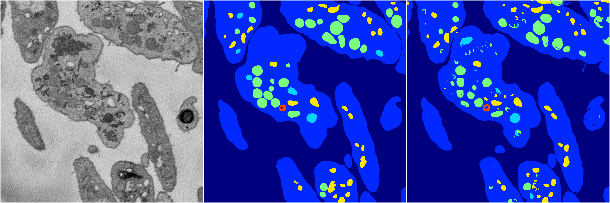

[Back](..)&nbsp;&nbsp;&nbsp;&nbsp;&nbsp;[Home](https://leapmanlab.github.io/snapshots)

---

<a href="0424"><h2>random_hybrid_3d / 0424</h2></a>
Created 07 May 2019, 11:57:22

<i>Click image for more details</i>

595 nets

**ari**: min -0.0000. max 0.8318. mean 0.8170.  ([best net](0424/38/1))

**miou**: min 0.0678. max 0.6339. mean 0.5810.  ([best net](0424/290/0))

**accuracy**: min 0.4743. max 0.9385. mean 0.9307.  ([best net](0424/79/1))

**n_params**: min 3591.0000. max 97048527.0000. mean 4468708.0067.  ([best net](0424/74/1))

---

<a href="0418"><h2>random_hybrid_3d / 0418</h2></a>
Created 07 May 2019, 11:57:02

<i>Click image for more details</i>

117 nets

**ari**: min 0.6311. max 0.8325. mean 0.8260.  ([best net](0418/81/0))

**miou**: min 0.3816. max 0.6348. mean 0.6024.  ([best net](0418/27/1))

**accuracy**: min 0.8679. max 0.9387. mean 0.9357.  ([best net](0418/32/0))

**n_params**: min 7847.0000. max 58518269.0000. mean 5543115.7778.  ([best net](0418/36/0))

---

[Back](..)&nbsp;&nbsp;&nbsp;&nbsp;&nbsp;[Home](https://leapmanlab.github.io/snapshots)

---