# unet0708_13

### Step 105840 (July 09 2018, 07:07:54)

[_Back_](..)

---

## Summary

<a href="media/summary.png">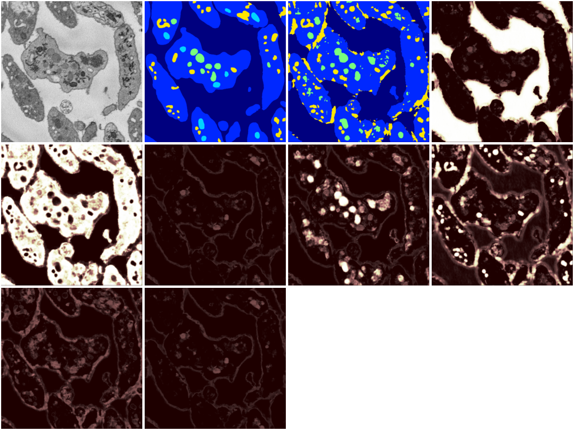</a>
summary.png. <i>Click to enlarge</i>

## Gene graph

gene_graph.svg. <i>Click to enlarge</i>

---

## Performance statistics, step 105840

<a href="media/accuracy.svg">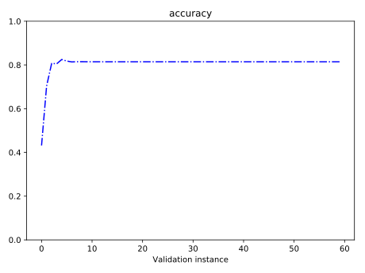</a>
accuracy.svg. <i>Click to enlarge</i>

adj_rand_idx.svg. <i>Click to enlarge</i>

<a href="media/loss.svg">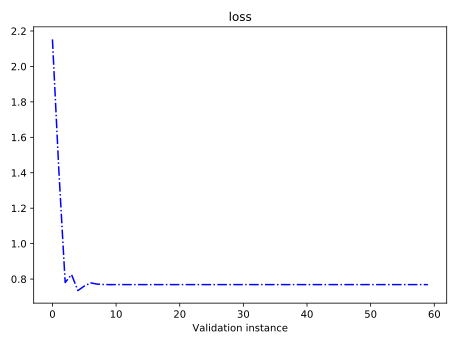</a>
loss.svg. <i>Click to enlarge</i>

<a href="media/mean_iou.svg">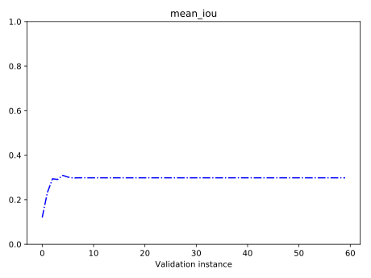</a>
mean_iou.svg. <i>Click to enlarge</i>

---

## Data, ground truth label, segmentation

<a href="media/105840_data.png">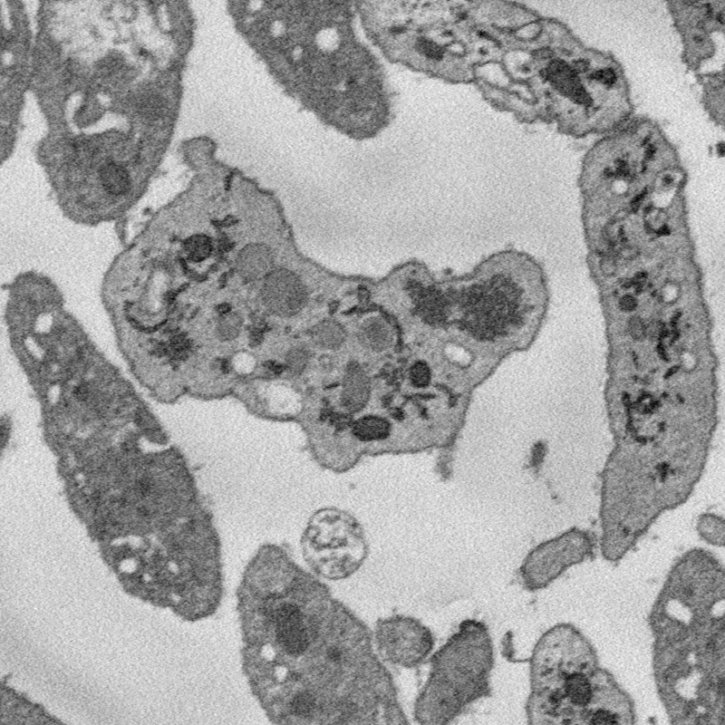</a>
105840_data.png. <i>Click to enlarge</i>

<a href="media/105840_label.png">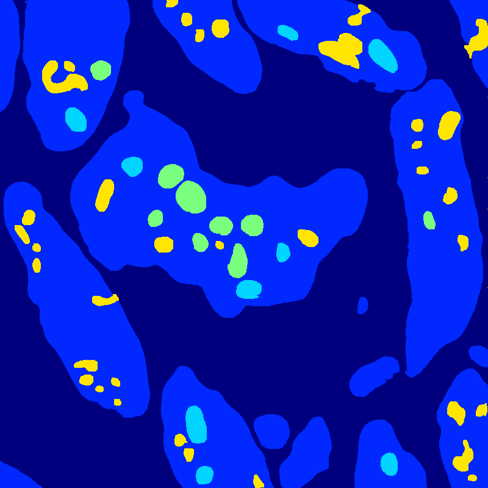</a>
105840_label.png. <i>Click to enlarge</i>

<a href="media/105840_segmentation.png">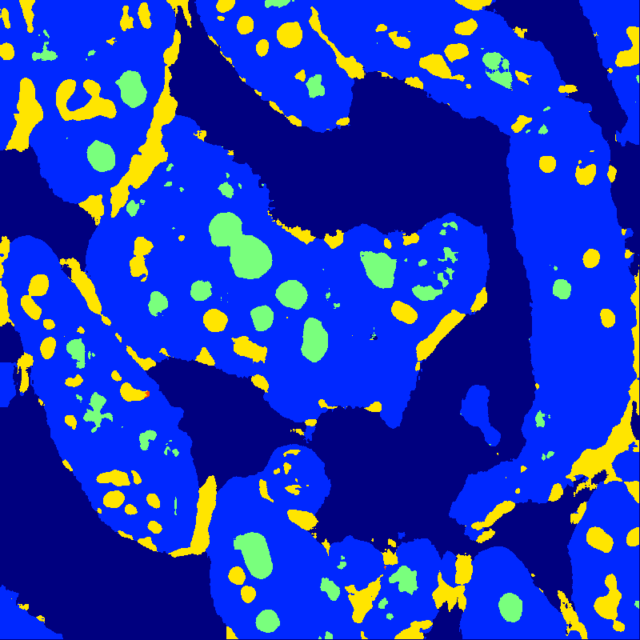</a>
105840_segmentation.png. <i>Click to enlarge</i>

---

## Probability maps

<a href="media/105840_prob_map_0.png">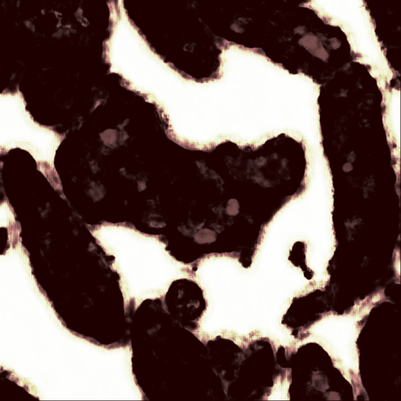</a>
105840_prob_map_0.png. <i>Click to enlarge</i>

<a href="media/105840_prob_map_1.png">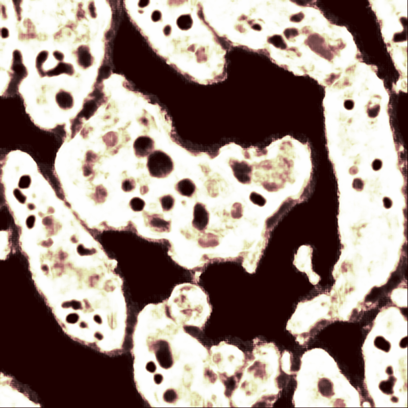</a>
105840_prob_map_1.png. <i>Click to enlarge</i>

<a href="media/105840_prob_map_2.png">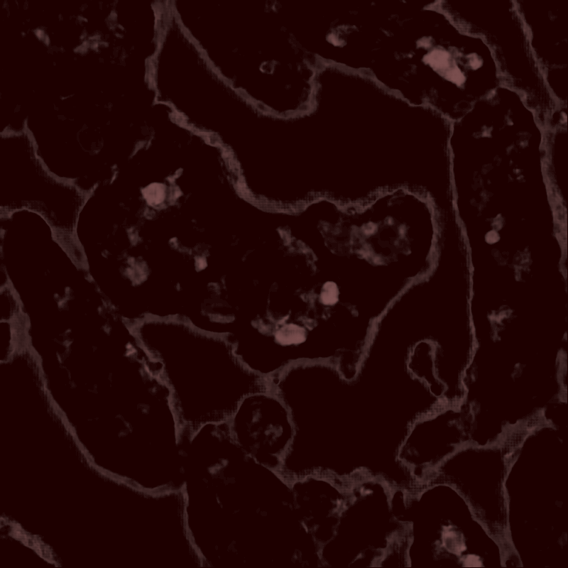</a>
105840_prob_map_2.png. <i>Click to enlarge</i>

<a href="media/105840_prob_map_3.png">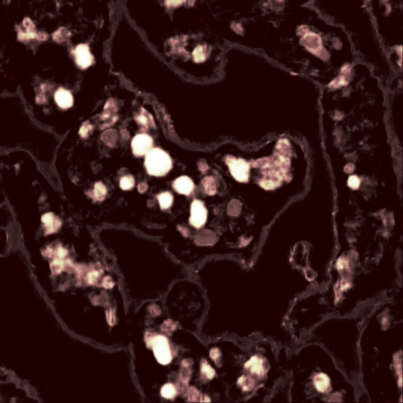</a>
105840_prob_map_3.png. <i>Click to enlarge</i>

<a href="media/105840_prob_map_4.png">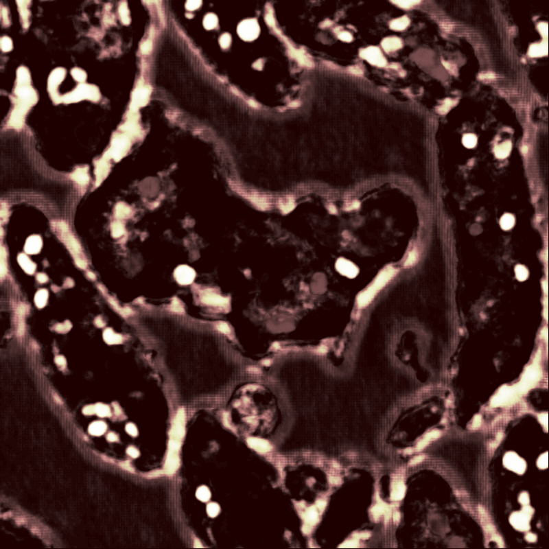</a>
105840_prob_map_4.png. <i>Click to enlarge</i>

<a href="media/105840_prob_map_5.png">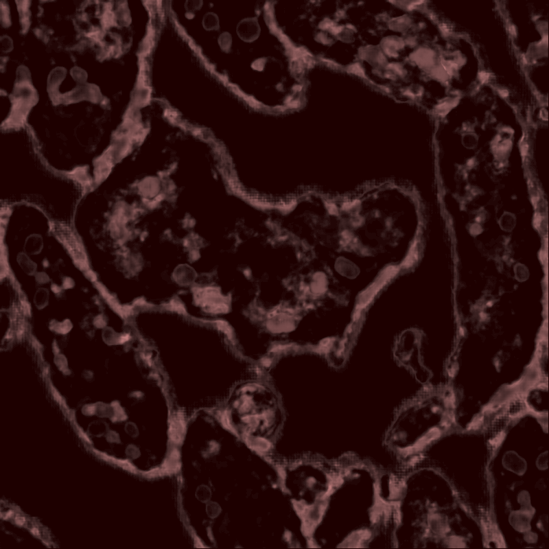</a>
105840_prob_map_5.png. <i>Click to enlarge</i>

105840_prob_map_6.png. <i>Click to enlarge</i>

---

