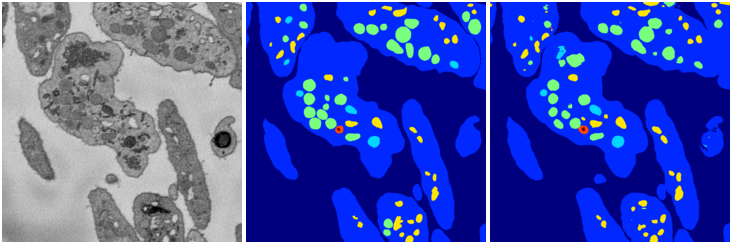
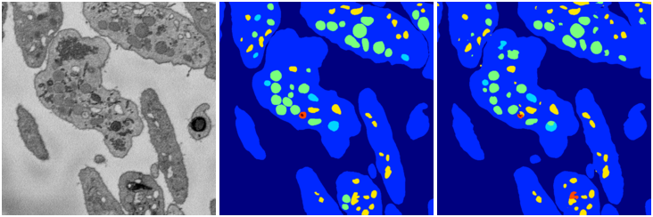

<a href="4"><h2>weight_volume / 1210 / 0 / 4</h2></a>
(Created 12 Dec 2018, 21:18:56. Modified 12 Dec 2018, 21:18:56)

<i>Click for more details</i>

**ari**: 0.8379. **miou**: 0.5708. **accuracy**: 0.9391. **n_params**: 31030983.0000. 

---

<a href="3"><h2>weight_volume / 1210 / 0 / 3</h2></a>
(Created 12 Dec 2018, 21:18:56. Modified 12 Dec 2018, 21:18:56)

<i>Click for more details</i>

**ari**: 0.8340. **miou**: 0.5211. **accuracy**: 0.9370. **n_params**: 31030983.0000. 

---

<a href="2"><h2>weight_volume / 1210 / 0 / 2</h2></a>
(Created 12 Dec 2018, 21:18:56. Modified 12 Dec 2018, 21:18:56)

<i>Click for more details</i>

**ari**: 0.8323. **miou**: 0.4843. **accuracy**: 0.9378. **n_params**: 31030983.0000. 

---

<a href="1"><h2>weight_volume / 1210 / 0 / 1</h2></a>
(Created 12 Dec 2018, 21:18:56. Modified 12 Dec 2018, 21:18:56)

<i>Click for more details</i>

**ari**: 0.8340. **miou**: 0.5482. **accuracy**: 0.9378. **n_params**: 31030983.0000. 

---

<a href="0"><h2>weight_volume / 1210 / 0 / 0</h2></a>
(Created 12 Dec 2018, 21:18:56. Modified 12 Dec 2018, 21:18:56)

<i>Click for more details</i>

**ari**: 0.8385. **miou**: 0.5829. **accuracy**: 0.9381. **n_params**: 31030983.0000. 

---