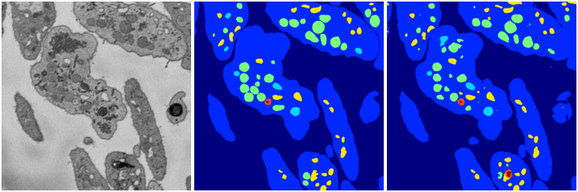

[Back](..)&nbsp;&nbsp;&nbsp;&nbsp;&nbsp;[Home](https://leapmanlab.github.io/snapshots)

---

<a href="4"><h2>weight_volume / 1210 / 01 / 4</h2></a>
Created 21 Dec 2018, 14:17:34

<i>Click for more details</i>

**ari**: 0.8315. **miou**: 0.5796. **accuracy**: 0.9379. **n_params**: 31030983.0000. 

---

<a href="3"><h2>weight_volume / 1210 / 01 / 3</h2></a>
Created 21 Dec 2018, 14:17:34

<i>Click for more details</i>

**ari**: 0.8360. **miou**: 0.5295. **accuracy**: 0.9386. **n_params**: 31030983.0000. 

---

<a href="2"><h2>weight_volume / 1210 / 01 / 2</h2></a>
Created 21 Dec 2018, 14:17:34

<i>Click for more details</i>

**ari**: 0.8332. **miou**: 0.5734. **accuracy**: 0.9383. **n_params**: 31030983.0000. 

---

<a href="1"><h2>weight_volume / 1210 / 01 / 1</h2></a>
Created 21 Dec 2018, 14:17:34

<i>Click for more details</i>

**ari**: 0.8372. **miou**: 0.5250. **accuracy**: 0.9385. **n_params**: 31030983.0000. 

---

<a href="0"><h2>weight_volume / 1210 / 01 / 0</h2></a>
Created 21 Dec 2018, 14:17:34

<i>Click for more details</i>

**ari**: 0.8328. **miou**: 0.5777. **accuracy**: 0.9365. **n_params**: 31030983.0000. 

---

[Back](..)&nbsp;&nbsp;&nbsp;&nbsp;&nbsp;[Home](https://leapmanlab.github.io/snapshots)

---