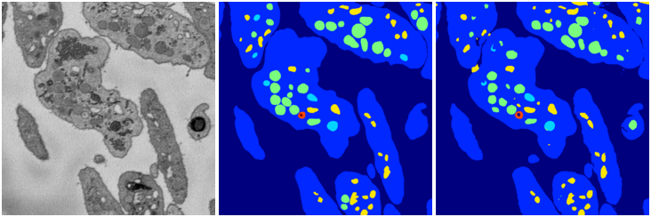

[Back](..)&nbsp;&nbsp;&nbsp;&nbsp;&nbsp;[Home](leapmanlab.github.io/snapshots)

---

<a href="4"><h2>weight_volume / 1210 / 025 / 4</h2></a>
(Created 12 Dec 2018, 21:34:45. Modified 12 Dec 2018, 21:34:45)

<i>Click for more details</i>

**ari**: 0.8332. **miou**: 0.5613. **accuracy**: 0.9375. **n_params**: 31030983.0000. 

---

<a href="3"><h2>weight_volume / 1210 / 025 / 3</h2></a>
(Created 12 Dec 2018, 21:34:45. Modified 12 Dec 2018, 21:34:45)

<i>Click for more details</i>

**ari**: 0.8318. **miou**: 0.5394. **accuracy**: 0.9348. **n_params**: 31030983.0000. 

---

<a href="2"><h2>weight_volume / 1210 / 025 / 2</h2></a>
(Created 12 Dec 2018, 21:34:45. Modified 12 Dec 2018, 21:34:45)

<i>Click for more details</i>

**ari**: 0.8341. **miou**: 0.5246. **accuracy**: 0.9381. **n_params**: 31030983.0000. 

---

<a href="1"><h2>weight_volume / 1210 / 025 / 1</h2></a>
(Created 12 Dec 2018, 21:34:45. Modified 12 Dec 2018, 21:34:45)

<i>Click for more details</i>

**ari**: 0.8326. **miou**: 0.5673. **accuracy**: 0.9372. **n_params**: 31030983.0000. 

---

<a href="0"><h2>weight_volume / 1210 / 025 / 0</h2></a>
(Created 12 Dec 2018, 21:34:45. Modified 12 Dec 2018, 21:34:45)

<i>Click for more details</i>

**ari**: 0.8217. **miou**: 0.4839. **accuracy**: 0.9322. **n_params**: 31030983.0000. 

---

[Back](..)&nbsp;&nbsp;&nbsp;&nbsp;&nbsp;[Home](leapmanlab.github.io/snapshots)

---