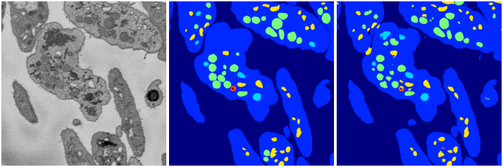
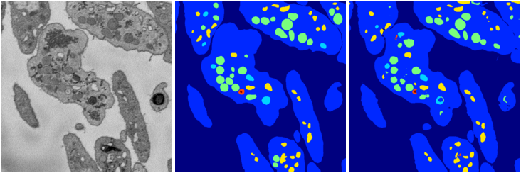

[Back](..)&nbsp;&nbsp;&nbsp;&nbsp;&nbsp;[Home](leapmanlab.github.io/snapshots)

---

<a href="4"><h2>weight_volume / 1210 / 05 / 4</h2></a>
(Created 12 Dec 2018, 21:36:39. Modified 12 Dec 2018, 21:36:39)

<i>Click for more details</i>

**ari**: 0.8312. **miou**: 0.5092. **accuracy**: 0.9359. **n_params**: 31030983.0000. 

---

<a href="3"><h2>weight_volume / 1210 / 05 / 3</h2></a>
(Created 12 Dec 2018, 21:36:39. Modified 12 Dec 2018, 21:36:39)

<i>Click for more details</i>

**ari**: 0.8315. **miou**: 0.5084. **accuracy**: 0.9362. **n_params**: 31030983.0000. 

---

<a href="2"><h2>weight_volume / 1210 / 05 / 2</h2></a>
(Created 12 Dec 2018, 21:36:39. Modified 12 Dec 2018, 21:36:39)

<i>Click for more details</i>

**ari**: 0.8262. **miou**: 0.4630. **accuracy**: 0.9344. **n_params**: 31030983.0000. 

---

<a href="1"><h2>weight_volume / 1210 / 05 / 1</h2></a>
(Created 12 Dec 2018, 21:36:39. Modified 12 Dec 2018, 21:36:39)

<i>Click for more details</i>

**ari**: 0.8339. **miou**: 0.5845. **accuracy**: 0.9384. **n_params**: 31030983.0000. 

---

<a href="0"><h2>weight_volume / 1210 / 05 / 0</h2></a>
(Created 12 Dec 2018, 21:36:39. Modified 12 Dec 2018, 21:36:39)

<i>Click for more details</i>

**ari**: 0.8196. **miou**: 0.4473. **accuracy**: 0.9293. **n_params**: 31030983.0000. 

---

[Back](..)&nbsp;&nbsp;&nbsp;&nbsp;&nbsp;[Home](leapmanlab.github.io/snapshots)

---