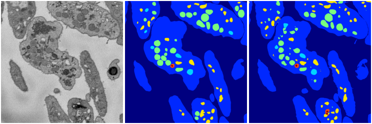
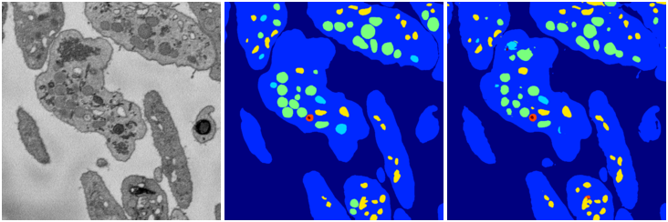

[Back](..)&nbsp;&nbsp;&nbsp;&nbsp;&nbsp;[Home](https://leapmanlab.github.io/snapshots)

---

<a href="0"><h2>weight_volume / 1210 / 075 / 0</h2></a>
Created 13 Dec 2018, 10:03:55

<i>Click for more details</i>

**ari**: 0.8254. **miou**: 0.4607. **accuracy**: 0.9331. **n_params**: 31030983.0000. 

---

<a href="3"><h2>weight_volume / 1210 / 075 / 3</h2></a>
Created 13 Dec 2018, 10:03:55

<i>Click for more details</i>

**ari**: 0.8313. **miou**: 0.5661. **accuracy**: 0.9376. **n_params**: 31030983.0000. 

---

<a href="1"><h2>weight_volume / 1210 / 075 / 1</h2></a>
Created 13 Dec 2018, 10:03:55

<i>Click for more details</i>

**ari**: 0.8310. **miou**: 0.5786. **accuracy**: 0.9361. **n_params**: 31030983.0000. 

---

<a href="4"><h2>weight_volume / 1210 / 075 / 4</h2></a>
Created 13 Dec 2018, 10:03:55

<i>Click for more details</i>

**ari**: 0.8326. **miou**: 0.5395. **accuracy**: 0.9362. **n_params**: 31030983.0000. 

---

<a href="2"><h2>weight_volume / 1210 / 075 / 2</h2></a>
Created 13 Dec 2018, 10:03:55

<i>Click for more details</i>

**ari**: 0.8296. **miou**: 0.4596. **accuracy**: 0.9349. **n_params**: 31030983.0000. 

---

[Back](..)&nbsp;&nbsp;&nbsp;&nbsp;&nbsp;[Home](https://leapmanlab.github.io/snapshots)

---