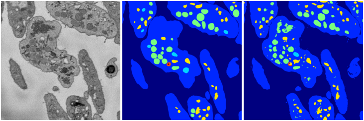

[Back](..)&nbsp;&nbsp;&nbsp;&nbsp;&nbsp;[Home](leapmanlab.github.io/snapshots)

---

<a href="0"><h2>weight_volume / 1210 / 10 / 0</h2></a>
(Created 12 Dec 2018, 22:03:10. Modified 12 Dec 2018, 22:03:10)

<i>Click for more details</i>

**ari**: 0.8166. **miou**: 0.5029. **accuracy**: 0.9302. **n_params**: 31030983.0000. 

---

<a href="3"><h2>weight_volume / 1210 / 10 / 3</h2></a>
(Created 12 Dec 2018, 22:03:10. Modified 12 Dec 2018, 22:03:10)

<i>Click for more details</i>

**ari**: 0.8167. **miou**: 0.5583. **accuracy**: 0.9303. **n_params**: 31030983.0000. 

---

<a href="1"><h2>weight_volume / 1210 / 10 / 1</h2></a>
(Created 12 Dec 2018, 22:03:10. Modified 12 Dec 2018, 22:03:10)

<i>Click for more details</i>

**ari**: 0.8166. **miou**: 0.5395. **accuracy**: 0.9292. **n_params**: 31030983.0000. 

---

<a href="4"><h2>weight_volume / 1210 / 10 / 4</h2></a>
(Created 12 Dec 2018, 22:03:10. Modified 12 Dec 2018, 22:03:10)

<i>Click for more details</i>

**ari**: 0.8138. **miou**: 0.5303. **accuracy**: 0.9277. **n_params**: 31030983.0000. 

---

<a href="2"><h2>weight_volume / 1210 / 10 / 2</h2></a>
(Created 12 Dec 2018, 22:03:10. Modified 12 Dec 2018, 22:03:10)

<i>Click for more details</i>

**ari**: 0.8191. **miou**: 0.5438. **accuracy**: 0.9313. **n_params**: 31030983.0000. 

---

[Back](..)&nbsp;&nbsp;&nbsp;&nbsp;&nbsp;[Home](leapmanlab.github.io/snapshots)

---