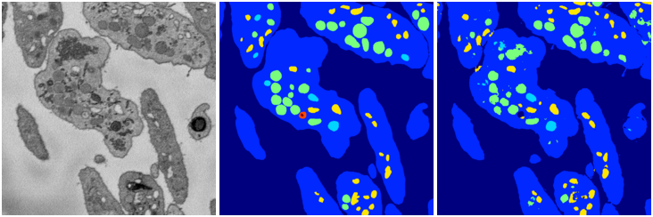
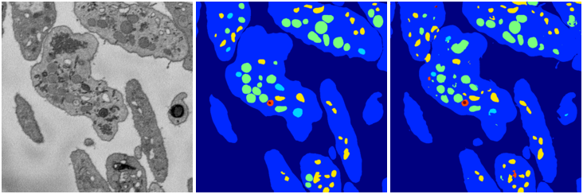

[Back](..)&nbsp;&nbsp;&nbsp;&nbsp;&nbsp;[Home](leapmanlab.github.io/snapshots)

---

<a href="0"><h2>weight_volume / 1210 / 25 / 0</h2></a>
(Created 12 Dec 2018, 22:03:10. Modified 12 Dec 2018, 22:03:10)

<i>Click for more details</i>

**ari**: 0.8267. **miou**: 0.5672. **accuracy**: 0.9348. **n_params**: 31030983.0000. 

---

<a href="3"><h2>weight_volume / 1210 / 25 / 3</h2></a>
(Created 12 Dec 2018, 22:03:10. Modified 12 Dec 2018, 22:03:10)

<i>Click for more details</i>

**ari**: 0.8251. **miou**: 0.4949. **accuracy**: 0.9332. **n_params**: 31030983.0000. 

---

<a href="1"><h2>weight_volume / 1210 / 25 / 1</h2></a>
(Created 12 Dec 2018, 22:03:10. Modified 12 Dec 2018, 22:03:10)

<i>Click for more details</i>

**ari**: 0.8227. **miou**: 0.4849. **accuracy**: 0.9337. **n_params**: 31030983.0000. 

---

<a href="4"><h2>weight_volume / 1210 / 25 / 4</h2></a>
(Created 12 Dec 2018, 22:03:10. Modified 12 Dec 2018, 22:03:10)

<i>Click for more details</i>

**ari**: 0.8273. **miou**: 0.5804. **accuracy**: 0.9352. **n_params**: 31030983.0000. 

---

<a href="2"><h2>weight_volume / 1210 / 25 / 2</h2></a>
(Created 12 Dec 2018, 22:03:10. Modified 12 Dec 2018, 22:03:10)

<i>Click for more details</i>

**ari**: 0.8274. **miou**: 0.5622. **accuracy**: 0.9359. **n_params**: 31030983.0000. 

---

[Back](..)&nbsp;&nbsp;&nbsp;&nbsp;&nbsp;[Home](leapmanlab.github.io/snapshots)

---