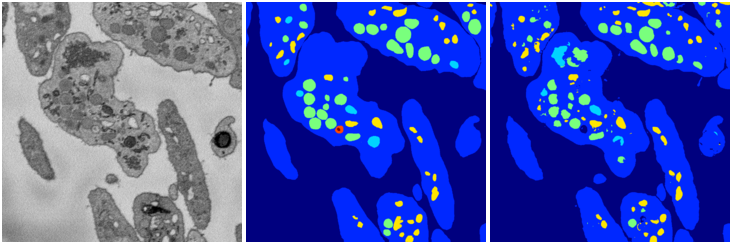
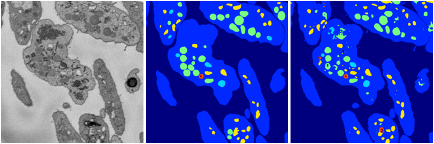

[Back](..)&nbsp;&nbsp;&nbsp;&nbsp;&nbsp;[Home](https://leapmanlab.github.io/snapshots)

---

<a href="4"><h2>weight_volume / 1210 / 75 / 4</h2></a>
(Created 13 Dec 2018, 16:39:44. Modified 13 Dec 2018, 16:39:44)

<i>Click for more details</i>

**ari**: 0.8185. **miou**: 0.4665. **accuracy**: 0.9308. **n_params**: 31030983.0000. 

---

<a href="3"><h2>weight_volume / 1210 / 75 / 3</h2></a>
(Created 13 Dec 2018, 16:39:44. Modified 13 Dec 2018, 16:39:44)

<i>Click for more details</i>

**ari**: 0.8207. **miou**: 0.5434. **accuracy**: 0.9320. **n_params**: 31030983.0000. 

---

<a href="2"><h2>weight_volume / 1210 / 75 / 2</h2></a>
(Created 13 Dec 2018, 16:39:44. Modified 13 Dec 2018, 16:39:44)

<i>Click for more details</i>

**ari**: 0.8158. **miou**: 0.5675. **accuracy**: 0.9319. **n_params**: 31030983.0000. 

---

<a href="1"><h2>weight_volume / 1210 / 75 / 1</h2></a>
(Created 13 Dec 2018, 16:39:44. Modified 13 Dec 2018, 16:39:44)

<i>Click for more details</i>

**ari**: 0.7837. **miou**: 0.4885. **accuracy**: 0.9157. **n_params**: 31030983.0000. 

---

<a href="0"><h2>weight_volume / 1210 / 75 / 0</h2></a>
(Created 13 Dec 2018, 16:39:44. Modified 13 Dec 2018, 16:39:44)

<i>Click for more details</i>

**ari**: 0.8198. **miou**: 0.5667. **accuracy**: 0.9318. **n_params**: 31030983.0000. 

---

[Back](..)&nbsp;&nbsp;&nbsp;&nbsp;&nbsp;[Home](https://leapmanlab.github.io/snapshots)

---