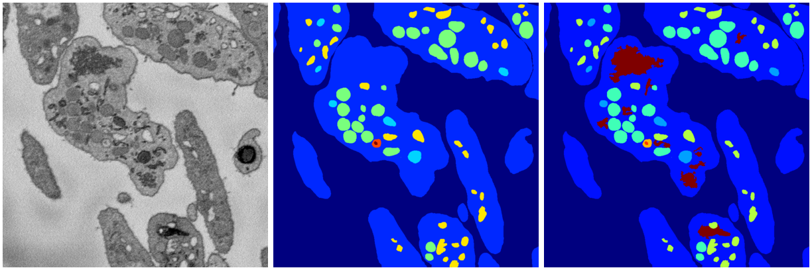
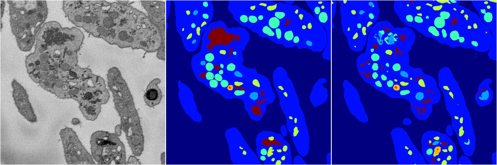
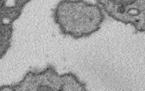
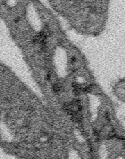
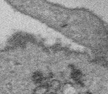

# Segmentation with "ER"

Overview of the results from 100 random 2D u-nets training on the new 8-class segmentation labels.

---

## Data

Up until recently, we sought to segment portions of this data into 7 classes - background, cytoplasm/membrane, canalicular system, alpha granules, dense granules, and dense granule cores. In the past couple weeks, we've worked with Kenny and Nash to add another class - we're calling it "endoplasmic reticulum".

Over the weekend, we started running network training experiments on the new data. I set 100 randomly-generated 2D u-net architectures to train for 30 epochs. In one sense, the networks had a hard time detecting what we'd labeled as "ER", when evaluated on validation data. In particular, it fails to properly classify the large ER mass in the center cell. Smaller areas are picked up, but inconsistently, but that could reflect their inconsistent labeling in training data.

---

## ER Mass Interpetation

I have a question about the large ER mass. As it stands, are we including multiple different structures under the ER label? The mass shares local characteristics with other ER areas - similar intensity, and lack of visible membrane at its boundary.

#### Animation 1

However, that cell is the only place in the Patient 1 data where "ER" congregates in such a large mass. Everywhere else in the eval and training data, ER seems to form a network of narrow tubes connecting other organelles.

#### Animation 2

In some areas, ER looks like that.

#### Animation 3

However, we've marked it as mitochondria with ER around it. Ignoring other label issues, we can see that here:

#### Animation 4

## Problems

#### ER identification

So, is there a similar story for the mass in Animation 1, is it hiding mitochondria? Is the analysis in Animation 4 incorrect? How do we handle the inconsistent labeling of smaller portions?

#### Adding new classes to data

In addition to dealing with the one or more structures currently labeled "ER", browsing through the Patient 1 data volume, I am also thinking about how we would go about segmenting the full Patient 1 image volume in the near future. There are additional structures that don't fall into our classification scheme. Dead cells and large borderless cavities inside of cells, to name two. 

In general, I don't think the way forward is adding more classes to a single classifier. I think our experiences are showing us that we need to start working with collections of binary classifiers.
